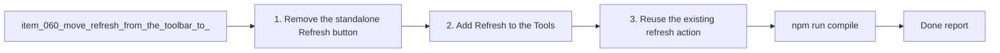

## task_065_move_refresh_from_the_toolbar_to_the_tools_menu - Move Refresh from the toolbar to the Tools menu
> From version: 1.10.0 (refreshed)
> Status: Done
> Understanding: 99%
> Confidence: 99%
> Progress: 100%
> Complexity: Low
> Theme: Toolbar prioritization and tools-menu cleanup
> Reminder: Update status/understanding/confidence/progress and dependencies/references when you edit this doc.

# Context
Derived from `logics/backlog/item_060_move_refresh_from_the_toolbar_to_the_tools_menu.md`.
- Derived from backlog item `item_060_move_refresh_from_the_toolbar_to_the_tools_menu`.
- Source file: `logics/backlog/item_060_move_refresh_from_the_toolbar_to_the_tools_menu.md`.
- Related request(s): `req_051_move_refresh_from_the_toolbar_to_the_tools_menu`.

# Plan
- [x] 1. Remove the standalone `Refresh` button from the primary toolbar.
- [x] 2. Add `Refresh` to the `Tools` menu under `Use workspace`.
- [x] 3. Reuse the existing refresh action wiring so behavior does not drift.
- [x] 4. Update tests and docs affected by the new entrypoint.
- [x] FINAL: Update related Logics docs

# AC Traceability
- AC1/AC2/AC3 -> Steps 1 and 2. Proof: covered by linked task completion.
- AC4 -> Step 3. Proof: covered by linked task completion.
- AC5 -> Step 4. Proof: covered by linked task completion.

# Links
- Backlog item: `item_060_move_refresh_from_the_toolbar_to_the_tools_menu`
- Request(s): `req_051_move_refresh_from_the_toolbar_to_the_tools_menu`

# Validation
- `npm run compile`
- `npm test`

# Definition of Done (DoD)
- [x] Scope implemented and acceptance criteria covered.
- [x] Validation commands executed and results captured.
- [x] Linked request/backlog/task docs updated.
- [x] Status and progress updated.

# Report
- 

# Notes
