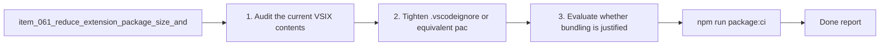

## task_066_reduce_extension_package_size_and_file_count_for_release_quality - Reduce extension package size and file count for release quality
> From version: 1.10.0 (refreshed)
> Status: Done
> Understanding: 99%
> Confidence: 99%
> Progress: 100%
> Complexity: Medium
> Theme: Extension packaging hygiene and runtime performance
> Reminder: Update status/understanding/confidence/progress and dependencies/references when you edit this doc.

# Context
Derived from `logics/backlog/item_061_reduce_extension_package_size_and_file_count_for_release_quality.md`.
- Derived from backlog item `item_061_reduce_extension_package_size_and_file_count_for_release_quality`.
- Source file: `logics/backlog/item_061_reduce_extension_package_size_and_file_count_for_release_quality.md`.
- Related request(s): `req_052_reduce_extension_package_size_and_file_count_for_release_quality`.

# Plan
- [x] 1. Audit the current VSIX contents and identify obviously unnecessary packaged files.
- [x] 2. Tighten `.vscodeignore` or equivalent packaging inputs to exclude dead weight safely.
- [x] 3. Evaluate whether bundling is justified beyond ignore-only cleanup.
- [x] 4. Re-run packaging validation and confirm runtime files are still present.
- [x] FINAL: Update related Logics docs

# Links
- Backlog item: `item_061_reduce_extension_package_size_and_file_count_for_release_quality`
- Request(s): `req_052_reduce_extension_package_size_and_file_count_for_release_quality`

# Validation
- `npm run package:ci`
- `vsce ls --tree` or equivalent package inspection

# Definition of Done (DoD)
- [x] Scope implemented and acceptance criteria covered.
- [x] Validation commands executed and results captured.
- [x] Linked request/backlog/task docs updated.
- [x] Status and progress updated.

# AC Traceability
- AC1 -> covered by linked delivery scope. Proof: covered by linked task completion.
- AC2 -> covered by linked delivery scope. Proof: covered by linked task completion.
- AC3 -> covered by linked delivery scope. Proof: covered by linked task completion.
- AC4 -> covered by linked delivery scope. Proof: covered by linked task completion.
- AC5 -> covered by linked delivery scope. Proof: covered by linked task completion.

# Report
- 

# Notes
