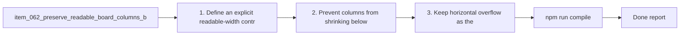

## task_067_preserve_readable_board_columns_by_preventing_column_compression - Preserve readable board columns by preventing column compression
> From version: 1.10.1 (refreshed)
> Status: Done
> Understanding: 100%
> Confidence: 100%
> Progress: 100%
> Complexity: Medium
> Theme: Board readability and width budgeting
> Reminder: Update status/understanding/confidence/progress and dependencies/references when you edit this doc.

# Context
Derived from `logics/backlog/item_062_preserve_readable_board_columns_by_preventing_column_compression.md`.
- Derived from backlog item `item_062_preserve_readable_board_columns_by_preventing_column_compression`.
- Source file: `logics/backlog/item_062_preserve_readable_board_columns_by_preventing_column_compression.md`.
- Related request(s): `req_053_preserve_readable_board_columns_by_preventing_column_compression`.
- Related architecture decision(s): `adr_005_define_responsive_layout_scroll_and_sizing_rules_for_plugin_views`.

# Plan
- [x] 1. Define an explicit readable-width contract for board columns.
- [x] 2. Prevent columns from shrinking below that contract in board mode.
- [x] 3. Keep horizontal overflow as the board-mode fallback.
- [x] 4. Verify compatibility with details-panel and responsive layout behavior.
- [x] 5. Add regression coverage for the width contract.
- [x] FINAL: Update related Logics docs

# Links
- Backlog item: `item_062_preserve_readable_board_columns_by_preventing_column_compression`
- Request(s): `req_053_preserve_readable_board_columns_by_preventing_column_compression`
- Architecture decision(s): `adr_005_define_responsive_layout_scroll_and_sizing_rules_for_plugin_views`

# Validation
- `npm run compile`
- `npm test -- tests/webview.layout-collapse.test.ts`

# Definition of Done (DoD)
- [x] Scope implemented and acceptance criteria covered.
- [x] Validation commands executed and results captured.
- [x] Linked request/backlog/task docs updated.
- [x] Status and progress updated.

# AC Traceability
- AC1 -> covered by linked delivery scope. Proof: covered by linked task completion.
- AC2 -> covered by linked delivery scope. Proof: covered by linked task completion.
- AC3 -> covered by linked delivery scope. Proof: covered by linked task completion.
- AC4 -> covered by linked delivery scope. Proof: covered by linked task completion.
- AC5 -> covered by linked delivery scope. Proof: covered by linked task completion.
- AC6 -> covered by linked delivery scope. Proof: covered by linked task completion.

# Report
- 

# Notes
