## task_068_reduce_remaining_oversized_files_after_the_first_modularization_pass - Reduce remaining oversized files after the first modularization pass
> From version: 1.10.1 (refreshed)
> Status: Done
> Understanding: 98%
> Confidence: 96%
> Progress: 100%
> Complexity: Medium
> Theme: Second-pass modularity and ownership clarity
> Reminder: Update status/understanding/confidence/progress and dependencies/references when you edit this doc.

```mermaid
%% logics-kind: task
%% logics-signature: task|reduce-remaining-oversized-files-after-t|item-063-reduce-remaining-oversized-file|1-split-the-remaining-oversized-responsi|npm-run-compile
flowchart LR
    Backlog[item_063_reduce_remaining_oversized_files_] --> Step1[1. Split the remaining oversized responsib]
    Step1 --> Step2[2. Split the remaining oversized responsib]
    Step2 --> Step3[3. Split the remaining oversized responsib]
    Step3 --> Validation[npm run compile]
    Validation --> Report[Done report]
```

# Context
Derived from `logics/backlog/item_063_reduce_remaining_oversized_files_after_the_first_modularization_pass.md`.
- Derived from backlog item `item_063_reduce_remaining_oversized_files_after_the_first_modularization_pass`.
- Source file: `logics/backlog/item_063_reduce_remaining_oversized_files_after_the_first_modularization_pass.md`.
- Related request(s): `req_054_reduce_remaining_oversized_files_after_the_first_modularization_pass`.
- Related architecture decision(s):
  - `adr_004_scale_the_plugin_around_a_derived_model_and_explicit_ui_state`
  - `adr_005_define_responsive_layout_scroll_and_sizing_rules_for_plugin_views`

# Plan
- [x] 1. Split the remaining oversized responsibilities out of `src/logicsViewProvider.ts` while keeping the provider entrypoint legible.
- [x] 2. Split the remaining oversized responsibilities out of `media/main.js` while preserving orchestration readability.
- [x] 3. Split the remaining oversized responsibilities out of `logics_flow_support.py` while keeping workflow helper ownership explicit.
- [x] 4. Tighten or add targeted validation around newly extracted seams.
- [x] FINAL: Update related Logics docs

# Links
- Backlog item: `item_063_reduce_remaining_oversized_files_after_the_first_modularization_pass`
- Request(s): `req_054_reduce_remaining_oversized_files_after_the_first_modularization_pass`
- Architecture decision(s):
  - `adr_004_scale_the_plugin_around_a_derived_model_and_explicit_ui_state`
  - `adr_005_define_responsive_layout_scroll_and_sizing_rules_for_plugin_views`

# Validation
- `npm run compile`
- `npm test`
- `python3 -m unittest discover -s logics/skills/tests -p 'test_*.py' -v`
- Finish workflow executed on 2026-03-17.
- Linked backlog/request close verification passed.

# Definition of Done (DoD)
- [x] Scope implemented and acceptance criteria covered.
- [x] Validation commands executed and results captured.
- [x] Linked request/backlog/task docs updated.
- [x] Status and progress updated.

# AC Traceability
- AC1 -> Steps 1, 2, and 3 extract coherent modules instead of preserving oversized hubs. Proof: `src/logicsViewProvider.ts` now delegates document flows to `src/logicsViewDocumentController.ts` and HTML generation to `src/logicsWebviewHtml.ts`; `media/main.js` now delegates DOM wiring to `media/mainInteractions.js`; `logics_flow_support.py` now delegates decision framing and companion rendering to `logics_flow_decision_support.py`.
- AC2 -> Steps 1, 2, and 3 reduce each targeted file toward the intended ceiling or justify any exception. Proof: `src/logicsViewProvider.ts` moved from `1522` to `810` lines; `logics_flow_support.py` moved from `1022` to `826` lines; `media/main.js` moved from `1184` to `1129` lines, with the remaining exception justified because it stays the webview orchestration entrypoint while listener wiring moved into `media/mainInteractions.js` (`262` lines).
- AC3 -> Steps 1, 2, and 3 preserve readable host/webview/kit entrypoints. Proof: the provider now reads as lifecycle plus workspace/bootstrap orchestration, `media/main.js` stays focused on state/render orchestration, and `logics_flow_support.py` stays focused on workflow support while imported decision helpers stay explicit.
- AC4 -> Steps 1, 2, and 3 keep behavior unchanged while only restructuring code. Proof: `npm run compile`, `npm test`, and `python3 -m unittest discover -s logics/skills/tests -p 'test_*.py' -v` all passed after the refactor.
- AC5 -> Steps 1, 2, and 3 keep imports and ownership boundaries understandable. Proof: new modules follow explicit ownership by domain (`DocumentController`, `WebviewHtml`, `mainInteractions`, `logics_flow_decision_support`) and the TypeScript bundle still compiles without circular-import fallout.
- AC6 -> Step 4 updates validation and regression coverage for extracted seams. Proof: the webview harness loaders in `tests/webviewHarnessTestUtils.ts` and `tests/webview.layout-collapse.test.ts` were updated to load `media/mainInteractions.js`, and the full `npm test` suite stayed green.

# Report
- Extracted document-action and HTML responsibilities from `src/logicsViewProvider.ts` into focused modules while keeping provider bootstrap and workspace orchestration in place.
- Extracted DOM event binding from `media/main.js` into `media/mainInteractions.js`; `main.js` remains slightly above the soft ceiling to preserve a single readable webview orchestration entrypoint.
- Extracted Logics decision-framing and companion-rendering helpers from `logics_flow_support.py` into `logics_flow_decision_support.py`.
- Validation passed on TypeScript compile, full Vitest suite, and the full Python skills test suite.

# Notes
