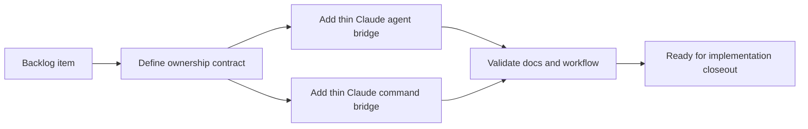

## task_069_add_a_minimal_claude_code_bridge_for_logics_agents - Add a minimal Claude Code bridge for Logics agents
> From version: 1.10.3
> Status: Ready
> Understanding: 96%
> Confidence: 93%
> Progress: 0%
> Complexity: Medium
> Theme: Agent orchestration and Claude Code compatibility
> Reminder: Update status/understanding/confidence/progress and dependencies/references when you edit this doc.

# Context
- Derived from backlog item `item_064_add_a_minimal_claude_code_bridge_for_logics_agents`.
- Source file: `logics/backlog/item_064_add_a_minimal_claude_code_bridge_for_logics_agents.md`.
- Related request(s): `req_055_add_a_minimal_claude_code_bridge_for_logics_agents`.
- This task should make Logics more natively usable from Claude Code without turning `.claude/` into a second source of truth.
- The real workflow memory and conventions must stay anchored in `logics/`, with `.claude/` limited to a thin project-level adapter.
- The first pass should cover the workflow-oriented entrypoints needed to discover and run the Logics request flow from Claude Code.

# Plan
- [ ] 1. Define the minimal `.claude/agents` and `.claude/commands` structure needed for this repo.
- [ ] 2. Add thin Claude bridge files that explicitly point back to `logics/instructions.md`, the relevant `SKILL.md`, and existing workflow scripts.
- [ ] 3. Ensure the bridge does not duplicate detailed prompts already owned by `openai.yaml` and `SKILL.md`.
- [ ] 4. Document the ownership and maintenance rule between `logics/` and `.claude/`.
- [ ] 5. Validate the bridge shape and update linked Logics docs.
- [ ] FINAL: Update related Logics docs

# AC Traceability
- AC1 -> Define a minimal `.claude/` layout without moving the real workflow source out of `logics/`. Proof: TODO.
- AC2 -> Keep Claude bridge files thin and explicitly anchored to `logics/instructions.md`, `SKILL.md`, and workflow scripts. Proof: TODO.
- AC3 -> Avoid duplicating detailed prompts and conventions across Claude files, `openai.yaml`, and `SKILL.md`. Proof: TODO.
- AC4 -> Cover at least the first workflow-oriented Claude entrypoint around request and flow management. Proof: TODO.
- AC5 -> Document the source-of-truth contract between `logics/` and `.claude/`. Proof: TODO.
- AC6 -> Preserve current Codex-oriented plugin behavior and manifest contracts. Proof: TODO.
- AC7 -> Keep the bridge small enough to remain maintainable manually or to be generated later without changing ownership. Proof: TODO.

# Decision framing
- Product framing: Not needed
- Product signals: (none detected)
- Product follow-up: No product brief follow-up is expected based on current signals.
- Architecture framing: Required
- Architecture signals: data model and persistence, contracts and integration, state and sync
- Architecture follow-up: Create or link an architecture decision before irreversible implementation work starts.

# Links
- Product brief(s): (none yet)
- Architecture decision(s): (none yet)
- Backlog item: `item_064_add_a_minimal_claude_code_bridge_for_logics_agents`
- Request(s): `req_055_add_a_minimal_claude_code_bridge_for_logics_agents`

# Validation
- `python3 logics/skills/logics-doc-linter/scripts/logics_lint.py`
- Run any Claude bridge-specific validation added during implementation.

# Definition of Done (DoD)
- [ ] Scope implemented and acceptance criteria covered.
- [ ] Validation commands executed and results recorded.
- [ ] Linked request/backlog/task docs updated consistently.
- [ ] Status is `Done` and progress is `100%`.

# Report
