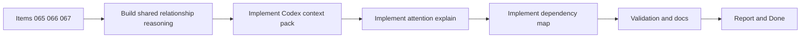

## task_070_orchestration_delivery_for_req_056_context_pack_attention_explain_and_dependency_map - Orchestration delivery for req 056 context pack attention explain and dependency map
> From version: 1.10.5
> Status: Done
> Understanding: 98%
> Confidence: 95%
> Progress: 100%
> Complexity: High
> Theme: Cross-item delivery orchestration
> Reminder: Update status/understanding/confidence/progress and dependencies/references when you edit this doc.

# Context
Derived from:
- `logics/backlog/item_065_build_codex_context_pack_for_related_logics_docs.md`
- `logics/backlog/item_066_explain_attention_reasons_and_suggested_remediation.md`
- `logics/backlog/item_067_add_dependency_map_for_logics_workflow_relationships.md`

This task bundles three adjacent plugin improvements that should share the same relationship model instead of being implemented as isolated features:
- a `Context Pack for Codex` built from the managed Logics graph;
- an `Attention Explain` layer that makes attention reasons explicit and actionable;
- a `Dependency Map` that visualizes workflow and companion-doc relationships.

Constraint:
- prefer a shared graph-reasoning layer first, so context selection, attention explanation, and map rendering do not each invent separate traversal logic.
- release can be phased across multiple versions, but the orchestration task is only considered complete when all three backlog slices are delivered.

# Plan
- [x] 1. Define or extract the shared relationship and explanation model that all three features can reuse.
- [x] 2. Implement the `Context Pack for Codex` flow, including related-doc selection, trimming rules, and launch or preview behavior.
- [x] 3. Implement `Attention Explain` so explicit reasons and suggested remediation can be surfaced from the same underlying graph signals.
- [x] 4. Implement the first `Dependency Map` experience and synchronize node selection with current item details or actions.
- [x] 5. Add or adjust automated tests and any required UI documentation for the combined feature set.
- [x] FINAL: Update related Logics docs

# AC Traceability
- item065-AC1/item067-AC5 -> Step 1. Proof: `media/logicsModel.js` now centralizes relationship insights, attention reasoning, context-pack assembly, and dependency-map shaping, while `media/webviewSelectors.js` reuses that layer instead of duplicating traversal logic.
- item065-AC2/item065-AC3 -> Step 2. Proof: the generated pack includes the current item plus direct upstream/downstream workflow links, companion docs, specs, and explicit open-question sections, all rendered from the shared graph model.
- item065-AC4/item065-AC5 -> Step 2. Proof: the details panel now exposes a `Context pack for Codex` section with compact counts, trim messaging, preview-first behavior, and an explicit `Inject into Codex` action wired through `hostApi.injectPrompt` and the extension host.
- item066-AC1/item066-AC2 -> Step 3. Proof: attention reasoning now emits explicit `Blocked`, `Workflow inconsistent`, `Orphaned`, and `Missing supporting doc` reasons from the shared model instead of relying on opaque attention-only filtering.
- item066-AC3/item066-AC4/item066-AC5 -> Step 3. Proof: the details panel renders primary and secondary attention reasons with remediation guidance, card badges use short reason labels, and only executable remediations produce clickable actions such as `Promote request`, `Link to primary flow`, or `Create companion doc`.
- item067-AC1/item067-AC2 -> Step 4. Proof: the details panel now includes a `Dependency map` built from the existing Logics graph and covering requests, backlog items, tasks, companion docs, and specs already indexed by the plugin.
- item067-AC3/item067-AC4 -> Step 4. Proof: the map is a bounded selected-item subgraph with one-level grouped neighbors (`Upstream`, `Downstream`, `Linked workflow`, `Supporting docs`) rather than a whole-workspace graph.
- item065-AC6/item066-AC6/item067-AC6 -> Step 5. Proof: `tests/webview.harness-details-and-filters.test.ts` now covers context-pack preview/injection, attention reason ordering and remediation wiring, and dependency-map selection synchronization; the full `npm test` suite passed.
- req056-AC7 -> Steps 1 through 4. Proof: implementation order is explicitly fixed to shared reasoning first, then context pack, then attention explain, then dependency map, with phased release allowed across versions.

# Decision framing
- Product framing: Not needed
- Product signals: (none detected)
- Product follow-up: No product brief follow-up is expected based on current signals.
- Architecture framing: Required
- Architecture signals: data model and persistence, contracts and integration, state and sync
- Architecture follow-up: Create or link an architecture decision before irreversible implementation work starts.

# Links
- Product brief(s): (none yet)
- Architecture decision(s): `adr_007_centralize_plugin_relationship_reasoning_for_context_packs_attention_explain_and_dependency_map`
- Backlog item(s):
  - `item_065_build_codex_context_pack_for_related_logics_docs`
  - `item_066_explain_attention_reasons_and_suggested_remediation`
  - `item_067_add_dependency_map_for_logics_workflow_relationships`
- Request(s): `req_056_add_codex_context_pack_attention_explain_and_dependency_map`

# Delivery decisions
- Delivery order:
  - shared graph or reasoning layer first
  - then item 065 context pack
  - then item 066 attention explain
  - then item 067 dependency map
- Release strategy:
  - implementation may ship across multiple versions if needed
  - this orchestration task closes only when all three backlog items are delivered

# Validation
- `npm run compile`
- `npm run lint`
- `npm run test`
- `python3 logics/skills/logics-doc-linter/scripts/logics_lint.py`
- Manual: validate the Codex context-pack launch or preview flow from a realistic selected item.
- Manual: validate attention reasons and suggested remediation on representative blocked, orphaned, or inconsistent items.
- Manual: validate dependency-map navigation and synchronization with the details panel.
- Manual UI checks were not run separately; the harness tests now cover preview, injection, remediation wiring, and map-selection synchronization.
- Finish workflow executed on 2026-03-17.
- Linked backlog/request close verification passed.

# Definition of Done (DoD)
- [x] Scope implemented and acceptance criteria covered.
- [x] Validation commands executed and results captured.
- [x] Linked request/backlog/task docs updated.
- [x] Status is `Done` and progress is `100%`.

# Report
- Finished on 2026-03-17.
- Added a shared relationship-reasoning layer in `media/logicsModel.js` and reused it from selectors, the details panel, and card badges.
- Added a preview-first `Context pack for Codex` flow with optional host-driven injection into Codex after review.
- Added explicit attention explanations plus action-safe remediation wiring, and introduced a bounded dependency map that can switch the selected item directly from the details panel.
- Validation passed on compile, TypeScript no-emit lint, full Vitest suite, and Logics doc lint.
- Linked backlog item(s): `item_065_build_codex_context_pack_for_related_logics_docs`, `item_066_explain_attention_reasons_and_suggested_remediation`, `item_067_add_dependency_map_for_logics_workflow_relationships`
- Related request(s): `req_056_add_codex_context_pack_attention_explain_and_dependency_map`
