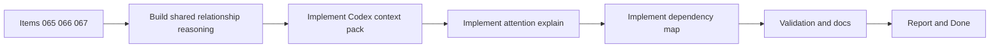

## task_070_orchestration_delivery_for_req_056_context_pack_attention_explain_and_dependency_map - Orchestration delivery for req 056 context pack attention explain and dependency map
> From version: 1.10.4
> Status: Ready
> Understanding: 97%
> Confidence: 94%
> Progress: 0%
> Complexity: High
> Theme: Cross-item delivery orchestration
> Reminder: Update status/understanding/confidence/progress and dependencies/references when you edit this doc.

# Context
Derived from:
- `logics/backlog/item_065_build_codex_context_pack_for_related_logics_docs.md`
- `logics/backlog/item_066_explain_attention_reasons_and_suggested_remediation.md`
- `logics/backlog/item_067_add_dependency_map_for_logics_workflow_relationships.md`

This task bundles three adjacent plugin improvements that should share the same relationship model instead of being implemented as isolated features:
- a `Context Pack for Codex` built from the managed Logics graph;
- an `Attention Explain` layer that makes attention reasons explicit and actionable;
- a `Dependency Map` that visualizes workflow and companion-doc relationships.

Constraint:
- prefer a shared graph-reasoning layer first, so context selection, attention explanation, and map rendering do not each invent separate traversal logic.
- release can be phased across multiple versions, but the orchestration task is only considered complete when all three backlog slices are delivered.

# Plan
- [ ] 1. Define or extract the shared relationship and explanation model that all three features can reuse.
- [ ] 2. Implement the `Context Pack for Codex` flow, including related-doc selection, trimming rules, and launch or preview behavior.
- [ ] 3. Implement `Attention Explain` so explicit reasons and suggested remediation can be surfaced from the same underlying graph signals.
- [ ] 4. Implement the first `Dependency Map` experience and synchronize node selection with current item details or actions.
- [ ] 5. Add or adjust automated tests and any required UI documentation for the combined feature set.
- [ ] FINAL: Update related Logics docs

# AC Traceability
- item065-AC1/item067-AC5 -> Step 1. Proof: TODO.
- item065-AC2/item065-AC3 -> Step 2. Proof: TODO.
- item065-AC4/item065-AC5 -> Step 2. Proof: TODO.
- item066-AC1/item066-AC2 -> Step 3. Proof: TODO.
- item066-AC3/item066-AC4/item066-AC5 -> Step 3. Proof: TODO.
- item067-AC1/item067-AC2 -> Step 4. Proof: TODO.
- item067-AC3/item067-AC4 -> Step 4. Proof: TODO.
- item065-AC6/item066-AC6/item067-AC6 -> Step 5. Proof: TODO.

# Decision framing
- Product framing: Not needed
- Product signals: (none detected)
- Product follow-up: No product brief follow-up is expected based on current signals.
- Architecture framing: Required
- Architecture signals: data model and persistence, contracts and integration, state and sync
- Architecture follow-up: Create or link an architecture decision before irreversible implementation work starts.

# Links
- Product brief(s): (none yet)
- Architecture decision(s): (none yet)
- Backlog item(s):
  - `item_065_build_codex_context_pack_for_related_logics_docs`
  - `item_066_explain_attention_reasons_and_suggested_remediation`
  - `item_067_add_dependency_map_for_logics_workflow_relationships`
- Request(s): `req_056_add_codex_context_pack_attention_explain_and_dependency_map`

# Delivery decisions
- Delivery order:
  - shared graph or reasoning layer first
  - then item 065 context pack
  - then item 066 attention explain
  - then item 067 dependency map
- Release strategy:
  - implementation may ship across multiple versions if needed
  - this orchestration task closes only when all three backlog items are delivered

# Validation
- `npm run compile`
- `npm run lint`
- `npm run test`
- `python3 logics/skills/logics-doc-linter/scripts/logics_lint.py`
- Manual: validate the Codex context-pack launch or preview flow from a realistic selected item.
- Manual: validate attention reasons and suggested remediation on representative blocked, orphaned, or inconsistent items.
- Manual: validate dependency-map navigation and synchronization with the details panel.

# Definition of Done (DoD)
- [ ] Scope implemented and acceptance criteria covered.
- [ ] Validation commands executed and results captured.
- [ ] Linked request/backlog/task docs updated.
- [ ] Status is `Done` and progress is `100%`.

# Report
