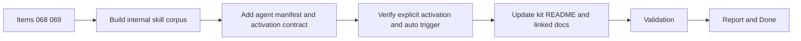

## task_071_orchestration_delivery_for_internal_ui_steering_skill_and_agent - Orchestration delivery for internal UI steering skill and agent
> From version: 1.10.4
> Status: Done
> Understanding: 99%
> Confidence: 96%
> Progress: 100%
> Complexity: Medium
> Theme: Cross-item delivery orchestration
> Reminder: Update status/understanding/confidence/progress and dependencies/references when you edit this doc.

# Context
Derived from:
- `logics/backlog/item_068_create_an_internal_ui_steering_skill_corpus_and_reference_pack.md`
- `logics/backlog/item_069_add_an_internal_ui_steering_agent_manifest_and_usage_contract.md`

This task bundles the two new delivery slices needed to ship the internal UI steering capability as a complete Logics feature:
- the internal skill corpus and reference pack;
- the paired agent manifest and activation contract.

Constraint:
- the delivery should produce one coherent capability, not a disconnected `SKILL.md` and agent manifest.
- the implementation should support both activation paths:
  - explicit activation through agent selection and `$logics-ui-steering`;
  - automatic triggering through strong `SKILL.md` metadata and trigger wording.
- the Logics kit documentation should be updated in the same delivery slice so the new skill is discoverable in `logics/skills/README.md`.

# Plan
- [x] 1. Create the internal UI steering skill package, including `SKILL.md` and any internal reference files needed to preserve the full guidance corpus.
- [x] 2. Add the paired `agents/openai.yaml` manifest and stabilize the internal skill identity so explicit activation works through `Logics: Select Agent` and `$logics-ui-steering`.
- [x] 3. Ensure the skill metadata and wording are strong enough for automatic triggering on frontend-generation and UI-refinement requests.
- [x] 4. Update `logics/skills/README.md` so the new skill is documented as part of the kit and its role is clear beside existing skills.
- [x] 5. Validate the skill package, activation paths, and linked Logics docs.
- [x] FINAL: Update related Logics docs

# AC Traceability
- item068-AC1/item068-AC3 -> Step 1. Proof: `logics/skills/logics-ui-steering/SKILL.md` now exists and establishes the internal UI steering corpus and philosophy.
- item068-AC4/item068-AC5/item068-AC6/item068-AC7 -> Step 1. Proof: `references/primitives.md` and `references/banned_patterns.md` cover grounded defaults, bans, repeated mistakes, and copy discipline.
- item068-AC8/item068-AC9/item068-AC10 -> Step 1. Proof: `references/palettes.md` defines project-first palette reuse and curated fallback palettes, while `SKILL.md` includes implementation-time usage guidance.
- item068-AC2/item068-AC2b/item068-AC10b -> Step 3. Proof: `SKILL.md` frontmatter and `Activation` section explicitly target frontend generation/refinement and explain automatic plus explicit activation.
- item069-AC1/item069-AC2/item069-AC2b -> Step 2. Proof: the skill folder is `logics-ui-steering` and `agents/openai.yaml` now defines the manifest for the same identity.
- item069-AC3/item069-AC4/item069-AC5/item069-AC6 -> Step 2. Proof: `agents/openai.yaml` uses the internal `UI Steering` display name, a concise short description, and a default prompt covering generation and refinement.
- item069-AC7/item069-AC8/item069-AC9/item069-AC10 -> Steps 2 and 3. Proof: the manifest prompt and `SKILL.md` both instruct the agent to inspect project styles first, preserve existing design systems, and remain a focused UI guardrail beside `logics-uiux-designer`.
- item069-AC11/item069-AC12/item069-AC13 -> Steps 2 through 5. Proof: the manifest follows the current registry contract in `src/agentRegistry.ts`, keeps wording internal-only, and documents both explicit and automatic activation paths.
- req057-AC8b/req057-AC14 -> Steps 2 and 3. Proof: explicit activation and auto-trigger behavior are both covered as first-class delivery goals.
- req057-AC13 -> Step 1. Proof: the skill corpus may be split across references only if the practical breadth remains intact.

# Decision framing
- Product framing: Not needed
- Product signals: (none detected)
- Product follow-up: No product brief follow-up is expected based on current signals.
- Architecture framing: Consider
- Architecture signals: contracts and integration
- Architecture follow-up: Review whether an architecture decision is needed only if implementation introduces broader naming or trigger conventions for future skills.

# Links
- Product brief(s): (none yet)
- Architecture decision(s): (none yet)
- Backlog item(s):
  - `item_068_create_an_internal_ui_steering_skill_corpus_and_reference_pack`
  - `item_069_add_an_internal_ui_steering_agent_manifest_and_usage_contract`
- Request(s): `req_057_add_an_internal_ui_steering_skill_and_agent_for_grounded_interface_generation`

# Validation
- `python3 logics/skills/logics-doc-linter/scripts/logics_lint.py --require-status`
- `python3 logics/skills/logics-flow-manager/scripts/workflow_audit.py --legacy-cutoff-version 1.1.0 --group-by-doc`
- `python3 -m unittest discover -s logics/skills/tests -p "test_*.py" -v`
- `npm run compile`
- `npm run test`
- `npm run test:smoke`
- `npm run package:ci`
- Manual: verify the new skill package is documented in `logics/skills/README.md`.
- Manual: verify the skill metadata is specific enough to support auto-triggering on frontend UI requests.
- Manual: verify the agent manifest is coherent with explicit invocation through `$logics-ui-steering`.
- Finish workflow executed on 2026-03-17.
- Linked backlog/request close verification passed.

# Definition of Done (DoD)
- [x] Scope implemented and acceptance criteria covered.
- [x] Validation commands executed and results captured.
- [x] Linked request/backlog/task docs updated.
- [x] Status is `Done` and progress is `100%`.

# Report
- Added `logics/skills/logics-ui-steering/` with a concise trigger-focused `SKILL.md`.
- Added `references/primitives.md`, `references/banned_patterns.md`, and `references/palettes.md` to preserve a dense internal guidance corpus without overloading the trigger doc.
- Added `agents/openai.yaml` so the capability is selectable through the current agent registry and explicit `$logics-ui-steering` invocation.
- Updated `logics/skills/README.md` so the new skill is discoverable in the kit documentation.
- Validation completed across Logics lint/audit, kit Python tests, TypeScript compile, unit tests, smoke tests, and VSIX packaging.
- Finished on 2026-03-17.
- Linked backlog item(s): `item_068_create_an_internal_ui_steering_skill_corpus_and_reference_pack`, `item_069_add_an_internal_ui_steering_agent_manifest_and_usage_contract`
- Related request(s): `req_057_add_an_internal_ui_steering_skill_and_agent_for_grounded_interface_generation`
