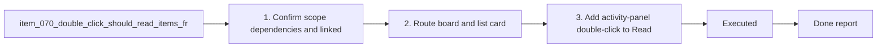

## task_072_double_click_should_read_items_from_list_board_and_activity - Double click should read items from list board and activity
> From version: 1.10.5 (refreshed)
> Status: Done
> Understanding: 100%
> Confidence: 98%
> Progress: 100%
> Complexity: Medium
> Theme: UX workflow
> Reminder: Update status/understanding/confidence/progress and dependencies/references when you edit this doc.

# Context
Derived from `logics/backlog/item_070_double_click_should_read_items_from_list_board_and_activity.md`.
- Derived from backlog item `item_070_double_click_should_read_items_from_list_board_and_activity`.
- Source file: `logics/backlog/item_070_double_click_should_read_items_from_list_board_and_activity.md`.
- Related request(s): `req_058_double_click_should_read_items_from_list_board_and_activity`.
- Delivery goals:
  - switch board/list card double-click to `Read`;
  - add activity-entry double-click to `Read`;
  - preserve single-click selection behavior;
  - lock the behavior with focused webview regressions.

# Plan
- [x] 1. Confirm scope, dependencies, and linked acceptance criteria.
- [x] 2. Route board and list card double-click to `Read` while preserving single-click selection.
- [x] 3. Add activity-panel double-click to `Read` through shared webview state handling.
- [x] 4. Extend regression tests for board, list, and activity behavior.
- [x] 5. Validate the targeted webview surface and update linked Logics docs.
- [x] FINAL: Update related Logics docs

# AC Traceability
- AC1 -> `media/renderBoard.js` switches card `dblclick` from `open` to `read`. Proof: `media/renderBoard.js`.
- AC2 -> List mode reuses the same card renderer and has an explicit regression. Proof: `media/renderBoard.js`, `tests/webview.harness-details-and-filters.test.ts`.
- AC3 -> `media/webviewChrome.js` adds activity `dblclick` handling and `media/main.js` resolves the selected target into `read`. Proof: `media/webviewChrome.js`, `media/main.js`, `tests/webview.harness-core.test.ts`.
- AC4 -> Single click remains selection-only in board/list/activity flows. Proof: `media/renderBoard.js`, `media/webviewChrome.js`, `tests/webview.harness-core.test.ts`.
- AC5 -> Focused webview tests cover board card, list row, and activity entry double-click behavior. Proof: `tests/webview.harness-details-and-filters.test.ts`, `tests/webview.harness-core.test.ts`.

# Decision framing
- Product framing: Not needed
- Product signals: narrow UX consistency fix inside an existing flow
- Product follow-up: none
- Architecture framing: Not needed
- Architecture signals: (none detected)
- Architecture follow-up: none

# Links
- Product brief(s): (none yet)
- Architecture decision(s): (none yet)
- Backlog item: `logics/backlog/item_070_double_click_should_read_items_from_list_board_and_activity.md`
- Request(s): `logics/request/req_058_double_click_should_read_items_from_list_board_and_activity.md`

# Validation
- Executed:
  - `npx vitest run tests/webview.harness-details-and-filters.test.ts tests/webview.harness-core.test.ts`
- Result:
  - `58` tests passed.

# Definition of Done (DoD)
- [x] Scope implemented and acceptance criteria covered.
- [x] Validation commands executed and results captured.
- [x] Linked request/backlog/task docs updated.
- [x] Status is `Done` and progress is `100%`.

# Report
- Implemented:
  - `media/renderBoard.js`: board/list card double-click now routes to `Read`.
  - `media/webviewChrome.js`: activity entries support double-click to `Read` while keeping click-to-select.
  - `media/main.js`: shared `readItemAndRender` helper for activity entries.
  - `tests/webview.harness-details-and-filters.test.ts`: explicit non-harness coverage for board and list double-click.
  - `tests/webview.harness-core.test.ts`: explicit non-harness coverage for activity double-click.
- Risks:
  - users familiar with double-click as `Open/Edit` will observe a changed navigation outcome;
  - click and double-click sequencing must keep selection behavior intact.
- Mitigation:
  - preserve explicit `Open/Edit` as a separate action;
  - keep single-click handlers unchanged and lock behavior with focused regressions.

# Notes
