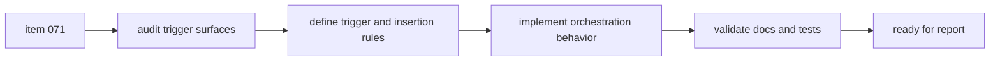

## task_073_orchestration_delivery_for_req_059_ui_steering_guidance_in_logics_kit - Orchestration delivery for req_059 UI steering guidance in Logics kit
> From version: 1.10.5
> Status: Ready
> Understanding: 97%
> Confidence: 95%
> Progress: 0%
> Complexity: Medium
> Theme: Logics kit skill orchestration and frontend guidance
> Reminder: Update status/understanding/confidence/progress and dependencies/references when you edit this doc.

# Context
- Derived from backlog item `item_071_guide_frontend_work_toward_the_ui_steering_skill_in_the_logics_kit`.
- Source file: `logics/backlog/item_071_guide_frontend_work_toward_the_ui_steering_skill_in_the_logics_kit.md`.
- Related request(s): `req_059_guide_frontend_work_toward_the_ui_steering_skill_in_the_logics_kit`.
- Delivery goal:
  - detect frontend-oriented scope reliably;
  - surface `logics-ui-steering` in the normal Logics workflow;
  - keep the guidance advisory and compatible with other skill framings.

# Plan
- [ ] 1. Confirm trigger vocabulary, insertion points, and expected advisory behavior.
- [ ] 2. Audit current flow-manager guidance and promotion surfaces where skill recommendations can appear.
- [ ] 3. Implement deterministic frontend-scope detection plus explicit `logics-ui-steering` recommendation.
- [ ] 4. Preserve compatibility with non-frontend flows and concurrent product or architecture recommendations.
- [ ] 5. Add or update tests and docs for the new orchestration behavior.
- [ ] FINAL: Update related Logics docs

# AC Traceability
- AC1 -> Workflow outputs explicitly surface `logics-ui-steering` for frontend-oriented scope. Proof: TODO.
- AC2 -> Trigger vocabulary and limited-context rules are implemented and testable. Proof: TODO.
- AC3 -> Recommendation appears in the chosen orchestration surfaces. Proof: TODO.
- AC4 -> Advisory behavior and multi-skill coexistence are preserved. Proof: TODO.
- AC5 -> Tests and docs cover the new behavior. Proof: TODO.

# Decision framing
- Product framing: Not needed
- Product signals: (none detected)
- Product follow-up: No product brief follow-up is expected based on current signals.
- Architecture framing: Not needed
- Architecture signals: (none detected)
- Architecture follow-up: No architecture decision follow-up is expected based on current signals.

# Links
- Product brief(s): (none yet)
- Architecture decision(s): (none yet)
- Backlog item: `logics/backlog/item_071_guide_frontend_work_toward_the_ui_steering_skill_in_the_logics_kit.md`
- Request(s): `logics/request/req_059_guide_frontend_work_toward_the_ui_steering_skill_in_the_logics_kit.md`

# Validation
- `python3 -m pytest logics/skills/tests/test_logics_flow.py`
- `python3 logics/skills/logics-doc-linter/scripts/logics_lint.py`

# Definition of Done (DoD)
- [ ] Scope implemented and acceptance criteria covered.
- [ ] Validation commands executed and results captured.
- [ ] Linked request/backlog/task docs updated.
- [ ] Status is `Done` and progress is `100%`.

# Report
- Pending implementation.
