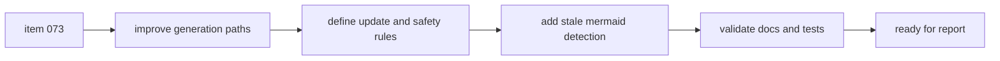

## task_074_orchestration_delivery_for_req_061_context_aware_mermaid_in_logics_docs - Orchestration delivery for req_061 context aware Mermaid in Logics docs
> From version: 1.10.5
> Status: Done
> Understanding: 97%
> Confidence: 94%
> Progress: 100%
> Complexity: Medium
> Theme: Logics doc quality and Mermaid relevance
> Reminder: Update status/understanding/confidence/progress and dependencies/references when you edit this doc.

# Context
- Derived from backlog item `item_073_generate_context_aware_mermaid_diagrams_and_keep_them_updated_in_logics_docs`.
- Source file: `logics/backlog/item_073_generate_context_aware_mermaid_diagrams_and_keep_them_updated_in_logics_docs.md`.
- Related request(s): `req_061_generate_context_aware_mermaid_diagrams_and_keep_them_updated_in_logics_docs`.
- Delivery goal:
  - generate Mermaid from real document context;
  - define when Mermaid must be refreshed;
  - keep diagrams compact and safe;
  - add warning-first stale or generic Mermaid detection.

# Plan
- [ ] 1. Confirm contextual Mermaid requirements for request, backlog, and task docs.
- [ ] 2. Audit current template and promotion behavior for generic or stale Mermaid output.
- [ ] 3. Implement improved context-aware Mermaid generation for creation and promotion flows.
- [ ] 4. Define update triggers and warning-first stale Mermaid detection.
- [ ] 5. Add or update tests and kit docs for the revised Mermaid contract.
- [ ] FINAL: Update related Logics docs

# AC Traceability
- AC1 -> Generation paths use actual document context for Mermaid. Proof: TODO.
- AC2 -> Update triggers cover problem, scope, AC, plan, and execution-path changes. Proof: TODO.
- AC3 -> Mermaid stays compact and render-safe. Proof: TODO.
- AC4 -> Stale or generic Mermaid detection follows warning-first behavior. Proof: TODO.
- AC5 -> Tests and docs cover the improved Mermaid workflow. Proof: TODO.

# Decision framing
- Product framing: Not needed
- Product signals: (none detected)
- Product follow-up: No product brief follow-up is expected based on current signals.
- Architecture framing: Not needed
- Architecture signals: (none detected)
- Architecture follow-up: No architecture decision follow-up is expected based on current signals.

# Links
- Product brief(s): (none yet)
- Architecture decision(s): (none yet)
- Backlog item: `logics/backlog/item_073_generate_context_aware_mermaid_diagrams_and_keep_them_updated_in_logics_docs.md`
- Request(s): `logics/request/req_061_generate_context_aware_mermaid_diagrams_and_keep_them_updated_in_logics_docs.md`

# Validation
- `python3 -m pytest logics/skills/tests/test_logics_flow.py`
- `python3 logics/skills/logics-doc-linter/scripts/logics_lint.py`
- Finish workflow executed on 2026-03-18.
- Linked backlog/request close verification passed.

# Definition of Done (DoD)
- [x] Scope implemented and acceptance criteria covered.
- [x] Validation commands executed and results captured.
- [x] Linked request/backlog/task docs updated.
- [x] Status is `Done` and progress is `100%`.

# Report
- Pending implementation.
- Finished on 2026-03-18.
- Linked backlog item(s): `item_073_generate_context_aware_mermaid_diagrams_and_keep_them_updated_in_logics_docs`
- Related request(s): `req_061_generate_context_aware_mermaid_diagrams_and_keep_them_updated_in_logics_docs`
