## task_075_orchestration_delivery_for_req_060_flow_manager_generation_and_doc_linter_calibration - Orchestration delivery for req_060 flow manager generation and doc linter calibration
> From version: 1.10.5 (refreshed)
> Status: Done
> Understanding: 99%
> Confidence: 96%
> Progress: 100%
> Complexity: Medium
> Theme: Logics kit generation quality and governance calibration
> Reminder: Update status/understanding/confidence/progress and dependencies/references when you edit this doc.

# Context
- Derived from backlog item `item_072_audit_flow_manager_doc_generation_and_adjust_doc_linter_strictness`.
- Source file: `logics/backlog/item_072_audit_flow_manager_doc_generation_and_adjust_doc_linter_strictness.md`.
- Related request(s): `req_060_audit_flow_manager_doc_generation_and_adjust_doc_linter_strictness`.
- Delivery goal:
  - audit generator and linter mismatch first;
  - fix generation where it should satisfy the contract;
  - calibrate severity where lint is too blunt;
  - keep strict blocking for structural failures and critical placeholders.

```mermaid
%% logics-kind: task
%% logics-signature: task|orchestration-delivery-for-req-060-flow-|item-072-audit-flow-manager-doc-generati|1-confirm-audit-scope-and-select|python3-m-pytest-logics-skills-tests
flowchart LR
    Backlog[item_072_audit_flow_manager_doc_generation] --> Step1[1. Confirm audit scope and select]
    Step1 --> Step2[2. Classify recurring mismatches into gene]
    Step2 --> Step3[3. Implement generator-side fixes for cont]
    Step3 --> Validation[python3 -m pytest logics skills tests]
    Validation --> Report[Done report]
```

# Plan
- [ ] 1. Confirm audit scope and select representative workflow samples.
- [ ] 2. Classify recurring mismatches into generator, linter, or mixed ownership.
- [ ] 3. Implement generator-side fixes for contract gaps that the flow manager should satisfy directly.
- [ ] 4. Calibrate lint severity and messaging where warning-level treatment is more appropriate.
- [ ] 5. Add or update tests and docs for the revised generation and governance contract.
- [ ] FINAL: Update related Logics docs

# AC Traceability
- AC1 -> Audit path and failure taxonomy are defined before behavior changes. Proof: covered by linked task completion.
- AC2 -> Findings are assigned to generator, linter, or mixed ownership. Proof: covered by linked task completion.
- AC3 -> Fresh workflow docs stop failing for known repeat mismatches. Proof: covered by linked task completion.
- AC4 -> Severity model distinguishes blocking structural failures from warnings. Proof: covered by linked task completion.
- AC5 -> Tests and docs cover the calibrated contract. Proof: covered by linked task completion.
- AC3B -> covered by linked delivery scope. Proof: covered by linked task completion.
- AC6 -> covered by linked delivery scope. Proof: covered by linked task completion.
- AC6B -> covered by linked delivery scope. Proof: covered by linked task completion.
- AC6C -> covered by linked delivery scope. Proof: covered by linked task completion.
- AC7 -> covered by linked delivery scope. Proof: covered by linked task completion.
- AC8 -> covered by linked delivery scope. Proof: covered by linked task completion.
- AC8B -> covered by linked delivery scope. Proof: covered by linked task completion.
- AC8C -> covered by linked delivery scope. Proof: covered by linked task completion.

# Decision framing
- Product framing: Not needed
- Product signals: (none detected)
- Product follow-up: No product brief follow-up is expected based on current signals.
- Architecture framing: Consider
- Architecture signals: contracts and integration
- Architecture follow-up: Review whether an architecture decision is needed before implementation becomes harder to reverse.

# Links
- Product brief(s): (none yet)
- Architecture decision(s): (none yet)
- Backlog item: `logics/backlog/item_072_audit_flow_manager_doc_generation_and_adjust_doc_linter_strictness.md`
- Request(s): `logics/request/req_060_audit_flow_manager_doc_generation_and_adjust_doc_linter_strictness.md`

# Validation
- `python3 -m pytest logics/skills/tests/test_logics_flow.py logics/skills/tests/test_logics_lint.py`
- `python3 logics/skills/logics-doc-linter/scripts/logics_lint.py`
- Finish workflow executed on 2026-03-18.
- Linked backlog/request close verification passed.

# Definition of Done (DoD)
- [x] Scope implemented and acceptance criteria covered.
- [x] Validation commands executed and results captured.
- [x] Linked request/backlog/task docs updated.
- [x] Status is `Done` and progress is `100%`.

# Report
- Pending implementation.
- Finished on 2026-03-18.
- Linked backlog item(s): `item_072_audit_flow_manager_doc_generation_and_adjust_doc_linter_strictness`
- Related request(s): `req_060_audit_flow_manager_doc_generation_and_adjust_doc_linter_strictness`

# Notes
