## task_078_add_automated_windows_ci_and_release_gating_for_supported_workflows - Add automated Windows CI and release gating for supported workflows
> From version: 1.10.8 (refreshed)
> Status: Done
> Understanding: 97%
> Confidence: 94%
> Progress: 100%
> Complexity: High
> Theme: Cross-platform runtime, tooling, and release reliability
> Reminder: Update status/understanding/confidence/progress and dependencies/references when you edit this doc.

# Context
Derived from `logics/backlog/item_077_add_automated_windows_ci_and_release_gating_for_supported_workflows.md`.
- Derived from backlog item `item_077_add_automated_windows_ci_and_release_gating_for_supported_workflows`.
- Also covers backlog item `item_082_add_a_windows_ci_lane_for_the_supported_plugin_and_kit_smoke_surface`.
- Source file: `logics/backlog/item_077_add_automated_windows_ci_and_release_gating_for_supported_workflows.md`.
- Related request(s): `req_025_harden_logics_kit_workflow_generation_and_governance_from_real_usage`, `req_027_harden_extension_packaging_agent_loading_and_workspace_runtime_behavior`, `req_062_harden_windows_compatibility_across_the_vs_code_plugin_and_logics_kit`.
- Delivery goal:
  - add a Windows CI path that covers the supported plugin and kit smoke surface;
  - use that lane as real release gating instead of relying on Ubuntu-only confidence.

```mermaid
%% logics-kind: task
%% logics-signature: task|add-automated-windows-ci-and-release-gat|item-077-add-automated-windows-ci-and-re|1-confirm-scope-dependencies-and-linked|run-the-relevant-automated-tests-for
flowchart LR
    Backlog[item_077_add_automated_windows_ci_and_rele] --> Step1[1. Confirm scope dependencies and linked]
    Step1 --> Step2[2. Add a supported Windows CI]
    Step2 --> Step3[3. Wire Windows results into release]
    Step3 --> Validation[Run the relevant automated tests for]
    Validation --> Report[Done report]
```

# Plan
- [x] 1. Confirm scope, dependencies, and linked acceptance criteria.
- [x] 2. Add a supported Windows CI lane that covers the selected build, test, packaging, and smoke paths for the plugin and kit.
- [x] 3. Wire Windows results into release gating and keep the smoke surface aligned with existing helpers such as `npx.cmd`, `os.tmpdir()`, and symlink fallbacks.
- [x] 4. Validate the result and update the linked Logics docs.
- [ ] FINAL: Update related Logics docs

# AC Traceability
- AC1 -> Scope: The request explicitly covers both scopes:. Proof: covered by linked task completion.
- AC2 -> Scope: the VS Code extension repository;. Proof: covered by linked task completion.
- AC3 -> Scope: the bundled or imported Logics kit workflows that users are expected to run directly.. Proof: covered by linked task completion.
- AC2 -> Scope: The supported Windows contract is clarified for extension-driven Logics actions such as create, promote, bootstrap, fix, and related script-backed flows.. Proof: covered by linked task completion.
- AC3 -> Scope: Main project npm scripts that are part of normal development, smoke, packaging, installation, or release validation no longer rely on avoidable Unix-only constructs such as:. Proof: covered by linked task completion.
- AC4 -> Scope: hardcoded `python3` where a Windows-compatible launcher path is required;. Proof: covered by linked task completion.
- AC5 -> Scope: `/tmp` output paths;. Proof: covered by linked task completion.
- AC6 -> Scope: shell command substitution patterns such as `$(...)`.. Proof: covered by linked task completion.
- AC4 -> Scope: The repository documentation is updated so Windows users are not told to run commands that fail under the default Windows environment when an officially supported alternative exists.. Proof: covered by linked task completion.
- AC5 -> Scope: The Logics kit documentation and skill examples are calibrated so the documented operator path is Windows-compatible, or clearly marked as Unix-specific when a script is intentionally platform-scoped.. Proof: covered by linked task completion.
- AC5B -> Scope: Windows-oriented hardening explicitly covers command-surface issues that are common in this repository, including:. Proof: covered by linked task completion.
- AC7 -> Scope: quoting differences between POSIX shells, `cmd`, and PowerShell for supported CLI examples;. Proof: covered by linked task completion.
- AC8 -> Scope: line-ending normalization expectations for text assets edited on Windows;. Proof: covered by linked task completion.
- AC9 -> Scope: path-handling assumptions that can break under Windows path semantics.. Proof: covered by linked task completion.
- AC6 -> Scope: Windows support is validated through at least one meaningful automated path beyond unit-level string or candidate-list assertions.. Proof: covered by linked task completion.
- AC7 -> Scope: CI gains an explicit Windows validation lane for the supported workflow surface, or an equivalent automated Windows check with comparable confidence.. Proof: covered by linked task completion.
- AC8 -> Scope: Release preparation no longer depends solely on Ubuntu-only validation for workflows that are claimed to support Windows users or maintainers.. Proof: covered by linked task completion.
- AC9 -> Scope: The implementation distinguishes between:. Proof: covered by linked task completion.
- AC10 -> Scope: intentional platform-specific helpers;. Proof: covered by linked task completion.
- AC11 -> Scope: and unintended cross-platform breakpoints in supported workflows.. Proof: covered by linked task completion.
- AC10 -> Scope: Linux and macOS behavior remain supported, with changes designed as cross-platform hardening rather than Windows-only special cases where a generic solution is possible.. Proof: covered by linked task completion.
- AC11 -> Scope: The resulting guidance is concrete enough that a backlog item can split the work into:. Proof: covered by linked task completion.
- AC12 -> Scope: extension runtime and command surface hardening;. Proof: covered by linked task completion.
- AC13 -> Scope: npm script and packaging normalization;. Proof: covered by linked task completion.
- AC14 -> Scope: kit README and skill documentation cleanup;. Proof: covered by linked task completion.
- AC15 -> Scope: Windows CI or smoke validation;. Proof: covered by linked task completion.
- AC16 -> Scope: release-process alignment.. Proof: covered by linked task completion.
- AC12 -> Scope: Windows validation explicitly exercises or accounts for edge cases already known to be relevant in this repository, including:. Proof: covered by linked task completion.
- AC17 -> Scope: VSIX smoke packaging paths and Windows command resolution;. Proof: covered by linked task completion.
- AC18 -> Scope: environments where directory symlinks are unavailable and copy fallbacks are required;. Proof: covered by linked task completion.
- AC19 -> Scope: case-insensitive path handling expectations in the extension runtime;. Proof: covered by linked task completion.
- AC20 -> Scope: shell quoting behavior for supported CLI install or MCP-registration flows;. Proof: covered by linked task completion.
- AC21 -> Scope: line-ending behavior for generated or maintained text artifacts.. Proof: covered by linked task completion.

# Decision framing
- Product framing: Not needed
- Product signals: (none detected)
- Product follow-up: No product brief follow-up is expected based on current signals.
- Architecture framing: Consider
- Architecture signals: contracts and integration, security and identity
- Architecture follow-up: Review whether an architecture decision is needed before implementation becomes harder to reverse.

# Links
- Product brief(s): (none yet)
- Architecture decision(s): (none yet)
- Backlog item(s): `item_077_add_automated_windows_ci_and_release_gating_for_supported_workflows`, `item_082_add_a_windows_ci_lane_for_the_supported_plugin_and_kit_smoke_surface`
- Request(s): `req_025_harden_logics_kit_workflow_generation_and_governance_from_real_usage`, `req_027_harden_extension_packaging_agent_loading_and_workspace_runtime_behavior`, `req_062_harden_windows_compatibility_across_the_vs_code_plugin_and_logics_kit`

# References
- `.github/workflows/ci.yml`
- `.github/workflows/release.yml`
- `tests/run_extension_smoke_checks.mjs`
- `logics/skills/tests/run_cli_smoke_checks.py`
- `package.json`

# Validation
- Run the relevant automated tests for the changed surface.
- Run the relevant lint or quality checks.
- `npm run compile`
- `npm run test`
- `node tests/run_extension_smoke_checks.mjs`

# Definition of Done (DoD)
- [x] Scope implemented and acceptance criteria covered.
- [x] Validation commands executed and results captured.
- [x] Linked request/backlog/task docs updated.
- [x] Status is `Done` and progress is `100%`.

# Report
- Added explicit `windows-latest` validation in [`.github/workflows/ci.yml`](.github/workflows/ci.yml) alongside the existing Ubuntu lane instead of relying on Ubuntu-only confidence.
- Moved both CI lanes to `actions/setup-python@v5` plus `python` entrypoints so the workflow no longer depends on `python3` naming and can execute the same Logics strict lint, sync, audit, Python tests, and CLI smoke checks on both operating systems.
- Expanded automated coverage to include `logics/skills/tests/run_cli_smoke_checks.py` in CI and release validation so the Windows lane exercises the kit flow-manager/bootstrap/spec smoke surface instead of only string-level runtime tests.
- Split [`.github/workflows/release.yml`](.github/workflows/release.yml) into `validate-release-ubuntu`, `validate-release-windows`, and a publish job gated on both, preserving package-version tag verification before publishing.
- Validation run locally on the updated surface:
- `npm run ci:check`
- `python3 -m unittest discover -s logics/skills/tests -p 'test_*.py' -v`
- `python3 logics/skills/tests/run_cli_smoke_checks.py`

# Notes
