## task_079_make_missing_workflow_directories_an_explicit_self_healing_logics_contract - Make missing workflow directories an explicit self-healing Logics contract
> From version: 1.10.8
> Status: Done
> Understanding: 96%
> Confidence: 94%
> Progress: 100%
> Complexity: Medium
> Theme: Bootstrap resilience and workflow directory recovery
> Reminder: Update status/understanding/confidence/progress and dependencies/references when you edit this doc.

# Context
- Derived from backlog item `item_085_make_missing_workflow_directories_an_explicit_self_healing_logics_contract`.
- Also covers backlog item `item_086_add_regression_coverage_for_create_flows_when_workflow_directories_are_missing`.
- Source file: `logics/backlog/item_085_make_missing_workflow_directories_an_explicit_self_healing_logics_contract.md`.
- Related request(s): `req_062_harden_windows_compatibility_across_the_vs_code_plugin_and_logics_kit`, `req_065_harden_partial_logics_bootstrap_recovery_when_workflow_directories_are_missing`.
- Delivery goal:
  - codify missing workflow directories as an intentional self-healing case when the kit is otherwise present;
  - lock that behavior down with direct flow-manager regression coverage.

```mermaid
%% logics-kind: task
%% logics-signature: task|make-missing-workflow-directories-an-exp|item-085-make-missing-workflow-directori|1-confirm-scope-dependencies-and-linked|run-the-relevant-automated-tests-for
flowchart LR
    Backlog[item_085_make_missing_workflow_directories] --> Step1[1. Confirm scope dependencies and linked]
    Step1 --> Step2[2. Implement the scoped changes from]
    Step2 --> Step3[3. Validate the result and update]
    Step3 --> Validation[Run the relevant automated tests for]
    Validation --> Report[Done report]
```

# Plan
- [x] 1. Confirm scope, dependencies, and linked acceptance criteria.
- [x] 2. Make the self-healing contract explicit in the flow manager and any extension-facing messaging for missing `request`, `backlog`, and `tasks` directories.
- [x] 3. Add targeted regression coverage for missing-directory create flows while preserving explicit failure modes for missing kit scripts or incomplete installs.
- [x] 4. Validate the result and update the linked Logics docs.
- [ ] FINAL: Update related Logics docs

# AC Traceability
- AC1 -> Scope: The request explicitly covers partial-bootstrap states where the Logics kit is present but one or more workflow directories are missing.. Proof: TODO.
- AC2 -> Scope: The request makes clear that missing `logics/request`, `logics/backlog`, and `logics/tasks` directories are expected recovery cases for the supported create flows.. Proof: TODO.
- AC3 -> Scope: The request allows the implementation to treat these missing-directory cases as self-healing by recreating the target directory automatically before document generation.. Proof: TODO.
- AC4 -> Scope: Targeted regression tests are added for at least:. Proof: TODO.
- AC5 -> Scope: missing request directory then `new request`;. Proof: TODO.
- AC6 -> Scope: missing backlog directory then `new backlog`;. Proof: TODO.
- AC7 -> Scope: missing task directory then `new task`.. Proof: TODO.
- AC5 -> Scope: The request distinguishes missing workflow directories from broader broken-kit states such as:. Proof: TODO.
- AC8 -> Scope: missing `logics/skills`;. Proof: TODO.
- AC9 -> Scope: missing flow-manager scripts;. Proof: TODO.
- AC10 -> Scope: incompatible or incomplete kit installations.. Proof: TODO.
- AC6 -> Scope: The resulting behavior is documented or otherwise made explicit enough that maintainers understand this recovery path is intentional rather than accidental.. Proof: TODO.
- AC7 -> Scope: The request is specific enough that a backlog item can split the work into:. Proof: TODO.
- AC11 -> Scope: contract clarification;. Proof: TODO.
- AC12 -> Scope: flow-manager regression tests;. Proof: TODO.
- AC13 -> Scope: optional extension-level messaging or smoke coverage if needed.. Proof: TODO.

# Decision framing
- Product framing: Not needed
- Product signals: (none detected)
- Product follow-up: No product brief follow-up is expected based on current signals.
- Architecture framing: Consider
- Architecture signals: contracts and integration
- Architecture follow-up: Review whether an architecture decision is needed before implementation becomes harder to reverse.

# Links
- Product brief(s): (none yet)
- Architecture decision(s): (none yet)
- Backlog item(s): `item_085_make_missing_workflow_directories_an_explicit_self_healing_logics_contract`, `item_086_add_regression_coverage_for_create_flows_when_workflow_directories_are_missing`
- Request(s): `req_062_harden_windows_compatibility_across_the_vs_code_plugin_and_logics_kit`, `req_065_harden_partial_logics_bootstrap_recovery_when_workflow_directories_are_missing`

# References
- `src/logicsViewDocumentController.ts`
- `logics/skills/logics-flow-manager/scripts/logics_flow.py`
- `logics/skills/logics-flow-manager/scripts/logics_flow_support.py`
- `logics/skills/tests/test_logics_flow.py`

# Validation
- Run the relevant automated tests for the changed surface.
- Run the relevant lint or quality checks.
- `python3 -m unittest discover -s logics/skills/tests -p "test_*.py" -v`
- `python3 logics/skills/logics-doc-linter/scripts/logics_lint.py`

# Definition of Done (DoD)
- [x] Scope implemented and acceptance criteria covered.
- [x] Validation commands executed and results captured.
- [x] Linked request/backlog/task docs updated.
- [x] Status is `Done` and progress is `100%`.

# Report
- Documented the self-healing contract directly in [`logics/skills/logics-flow-manager/scripts/logics_flow_support.py`](logics/skills/logics-flow-manager/scripts/logics_flow_support.py) at `_reserve_doc`, which is the path used by `new request`, `new backlog`, and `new task`.
- Added direct regression coverage in [`logics/skills/tests/test_logics_flow.py`](logics/skills/tests/test_logics_flow.py) for:
- missing `logics/request` then `new request`
- missing `logics/backlog` then `new backlog`
- missing `logics/tasks` then `new task`
- Kept failure handling for broader broken-kit states unchanged; this task only codifies missing workflow directories as an intentional recovery case when the kit and scripts are otherwise present.
- Validation run:
- `python3 -m unittest discover -s logics/skills/tests -p 'test_*.py' -v`
- `python3 logics/skills/logics-doc-linter/scripts/logics_lint.py`
