## task_080_make_supported_logics_kit_command_entrypoints_cross_platform - Make supported Logics kit command entrypoints cross-platform
> From version: 1.10.8
> Status: Done
> Understanding: 96%
> Confidence: 93%
> Progress: 100%
> Complexity: High
> Theme: Cross-platform runtime, tooling, and release reliability
> Reminder: Update status/understanding/confidence/progress and dependencies/references when you edit this doc.

# Context
- Derived from backlog item `item_076_make_supported_logics_kit_command_entrypoints_cross_platform`.
- Source file: `logics/backlog/item_076_make_supported_logics_kit_command_entrypoints_cross_platform.md`.
- Related request(s): `req_025_harden_logics_kit_workflow_generation_and_governance_from_real_usage`, `req_027_harden_extension_packaging_agent_loading_and_workspace_runtime_behavior`, `req_062_harden_windows_compatibility_across_the_vs_code_plugin_and_logics_kit`.
- Delivery goal:
  - make the supported kit command entrypoints usable from Windows without relying on Unix-only launcher assumptions;
  - keep the kit contract generic for downstream repos instead of patching only this extension.

```mermaid
%% logics-kind: task
%% logics-signature: task|make-supported-logics-kit-command-entryp|item-076-make-supported-logics-kit-comma|1-confirm-scope-dependencies-and-linked|run-the-relevant-automated-tests-for
flowchart LR
    Backlog[item_076_make_supported_logics_kit_command] --> Step1[1. Confirm scope dependencies and linked]
    Step1 --> Step2[2. Implement the scoped changes from]
    Step2 --> Step3[3. Validate the result and update]
    Step3 --> Validation[Run the relevant automated tests for]
    Validation --> Report[Done report]
```

# Plan
- [x] 1. Confirm scope, dependencies, and linked acceptance criteria.
- [x] 2. Inventory the supported kit command entrypoints and replace blind `python3` or POSIX-only assumptions with Windows-safe invocation guidance or helper logic where needed.
- [x] 3. Update kit smoke paths or tests so the supported command surface stays cross-platform instead of drifting back to Unix-only examples.
- [x] 4. Validate the result and update the linked Logics docs.
- [ ] FINAL: Update related Logics docs

# AC Traceability
- AC1 -> Scope: The request explicitly covers both scopes:. Proof: TODO.
- AC2 -> Scope: the VS Code extension repository;. Proof: TODO.
- AC3 -> Scope: the bundled or imported Logics kit workflows that users are expected to run directly.. Proof: TODO.
- AC2 -> Scope: The supported Windows contract is clarified for extension-driven Logics actions such as create, promote, bootstrap, fix, and related script-backed flows.. Proof: TODO.
- AC3 -> Scope: Main project npm scripts that are part of normal development, smoke, packaging, installation, or release validation no longer rely on avoidable Unix-only constructs such as:. Proof: TODO.
- AC4 -> Scope: hardcoded `python3` where a Windows-compatible launcher path is required;. Proof: TODO.
- AC5 -> Scope: `/tmp` output paths;. Proof: TODO.
- AC6 -> Scope: shell command substitution patterns such as `$(...)`.. Proof: TODO.
- AC4 -> Scope: The repository documentation is updated so Windows users are not told to run commands that fail under the default Windows environment when an officially supported alternative exists.. Proof: TODO.
- AC5 -> Scope: The Logics kit documentation and skill examples are calibrated so the documented operator path is Windows-compatible, or clearly marked as Unix-specific when a script is intentionally platform-scoped.. Proof: TODO.
- AC5B -> Scope: Windows-oriented hardening explicitly covers command-surface issues that are common in this repository, including:. Proof: TODO.
- AC7 -> Scope: quoting differences between POSIX shells, `cmd`, and PowerShell for supported CLI examples;. Proof: TODO.
- AC8 -> Scope: line-ending normalization expectations for text assets edited on Windows;. Proof: TODO.
- AC9 -> Scope: path-handling assumptions that can break under Windows path semantics.. Proof: TODO.
- AC6 -> Scope: Windows support is validated through at least one meaningful automated path beyond unit-level string or candidate-list assertions.. Proof: TODO.
- AC7 -> Scope: CI gains an explicit Windows validation lane for the supported workflow surface, or an equivalent automated Windows check with comparable confidence.. Proof: TODO.
- AC8 -> Scope: Release preparation no longer depends solely on Ubuntu-only validation for workflows that are claimed to support Windows users or maintainers.. Proof: TODO.
- AC9 -> Scope: The implementation distinguishes between:. Proof: TODO.
- AC10 -> Scope: intentional platform-specific helpers;. Proof: TODO.
- AC11 -> Scope: and unintended cross-platform breakpoints in supported workflows.. Proof: TODO.
- AC10 -> Scope: Linux and macOS behavior remain supported, with changes designed as cross-platform hardening rather than Windows-only special cases where a generic solution is possible.. Proof: TODO.
- AC11 -> Scope: The resulting guidance is concrete enough that a backlog item can split the work into:. Proof: TODO.
- AC12 -> Scope: extension runtime and command surface hardening;. Proof: TODO.
- AC13 -> Scope: npm script and packaging normalization;. Proof: TODO.
- AC14 -> Scope: kit README and skill documentation cleanup;. Proof: TODO.
- AC15 -> Scope: Windows CI or smoke validation;. Proof: TODO.
- AC16 -> Scope: release-process alignment.. Proof: TODO.
- AC12 -> Scope: Windows validation explicitly exercises or accounts for edge cases already known to be relevant in this repository, including:. Proof: TODO.
- AC17 -> Scope: VSIX smoke packaging paths and Windows command resolution;. Proof: TODO.
- AC18 -> Scope: environments where directory symlinks are unavailable and copy fallbacks are required;. Proof: TODO.
- AC19 -> Scope: case-insensitive path handling expectations in the extension runtime;. Proof: TODO.
- AC20 -> Scope: shell quoting behavior for supported CLI install or MCP-registration flows;. Proof: TODO.
- AC21 -> Scope: line-ending behavior for generated or maintained text artifacts.. Proof: TODO.

# Decision framing
- Product framing: Not needed
- Product signals: (none detected)
- Product follow-up: No product brief follow-up is expected based on current signals.
- Architecture framing: Consider
- Architecture signals: contracts and integration, security and identity
- Architecture follow-up: Review whether an architecture decision is needed before implementation becomes harder to reverse.

# Links
- Product brief(s): (none yet)
- Architecture decision(s): (none yet)
- Backlog item: `item_076_make_supported_logics_kit_command_entrypoints_cross_platform`
- Request(s): `req_025_harden_logics_kit_workflow_generation_and_governance_from_real_usage`, `req_027_harden_extension_packaging_agent_loading_and_workspace_runtime_behavior`, `req_062_harden_windows_compatibility_across_the_vs_code_plugin_and_logics_kit`

# References
- `logics/instructions.md`
- `logics/skills/README.md`
- `logics/skills/tests/run_cli_smoke_checks.py`
- `package.json`

# Validation
- Run the relevant automated tests for the changed surface.
- Run the relevant lint or quality checks.
- `python3 logics/skills/tests/run_cli_smoke_checks.py`
- `python3 logics/skills/logics-doc-linter/scripts/logics_lint.py`

# Definition of Done (DoD)
- [x] Scope implemented and acceptance criteria covered.
- [x] Validation commands executed and results captured.
- [x] Linked request/backlog/task docs updated.
- [x] Status is `Done` and progress is `100%`.

# Report
- Normalized the top-level kit operator surface to use `python ...` as the canonical entrypoint in [`logics/skills/README.md`](logics/skills/README.md), [`logics/instructions.md`](logics/instructions.md), and the bootstrapped instructions template at [`logics/skills/logics-bootstrapper/assets/instructions.md`](logics/skills/logics-bootstrapper/assets/instructions.md).
- Added explicit guidance that operators may substitute `python3` on Unix-like environments or `py -3` on Windows when that is the installed launcher, instead of documenting Unix-only `python3` as the default.
- Updated generated review guidance in [`logics/skills/logics-global-reviewer/scripts/logics_global_review.py`](logics/skills/logics-global-reviewer/scripts/logics_global_review.py) so the kit itself does not reintroduce `python3` recommendations.
- Added regression coverage in [`logics/skills/tests/test_bootstrapper.py`](logics/skills/tests/test_bootstrapper.py) and [`logics/skills/tests/test_global_reviewer.py`](logics/skills/tests/test_global_reviewer.py) to keep the canonical command surface cross-platform.
- Validation run:
- `python3 -m unittest discover -s logics/skills/tests -p 'test_*.py' -v`
- `python3 logics/skills/tests/run_cli_smoke_checks.py`
- `python3 logics/skills/logics-doc-linter/scripts/logics_lint.py`
