## task_081_add_environment_capability_detection_for_read_only_workflow_and_bootstrap_modes - Add environment capability detection for read-only workflow and bootstrap modes
> From version: 1.10.8
> Status: Done
> Understanding: 97%
> Confidence: 95%
> Progress: 100%
> Complexity: Medium
> Theme: Environment detection, onboarding, and guarded recovery UX
> Reminder: Update status/understanding/confidence/progress and dependencies/references when you edit this doc.

# Context
- Derived from backlog item `item_087_add_environment_capability_detection_for_read_only_workflow_and_bootstrap_modes`.
- Also covers backlog item `item_089_add_a_logics_environment_diagnostic_command_and_onboarding_surface`.
- Source file: `logics/backlog/item_087_add_environment_capability_detection_for_read_only_workflow_and_bootstrap_modes.md`.
- Related request(s): `req_062_harden_windows_compatibility_across_the_vs_code_plugin_and_logics_kit`, `req_065_harden_partial_logics_bootstrap_recovery_when_workflow_directories_are_missing`, `req_066_add_guarded_environment_preflight_and_onboarding_for_logics_bootstrap_and_workflow_actions`.
- Delivery goal:
  - define a capability model that separates read-only, workflow mutation, bootstrap or repair, and diagnostic modes;
  - surface that model in a way that helps onboarding without blocking browsing scenarios.

```mermaid
%% logics-kind: task
%% logics-signature: task|add-environment-capability-detection-for|item-087-add-environment-capability-dete|1-confirm-scope-dependencies-and-linked|run-the-relevant-automated-tests-for
flowchart LR
    Backlog[item_087_add_environment_capability_detect] --> Step1[1. Confirm scope dependencies and linked]
    Step1 --> Step2[2. Implement the scoped changes from]
    Step2 --> Step3[3. Validate the result and update]
    Step3 --> Validation[Run the relevant automated tests for]
    Validation --> Report[Done report]
```

# Plan
- [x] 1. Confirm scope, dependencies, and linked acceptance criteria.
- [x] 2. Implement a reusable capability model that distinguishes read-only browsing, workflow mutation, bootstrap or repair, and diagnostic surfaces.
- [x] 3. Expose that model through a dedicated environment diagnostic command or panel state without degrading read-only usage.
- [x] 4. Validate the result and update the linked Logics docs.
- [ ] FINAL: Update related Logics docs

# AC Traceability
- AC1 -> Scope: The request defines an explicit environment capability model that distinguishes at least:. Proof: TODO.
- AC2 -> Scope: read-only browsing capabilities;. Proof: TODO.
- AC3 -> Scope: workflow mutation capabilities such as create, promote, and fix;. Proof: TODO.
- AC4 -> Scope: bootstrap or repair capabilities.. Proof: TODO.
- AC2 -> Scope: Missing prerequisites for supported flows are detected before or at action entry with actionable feedback rather than only after deep execution failure.. Proof: TODO.
- AC3 -> Scope: The request explicitly covers machine prerequisites relevant to the current plugin behavior, including:. Proof: TODO.
- AC5 -> Scope: `git` for bootstrap and submodule-related flows;. Proof: TODO.
- AC6 -> Scope: `python` for script-backed workflow actions;. Proof: TODO.
- AC7 -> Scope: optional tooling such as the `code` CLI only where relevant to install or developer workflows.. Proof: TODO.
- AC4 -> Scope: The plugin remains usable in read-only mode when repository mutation prerequisites are missing, instead of treating the entire environment as unusable.. Proof: TODO.
- AC5 -> Scope: The onboarding and recovery UX makes clear that the extension can recover repository state but does not promise to install system-level tools automatically.. Proof: TODO.
- AC6 -> Scope: The request allows a dedicated environment check or diagnostic entrypoint, such as a command or panel action, that summarizes prerequisite status and explains impact.. Proof: TODO.
- AC7 -> Scope: The resulting UX distinguishes clearly between:. Proof: TODO.
- AC8 -> Scope: missing kit state;. Proof: TODO.
- AC9 -> Scope: missing scripts;. Proof: TODO.
- AC10 -> Scope: missing machine prerequisites;. Proof: TODO.
- AC11 -> Scope: and partial repository bootstrap states.. Proof: TODO.
- AC8 -> Scope: The request is specific enough that a backlog item can split the work into:. Proof: TODO.
- AC12 -> Scope: capability model and prerequisite detection;. Proof: TODO.
- AC13 -> Scope: guarded action gating;. Proof: TODO.
- AC14 -> Scope: onboarding and recovery messaging;. Proof: TODO.
- AC15 -> Scope: optional diagnostic command or status surface.. Proof: TODO.

# Decision framing
- Product framing: Consider
- Product signals: conversion journey, navigation and discoverability
- Product follow-up: Review whether a product brief is needed before implementation becomes harder to reverse.
- Architecture framing: Consider
- Architecture signals: contracts and integration
- Architecture follow-up: Review whether an architecture decision is needed before implementation becomes harder to reverse.

# Links
- Product brief(s): (none yet)
- Architecture decision(s): (none yet)
- Backlog item(s): `item_087_add_environment_capability_detection_for_read_only_workflow_and_bootstrap_modes`, `item_089_add_a_logics_environment_diagnostic_command_and_onboarding_surface`
- Request(s): `req_062_harden_windows_compatibility_across_the_vs_code_plugin_and_logics_kit`, `req_065_harden_partial_logics_bootstrap_recovery_when_workflow_directories_are_missing`, `req_066_add_guarded_environment_preflight_and_onboarding_for_logics_bootstrap_and_workflow_actions`

# References
- `src/logicsViewProvider.ts`
- `src/logicsViewDocumentController.ts`
- `src/pythonRuntime.ts`
- `src/logicsProviderUtils.ts`
- `README.md`

# Validation
- Run the relevant automated tests for the changed surface.
- Run the relevant lint or quality checks.
- `npm run compile`
- `npm run lint:ts`
- `npm run test`

# Definition of Done (DoD)
- [x] Scope implemented and acceptance criteria covered.
- [x] Validation commands executed and results captured.
- [x] Linked request/backlog/task docs updated.
- [x] Status is `Done` and progress is `100%`.

# Report
- Added a reusable capability model in [`src/logicsEnvironment.ts`](src/logicsEnvironment.ts) that classifies repository state (`no-root`, `missing-logics`, `missing-kit`, `missing-flow-manager`, `partial-bootstrap`, `ready`) and evaluates the four supported surfaces: read-only browsing, workflow mutation, bootstrap or repair, and diagnostics.
- Exposed the diagnostic through a new extension command `logics.checkEnvironment`, the Tools menu button `Check Environment`, and a quick-pick summary surfaced by [`src/logicsViewProvider.ts`](src/logicsViewProvider.ts).
- Kept read-only behavior independent from mutation prerequisites: the diagnostic explicitly reports when browsing can continue even though Python or Git are missing.
- Added regression coverage in [`tests/logicsEnvironment.test.ts`](tests/logicsEnvironment.test.ts), [`tests/logicsViewProvider.test.ts`](tests/logicsViewProvider.test.ts), and [`tests/webview.harness-core.test.ts`](tests/webview.harness-core.test.ts).
- Validation run:
- `npm run compile`
- `npm run lint:ts`
- `npm run test`
