## task_083_clarify_windows_install_and_cli_guidance_in_the_main_plugin_readme - Clarify Windows install and CLI guidance in the main plugin README
> From version: 1.10.7
> Status: Done
> Understanding: 95%
> Confidence: 92%
> Progress: 100%
> Complexity: Medium
> Theme: Documentation quality, operator ergonomics, and platform clarity
> Reminder: Update status/understanding/confidence/progress and dependencies/references when you edit this doc.

# Context
- Derived from backlog item `item_078_clarify_windows_install_and_cli_guidance_in_the_main_plugin_readme`.
- Source file: `logics/backlog/item_078_clarify_windows_install_and_cli_guidance_in_the_main_plugin_readme.md`.
- Related request(s): `req_062_harden_windows_compatibility_across_the_vs_code_plugin_and_logics_kit`, `req_063_clarify_windows_operator_guidance_and_platform_specific_helper_boundaries_in_the_logics_docs`.
- Delivery goal:
  - make the main plugin README explicit about Windows prerequisites, install paths, and `code` CLI expectations;
  - stop presenting macOS or Linux habits as the default operator model for Windows users.

```mermaid
%% logics-kind: task
%% logics-signature: task|clarify-windows-install-and-cli-guidance|item-078-clarify-windows-install-and-cli|1-confirm-scope-dependencies-and-linked|run-the-relevant-automated-tests-for
flowchart LR
    Backlog[item_078_clarify_windows_install_and_cli_g] --> Step1[1. Confirm scope dependencies and linked]
    Step1 --> Step2[2. Implement the scoped changes from]
    Step2 --> Step3[3. Validate the result and update]
    Step3 --> Validation[Run the relevant automated tests for]
    Validation --> Report[Done report]
```

# Plan
- [x] 1. Confirm scope, dependencies, and linked acceptance criteria.
- [x] 2. Update the main plugin README so Windows prerequisites, installation paths, and `code` CLI expectations are explicit and not macOS-centric.
- [x] 3. Reconcile the README examples with the actual supported runtime, packaging, and install flows.
- [x] 4. Validate the result and update the linked Logics docs.
- [ ] FINAL: Update related Logics docs

# AC Traceability
- AC1 -> Scope: The request explicitly covers documentation and examples for both:. Proof: TODO.
- AC2 -> Scope: the main VS Code plugin repository;. Proof: TODO.
- AC3 -> Scope: the imported or bundled Logics kit documentation surface.. Proof: TODO.
- AC2 -> Scope: Installation and operator guidance for Windows users is explicit where the current wording is macOS/Linux-centric or ambiguous.. Proof: TODO.
- AC3 -> Scope: General-purpose command examples that are meant to be copy-pasteable by users or maintainers are rewritten to avoid avoidable POSIX-only syntax, or are paired with a Windows-compatible variant.. Proof: TODO.
- AC4 -> Scope: Maintainer and release guidance no longer presents Unix-only temp paths or shell idioms as the default generic workflow when a cross-platform alternative is expected.. Proof: TODO.
- AC4B -> Scope: Documentation cleanup explicitly covers Windows friction points that are easy to miss in code review, including:. Proof: TODO.
- AC5 -> Scope: shell quoting differences for `code` CLI or MCP-related commands;. Proof: TODO.
- AC6 -> Scope: `CRLF` versus `LF` expectations where contributors edit repo-managed text files on Windows;. Proof: TODO.
- AC7 -> Scope: submodule installation guidance that should prefer the least-friction Windows-compatible operator path when no SSH-specific requirement exists.. Proof: TODO.
- AC5 -> Scope: Platform-specific helper scripts remain allowed, but their documentation clearly labels them as platform-scoped instead of implying that they are general workflow entrypoints.. Proof: TODO.
- AC6 -> Scope: The resulting docs distinguish clearly between:. Proof: TODO.
- AC8 -> Scope: supported cross-platform workflows;. Proof: TODO.
- AC9 -> Scope: supported Windows alternatives;. Proof: TODO.
- AC10 -> Scope: and intentionally OS-specific helpers.. Proof: TODO.
- AC7 -> Scope: The documentation cleanup remains aligned with the actual code and script behavior rather than promising unsupported execution paths.. Proof: TODO.
- AC8 -> Scope: The request is specific enough that a future backlog item can split the work into:. Proof: TODO.
- AC11 -> Scope: plugin install and usage docs;. Proof: TODO.
- AC12 -> Scope: kit README and `SKILL.md` example cleanup;. Proof: TODO.
- AC13 -> Scope: contributor and release guidance cleanup;. Proof: TODO.
- AC14 -> Scope: helper labeling and platform notes.. Proof: TODO.
- AC9 -> Scope: The highest-traffic Windows friction points are addressed explicitly, including:. Proof: TODO.
- AC15 -> Scope: `code` CLI expectations for plugin install and dev workflows;. Proof: TODO.
- AC16 -> Scope: POSIX-only shell examples such as `mkdir -p` and trailing `\` continuations;. Proof: TODO.
- AC17 -> Scope: Unix temp-path examples such as `/tmp` in maintainer flows.. Proof: TODO.

# Decision framing
- Product framing: Not needed
- Product signals: (none detected)
- Product follow-up: No product brief follow-up is expected based on current signals.
- Architecture framing: Consider
- Architecture signals: contracts and integration
- Architecture follow-up: Review whether an architecture decision is needed before implementation becomes harder to reverse.

# Links
- Product brief(s): (none yet)
- Architecture decision(s): (none yet)
- Backlog item: `item_078_clarify_windows_install_and_cli_guidance_in_the_main_plugin_readme`
- Request(s): `req_062_harden_windows_compatibility_across_the_vs_code_plugin_and_logics_kit`, `req_063_clarify_windows_operator_guidance_and_platform_specific_helper_boundaries_in_the_logics_docs`

# References
- `README.md`
- `package.json`
- `src/pythonRuntime.ts`

# Validation
- Run the relevant automated tests for the changed surface.
- Run the relevant lint or quality checks.
- `python3 logics/skills/logics-doc-linter/scripts/logics_lint.py`

# Definition of Done (DoD)
- [x] Scope implemented and acceptance criteria covered.
- [x] Validation commands executed and results captured.
- [x] Linked request/backlog/task docs updated.
- [x] Status is `Done` and progress is `100%`.

# Report
- Clarified the main plugin README in [`README.md`](README.md) around three separate paths: using the extension, installing a VSIX, and developing locally.
- Made Windows guidance explicit for `code` CLI expectations: normal extension usage does not require `code`, Windows can install VSIX files from the VS Code UI, and terminal-driven helpers such as `npm run dev` still require `code` on PATH.
- Aligned the documented Python contract with the actual runtime support (`python3`, `python`, `py -3`, `py`) and added a note about Git-managed line endings via [`.gitattributes`](.gitattributes).
- Documented the new `Logics: Check Environment` command and Tools menu entry as the supported way to inspect prerequisite and repository state.
- Validation run:
- `python3 logics/skills/logics-doc-linter/scripts/logics_lint.py`
