## task_085_clean_contributor_and_release_guidance_for_windows_friendly_shell_and_temp_path_usage - Clean contributor and release guidance for Windows-friendly shell and temp-path usage
> From version: 1.10.7
> Status: Ready
> Understanding: 95%
> Confidence: 92%
> Progress: 0%
> Complexity: Medium
> Theme: Documentation quality, operator ergonomics, and platform clarity
> Reminder: Update status/understanding/confidence/progress and dependencies/references when you edit this doc.

# Context
- Derived from backlog item `item_080_clean_contributor_and_release_guidance_for_windows_friendly_shell_and_temp_path_usage`.
- Source file: `logics/backlog/item_080_clean_contributor_and_release_guidance_for_windows_friendly_shell_and_temp_path_usage.md`.
- Related request(s): `req_062_harden_windows_compatibility_across_the_vs_code_plugin_and_logics_kit`, `req_063_clarify_windows_operator_guidance_and_platform_specific_helper_boundaries_in_the_logics_docs`.
- Delivery goal:
  - clean maintainer and release documentation so temp paths, shell idioms, and line-ending expectations are not implicitly Unix-only;
  - keep contributor guidance aligned with the actual supported Windows toolchain.

```mermaid
%% logics-kind: task
%% logics-signature: task|clean-contributor-and-release-guidance-f|item-080-clean-contributor-and-release-g|1-confirm-scope-dependencies-and-linked|run-the-relevant-automated-tests-for
flowchart LR
    Backlog[item_080_clean_contributor_and_release_gui] --> Step1[1. Confirm scope dependencies and linked]
    Step1 --> Step2[2. Implement the scoped changes from]
    Step2 --> Step3[3. Validate the result and update]
    Step3 --> Validation[Run the relevant automated tests for]
    Validation --> Report[Done report]
```

# Plan
- [ ] 1. Confirm scope, dependencies, and linked acceptance criteria.
- [ ] 2. Replace Unix-only maintainer and release examples such as `/tmp` and shell-specific idioms with cross-platform guidance that matches the actual tooling.
- [ ] 3. Clarify any remaining maintainer expectations around line endings, temp paths, and shell choice on Windows.
- [ ] 4. Validate the result and update the linked Logics docs.
- [ ] FINAL: Update related Logics docs

# AC Traceability
- AC1 -> Scope: The request explicitly covers documentation and examples for both:. Proof: TODO.
- AC2 -> Scope: the main VS Code plugin repository;. Proof: TODO.
- AC3 -> Scope: the imported or bundled Logics kit documentation surface.. Proof: TODO.
- AC2 -> Scope: Installation and operator guidance for Windows users is explicit where the current wording is macOS/Linux-centric or ambiguous.. Proof: TODO.
- AC3 -> Scope: General-purpose command examples that are meant to be copy-pasteable by users or maintainers are rewritten to avoid avoidable POSIX-only syntax, or are paired with a Windows-compatible variant.. Proof: TODO.
- AC4 -> Scope: Maintainer and release guidance no longer presents Unix-only temp paths or shell idioms as the default generic workflow when a cross-platform alternative is expected.. Proof: TODO.
- AC4B -> Scope: Documentation cleanup explicitly covers Windows friction points that are easy to miss in code review, including:. Proof: TODO.
- AC5 -> Scope: shell quoting differences for `code` CLI or MCP-related commands;. Proof: TODO.
- AC6 -> Scope: `CRLF` versus `LF` expectations where contributors edit repo-managed text files on Windows;. Proof: TODO.
- AC7 -> Scope: submodule installation guidance that should prefer the least-friction Windows-compatible operator path when no SSH-specific requirement exists.. Proof: TODO.
- AC5 -> Scope: Platform-specific helper scripts remain allowed, but their documentation clearly labels them as platform-scoped instead of implying that they are general workflow entrypoints.. Proof: TODO.
- AC6 -> Scope: The resulting docs distinguish clearly between:. Proof: TODO.
- AC8 -> Scope: supported cross-platform workflows;. Proof: TODO.
- AC9 -> Scope: supported Windows alternatives;. Proof: TODO.
- AC10 -> Scope: and intentionally OS-specific helpers.. Proof: TODO.
- AC7 -> Scope: The documentation cleanup remains aligned with the actual code and script behavior rather than promising unsupported execution paths.. Proof: TODO.
- AC8 -> Scope: The request is specific enough that a future backlog item can split the work into:. Proof: TODO.
- AC11 -> Scope: plugin install and usage docs;. Proof: TODO.
- AC12 -> Scope: kit README and `SKILL.md` example cleanup;. Proof: TODO.
- AC13 -> Scope: contributor and release guidance cleanup;. Proof: TODO.
- AC14 -> Scope: helper labeling and platform notes.. Proof: TODO.
- AC9 -> Scope: The highest-traffic Windows friction points are addressed explicitly, including:. Proof: TODO.
- AC15 -> Scope: `code` CLI expectations for plugin install and dev workflows;. Proof: TODO.
- AC16 -> Scope: POSIX-only shell examples such as `mkdir -p` and trailing `\` continuations;. Proof: TODO.
- AC17 -> Scope: Unix temp-path examples such as `/tmp` in maintainer flows.. Proof: TODO.

# Decision framing
- Product framing: Not needed
- Product signals: (none detected)
- Product follow-up: No product brief follow-up is expected based on current signals.
- Architecture framing: Not needed
- Architecture signals: (none detected)
- Architecture follow-up: No architecture decision follow-up is expected based on current signals.

# Links
- Product brief(s): (none yet)
- Architecture decision(s): (none yet)
- Backlog item: `item_080_clean_contributor_and_release_guidance_for_windows_friendly_shell_and_temp_path_usage`
- Request(s): `req_062_harden_windows_compatibility_across_the_vs_code_plugin_and_logics_kit`, `req_063_clarify_windows_operator_guidance_and_platform_specific_helper_boundaries_in_the_logics_docs`

# References
- `logics/skills/CONTRIBUTING.md`
- `README.md`
- `.github/workflows/release.yml`

# Validation
- Run the relevant automated tests for the changed surface.
- Run the relevant lint or quality checks.
- `python3 logics/skills/logics-doc-linter/scripts/logics_lint.py`

# Definition of Done (DoD)
- [ ] Scope implemented and acceptance criteria covered.
- [ ] Validation commands executed and results captured.
- [ ] Linked request/backlog/task docs updated.
- [ ] Status is `Done` and progress is `100%`.

# Report
