## task_087_define_a_real_windows_vm_smoke_checklist_for_macos_maintainers - Define a real Windows VM smoke checklist for macOS maintainers
> From version: 1.10.7
> Status: Ready
> Understanding: 97%
> Confidence: 95%
> Progress: 0%
> Complexity: Medium
> Theme: Cross-platform validation strategy and test environment realism
> Reminder: Update status/understanding/confidence/progress and dependencies/references when you edit this doc.

# Context
- Derived from backlog item `item_083_define_a_real_windows_vm_smoke_checklist_for_macos_maintainers`.
- Also covers backlog item `item_084_integrate_windows_validation_strategy_into_release_preparation_and_debugging_workflows`.
- Source file: `logics/backlog/item_083_define_a_real_windows_vm_smoke_checklist_for_macos_maintainers.md`.
- Related request(s): `req_062_harden_windows_compatibility_across_the_vs_code_plugin_and_logics_kit`, `req_063_clarify_windows_operator_guidance_and_platform_specific_helper_boundaries_in_the_logics_docs`, `req_064_add_a_practical_windows_validation_strategy_from_macos_for_the_vs_code_plugin_and_logics_kit`.
- Delivery goal:
  - define the real Windows VM smoke path that complements CI for macOS maintainers;
  - integrate that path into release preparation and targeted debugging instead of leaving it as ad hoc tribal knowledge.

```mermaid
%% logics-kind: task
%% logics-signature: task|define-a-real-windows-vm-smoke-checklist|item-083-define-a-real-windows-vm-smoke-|1-confirm-scope-dependencies-and-linked|run-the-relevant-automated-tests-for
flowchart LR
    Backlog[item_083_define_a_real_windows_vm_smoke_ch] --> Step1[1. Confirm scope dependencies and linked]
    Step1 --> Step2[2. Implement the scoped changes from]
    Step2 --> Step3[3. Validate the result and update]
    Step3 --> Validation[Run the relevant automated tests for]
    Validation --> Report[Done report]
```

# Plan
- [ ] 1. Confirm scope, dependencies, and linked acceptance criteria.
- [ ] 2. Define the real Windows VM setup, prerequisites, and smoke checklist that macOS maintainers should use for extension and CLI validation.
- [ ] 3. Integrate that checklist into release preparation and debugging guidance so manual Windows checks complement CI instead of duplicating it blindly.
- [ ] 4. Validate the result and update the linked Logics docs.
- [ ] FINAL: Update related Logics docs

# AC Traceability
- AC1 -> Scope: The request defines a two-layer Windows validation strategy that explicitly distinguishes:. Proof: TODO.
- AC2 -> Scope: automated validation suitable for CI;. Proof: TODO.
- AC3 -> Scope: and manual or semi-manual smoke validation that requires a real Windows environment.. Proof: TODO.
- AC2 -> Scope: The request makes clear that macOS-only local simulation is insufficient for certain Windows-specific behaviors and must not be treated as a complete validation substitute.. Proof: TODO.
- AC3 -> Scope: The strategy includes an automated Windows lane capable of exercising the supported workflow surface that is most likely to regress, such as build, tests, packaging, and selected script-backed flows.. Proof: TODO.
- AC4 -> Scope: The strategy includes a real-Windows smoke path, such as a VM-based workflow, for operator paths that cannot be trusted through indirect simulation alone.. Proof: TODO.
- AC5 -> Scope: The request identifies which classes of problems should be validated only in real Windows, including at least:. Proof: TODO.
- AC6 -> Scope: shell and CLI behavior;. Proof: TODO.
- AC7 -> Scope: Python launcher behavior;. Proof: TODO.
- AC8 -> Scope: VS Code extension-host runtime behavior;. Proof: TODO.
- AC9 -> Scope: filesystem permission or symlink restrictions;. Proof: TODO.
- AC10 -> Scope: case-insensitive path assumptions where relevant.. Proof: TODO.
- AC6 -> Scope: The resulting workflow is pragmatic enough for a maintainer using macOS to run regularly during release preparation and targeted debugging.. Proof: TODO.
- AC7 -> Scope: The request is specific enough that future backlog work can split the implementation into:. Proof: TODO.
- AC11 -> Scope: Windows CI setup;. Proof: TODO.
- AC12 -> Scope: Windows smoke-check definition;. Proof: TODO.
- AC13 -> Scope: VM or local real-Windows workflow guidance;. Proof: TODO.
- AC14 -> Scope: release-process integration.. Proof: TODO.
- AC8 -> Scope: The validation strategy is aligned with the broader Windows hardening work and does not pretend to solve compatibility through documentation alone.. Proof: TODO.

# Decision framing
- Product framing: Not needed
- Product signals: (none detected)
- Product follow-up: No product brief follow-up is expected based on current signals.
- Architecture framing: Required
- Architecture signals: contracts and integration, security and identity
- Architecture follow-up: Create or link an architecture decision before irreversible implementation work starts.

# Links
- Product brief(s): (none yet)
- Architecture decision(s): (none yet)
- Backlog item(s): `item_083_define_a_real_windows_vm_smoke_checklist_for_macos_maintainers`, `item_084_integrate_windows_validation_strategy_into_release_preparation_and_debugging_workflows`
- Request(s): `req_062_harden_windows_compatibility_across_the_vs_code_plugin_and_logics_kit`, `req_063_clarify_windows_operator_guidance_and_platform_specific_helper_boundaries_in_the_logics_docs`, `req_064_add_a_practical_windows_validation_strategy_from_macos_for_the_vs_code_plugin_and_logics_kit`

# References
- `tests/run_extension_smoke_checks.mjs`
- `logics/skills/tests/run_cli_smoke_checks.py`
- `.github/workflows/ci.yml`
- `.github/workflows/release.yml`
- `README.md`

# Validation
- Run the relevant automated tests for the changed surface.
- Run the relevant lint or quality checks.
- `python3 logics/skills/logics-doc-linter/scripts/logics_lint.py`

# Definition of Done (DoD)
- [ ] Scope implemented and acceptance criteria covered.
- [ ] Validation commands executed and results captured.
- [ ] Linked request/backlog/task docs updated.
- [ ] Status is `Done` and progress is `100%`.

# Report
