## task_088_orchestration_delivery_for_req_067_to_req_075_codex_overlays_and_workflow_maintenance - Orchestration delivery for req_067 to req_075 Codex overlays and workflow maintenance
> From version: 1.10.8
> Status: In progress
> Understanding: 95%
> Confidence: 92%
> Progress: 75%
> Complexity: High
> Theme: Cross-item delivery orchestration
> Reminder: Update status/understanding/confidence/progress and dependencies/references when you edit this doc.

# Context
Derived from:
- `logics/backlog/item_090_add_multi_project_codex_workspace_overlays_for_logics_skills.md`
- `logics/backlog/item_091_auto_refresh_stale_mermaid_signatures_in_logics_workflow_docs.md`
- `logics/backlog/item_092_add_an_operator_facing_logics_codex_workspace_manager_cli.md`
- `logics/backlog/item_093_define_workspace_overlay_precedence_and_coexistence_with_global_codex_skills.md`
- `logics/backlog/item_094_add_diagnostics_and_self_healing_for_codex_workspace_overlays.md`
- `logics/backlog/item_095_harden_cross_platform_overlay_publication_for_symlink_junction_and_copy_fallback.md`
- `logics/backlog/item_096_add_concurrent_multi_repo_validation_for_codex_workspace_overlays.md`
- `logics/backlog/item_097_define_workspace_identity_and_overlay_lifecycle_for_moved_or_renamed_repositories.md`
- `logics/backlog/item_098_strengthen_logics_task_waves_with_commit_and_documentation_update_checkpoints.md`

This orchestration task bundles the newly opened Codex-overlay portfolio plus the adjacent Logics workflow-maintenance slice into one delivery frame:
- the Codex workspace overlay architecture and its operational surfaces;
- the stale Mermaid signature refresh path for generated workflow docs;
- the task-wave checkpoint contract for commit-ready, documentation-aware execution.

Portfolio extension:
- the plugin-facing overlay adaptation and bootstrap-readiness follow-up is tracked by `task_089_orchestration_delivery_for_req_076_and_req_077_plugin_overlay_awareness_and_bootstrap_readiness`;
- that sub-chantier should be treated as the extension of this portfolio on the VS Code plugin side, not as an unrelated parallel effort.

Constraint:
- keep `logics/skills/` as the canonical source of truth for repo-local skills;
- implement the overlay portfolio against `adr_008_keep_codex_workspace_overlays_repo_local_isolated_and_composable`;
- implement the task-wave governance slice against `adr_009_treat_logics_task_waves_as_coherent_documented_commit_checkpoints`;
- allow delivery to land in several commits or waves, but treat the orchestration task as complete only when the portfolio has a coherent operator path, governance path, and validation path.

Delivery shape:
- Wave 1 should establish the overlay runtime contract and operator path end to end.
- Wave 2 should harden the overlay portfolio with precedence, diagnostics, lifecycle, cross-platform publication, and concurrent validation.
- Wave 3 should close the workflow-maintenance side by making Mermaid signature refresh and task-wave governance explicit in the kit.
- Wave 4 should align the VS Code plugin and bootstrap surfaces through the child task `task_089_orchestration_delivery_for_req_076_and_req_077_plugin_overlay_awareness_and_bootstrap_readiness`.

```mermaid
%% logics-kind: task
%% logics-signature: task|orchestration-delivery-for-req-067-to-re|item-090-add-multi-project-codex-workspa|1-confirm-portfolio-scope-linked-adrs|python3-logics-skills-logics-doc-linter-
flowchart LR
    Backlog[Items 090 to 098] --> Step1[Confirm portfolio scope ADRs and delivery order]
    Step1 --> Step2[Implement overlay runtime manager and policy slices]
    Step2 --> Step3[Implement doc maintenance and task wave governance]
    Step3 --> Step4[Integrate plugin follow on through task 089]
    Step4 --> Validation[python3 logics skills logics doc linter]
    Validation --> Report[Done report]
```

# Plan
- [x] 1. Confirm portfolio scope, linked ADRs, and shared test or documentation surfaces across items `090` to `098`.
- [x] 2. Wave 1: implement the minimum viable Codex workspace-overlay path across items `090` and `092`, so a repo-local skill set can be projected into an isolated workspace home and launched through a supported operator flow.
- [x] 3. Wave 2: harden the overlay portfolio across items `093`, `094`, `095`, `096`, and `097`, covering precedence, diagnostics, publication mode visibility, concurrent validation, and workspace identity or lifecycle behavior.
- [x] 4. Wave 3: implement the workflow-maintenance slices for items `091` and `098`, so Mermaid signature refresh and task-wave checkpoint guidance land with explicit doc-generation or governance support.
- [ ] 5. Wave 4: track and integrate the plugin-facing follow-on through `task_089_orchestration_delivery_for_req_076_and_req_077_plugin_overlay_awareness_and_bootstrap_readiness`, so overlay rollout, bootstrap semantics, and plugin messaging remain aligned.
- [ ] 6. Add or update tests, audits, and kit documentation so each completed wave leaves a validated and documented checkpoint instead of only partial implementation state.
- [ ] FINAL: Update related Logics docs

# AC Traceability
- item090-AC1/item090-AC2/item090-AC3/item090-AC4/item090-AC5/item090-AC6 -> Steps 1 and 2. Proof: TODO.
- item090-AC7/item090-AC8/item090-AC9 -> Steps 2 and 4. Proof: TODO.
- item091-AC1/item091-AC2/item091-AC3/item091-AC4/item091-AC5/item091-AC6/item091-AC7/item091-AC8 -> Step 3. Proof: TODO.
- item092-AC1/item092-AC2/item092-AC3/item092-AC4/item092-AC5/item092-AC6 -> Steps 1, 2, and 4. Proof: TODO.
- item093-AC1/item093-AC2/item093-AC3/item093-AC4/item093-AC5/item093-AC6 -> Steps 1 and 2. Proof: TODO.
- item094-AC1/item094-AC2/item094-AC3/item094-AC4/item094-AC5/item094-AC6 -> Steps 2 and 4. Proof: TODO.
- item095-AC1/item095-AC2/item095-AC3/item095-AC4/item095-AC5/item095-AC6 -> Steps 2 and 4. Proof: TODO.
- item096-AC1/item096-AC2/item096-AC3/item096-AC4/item096-AC5/item096-AC6 -> Steps 2 and 4. Proof: TODO.
- item097-AC1/item097-AC2/item097-AC3/item097-AC4/item097-AC5/item097-AC6 -> Steps 1, 2, and 4. Proof: TODO.
- item098-AC1/item098-AC2/item098-AC3/item098-AC4/item098-AC5/item098-AC6/item098-AC7 -> Steps 3 and 4. Proof: TODO.
- task089-item099/task089-item100 plugin follow-on coverage -> Step 5. Proof: TODO.

# Decision framing
- Product framing: Not needed
- Product signals: (none detected)
- Product follow-up: No product brief follow-up is expected based on current signals.
- Architecture framing: Required
- Architecture signals: contracts and integration, state and sync, delivery and operations
- Architecture follow-up: Covered by `adr_008_keep_codex_workspace_overlays_repo_local_isolated_and_composable` and `adr_009_treat_logics_task_waves_as_coherent_documented_commit_checkpoints`.

# Links
- Product brief(s): (none yet)
- Architecture decision(s):
  - `adr_008_keep_codex_workspace_overlays_repo_local_isolated_and_composable`
  - `adr_009_treat_logics_task_waves_as_coherent_documented_commit_checkpoints`
- Backlog item(s):
  - `item_090_add_multi_project_codex_workspace_overlays_for_logics_skills`
  - `item_091_auto_refresh_stale_mermaid_signatures_in_logics_workflow_docs`
  - `item_092_add_an_operator_facing_logics_codex_workspace_manager_cli`
  - `item_093_define_workspace_overlay_precedence_and_coexistence_with_global_codex_skills`
  - `item_094_add_diagnostics_and_self_healing_for_codex_workspace_overlays`
  - `item_095_harden_cross_platform_overlay_publication_for_symlink_junction_and_copy_fallback`
  - `item_096_add_concurrent_multi_repo_validation_for_codex_workspace_overlays`
  - `item_097_define_workspace_identity_and_overlay_lifecycle_for_moved_or_renamed_repositories`
  - `item_098_strengthen_logics_task_waves_with_commit_and_documentation_update_checkpoints`
- Related task(s):
  - `task_089_orchestration_delivery_for_req_076_and_req_077_plugin_overlay_awareness_and_bootstrap_readiness`
- Request(s):
  - `req_067_add_multi_project_codex_workspace_overlays_for_logics_skills`
  - `req_068_auto_refresh_stale_mermaid_signatures_in_logics_workflow_docs`
  - `req_069_add_an_operator_facing_logics_codex_workspace_manager_cli`
  - `req_070_define_workspace_overlay_precedence_and_coexistence_with_global_codex_skills`
  - `req_071_add_diagnostics_and_self_healing_for_codex_workspace_overlays`
  - `req_072_harden_cross_platform_overlay_publication_for_symlink_junction_and_copy_fallback`
  - `req_073_add_concurrent_multi_repo_validation_for_codex_workspace_overlays`
  - `req_074_define_workspace_identity_and_overlay_lifecycle_for_moved_or_renamed_repositories`
  - `req_075_strengthen_logics_task_waves_with_commit_and_documentation_update_checkpoints`

# Delivery decisions
- Delivery order:
  - Wave 1: overlay runtime plus operator path
  - Wave 2: overlay hardening and validation
  - Wave 3: workflow maintenance and governance
  - Wave 4: plugin overlay awareness and bootstrap readiness via `task_089_orchestration_delivery_for_req_076_and_req_077_plugin_overlay_awareness_and_bootstrap_readiness`
- Checkpoint rule:
  - each wave should end with updated linked Logics docs and a commit-ready repository state
- Closure rule:
  - this orchestration task closes only when all backlog items `090` to `098` are either delivered directly or explicitly resolved through the implemented portfolio work, and the plugin-facing follow-on tracked by `task_089_orchestration_delivery_for_req_076_and_req_077_plugin_overlay_awareness_and_bootstrap_readiness` is either delivered or explicitly resolved as part of the same rollout

# Validation
- `python3 logics/skills/logics-doc-linter/scripts/logics_lint.py --require-status`
- `python3 logics/skills/logics-flow-manager/scripts/workflow_audit.py --group-by-doc`
- `python3 -m pytest logics/skills/tests/test_logics_flow.py logics/skills/tests/test_logics_lint.py`
- Manual: verify the workspace-overlay operator path is coherent from registration or sync through run and diagnostics.
- Manual: verify the task-wave guidance and Mermaid-signature maintenance flows are reflected in generated or updated docs.

# Definition of Done (DoD)
- [ ] Scope implemented and acceptance criteria covered.
- [ ] Validation commands executed and results captured.
- [ ] Linked request/backlog/task docs updated.
- [ ] Status is `Done` and progress is `100%`.

# Report
- Wave 1 completed on 2026-03-23.
- Added the first operator-facing Codex workspace overlay manager under `logics/skills/logics-flow-manager/scripts/logics_codex_workspace.py`.
- Added regression coverage for sync, run, doctor, and concurrent multi-repo isolation in `logics/skills/tests/test_codex_workspace_overlay.py`.
- Updated the kit and extension README surfaces so the new overlay workflow is documented before the next wave.
- Wave 2 completed on 2026-03-23.
- Hardened overlay diagnostics with explicit missing/stale states, publication-mode visibility, and registry-wide status checks.
- Added regression coverage for copy-mode drift and moved-repository lifecycle behavior.
- Wave 3 completed on 2026-03-23.
- Added `logics_flow.py sync refresh-mermaid-signatures` and aligned linter signature expectations with the shared flow-manager computation.
- Updated generated task templates and plan/validation defaults so delivery waves explicitly require commit-ready checkpoints and in-wave Logics doc updates.
- Applied the Mermaid signature refresh across the current workflow corpus to remove bookkeeping drift already present in managed docs.
