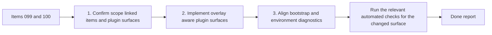

## task_089_orchestration_delivery_for_req_076_and_req_077_plugin_overlay_awareness_and_bootstrap_readiness - Orchestration delivery for req_076 and req_077 plugin overlay awareness and bootstrap readiness
> From version: 1.10.8
> Status: Ready
> Understanding: 96%
> Confidence: 93%
> Progress: 0%
> Complexity: Medium
> Theme: VS Code overlay integration and bootstrap diagnostics
> Reminder: Update status/understanding/confidence/progress and dependencies/references when you edit this doc.

# Context
- Derived from backlog items:
  - `item_099_adapt_the_vs_code_logics_plugin_to_codex_workspace_overlays`
  - `item_100_adapt_logics_bootstrap_and_environment_checks_to_codex_workspace_overlays`

This task packages the plugin-facing slice of the Codex workspace-overlay rollout:
- make the VS Code Logics plugin overlay-aware without moving overlay ownership into the extension;
- preserve the repo-local `logics/skills` contract and script-backed workflow actions;
- separate repo-local Logics kit readiness from overlay-backed Codex runtime readiness in bootstrap and diagnostics.

Delivery constraint:
- keep the plugin additive and backward-aware for repositories that still use the current repo-local workflow;
- align operator messaging with `adr_008_keep_codex_workspace_overlays_repo_local_isolated_and_composable`;
- land plugin surfaces and bootstrap semantics as a coherent checkpoint rather than as disconnected partial changes.
- deliver this task as the plugin-facing child chantier of `task_088_orchestration_delivery_for_req_067_to_req_075_codex_overlays_and_workflow_maintenance`.

# Plan
- [ ] 1. Confirm scope, linked items, shared dependencies, and the plugin surfaces that must become overlay-aware.
- [ ] 2. Wave 1: implement the plugin-facing overlay-awareness path from `item_099`, covering status visibility, launch or handoff guidance, and operator-facing recovery messaging.
- [ ] 3. Wave 2: implement the bootstrap and environment-check alignment from `item_100`, separating repo-local kit readiness from overlay runtime readiness without breaking current repo-local workflows.
- [ ] 4. Validate the result and update the linked Logics docs so the two plugin slices land as one coherent checkpoint.
- [ ] FINAL: Update related Logics docs

# AC Traceability
- item099-AC1/item099-AC2/item099-AC3/item099-AC4/item099-AC5/item099-AC6/item099-AC7/item099-AC8 -> Steps 1 and 2. Proof: TODO.
- item100-AC1/item100-AC2/item100-AC3/item100-AC4/item100-AC5/item100-AC6/item100-AC7 -> Steps 1 and 3. Proof: TODO.

# Decision framing
- Product framing: Consider
- Product signals: navigation and discoverability
- Product follow-up: Review whether a product brief is needed before scope becomes harder to change.
- Architecture framing: Required
- Architecture signals: contracts and integration, state and sync
- Architecture follow-up: Covered by `adr_008_keep_codex_workspace_overlays_repo_local_isolated_and_composable`.

# Links
- Product brief(s): (none yet)
- Architecture decision(s): `adr_008_keep_codex_workspace_overlays_repo_local_isolated_and_composable`
- Parent task: `task_088_orchestration_delivery_for_req_067_to_req_075_codex_overlays_and_workflow_maintenance`
- Backlog item(s):
  - `item_099_adapt_the_vs_code_logics_plugin_to_codex_workspace_overlays`
  - `item_100_adapt_logics_bootstrap_and_environment_checks_to_codex_workspace_overlays`
- Request(s):
  - `req_067_add_multi_project_codex_workspace_overlays_for_logics_skills`
  - `req_069_add_an_operator_facing_logics_codex_workspace_manager_cli`
  - `req_071_add_diagnostics_and_self_healing_for_codex_workspace_overlays`
  - `req_076_adapt_the_vs_code_logics_plugin_to_codex_workspace_overlays`
  - `req_077_adapt_logics_bootstrap_and_environment_checks_to_codex_workspace_overlays`

# References
- `Related request(s): `logics/request/req_067_add_multi_project_codex_workspace_overlays_for_logics_skills.md``
- `Related request(s): `logics/request/req_069_add_an_operator_facing_logics_codex_workspace_manager_cli.md``
- `Related request(s): `logics/request/req_071_add_diagnostics_and_self_healing_for_codex_workspace_overlays.md``
- `Related request(s): `logics/request/req_077_adapt_logics_bootstrap_and_environment_checks_to_codex_workspace_overlays.md``
- `Reference: `src/logicsViewProvider.ts``
- `Reference: `src/logicsViewDocumentController.ts``
- `Reference: `src/logicsEnvironment.ts``
- `Reference: `README.md``

# Validation
- `npm run lint`
- `npm run test`
- `python3 logics/skills/logics-doc-linter/scripts/logics_lint.py --require-status`
- `python3 logics/skills/logics-flow-manager/scripts/workflow_audit.py --group-by-doc`
- Manual: verify plugin messaging can distinguish repo-local Logics readiness from overlay-backed Codex runtime readiness.

# Definition of Done (DoD)
- [ ] Scope implemented and acceptance criteria covered.
- [ ] Validation commands executed and results captured.
- [ ] Linked request/backlog/task docs updated.
- [ ] Status is `Done` and progress is `100%`.

# Report
