## task_090_add_plugin_actions_to_update_the_logics_kit_and_sync_codex_overlays - Add plugin actions to update the Logics kit and sync Codex overlays
> From version: 1.10.9 (refreshed)
> Status: Done
> Understanding: 99%
> Confidence: 97%
> Progress: 100%
> Complexity: Medium
> Theme: VS Code operator remediation and kit lifecycle
> Reminder: Update status/understanding/confidence/progress and dependencies/references when you edit this doc.

# Context
Derived from `logics/backlog/item_101_add_plugin_actions_to_update_the_logics_kit_and_sync_codex_overlays.md`.
- Derived from backlog item `item_101_add_plugin_actions_to_update_the_logics_kit_and_sync_codex_overlays`.
- Source file: `logics/backlog/item_101_add_plugin_actions_to_update_the_logics_kit_and_sync_codex_overlays.md`.
- Related request(s): `req_067_add_multi_project_codex_workspace_overlays_for_logics_skills`, `req_076_adapt_the_vs_code_logics_plugin_to_codex_workspace_overlays`, `req_077_adapt_logics_bootstrap_and_environment_checks_to_codex_workspace_overlays`, `req_078_add_plugin_actions_to_update_the_logics_kit_and_sync_codex_overlays`.
- The plugin can now diagnose stale-kit and missing-overlay states, but it still leaves the operator on a manual shell path for the standard remediation flow.
- In practice, the extension already knows the two common next steps:
- update the canonical `logics/skills` submodule to a kit version that includes `logics_codex_workspace.py`;

```mermaid
%% logics-kind: task
%% logics-signature: task|add-plugin-actions-to-update-the-logics-|item-101-add-plugin-actions-to-update-th|1-confirm-scope-dependencies-and-linked|run-the-relevant-automated-tests-for
flowchart LR
    Backlog[item_101_add_plugin_actions_to_update_the_] --> Step1[1. Confirm scope dependencies and linked]
    Step1 --> Step2[2. Implement the next coherent delivery]
    Step2 --> Step3[3. Checkpoint the wave in a]
    Step3 --> Validation[Run the relevant automated tests for]
    Validation --> Report[Done report]
```

# Plan
- [x] 1. Confirm scope, dependencies, and linked acceptance criteria.
- [x] 2. Implement the next coherent delivery wave from the backlog item.
- [x] 3. Checkpoint the wave in a commit-ready state, validate it, and update the linked Logics docs.
- [x] CHECKPOINT: leave the current wave commit-ready and update the linked Logics docs before continuing.
- [x] FINAL: Update related Logics docs

# Delivery checkpoints
- Each completed wave should leave the repository in a coherent, commit-ready state.
- Update the linked Logics docs during the wave that changes the behavior, not only at final closure.
- Prefer a reviewed commit checkpoint at the end of each meaningful wave instead of accumulating several undocumented partial states.

# AC Traceability
- AC1 -> Scope: A plugin action exists to update the Logics kit when the repository uses the canonical `logics/skills` submodule model and the detected kit is older than the overlay-manager baseline.. Proof: covered by linked task completion.
- AC2 -> Scope: A plugin action exists to sync the Codex workspace overlay when `logics/skills/logics-flow-manager/scripts/logics_codex_workspace.py` is present and the overlay is missing, stale, or otherwise not ready.. Proof: covered by linked task completion.
- AC3 -> Scope: The plugin checks Git and repository safety before attempting kit updates, including missing Git on PATH, dirty worktree, and missing or non-submodule `logics/skills` layouts.. Proof: covered by linked task completion.
- AC4 -> Scope: Unsupported or unsafe update cases fall back to explicit operator guidance instead of partial automation or misleading success messages.. Proof: covered by linked task completion.
- AC5 -> Scope: The plugin keeps the kit and overlay logic delegated to the existing submodule and Python scripts rather than duplicating those behaviors in TypeScript.. Proof: covered by linked task completion.
- AC6 -> Scope: The new actions are surfaced from at least one user-facing remediation surface that already reports the corresponding problem state.. Proof: covered by linked task completion.
- AC7 -> Scope: Documentation and user-facing messaging explain when the plugin can remediate automatically and when it only provides manual guidance.. Proof: covered by linked task completion.
- AC8 -> Scope: The first implementation pass can expose the remediation flow from both the Tools menu and actionable environment diagnostics without expanding beyond the current wrapper role.. Proof: Implemented through new Tools menu entries plus actionable `Logics: Check Environment` remediation items.

# Decision framing
- Product framing: Consider
- Product signals: navigation and discoverability
- Product follow-up: Review whether a product brief is needed before scope becomes harder to change.
- Architecture framing: Required
- Architecture signals: contracts and integration, state and sync
- Architecture follow-up: Create or link an architecture decision before irreversible implementation work starts.

# Links
- Product brief(s): (none yet)
- Architecture decision(s): `adr_008_keep_codex_workspace_overlays_repo_local_isolated_and_composable`
- Backlog item: `item_101_add_plugin_actions_to_update_the_logics_kit_and_sync_codex_overlays`
- Request(s): `req_067_add_multi_project_codex_workspace_overlays_for_logics_skills`, `req_076_adapt_the_vs_code_logics_plugin_to_codex_workspace_overlays`, `req_077_adapt_logics_bootstrap_and_environment_checks_to_codex_workspace_overlays`, `req_078_add_plugin_actions_to_update_the_logics_kit_and_sync_codex_overlays`

# References
- `Related request(s): `logics/request/req_067_add_multi_project_codex_workspace_overlays_for_logics_skills.md``
- `Related request(s): `logics/request/req_076_adapt_the_vs_code_logics_plugin_to_codex_workspace_overlays.md``
- `Related request(s): `logics/request/req_077_adapt_logics_bootstrap_and_environment_checks_to_codex_workspace_overlays.md``
- `Reference: `src/logicsViewProvider.ts``
- `Reference: `src/logicsViewDocumentController.ts``
- `Reference: `src/logicsEnvironment.ts``
- `Reference: `src/logicsProviderUtils.ts``
- `Reference: `README.md``
- `logics/skills/logics-ui-steering/SKILL.md`

# Validation
- Run the relevant automated tests for the changed surface.
- Run the relevant lint or quality checks.
- Confirm the completed wave leaves the repository in a commit-ready state.

# Definition of Done (DoD)
- [x] Scope implemented and acceptance criteria covered.
- [x] Validation commands executed and results captured.
- [x] Linked request/backlog/task docs updated during completed waves and at closure.
- [x] Each completed wave left a commit-ready checkpoint or an explicit exception is documented.
- [x] Status is `Done` and progress is `100%`.

# Report
- Wave 1 completed on 2026-03-23.
- Added explicit plugin remediation actions for `Update Logics Kit` and `Sync Codex Overlay`, exposed through both the Tools menu and actionable environment diagnostics.
- Kept kit updates delegated to the canonical `logics/skills` submodule flow with Git safety checks for missing Git, non-canonical layouts, non-git roots, and dirty worktrees.
- Added regression coverage for direct remediation from `Logics: Check Environment` and updated the plugin README to explain the new automation path and fallback behavior.
- Final closure completed on 2026-03-23.
- Full extension validation passed with TypeScript lint, the full Vitest suite, Logics lint, and the workflow audit after updating the linked request and backlog docs to reflect the delivered remediation path.
- Follow-up remediation UX completed on 2026-03-23.
- Added startup-time VS Code notifications that proactively offer `Update Logics Kit` or `Sync Codex Overlay` once per unresolved repository state, matching the existing bootstrap prompt model without spamming repeated refreshes.
- Tightened terminal Codex handoff on 2026-03-23 so copied overlay commands use the detected Python launcher and healthy overlays can be launched directly in a VS Code terminal instead of relying only on clipboard handoff.

# Notes
