## task_091_migrate_github_actions_off_node_20_before_runner_deprecation - Migrate GitHub Actions off Node 20 before runner deprecation
> From version: 1.11.1 (refreshed)
> Status: Done
> Understanding: 97%
> Confidence: 96%
> Progress: 100%
> Complexity: Medium
> Theme: CI and release maintenance
> Reminder: Update status/understanding/confidence/progress and dependencies/references when you edit this doc.

# Context
Derived from `logics/backlog/item_102_migrate_github_actions_off_node_20_before_runner_deprecation.md`.
- Derived from backlog item `item_102_migrate_github_actions_off_node_20_before_runner_deprecation`.
- Source file: `logics/backlog/item_102_migrate_github_actions_off_node_20_before_runner_deprecation.md`.
- Related request(s): `req_079_migrate_github_actions_off_node_20_before_runner_deprecation`.
- Remove the current GitHub Actions dependency on Node 20 based JavaScript actions before runner defaults switch to Node 24.
- Keep CI and release workflows green on Ubuntu and Windows while upgrading the workflow action stack.
- - Recent GitHub Actions runs now emit a platform warning that `actions/checkout@v4`, `actions/setup-node@v4`, and `actions/setup-python@v5` still run on Node 20.

```mermaid
%% logics-kind: task
%% logics-signature: task|migrate-github-actions-off-node-20-befor|item-102-migrate-github-actions-off-node|1-confirm-scope-dependencies-and-linked|run-the-relevant-automated-tests-for
flowchart LR
    Backlog[item_102_migrate_github_actions_off_node_2] --> Step1[1. Confirm scope dependencies and linked]
    Step1 --> Step2[2. Implement the next coherent delivery]
    Step2 --> Step3[3. Checkpoint the wave in a]
    Step3 --> Validation[Run the relevant automated tests for]
    Validation --> Report[Done report]
```

# Plan
- [x] 1. Confirm scope, dependencies, and linked acceptance criteria.
- [x] 2. Implement the next coherent delivery wave from the backlog item.
- [x] 3. Checkpoint the wave in a commit-ready state, validate it, and update the linked Logics docs.
- [x] CHECKPOINT: leave the current wave commit-ready and update the linked Logics docs before continuing.
- [ ] FINAL: Update related Logics docs

# Delivery checkpoints
- Each completed wave should leave the repository in a coherent, commit-ready state.
- Update the linked Logics docs during the wave that changes the behavior, not only at final closure.
- Prefer a reviewed commit checkpoint at the end of each meaningful wave instead of accumulating several undocumented partial states.

# AC Traceability
- AC1 -> Scope: `ci.yml`, `release.yml`, and any other repository workflow files that currently rely on Node 20 based GitHub-hosted JavaScript actions are updated to maintained versions that are compatible with the post-Node-20 runner contract.. Proof: `.github/workflows/audit.yml`, `.github/workflows/ci.yml`, and `.github/workflows/release.yml` now use `actions/checkout@v6`, `actions/setup-node@v6`, and `actions/setup-python@v6` where applicable.
- AC2 -> Scope: Repository validation confirms that CI and release workflows still pass on Ubuntu and Windows after the action upgrade, without regressing the existing Logics kit, VSIX packaging, or release-changelog gates.. Proof: local validation passed with `npm run ci:check`, `python3 -m unittest discover -s logics/skills/tests -p "test_*.py" -v`, `python3 logics/skills/tests/run_cli_smoke_checks.py`, `python3 logics/skills/logics-flow-manager/scripts/workflow_audit.py --legacy-cutoff-version 1.1.0 --group-by-doc`, and `npm run release:changelog:validate`.
- AC3 -> Scope: Workflow documentation or maintainer guidance is updated if the migration changes version expectations, action pinning, or release maintenance steps.. Proof: `adr_010_pin_github_actions_to_a_node_24_compatible_baseline` now records the accepted action baseline and explicitly states that the build toolchain remains on `node-version: 20` pending a separate decision.

# Decision framing
- Product framing: Consider
- Product signals: conversion journey
- Product follow-up: Review whether a product brief is needed before scope becomes harder to change.
- Architecture framing: Required
- Architecture signals: data model and persistence, contracts and integration
- Architecture follow-up: Create or link an architecture decision before irreversible implementation work starts.

# Links
- Product brief(s): (none yet)
- Architecture decision(s): `adr_010_pin_github_actions_to_a_node_24_compatible_baseline`
- Backlog item: `item_102_migrate_github_actions_off_node_20_before_runner_deprecation`
- Request(s): `req_079_migrate_github_actions_off_node_20_before_runner_deprecation`

# Validation
- Run the relevant automated tests for the changed surface.
- Run the relevant lint or quality checks.
- Confirm the completed wave leaves the repository in a commit-ready state.
- Finish workflow executed on 2026-03-23.
- Linked backlog/request close verification passed.

# Definition of Done (DoD)
- [x] Scope implemented and acceptance criteria covered.
- [x] Validation commands executed and results captured.
- [x] Linked request/backlog/task docs updated during completed waves and at closure.
- [x] Each completed wave left a commit-ready checkpoint or an explicit exception is documented.
- [x] Status is `Done` and progress is `100%`.

# Report
- Updated `.github/workflows/audit.yml`, `.github/workflows/ci.yml`, and `.github/workflows/release.yml` to use `actions/checkout@v6`, `actions/setup-node@v6`, and `actions/setup-python@v6` where those actions are present.
- Kept `node-version: 20` for repository build steps so this task removes the Node 20 GitHub-hosted action runtime dependency without silently changing the extension toolchain contract.
- Validated the resulting workflow contract locally with `npm run ci:check`, `python3 -m unittest discover -s logics/skills/tests -p "test_*.py" -v`, `python3 logics/skills/tests/run_cli_smoke_checks.py`, `python3 logics/skills/logics-flow-manager/scripts/workflow_audit.py --legacy-cutoff-version 1.1.0 --group-by-doc`, and `npm run release:changelog:validate`.
- Finished on 2026-03-23.
- Linked backlog item(s): `item_102_migrate_github_actions_off_node_20_before_runner_deprecation`
- Related request(s): `req_079_migrate_github_actions_off_node_20_before_runner_deprecation`

# Notes
