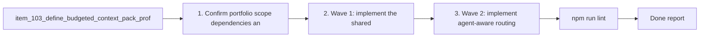

## task_092_orchestration_delivery_for_req_080_token_efficient_codex_context_shaping - Orchestration delivery for req_080 token-efficient Codex context shaping
> From version: 1.11.1 (refreshed)
> Status: Done
> Understanding: 97%
> Confidence: 96%
> Progress: 100%
> Complexity: High
> Theme: Cross-item delivery orchestration
> Reminder: Update status/understanding/confidence/progress and dependencies/references when you edit this doc.

# Context
Derived from:
- `logics/backlog/item_103_define_budgeted_context_pack_profiles_and_deterministic_trimming_for_codex.md`
- `logics/backlog/item_104_add_ai_facing_summaries_and_compact_metadata_to_managed_logics_docs.md`
- `logics/backlog/item_105_make_agent_manifests_declare_context_budgets_and_allowed_doc_families.md`
- `logics/backlog/item_106_build_delta_oriented_codex_context_packs_from_direct_dependencies_and_recent_changes.md`
- `logics/backlog/item_107_detect_redundant_or_oversized_logics_context_and_guide_token_hygiene.md`

This orchestration task bundles the first token-efficiency portfolio for Codex-facing Logics workflows:
- define explicit context-pack budgets and deterministic trimming instead of implicit "include what seems relevant" behavior;
- make managed docs summary-first so packs can inject shorter context by default;
- route context by agent role and task type instead of shipping one broad pack to every flow;
- prefer delta-oriented context from direct dependencies and recent changes over the full related-document graph;
- add hygiene checks and operator guidance so the corpus stays small enough over time.

Constraint:
- keep the Logics corpus as durable project memory, but make smaller-by-default context an explicit contract rather than a best effort;
- land the work in coherent waves so profiles, summaries, routing, delta selection, and hygiene guidance do not contradict one another;
- treat this as a cross-kit and plugin-facing orchestration slice, not as a single isolated TypeScript change.

Delivery shape:
- Wave 1 should establish the shared context-budget contract and summary-first document building blocks through items `103` and `104`.
- Wave 2 should route those budgets through agent manifests and delta-selection behavior through items `105` and `106`.
- Wave 3 should close the portfolio with token-hygiene detection, operator guidance, and final validation through item `107`.

# Plan
- [x] 1. Confirm portfolio scope, dependencies, and linked request acceptance criteria across items `103` to `107`.
- [x] 2. Wave 1: implement the shared context-budget and trimming contract from `item_103`, plus the summary-first document building blocks from `item_104`.
- [x] 3. Wave 2: implement agent-aware routing through `item_105` and delta-oriented context-pack selection through `item_106`.
- [x] 4. Wave 3: implement token-hygiene detection and operator guidance through `item_107`, then align the full portfolio behavior end to end.
- [x] 5. Add or update validation, documentation, and operator-facing surfaces so each wave leaves a coherent and inspectable checkpoint.
- [x] CHECKPOINT: leave the current wave commit-ready and update the linked Logics docs before continuing.
- [x] FINAL: Update related Logics docs

# Delivery checkpoints
- Each completed wave should leave the repository in a coherent, commit-ready state.
- Update the linked Logics docs during the wave that changes the behavior, not only at final closure.
- Prefer a reviewed commit checkpoint at the end of each meaningful wave instead of accumulating several undocumented partial states.

# AC Traceability
- AC1 -> Steps 1 and 2. Proof: Wave 1 establishes the shared context-budget profiles and deterministic trimming contract through `item_103_define_budgeted_context_pack_profiles_and_deterministic_trimming_for_codex`.
- AC2 -> Steps 2 and 5. Proof: Wave 1 adds summary-first document building blocks and the portfolio validation keeps summary use aligned with the pack contract through `item_104_add_ai_facing_summaries_and_compact_metadata_to_managed_logics_docs`.
- AC3 -> Steps 3 and 5. Proof: Wave 2 routes the budget contract through agent-aware manifests and handoff behavior via `item_105_make_agent_manifests_declare_context_budgets_and_allowed_doc_families`.
- AC4 -> Steps 3 and 5. Proof: Wave 2 adds delta-oriented pack selection from direct dependencies and recent changes via `item_106_build_delta_oriented_codex_context_packs_from_direct_dependencies_and_recent_changes`.
- AC5 -> Steps 4 and 5. Proof: Wave 3 closes the token-efficiency portfolio with hygiene detection and remediation guidance via `item_107_detect_redundant_or_oversized_logics_context_and_guide_token_hygiene`.
- AC6 -> Steps 2 through 5. Proof: the orchestration plan explicitly includes documentation, operator-facing guidance, and final portfolio alignment across all five backlog slices.
- item103-AC1/item103-AC2/item103-AC3/item103-AC4 -> Steps 1 and 2. Proof: explicit `tiny/normal/deep` profiles, deterministic trimming, and budget estimation landed in `media/logicsModel.js` and are surfaced in `media/renderDetails.js`.
- item104-AC1/item104-AC2/item104-AC3/item104-AC4/item104-AC5 -> Steps 2 and 5. Proof: summary-first document metadata landed in `src/logicsIndexer.ts`, while compact `# AI Context` generation landed in `logics/skills/logics-flow-manager/assets/templates/*.md` and `logics_flow_support.py`.
- item105-AC1/item105-AC2/item105-AC3/item105-AC4/item105-AC5 -> Steps 3 and 5. Proof: agent routing fields landed in `src/agentRegistry.ts` and are carried into the webview from `src/logicsViewProvider.ts`.
- item106-AC1/item106-AC2/item106-AC3/item106-AC4 -> Steps 3 and 5. Proof: delta-oriented changed-path collection landed in `src/logicsViewProvider.ts` and changed-path-aware pack assembly landed in `media/logicsModel.js`.
- item107-AC1/item107-AC2/item107-AC3/item107-AC4 -> Steps 4 and 5. Proof: stale and weak-link filtering landed in `media/logicsModel.js`, and token-hygiene auditing landed in `logics/skills/logics-flow-manager/scripts/workflow_audit.py`.

# Decision framing
- Product framing: Not needed
- Product signals: (none detected)
- Product follow-up: No product brief follow-up is expected based on current signals.
- Architecture framing: Consider
- Architecture signals: contracts and integration, state and sync
- Architecture follow-up: Review whether the final context-pack and agent-routing contracts should be captured in an ADR once the implementation shape stabilizes.

# Links
- Product brief(s): (none yet)
- Architecture decision(s): (none yet)
- Backlog item(s):
  - `item_103_define_budgeted_context_pack_profiles_and_deterministic_trimming_for_codex`
  - `item_104_add_ai_facing_summaries_and_compact_metadata_to_managed_logics_docs`
  - `item_105_make_agent_manifests_declare_context_budgets_and_allowed_doc_families`
  - `item_106_build_delta_oriented_codex_context_packs_from_direct_dependencies_and_recent_changes`
  - `item_107_detect_redundant_or_oversized_logics_context_and_guide_token_hygiene`
- Request(s): `req_080_reduce_codex_token_consumption_with_budgeted_context_packs_and_agent_aware_prompt_shaping`

# Validation
- `npm run lint`
- `npm run test`
- `python3 logics/skills/logics-doc-linter/scripts/logics_lint.py --require-status`
- `python3 logics/skills/logics-flow-manager/scripts/workflow_audit.py --group-by-doc`
- Manual: verify Codex-facing context handoff stays understandable from profile selection through preview or injection.
- Manual: verify the summary, routing, delta, and hygiene stories remain coherent together rather than as disconnected behaviors.
- Finish workflow executed on 2026-03-23.
- Linked backlog/request close verification passed.

# Definition of Done (DoD)
- [x] Scope implemented and acceptance criteria covered.
- [x] Validation commands executed and results captured.
- [x] Linked request/backlog/task docs updated during completed waves and at closure.
- [x] Each completed wave left a commit-ready checkpoint or an explicit exception is documented.
- [x] Status is `Done` and progress is `100%`.

# Report
- Implementation wave landed on 2026-03-23.
- Added compact doc metadata extraction in [`src/logicsIndexer.ts`](src/logicsIndexer.ts) so Codex handoffs can use summary points, acceptance criteria, and deterministic doc size signals without reparsing the repo in the webview.
- Extended [`src/agentRegistry.ts`](src/agentRegistry.ts) with optional routing fields for preferred context profile, allowed or blocked doc stages, and response style, then surfaced the active-agent routing payload from [`src/logicsViewProvider.ts`](src/logicsViewProvider.ts).
- Replaced the previous single-shape context pack with multi-mode handoff assembly in [`media/logicsModel.js`](media/logicsModel.js), covering explicit profiles, deterministic trimming, summary-first packs, diff-first packs from changed paths, stale-context exclusion, and concise response contracts.
- Updated [`media/main.js`](media/main.js), [`media/webviewSelectors.js`](media/webviewSelectors.js), [`media/renderDetails.js`](media/renderDetails.js), and [`media/hostApi.js`](media/hostApi.js) so the details panel now exposes budget visibility, multi-mode previews, active-agent-aware routing, and fresh-thread Codex handoff actions.
- Added regression coverage in [`tests/agentRegistry.test.ts`](tests/agentRegistry.test.ts), [`tests/logicsViewProvider.test.ts`](tests/logicsViewProvider.test.ts), [`tests/webview.harness-details-and-filters.test.ts`](tests/webview.harness-details-and-filters.test.ts), and [`tests/webviewHarnessTestUtils.ts`](tests/webviewHarnessTestUtils.ts).
- Added kit-side compact handoff metadata generation in [`logics/skills/logics-flow-manager/assets/templates/request.md`](logics/skills/logics-flow-manager/assets/templates/request.md), [`logics/skills/logics-flow-manager/assets/templates/backlog.md`](logics/skills/logics-flow-manager/assets/templates/backlog.md), [`logics/skills/logics-flow-manager/assets/templates/task.md`](logics/skills/logics-flow-manager/assets/templates/task.md), and [`logics/skills/logics-flow-manager/scripts/logics_flow_support.py`](logics/skills/logics-flow-manager/scripts/logics_flow_support.py).
- Added token-hygiene audit controls in [`logics/skills/logics-flow-manager/scripts/workflow_audit.py`](logics/skills/logics-flow-manager/scripts/workflow_audit.py), plus template-compatibility updates in the Confluence, Jira, Figma, Linear, and Render connectors that reuse the flow-manager templates.
- Validation executed:
  - `npm run lint`
  - `npm run test`
  - `python3 -m pytest logics/skills/tests`
  - `python3 -m py_compile logics/skills/logics-flow-manager/scripts/logics_flow.py logics/skills/logics-flow-manager/scripts/logics_flow_support.py logics/skills/logics-flow-manager/scripts/workflow_audit.py logics/skills/logics-connector-confluence/scripts/confluence_to_request.py logics/skills/logics-connector-jira/scripts/jira_to_backlog.py logics/skills/logics-connector-figma/scripts/figma_to_backlog.py logics/skills/logics-connector-linear/scripts/linear_to_backlog.py logics/skills/logics-connector-render/scripts/render_to_backlog.py`
  - `python3 logics/skills/logics-doc-linter/scripts/logics_lint.py --require-status`
  - `python3 logics/skills/logics-flow-manager/scripts/workflow_audit.py --group-by-doc`
- Finished on 2026-03-23.
- Linked backlog item(s): `item_103_define_budgeted_context_pack_profiles_and_deterministic_trimming_for_codex`, `item_104_add_ai_facing_summaries_and_compact_metadata_to_managed_logics_docs`, `item_105_make_agent_manifests_declare_context_budgets_and_allowed_doc_families`, `item_106_build_delta_oriented_codex_context_packs_from_direct_dependencies_and_recent_changes`, `item_107_detect_redundant_or_oversized_logics_context_and_guide_token_hygiene`
- Related request(s): `req_080_reduce_codex_token_consumption_with_budgeted_context_packs_and_agent_aware_prompt_shaping`

# Notes
