## task_093_orchestration_delivery_for_req_081_observable_and_lightweight_codex_handoffs - Orchestration delivery for req_081 observable and lightweight Codex handoffs
> From version: 1.11.1
> Status: Ready
> Understanding: 96%
> Confidence: 94%
> Progress: 0%
> Complexity: High
> Theme: Cross-item delivery orchestration
> Reminder: Update status/understanding/confidence/progress and dependencies/references when you edit this doc.

# Context
Derived from:
- `logics/backlog/item_108_add_pre_injection_context_size_estimation_and_budget_visibility_for_codex_handoffs.md`
- `logics/backlog/item_109_add_a_summary_only_first_pass_mode_for_codex_context_injection.md`
- `logics/backlog/item_110_add_diff_first_codex_context_flows_for_implementation_and_review_work.md`
- `logics/backlog/item_111_exclude_or_deprioritize_stale_completed_and_weakly_linked_context_by_default.md`
- `logics/backlog/item_112_add_session_hygiene_guidance_when_topic_or_root_changes_materially.md`
- `logics/backlog/item_113_define_task_type_default_budgets_and_concise_response_contracts_for_codex_handoffs.md`

This orchestration task bundles the second token-efficiency portfolio for Codex-facing Logics workflows:
- make context cost visible before launch or injection;
- add summary-only and diff-first lightweight-default handoff modes;
- prevent older or weakly relevant context from inflating fresh sessions by default;
- steer operators toward fresh sessions when the active working context changes;
- make task-type-specific budgets and concise response defaults explicit.

Constraint:
- keep this portfolio complementary to `req_080`, not a replacement for the underlying context-pack contract work;
- land the work in coherent waves so measurement, lightweight defaults, and operator guidance reinforce each other instead of conflicting;
- treat operator-facing clarity as part of the feature, not just as follow-up documentation.

Delivery shape:
- Wave 1 should establish observable size measurement and the summary-only lightweight path through items `108` and `109`.
- Wave 2 should add diff-first code-centric handoffs and stale-context default exclusion through items `110` and `111`.
- Wave 3 should close the portfolio with session-hygiene guidance plus task-type default budgets and concise response contracts through items `112` and `113`.

```mermaid
%% logics-kind: task
%% logics-signature: task|orchestration-delivery-for-req-081-obser|item-108-add-pre-injection-context-size-|1-confirm-portfolio-scope-dependencies-a|npm-run-lint
flowchart LR
    Backlog[Items 108 to 113] --> Step1[Confirm portfolio scope and delivery order]
    Step1 --> Step2[Implement measurement and summary-only foundations]
    Step2 --> Step3[Implement diff-first and stale-context defaults]
    Step3 --> Step4[Implement session hygiene and task-type defaults]
    Step4 --> Validation[Run the relevant automated tests for the changed surfaces]
    Validation --> Report[Done report]
```

# Plan
- [ ] 1. Confirm portfolio scope, dependencies, and linked request acceptance criteria across items `108` to `113`.
- [ ] 2. Wave 1: implement pre-injection measurement through `item_108` and the summary-only first-pass flow through `item_109`.
- [ ] 3. Wave 2: implement diff-first code handoffs through `item_110` and stale-context exclusion or deprioritization through `item_111`.
- [ ] 4. Wave 3: implement session-hygiene guidance through `item_112` plus task-type default budgets and concise response contracts through `item_113`.
- [ ] 5. Add or update documentation, operator-facing surfaces, and validation so each wave leaves a coherent lightweight-handoff checkpoint.
- [ ] CHECKPOINT: leave the current wave commit-ready and update the linked Logics docs before continuing.
- [ ] FINAL: Update related Logics docs

# Delivery checkpoints
- Each completed wave should leave the repository in a coherent, commit-ready state.
- Update the linked Logics docs during the wave that changes the behavior, not only at final closure.
- Prefer a reviewed commit checkpoint at the end of each meaningful wave instead of accumulating several undocumented partial states.

# AC Traceability
- AC1 -> Steps 1, 2, and 5. Proof: Wave 1 establishes the observable pre-injection measurement contract through `item_108`.
- AC2 -> Steps 2 and 5. Proof: Wave 1 adds the summary-only first-pass handoff path through `item_109`.
- AC3 -> Steps 3 and 5. Proof: Wave 2 adds diff-first code-centric handoff behavior through `item_110`.
- AC4 -> Steps 3 and 5. Proof: Wave 2 defines default exclusion or deprioritization of stale context through `item_111`.
- AC5 -> Steps 4 and 5. Proof: Wave 3 adds session-hygiene guidance and surfacing through `item_112`.
- AC6 -> Steps 4 and 5. Proof: Wave 3 defines task-type default budgets through `item_113`.
- AC7 -> Steps 4 and 5. Proof: Wave 3 defines concise response defaults and override behavior through `item_113`.
- item108-AC1/item108-AC2/item108-AC3/item108-AC4 -> Steps 2 and 5. Proof: TODO.
- item109-AC1/item109-AC2/item109-AC3/item109-AC4 -> Steps 2 and 5. Proof: TODO.
- item110-AC1/item110-AC2/item110-AC3/item110-AC4 -> Steps 3 and 5. Proof: TODO.
- item111-AC1/item111-AC2/item111-AC3/item111-AC4 -> Steps 3 and 5. Proof: TODO.
- item112-AC1/item112-AC2/item112-AC3/item112-AC4 -> Steps 4 and 5. Proof: TODO.
- item113-AC1/item113-AC2/item113-AC3/item113-AC4 -> Steps 4 and 5. Proof: TODO.

# Decision framing
- Product framing: Not needed
- Product signals: (none detected)
- Product follow-up: No product brief follow-up is expected based on current signals.
- Architecture framing: Consider
- Architecture signals: contracts and integration, delivery and operations
- Architecture follow-up: Review whether the final lightweight-handoff portfolio warrants an ADR after the contracts stabilize.

# Links
- Product brief(s): (none yet)
- Architecture decision(s): (none yet)
- Backlog item(s):
  - `item_108_add_pre_injection_context_size_estimation_and_budget_visibility_for_codex_handoffs`
  - `item_109_add_a_summary_only_first_pass_mode_for_codex_context_injection`
  - `item_110_add_diff_first_codex_context_flows_for_implementation_and_review_work`
  - `item_111_exclude_or_deprioritize_stale_completed_and_weakly_linked_context_by_default`
  - `item_112_add_session_hygiene_guidance_when_topic_or_root_changes_materially`
  - `item_113_define_task_type_default_budgets_and_concise_response_contracts_for_codex_handoffs`
- Request(s): `req_081_add_measurement_summary_first_and_diff_first_controls_to_reduce_codex_token_consumption`

# Validation
- `npm run lint`
- `npm run test`
- `python3 logics/skills/logics-doc-linter/scripts/logics_lint.py --require-status`
- `python3 logics/skills/logics-flow-manager/scripts/workflow_audit.py --group-by-doc`
- Manual: verify operators can understand the cost and lightweight mode chosen before a Codex launch or injection.
- Manual: verify the lightweight-default story remains coherent across summary-only, diff-first, stale-context, session-hygiene, and task-type defaults.

# Definition of Done (DoD)
- [ ] Scope implemented and acceptance criteria covered.
- [ ] Validation commands executed and results captured.
- [ ] Linked request/backlog/task docs updated during completed waves and at closure.
- [ ] Each completed wave left a commit-ready checkpoint or an explicit exception is documented.
- [ ] Status is `Done` and progress is `100%`.

# Report
