## task_094_orchestration_delivery_for_req_082_compact_ai_context_and_reusable_handoff_generation - Orchestration delivery for req_082 compact AI context and reusable handoff generation
> From version: 1.11.1
> Status: Ready
> Understanding: 96%
> Confidence: 95%
> Progress: 0%
> Complexity: High
> Theme: Cross-item delivery orchestration
> Reminder: Update status/understanding/confidence/progress and dependencies/references when you edit this doc.

# Context
Derived from:
- `logics/backlog/item_114_backfill_and_refresh_ai_context_for_existing_workflow_docs.md`
- `logics/backlog/item_115_extract_shared_connector_helpers_for_compact_ai_context_and_template_assembly.md`
- `logics/backlog/item_117_generate_kit_native_compact_context_pack_artifacts_from_workflow_docs.md`
- `logics/backlog/item_119_add_corpus_compaction_and_token_hygiene_maintenance_flows_for_workflow_docs.md`
- `logics/backlog/item_121_audit_generated_assets_and_add_skill_capability_metadata_for_compact_ai_handoffs.md`

This orchestration task bundles the kit-side compact-context portfolio for `req_082`:
- backfill compact `# AI Context` metadata across existing workflow docs instead of limiting the contract to newly generated files;
- extract shared connector helpers so imported request/backlog docs stop duplicating compact-context assembly;
- generate kit-native compact handoff artifacts that can later be consumed by plugin or agent surfaces;
- add maintenance flows that keep the workflow corpus lean enough over time;
- align generated assets and skill capability metadata with the compact-handoff contract.

Constraint:
- keep the work kit-native and reusable, not plugin-UI-specific;
- split the delivery into coherent waves so doc backfill, helper extraction, handoff artifact generation, maintenance flows, and capability metadata reinforce one another instead of diverging;
- prefer primitives that other skills and future requests can reuse rather than one-off automation around the current repo state.

Delivery shape:
- Wave 1 should establish `# AI Context` backfill and shared connector helper foundations through items `114` and `115`.
- Wave 2 should add kit-native compact handoff artifact generation through item `117`.
- Wave 3 should close the portfolio with corpus maintenance and generated-asset or skill-capability alignment through items `119` and `121`.

```mermaid
%% logics-kind: task
%% logics-signature: task|orchestration-delivery-for-req-082-compa|item-114-backfill-and-refresh-ai-context|1-confirm-portfolio-scope-dependencies-a|python3-logics-skills-logics-doc-linter-
flowchart LR
    Backlog[Items 114 115 117 119 and 121] --> Step1[Confirm portfolio scope and delivery order]
    Step1 --> Step2[Implement AI Context backfill and shared helpers]
    Step2 --> Step3[Implement kit native context pack artifacts]
    Step3 --> Step4[Implement maintenance and capability alignment]
    Step4 --> Validation[python3 logics skills logics doc linter]
    Validation --> Report[Done report]
```

# Plan
- [ ] 1. Confirm portfolio scope, dependencies, and linked request acceptance criteria across items `114`, `115`, `117`, `119`, and `121`.
- [ ] 2. Wave 1: implement AI Context backfill or refresh support through `item_114` and shared connector helper extraction through `item_115`.
- [ ] 3. Wave 2: implement kit-native compact context-pack artifact generation through `item_117`.
- [ ] 4. Wave 3: implement corpus compaction or token-hygiene maintenance through `item_119` and generated-asset or skill-capability alignment through `item_121`.
- [ ] 5. Add or update validation, documentation, and operator-facing kit guidance so each wave leaves a coherent checkpoint.
- [ ] CHECKPOINT: leave the current wave commit-ready and update the linked Logics docs before continuing.
- [ ] FINAL: Update related Logics docs

# Delivery checkpoints
- Each completed wave should leave the repository in a coherent, commit-ready state.
- Update the linked Logics docs during the wave that changes the behavior, not only at final closure.
- Prefer a reviewed commit checkpoint at the end of each meaningful wave instead of accumulating several undocumented partial states.

# AC Traceability
- AC1 -> Steps 1 and 2. Proof: Wave 1 introduces backfill or refresh support for compact `# AI Context` sections through `item_114`.
- AC2 -> Steps 2 and 5. Proof: Wave 1 also extracts shared connector helper primitives through `item_115`.
- AC3 -> Steps 3 and 5. Proof: Wave 2 adds kit-native compact handoff artifact generation through `item_117`.
- AC4 -> Steps 4 and 5. Proof: Wave 3 adds corpus maintenance and token-hygiene flows through `item_119`.
- AC5 -> Steps 4 and 5. Proof: Wave 3 aligns generated assets and skill capability metadata through `item_121`.

# Decision framing
- Product framing: Not needed
- Product signals: (none detected)
- Product follow-up: No product brief follow-up is expected based on current signals.
- Architecture framing: Consider
- Architecture signals: contracts and integration, state and sync
- Architecture follow-up: Review whether the compact handoff artifact and skill capability contracts should be captured in an ADR once implementation stabilizes.

# Links
- Product brief(s): (none yet)
- Architecture decision(s): (none yet)
- Backlog item(s):
  - `item_114_backfill_and_refresh_ai_context_for_existing_workflow_docs`
  - `item_115_extract_shared_connector_helpers_for_compact_ai_context_and_template_assembly`
  - `item_117_generate_kit_native_compact_context_pack_artifacts_from_workflow_docs`
  - `item_119_add_corpus_compaction_and_token_hygiene_maintenance_flows_for_workflow_docs`
  - `item_121_audit_generated_assets_and_add_skill_capability_metadata_for_compact_ai_handoffs`
- Request(s): `req_082_strengthen_logics_kit_primitives_for_compact_ai_context_and_reusable_handoff_generation`

# AI Context
- Summary: Coordinate the req_082 kit-side portfolio across AI Context backfill, shared connector helpers, context-pack artifacts, maintenance flows, and skill metadata alignment.
- Keywords: orchestration, req_082, ai-context, connectors, context-pack, compaction, metadata
- Use when: Use when executing the cross-item delivery wave for req_082 and keeping all linked backlog slices synchronized.
- Skip when: Skip when the work belongs to another backlog item or a different execution wave.

# Validation
- `python3 logics/skills/logics-doc-linter/scripts/logics_lint.py --require-status`
- `python3 logics/skills/logics-flow-manager/scripts/workflow_audit.py --group-by-doc`
- `python3 -m unittest discover -s logics/skills/tests -p "test_*.py" -v`
- Manual: verify backfilled or generated compact handoff metadata stays consistent across flow-manager docs and connector-generated docs.
- Manual: verify the kit-native artifact contract stays aligned with the compact-context vocabulary from `req_080` and `req_081`.

# Definition of Done (DoD)
- [ ] Scope implemented and acceptance criteria covered.
- [ ] Validation commands executed and results captured.
- [ ] Linked request/backlog/task docs updated during completed waves and at closure.
- [ ] Each completed wave left a commit-ready checkpoint or an explicit exception is documented.
- [ ] Status is `Done` and progress is `100%`.

# Report
