## task_095_orchestration_delivery_for_req_083_kit_governance_migration_and_machine_readable_tooling_primitives - Orchestration delivery for req_083 kit governance migration and machine-readable tooling primitives
> From version: 1.11.1
> Status: Done
> Understanding: 96%
> Confidence: 95%
> Progress: 100%
> Complexity: High
> Theme: Cross-item delivery orchestration
> Reminder: Update status/understanding/confidence/progress and dependencies/references when you edit this doc.

# Context
Derived from:
- `logics/backlog/item_116_extend_workflow_audit_and_repair_tooling_for_structural_autofix_coverage.md`
- `logics/backlog/item_118_export_workflow_graphs_and_validate_structured_skill_package_contracts.md`
- `logics/backlog/item_120_define_strict_governance_profiles_and_extract_reusable_kit_document_assembly_apis.md`
- `logics/backlog/item_122_add_machine_readable_json_outputs_for_core_flow_manager_commands.md`
- `logics/backlog/item_123_introduce_workflow_doc_schema_versioning_and_named_migration_commands.md`

This orchestration task bundles the internal governance and automation portfolio for `req_083`:
- expose machine-readable output contracts for core flow-manager commands;
- introduce explicit schema versioning and named migration support for workflow docs;
- extend structural audit and repair coverage beyond current narrow autofix paths;
- export workflow graph data and validate skills as structured packages;
- define stricter governance profiles and extract reusable document-assembly APIs from the flow manager.

Constraint:
- keep this work internal to the kit and reusable across repositories;
- land the automation contract in coherent waves so JSON output, schema migrations, audit repair, graph export, skill validation, and governance APIs remain aligned;
- avoid freezing unstable contracts accidentally: when introducing machine-readable outputs, keep versioning and maintainability explicit.

Delivery shape:
- Wave 1 should establish machine-readable outputs and schema or migration primitives through items `122` and `123`.
- Wave 2 should extend structural audit or repair coverage and workflow graph or skill validation through items `116` and `118`.
- Wave 3 should close the portfolio with strict governance profiles and reusable document-assembly APIs through item `120`.

```mermaid
%% logics-kind: task
%% logics-signature: task|orchestration-delivery-for-req-083-kit-g|item-116-extend-workflow-audit-and-repai|1-confirm-portfolio-scope-dependencies-a|python3-logics-skills-logics-doc-linter-
flowchart LR
    Backlog[Items 116 118 120 122 and 123] --> Step1[Confirm portfolio scope and delivery order]
    Step1 --> Step2[Implement JSON outputs and schema migrations]
    Step2 --> Step3[Implement audit repair and graph or skill validation]
    Step3 --> Step4[Implement strict governance and reusable APIs]
    Step4 --> Validation[python3 logics skills logics doc linter]
    Validation --> Report[Done report]
```

# Plan
- [ ] 1. Confirm portfolio scope, dependencies, and linked request acceptance criteria across items `116`, `118`, `120`, `122`, and `123`.
- [ ] 2. Wave 1: implement machine-readable JSON outputs through `item_122` and schema or migration primitives through `item_123`.
- [ ] 3. Wave 2: extend structural audit or repair coverage through `item_116` and graph export or skill package validation through `item_118`.
- [ ] 4. Wave 3: define strict governance profiles and extract reusable document-assembly APIs through `item_120`.
- [ ] 5. Add or update validation, documentation, and maintainer guidance so each wave leaves a coherent governance checkpoint.
- [ ] CHECKPOINT: leave the current wave commit-ready and update the linked Logics docs before continuing.
- [ ] FINAL: Update related Logics docs

# Delivery checkpoints
- Each completed wave should leave the repository in a coherent, commit-ready state.
- Update the linked Logics docs during the wave that changes the behavior, not only at final closure.
- Prefer a reviewed commit checkpoint at the end of each meaningful wave instead of accumulating several undocumented partial states.

# AC Traceability
- AC1 -> Steps 1 and 2. Proof: Wave 1 establishes machine-readable output contracts through `item_122`.
- AC2 -> Steps 2 and 5. Proof: Wave 1 also introduces schema versioning and named migration primitives through `item_123`.
- AC3 -> Steps 3 and 5. Proof: Wave 2 extends structural audit and repair coverage through `item_116`.
- AC4 -> Steps 3 and 5. Proof: Wave 2 adds workflow graph export and structured skill package validation through `item_118`.
- AC5 -> Steps 4 and 5. Proof: Wave 3 defines strict governance profiles and reusable kit document-assembly APIs through `item_120`.

# Decision framing
- Product framing: Not needed
- Product signals: (none detected)
- Product follow-up: No product brief follow-up is expected based on current signals.
- Architecture framing: Consider
- Architecture signals: data model and persistence, contracts and integration, runtime and boundaries, state and sync
- Architecture follow-up: Review whether the resulting schema and machine-readable contracts should be captured in an ADR once they stabilize.

# Links
- Product brief(s): (none yet)
- Architecture decision(s): (none yet)
- Backlog item(s):
  - `item_116_extend_workflow_audit_and_repair_tooling_for_structural_autofix_coverage`
  - `item_118_export_workflow_graphs_and_validate_structured_skill_package_contracts`
  - `item_120_define_strict_governance_profiles_and_extract_reusable_kit_document_assembly_apis`
  - `item_122_add_machine_readable_json_outputs_for_core_flow_manager_commands`
  - `item_123_introduce_workflow_doc_schema_versioning_and_named_migration_commands`
- Request(s): `req_083_add_internal_logics_kit_governance_migration_and_machine_readable_tooling_primitives`

# AI Context
- Summary: Coordinate the req_083 governance portfolio across JSON outputs, schema migrations, audit repair, graph export, skill validation, and reusable flow-manager APIs.
- Keywords: orchestration, req_083, governance, json, schema, migrations, audit, skills
- Use when: Use when executing the cross-item delivery wave for req_083 and keeping the internal kit governance contract coherent.
- Skip when: Skip when the work belongs to another backlog item or a different execution wave.

# Validation
- `python3 logics/skills/logics-doc-linter/scripts/logics_lint.py --require-status`
- `python3 logics/skills/logics-flow-manager/scripts/workflow_audit.py --group-by-doc`
- `python3 -m unittest discover -s logics/skills/tests -p "test_*.py" -v`
- Manual: verify machine-readable outputs and schema migration commands remain stable enough for downstream automation.
- Manual: verify graph export, skill validation, and governance profiles all consume the same workflow-doc and skill metadata contracts.
- Finish workflow executed on 2026-03-24.
- Linked backlog/request close verification passed.

# Definition of Done (DoD)
- [x] Scope implemented and acceptance criteria covered.
- [x] Validation commands executed and results captured.
- [x] Linked request/backlog/task docs updated during completed waves and at closure.
- [x] Each completed wave left a commit-ready checkpoint or an explicit exception is documented.
- [x] Status is `Done` and progress is `100%`.

# Report
- Finished on 2026-03-24.
- Linked backlog item(s): `item_116_extend_workflow_audit_and_repair_tooling_for_structural_autofix_coverage`, `item_118_export_workflow_graphs_and_validate_structured_skill_package_contracts`, `item_120_define_strict_governance_profiles_and_extract_reusable_kit_document_assembly_apis`, `item_122_add_machine_readable_json_outputs_for_core_flow_manager_commands`, `item_123_introduce_workflow_doc_schema_versioning_and_named_migration_commands`
- Related request(s): `req_082_strengthen_logics_kit_primitives_for_compact_ai_context_and_reusable_handoff_generation`, `req_083_add_internal_logics_kit_governance_migration_and_machine_readable_tooling_primitives`
