## task_096_orchestration_delivery_for_req_084_diagnostics_safety_and_internal_runtime_contracts - Orchestration delivery for req_084 diagnostics safety and internal runtime contracts
> From version: 1.11.1 (refreshed)
> Status: Done
> Understanding: 97%
> Confidence: 96%
> Progress: 100%
> Complexity: High
> Theme: Cross-item delivery orchestration
> Reminder: Update status/understanding/confidence/progress and dependencies/references when you edit this doc.

# Context
Derived from:
- `logics/backlog/item_124_add_a_logics_kit_doctor_command_and_explainable_diagnostics.md`
- `logics/backlog/item_125_add_canonical_parse_and_normalize_models_for_workflow_docs_and_skill_metadata.md`
- `logics/backlog/item_126_centralize_logics_kit_conventions_capability_registry_and_machine_readable_release_metadata.md`
- `logics/backlog/item_127_add_safe_write_preview_and_patch_planning_for_bulk_logics_kit_operations.md`
- `logics/backlog/item_128_add_skill_fixtures_benchmarks_and_extension_contracts_for_kit_regression_coverage.md`

This orchestration task bundles the kit-runtime portfolio for `req_084`:
- add a doctor-style diagnostics surface with explainable remediation;
- introduce canonical parse and normalize models for workflow docs and skill metadata;
- centralize conventions, capability metadata, and machine-readable release evolution data;
- make bulk write operations safer through preview or patch planning;
- add fixtures, extension contracts, and lightweight benchmarks for regression coverage.

Constraint:
- keep the work purely kit-side and distinct from the compact-context and governance portfolios in `req_082` and `req_083`;
- deliver the work in coherent waves so diagnostics, canonical models, registries, safe-write controls, and regression surfaces reinforce one another;
- prefer reusable primitives that future kit commands and skills can consume instead of one-off repo-local helpers.

```mermaid
%% logics-kind: task
%% logics-signature: task|orchestration-delivery-for-req-084-diagn|item-124-add-a-logics-kit-doctor-command|1-confirm-portfolio-scope-dependencies-a|python3-logics-skills-logics-doc-linter-
flowchart LR
    Backlog[item_124_add_a_logics_kit_doctor_command_a] --> Step1[1. Confirm portfolio scope dependencies an]
    Step1 --> Step2[2. Wave 1: implement doctor diagnostics]
    Step2 --> Step3[3. Wave 2: implement conventions or]
    Step3 --> Validation[python3 logics skills logics-doc-linter sc]
    Validation --> Report[Done report]
```

# Plan
- [ ] 1. Confirm portfolio scope, dependencies, and linked request acceptance criteria across items `124`, `125`, `126`, `127`, and `128`.
- [ ] 2. Wave 1: implement doctor diagnostics through `item_124` and canonical parse or normalize models through `item_125`.
- [ ] 3. Wave 2: implement conventions or capability registries through `item_126` and safe-write preview support through `item_127`.
- [ ] 4. Wave 3: implement fixtures, extension contracts, and lightweight benchmarks through `item_128`.
- [ ] 5. Add or update validation, documentation, and maintainer guidance so the portfolio leaves reusable operator-facing kit primitives.
- [ ] CHECKPOINT: leave the current wave commit-ready and update the linked Logics docs before continuing.
- [ ] FINAL: Update related Logics docs

# Delivery checkpoints
- Each completed wave should leave the repository in a coherent, commit-ready state.
- Update the linked Logics docs during the wave that changes the behavior, not only at final closure.
- Prefer a reviewed commit checkpoint at the end of each meaningful wave instead of accumulating several undocumented partial states.

# AC Traceability
- AC1 -> Steps 1, 2, and 5. Proof: Wave 1 adds a doctor-style diagnostics surface through `item_124`.
- AC2 -> Steps 2 and 5. Proof: Wave 1 also introduces canonical parse and normalize models through `item_125`.
- AC3 -> Steps 3 and 5. Proof: Wave 2 centralizes conventions, capability metadata, and release metadata through `item_126`.
- AC4 -> Steps 3 and 5. Proof: Wave 2 adds safe-write preview or patch planning through `item_127`.
- AC5 -> Steps 4 and 5. Proof: Wave 3 adds fixtures, extension contracts, and lightweight benchmarks through `item_128`.

# Decision framing
- Product framing: Not needed
- Product signals: (none detected)
- Product follow-up: No product brief follow-up is expected based on current signals.
- Architecture framing: Not needed
- Architecture signals: (none detected)
- Architecture follow-up: No architecture decision follow-up is expected based on current signals.

# Links
- Product brief(s): (none yet)
- Architecture decision(s): (none yet)
- Backlog item(s):
  - `item_124_add_a_logics_kit_doctor_command_and_explainable_diagnostics`
  - `item_125_add_canonical_parse_and_normalize_models_for_workflow_docs_and_skill_metadata`
  - `item_126_centralize_logics_kit_conventions_capability_registry_and_machine_readable_release_metadata`
  - `item_127_add_safe_write_preview_and_patch_planning_for_bulk_logics_kit_operations`
  - `item_128_add_skill_fixtures_benchmarks_and_extension_contracts_for_kit_regression_coverage`
- Request(s): `req_084_improve_logics_kit_diagnostics_safety_and_internal_runtime_contracts`

# AI Context
- Summary: Coordinate the req_084 kit-runtime portfolio across doctor diagnostics, canonical models, conventions registries, safe-write controls, and skill regression surfaces.
- Keywords: orchestration, req_084, doctor, parse, normalize, safe-write, fixtures, benchmarks
- Use when: Use when executing the cross-item delivery wave for req_084 and keeping the kit-runtime primitives aligned.
- Skip when: Skip when the work belongs to another backlog item or a different execution wave.

# Validation
- `python3 logics/skills/logics-doc-linter/scripts/logics_lint.py --require-status`
- `python3 logics/skills/logics-flow-manager/scripts/workflow_audit.py --group-by-doc`
- `python3 -m unittest discover -s logics/skills/tests -p "test_*.py" -v`
- Manual: verify the doctor output and safe-write preview remain understandable for maintainers instead of leaking only low-level internals.
- Manual: verify the canonical model and registry layers are reused by more than one kit surface.
- Finish workflow executed on 2026-03-24.
- Linked backlog/request close verification passed.

# Definition of Done (DoD)
- [x] Scope implemented and acceptance criteria covered.
- [x] Validation commands executed and results captured.
- [x] Linked request/backlog/task docs updated during completed waves and at closure.
- [x] Each completed wave left a commit-ready checkpoint or an explicit exception is documented.
- [x] Status is `Done` and progress is `100%`.

# Report
- Finished on 2026-03-24.
- Linked backlog item(s): `item_124_add_a_logics_kit_doctor_command_and_explainable_diagnostics`, `item_125_add_canonical_parse_and_normalize_models_for_workflow_docs_and_skill_metadata`, `item_126_centralize_logics_kit_conventions_capability_registry_and_machine_readable_release_metadata`, `item_127_add_safe_write_preview_and_patch_planning_for_bulk_logics_kit_operations`, `item_128_add_skill_fixtures_benchmarks_and_extension_contracts_for_kit_regression_coverage`
- Related request(s): `req_084_improve_logics_kit_diagnostics_safety_and_internal_runtime_contracts`

# Notes
