## task_097_orchestration_delivery_for_req_085_repo_config_runtime_entrypoints_and_transactional_scaling_primitives - Orchestration delivery for req_085 repo config runtime entrypoints and transactional scaling primitives
> From version: 1.12.0 (refreshed)
> Schema version: 1.0
> Status: Done
> Understanding: 100% (refreshed)
> Confidence: 99%
> Progress: 100%
> Complexity: High
> Theme: Cross-item delivery orchestration
> Reminder: Update status/understanding/confidence/progress and dependencies/references when you edit this doc.

# Context
Derived from:
- `logics/backlog/item_129_introduce_repo_native_logics_configuration_and_policy_resolution.md`
- `logics/backlog/item_130_add_a_unified_logics_cli_entrypoint_with_compatibility_routing.md`
- `logics/backlog/item_131_extend_machine_readable_outputs_across_automation_facing_kit_skills.md`
- `logics/backlog/item_132_add_incremental_workflow_and_skill_indexing_for_repeated_kit_operations.md`
- `logics/backlog/item_133_strengthen_bulk_mutation_safety_with_transactional_apply_or_rollback_semantics.md`
- `logics/backlog/item_134_codify_minimal_slice_split_policy_across_backlog_generation_and_operator_guidance.md`

This orchestration task delivered the req_085 runtime portfolio in three waves:
- Wave 1 shipped repo-native config, the unified `logics.py` entrypoint, and structured outputs beyond the flow-manager core.
- Wave 2 added the incremental runtime index plus transactional apply-or-rollback semantics for bulk mutations.
- Wave 3 codified the minimal-coherent split policy in config, command enforcement, and operator guidance.

```mermaid
%% logics-kind: task
%% logics-signature: task|orchestration-delivery-for-req-085-repo-|item-129-introduce-repo-native-logics-co|1-confirm-portfolio-scope-dependencies-a|python3-m-py-compile-logics-skills-logic
flowchart LR
    Backlog[item_129_introduce_repo_native_logics_conf] --> Step1[1. Confirm portfolio scope dependencies an]
    Step1 --> Step2[2. Wave 1: implement repo-native configura]
    Step2 --> Step3[3. Wave 2: implement incremental indexing]
    Step3 --> Validation[python3 -m py_compile logics skills logics]
    Validation --> Report[Done report]
```

# Plan
- [x] 1. Confirm portfolio scope, dependencies, and linked request acceptance criteria across items `129`, `130`, `131`, `132`, `133`, and `134`.
- [x] 2. Wave 1: implement repo-native configuration through `item_129`, unified CLI routing through `item_130`, and the first structured-output adopters through `item_131`.
- [x] 3. Wave 2: implement incremental indexing through `item_132` and transactional bulk-mutation safeguards through `item_133`.
- [x] 4. Wave 3: codify minimal-slice split policy and operator guidance through `item_134`, then align documentation and help surfaces with the new defaults.
- [x] 5. Add or update validation, documentation, and maintainer guidance so the portfolio leaves reusable kit-native runtime primitives.
- [x] CHECKPOINT: leave the current wave commit-ready and update the linked Logics docs before continuing.
- [x] FINAL: Update related Logics docs

# Delivery checkpoints
- Each completed wave left the submodule in a coherent state before broader validation.
- The linked request and backlog docs were updated at closure instead of remaining as generated placeholders.
- The final pass refreshed documentation, tests, and CLI smoke checks together so the board reflects the delivered runtime state.

# AC Traceability
- AC1 -> Wave 1. Proof: `logics/skills/logics-bootstrapper/assets/logics.yaml`, `logics/skills/logics-bootstrapper/scripts/logics_bootstrap.py`, `logics/skills/logics-flow-manager/scripts/logics_flow_config.py`, and `logics/skills/logics-flow-manager/scripts/logics_flow.py sync show-config`.
- AC2 -> Wave 1. Proof: `logics/skills/logics.py` routes to bootstrap, flow, audit, index, lint, doctor, and config inspection without removing the legacy scripts.
- AC3 -> Wave 1. Proof: `logics_bootstrap.py`, `generate_index.py`, and `logics_lint.py` now expose `--format json`.
- AC4 -> Wave 2. Proof: `logics/skills/logics-flow-manager/scripts/logics_flow_index.py` is reused by the flow manager and the indexer; `sync build-index` and `index --format json` expose cache hit/miss stats.
- AC5 -> Wave 2. Proof: `logics/skills/logics-flow-manager/scripts/logics_flow_transactions.py` plus the wired `refresh-ai-context` / `migrate-schema` flows provide transactional apply-or-rollback semantics and JSONL audit logs.
- AC6 -> Wave 3. Proof: `logics.yaml` ships a `minimal-coherent` split policy, split commands enforce it by default, and the README / SKILL guidance documents the override path.

# Decision framing
- Product framing: Not needed
- Product signals: (none detected)
- Product follow-up: No product brief follow-up is expected based on current signals.
- Architecture framing: Not needed
- Architecture signals: (none detected)
- Architecture follow-up: No architecture decision follow-up is expected based on current signals.

# Links
- Product brief(s): (none yet)
- Architecture decision(s): (none yet)
- Backlog item(s):
  - `item_129_introduce_repo_native_logics_configuration_and_policy_resolution`
  - `item_130_add_a_unified_logics_cli_entrypoint_with_compatibility_routing`
  - `item_131_extend_machine_readable_outputs_across_automation_facing_kit_skills`
  - `item_132_add_incremental_workflow_and_skill_indexing_for_repeated_kit_operations`
  - `item_133_strengthen_bulk_mutation_safety_with_transactional_apply_or_rollback_semantics`
  - `item_134_codify_minimal_slice_split_policy_across_backlog_generation_and_operator_guidance`
- Request(s): `req_085_add_repo_config_runtime_entrypoints_and_transactional_scaling_primitives_to_the_logics_kit`

# AI Context
- Summary: Deliver req_085 across repo-native config, unified CLI routing, machine-readable outputs, incremental indexing, transactional mutations, and minimal-slice split governance.
- Keywords: task_097, req_085, config, cli, json, index, transaction, split policy
- Use when: Use when executing or auditing the req_085 runtime delivery wave.
- Skip when: Skip when the work belongs to another request or only one isolated backlog slice.

# References
- `logics/request/req_085_add_repo_config_runtime_entrypoints_and_transactional_scaling_primitives_to_the_logics_kit.md`
- `logics/backlog/item_129_introduce_repo_native_logics_configuration_and_policy_resolution.md`
- `logics/backlog/item_130_add_a_unified_logics_cli_entrypoint_with_compatibility_routing.md`
- `logics/backlog/item_131_extend_machine_readable_outputs_across_automation_facing_kit_skills.md`
- `logics/backlog/item_132_add_incremental_workflow_and_skill_indexing_for_repeated_kit_operations.md`
- `logics/backlog/item_133_strengthen_bulk_mutation_safety_with_transactional_apply_or_rollback_semantics.md`
- `logics/backlog/item_134_codify_minimal_slice_split_policy_across_backlog_generation_and_operator_guidance.md`
- `logics/skills/logics.py`
- `logics/skills/logics-flow-manager/scripts/logics_flow.py`
- `logics/skills/logics-flow-manager/scripts/logics_flow_config.py`
- `logics/skills/logics-flow-manager/scripts/logics_flow_index.py`
- `logics/skills/logics-flow-manager/scripts/logics_flow_transactions.py`
- `logics/skills/tests/run_cli_smoke_checks.py`

# Validation
- `python3 -m py_compile logics/skills/logics.py logics/skills/logics-bootstrapper/scripts/logics_bootstrap.py logics/skills/logics-indexer/scripts/generate_index.py logics/skills/logics-doc-linter/scripts/logics_lint.py logics/skills/logics-flow-manager/scripts/logics_flow.py logics/skills/logics-flow-manager/scripts/logics_flow_config.py logics/skills/logics-flow-manager/scripts/logics_flow_index.py logics/skills/logics-flow-manager/scripts/logics_flow_transactions.py`
- `python3 -m unittest logics.skills.tests.test_bootstrapper logics.skills.tests.test_indexer_links logics.skills.tests.test_logics_flow -v`
- `python3 -m unittest discover -s logics/skills/tests -p "test_*.py" -v`
- `python3 logics/skills/tests/run_cli_smoke_checks.py`
- `python3 logics/skills/logics-flow-manager/scripts/logics_flow.py sync refresh-mermaid-signatures`
- `python3 logics/skills/logics-doc-linter/scripts/logics_lint.py --require-status`
- `python3 logics/skills/logics-flow-manager/scripts/workflow_audit.py --group-by-doc`

# Definition of Done (DoD)
- [x] Scope implemented and acceptance criteria covered.
- [x] Validation commands executed and results captured.
- [x] Linked request/backlog/task docs updated during completed waves and at closure.
- [x] Each completed wave left a commit-ready checkpoint or an explicit exception is documented.
- [x] Status is `Done` and progress is `100%`.

# Report
- Added repo-native `logics.yaml` defaults plus effective-config inspection, so runtime policy no longer lives only in Python constants.
- Added `logics/skills/logics.py` and migrated smoke coverage plus operator docs to the unified CLI contract.
- Extended machine-readable outputs to the bootstrapper, indexer, and doc linter.
- Added an incremental runtime index reused by repeated workflow and skill scans.
- Added transactional apply-or-rollback semantics with mutation audit logging for multi-file bulk updates.
- Enforced and documented the minimal-coherent split policy, including the explicit `--allow-extra-slices` override path.

# Notes
