## task_097_orchestration_delivery_for_req_085_repo_config_runtime_entrypoints_and_transactional_scaling_primitives - Orchestration delivery for req_085 repo config runtime entrypoints and transactional scaling primitives
> From version: 1.12.0
> Schema version: 1.0
> Status: Ready
> Understanding: 96%
> Confidence: 95%
> Progress: 0%
> Complexity: High
> Theme: Cross-item delivery orchestration
> Reminder: Update status/understanding/confidence/progress and dependencies/references when you edit this doc.

# Context
Derived from:
- `logics/backlog/item_129_introduce_repo_native_logics_configuration_and_policy_resolution.md`
- `logics/backlog/item_130_add_a_unified_logics_cli_entrypoint_with_compatibility_routing.md`
- `logics/backlog/item_131_extend_machine_readable_outputs_across_automation_facing_kit_skills.md`
- `logics/backlog/item_132_add_incremental_workflow_and_skill_indexing_for_repeated_kit_operations.md`
- `logics/backlog/item_133_strengthen_bulk_mutation_safety_with_transactional_apply_or_rollback_semantics.md`
- `logics/backlog/item_134_codify_minimal_slice_split_policy_across_backlog_generation_and_operator_guidance.md`

This orchestration task bundles the kit-runtime portfolio for `req_085`:
- add a repo-native configuration surface for workflow policy and kit behavior;
- introduce a stable top-level `logics` CLI with compatibility routing toward existing commands;
- extend machine-readable outputs across automation-facing kit skills beyond the flow manager core;
- add incremental indexing for repeated workflow or skill operations;
- strengthen bulk mutation safety with transactional or rollback-aware semantics;
- codify a minimal-slice split policy so decomposition defaults stay coherent and restrained.

Constraint:
- keep the work purely kit-side and distinct from plugin UX or earlier compact-context portfolios;
- deliver the work in coherent waves so config, CLI, output contracts, indexing, mutation safety, and split policy reinforce one another;
- prefer stable primitives that other kit commands, skills, and repositories can consume instead of one-off wrappers.

```mermaid
%% logics-kind: task
%% logics-signature: task|orchestration-delivery-for-req-085-repo-|item-129-introduce-repo-native-logics-co|1-confirm-portfolio-scope-dependencies-a|python3-logics-skills-logics-doc-linter-
flowchart LR
    Backlog[Items 129 130 131 132 133 and 134] --> Step1[Confirm portfolio scope and delivery order]
    Step1 --> Step2[Implement config CLI and structured output foundations]
    Step2 --> Step3[Implement indexing and transactional mutation safeguards]
    Step3 --> Step4[Codify minimal-slice split policy and guidance]
    Step4 --> Validation[python3 logics skills logics doc linter]
    Validation --> Report[Done report]
```

# Plan
- [ ] 1. Confirm portfolio scope, dependencies, and linked request acceptance criteria across items `129`, `130`, `131`, `132`, `133`, and `134`.
- [ ] 2. Wave 1: implement repo-native configuration through `item_129`, unified CLI routing through `item_130`, and the first structured-output adopters through `item_131`.
- [ ] 3. Wave 2: implement incremental indexing through `item_132` and transactional bulk-mutation safeguards through `item_133`.
- [ ] 4. Wave 3: codify minimal-slice split policy and operator guidance through `item_134`, then align documentation and help surfaces with the new defaults.
- [ ] 5. Add or update validation, documentation, and maintainer guidance so the portfolio leaves reusable kit-native runtime primitives.
- [ ] CHECKPOINT: leave the current wave commit-ready and update the linked Logics docs before continuing.
- [ ] FINAL: Update related Logics docs

# Delivery checkpoints
- Each completed wave should leave the repository in a coherent, commit-ready state.
- Update the linked Logics docs during the wave that changes the behavior, not only at final closure.
- Prefer a reviewed commit checkpoint at the end of each meaningful wave instead of accumulating several undocumented partial states.

# AC Traceability
- AC1 -> Steps 1, 2, and 5. Proof: Wave 1 adds repo-native configuration through `item_129`.
- AC2 -> Steps 2 and 5. Proof: Wave 1 introduces the stable `logics` CLI through `item_130`.
- AC3 -> Steps 2 and 5. Proof: Wave 1 also extends structured outputs across automation-facing skills through `item_131`.
- AC4 -> Steps 3 and 5. Proof: Wave 2 adds incremental indexing through `item_132`.
- AC5 -> Steps 3 and 5. Proof: Wave 2 strengthens transactional mutation safety through `item_133`.
- AC6 -> Steps 4 and 5. Proof: Wave 3 codifies the minimal-slice split policy through `item_134`.

# Decision framing
- Product framing: Not needed
- Product signals: (none detected)
- Product follow-up: No product brief follow-up is expected based on current signals.
- Architecture framing: Not needed
- Architecture signals: (none detected)
- Architecture follow-up: No architecture decision follow-up is expected based on current signals.

# Links
- Product brief(s): (none yet)
- Architecture decision(s): (none yet)
- Backlog item(s):
  - `item_129_introduce_repo_native_logics_configuration_and_policy_resolution`
  - `item_130_add_a_unified_logics_cli_entrypoint_with_compatibility_routing`
  - `item_131_extend_machine_readable_outputs_across_automation_facing_kit_skills`
  - `item_132_add_incremental_workflow_and_skill_indexing_for_repeated_kit_operations`
  - `item_133_strengthen_bulk_mutation_safety_with_transactional_apply_or_rollback_semantics`
  - `item_134_codify_minimal_slice_split_policy_across_backlog_generation_and_operator_guidance`
- Request(s): `req_085_add_repo_config_runtime_entrypoints_and_transactional_scaling_primitives_to_the_logics_kit`

# AI Context
- Summary: Coordinate the req_085 kit-runtime portfolio across repo config, unified CLI routing, structured outputs, incremental indexing, transactional mutations, and minimal-slice split guidance.
- Keywords: orchestration, req_085, config, cli, json, indexing, transaction, split policy
- Use when: Use when executing the cross-item delivery wave for req_085 and keeping the kit-runtime primitives aligned.
- Skip when: Skip when the work belongs to another backlog item or a different execution wave.

# Validation
- `python3 logics/skills/logics-doc-linter/scripts/logics_lint.py --require-status`
- `python3 logics/skills/logics-flow-manager/scripts/workflow_audit.py --group-by-doc`
- `python3 -m unittest discover -s logics/skills/tests -p "test_*.py" -v`
- Manual: verify repo-native config overrides remain deterministic and documented rather than becoming hidden policy drift.
- Manual: verify the unified CLI and structured outputs remain backward-compatible enough for operators during migration.

# Definition of Done (DoD)
- [ ] Scope implemented and acceptance criteria covered.
- [ ] Validation commands executed and results captured.
- [ ] Linked request/backlog/task docs updated during completed waves and at closure.
- [ ] Each completed wave left a commit-ready checkpoint or an explicit exception is documented.
- [ ] Status is `Done` and progress is `100%`.

# Report
