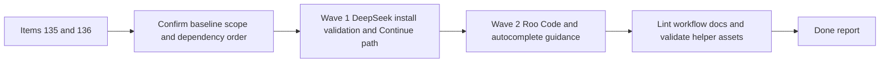

## task_098_orchestration_delivery_for_req_086_and_req_087_local_ollama_coding_workflows - Orchestration delivery for req_086 and req_087 local Ollama coding workflows
> From version: 1.12.1
> Schema version: 1.0
> Status: Ready
> Understanding: 95%
> Confidence: 92%
> Progress: 0%
> Complexity: Medium
> Theme: Cross-item delivery orchestration
> Reminder: Update status/understanding/confidence/progress and dependencies/references when you edit this doc.

# Context
Derived from:
- `logics/backlog/item_135_upgrade_the_logics_ollama_specialist_for_deepseek_coder_v2_installation_setup_and_access.md`
- `logics/backlog/item_136_extend_the_logics_ollama_specialist_for_roo_code_and_dedicated_local_autocomplete_workflows.md`

This orchestration task packages the local-coding skill delivery for the repository's Ollama specialist:
- first, make `deepseek-coder-v2` installation, validation, local API access, and Continue setup a first-class workflow
- then extend the same skill with Roo Code support and a dedicated local autocomplete pattern so editor guidance stays coherent instead of fragmenting into separate notes
- keep the work constrained to the repository skill, helper scripts, and references, without introducing unrelated extension-runtime changes

Delivery constraint:
- wave 1 should establish the baseline DeepSeek workflow before wave 2 adds editor integrations that depend on it
- the final skill should stay concise enough to be usable while still pointing to references or scripts for repeatable checks
- avoid duplicating install steps across several editor sections when the foundational workflow can be shared

# Plan
- [ ] 1. Confirm scope, dependencies, and linked acceptance criteria across items `135` and `136`, with `item_135` treated as the baseline path.
- [ ] 2. Wave 1: update `logics-ollama-specialist` for `deepseek-coder-v2` installation, validation, local API access, and Continue guidance.
- [ ] 3. Wave 2: extend the same skill with Roo Code setup guidance, dedicated local autocomplete guidance, and explicit tool-selection rules.
- [ ] 4. Validate the updated skill assets and linked Logics docs so the final workflow is coherent and commit-ready.
- [ ] CHECKPOINT: leave the current wave commit-ready and update the linked Logics docs before continuing.
- [ ] FINAL: Update related Logics docs

# Delivery checkpoints
- Each completed wave should leave the repository in a coherent, commit-ready state.
- Update the linked Logics docs during the wave that changes the behavior, not only at final closure.
- Prefer a reviewed commit checkpoint at the end of each meaningful wave instead of accumulating several undocumented partial states.

# AC Traceability
- item135-AC1/item135-AC2/item135-AC3/item135-AC4 -> Steps 1, 2, and 4. Proof: Wave 1 updates the repository skill and helper assets for the foundational DeepSeek workflow.
- item136-AC1/item136-AC2/item136-AC3/item136-AC4 -> Steps 1, 3, and 4. Proof: Wave 2 extends the skill with Roo Code, dedicated autocomplete, and explicit tool-selection guidance.

# Decision framing
- Product framing: Not needed
- Product signals: (none detected)
- Product follow-up: No product brief follow-up is expected based on current signals.
- Architecture framing: Not needed
- Architecture signals: (none detected)
- Architecture follow-up: No architecture decision follow-up is expected based on current signals.

# Links
- Product brief(s): (none yet)
- Architecture decision(s): (none yet)
- Backlog item(s):
  - `item_135_upgrade_the_logics_ollama_specialist_for_deepseek_coder_v2_installation_setup_and_access`
  - `item_136_extend_the_logics_ollama_specialist_for_roo_code_and_dedicated_local_autocomplete_workflows`
- Request(s):
  - `req_086_upgrade_the_logics_ollama_specialist_for_deepseek_coder_v2_installation_setup_and_access`
  - `req_087_extend_the_logics_ollama_specialist_for_roo_code_and_dedicated_local_autocomplete_workflows`

# AI Context
- Summary: Coordinate the repository Ollama skill rollout across the foundational DeepSeek workflow and the follow-up Roo Code plus dedicated autocomplete guidance.
- Keywords: orchestration, ollama, deepseek-coder-v2, continue, roo code, autocomplete
- Use when: Use when executing the two-wave local-coding skill delivery across items `135` and `136`.
- Skip when: Skip when the work belongs to another backlog item or a different execution wave.

# References
- `logics/request/req_086_upgrade_the_logics_ollama_specialist_for_deepseek_coder_v2_installation_setup_and_access.md`
- `logics/request/req_087_extend_the_logics_ollama_specialist_for_roo_code_and_dedicated_local_autocomplete_workflows.md`
- `logics/backlog/item_135_upgrade_the_logics_ollama_specialist_for_deepseek_coder_v2_installation_setup_and_access.md`
- `logics/backlog/item_136_extend_the_logics_ollama_specialist_for_roo_code_and_dedicated_local_autocomplete_workflows.md`
- `logics/skills/logics-ollama-specialist/SKILL.md`

# Validation
- `python3 logics/skills/logics-doc-linter/scripts/logics_lint.py --require-status`
- `python3 logics/skills/logics-flow-manager/scripts/workflow_audit.py --group-by-doc`
- `bash -n logics/skills/logics-ollama-specialist/scripts/ollama_check.sh`
- `bash -n logics/skills/logics-ollama-specialist/scripts/ollama_install_macos.sh`
- Manual: verify the final skill does not duplicate install steps across Continue, Roo Code, and autocomplete sections.

# Definition of Done (DoD)
- [ ] Scope implemented and acceptance criteria covered.
- [ ] Validation commands executed and results captured.
- [ ] Linked request/backlog/task docs updated during completed waves and at closure.
- [ ] Each completed wave left a commit-ready checkpoint or an explicit exception is documented.
- [ ] Status is `Done` and progress is `100%`.

# Report
