## task_099_orchestration_delivery_for_req_088_local_llm_dispatcher_for_deterministic_logics_flow_orchestration - Orchestration delivery for req_088 local LLM dispatcher for deterministic Logics flow orchestration
> From version: 1.12.1
> Schema version: 1.0
> Status: Ready
> Understanding: 97%
> Confidence: 95%
> Progress: 0%
> Complexity: High
> Theme: Cross-item delivery orchestration
> Reminder: Update status/understanding/confidence/progress and dependencies/references when you edit this doc.

# Context
Derived from:
- `logics/backlog/item_137_define_a_compact_dispatcher_context_package_and_strict_local_decision_contract.md`
- `logics/backlog/item_138_build_a_deterministic_dispatcher_runner_with_whitelisted_logics_action_mapping.md`
- `logics/backlog/item_139_add_an_ollama_first_local_dispatcher_adapter_audit_trail_and_operator_entrypoints.md`

This orchestration task packages the guarded local-dispatch portfolio for `req_088`:
- first, define the compact workflow-state package and strict local decision contract so the model input and output surfaces are bounded;
- then implement the deterministic runner that validates the contract and maps only whitelisted Logics actions onto controlled `logics_flow.py` commands;
- finally, wire an Ollama-first local runtime path, operator entrypoints, and structured auditability so the dispatcher is usable in practice without bypassing the deterministic runner.

Constraint:
- the contract slice must land before the runner because action mapping depends on stable payload and target semantics;
- the runtime adapter must consume the contract and runner as fixed boundaries rather than introducing its own execution logic;
- `suggestion-only` remains the default operating mode until validation, auditability, and reviewed execution paths are proven coherent.

```mermaid
%% logics-kind: task
%% logics-signature: task|orchestration-delivery-for-req-088-local|item-137-define-a-compact-dispatcher-con|1-confirm-scope-dependencies-and-linked|python3-logics-skills-logics-doc-linter-
flowchart LR
    Backlog[Items 137 138 and 139] --> Step1[Confirm contract scope and delivery order]
    Step1 --> Step2[Wave 1 context package and strict decision schema]
    Step2 --> Step3[Wave 2 deterministic runner and whitelisted action mapping]
    Step3 --> Step4[Wave 3 Ollama-first adapter audit trail and entrypoints]
    Step4 --> Validation[Lint docs audit workflow and run tests]
    Validation --> Report[Done report]
```

# Plan
- [ ] 1. Confirm scope, dependencies, and linked request acceptance criteria across items `137`, `138`, and `139`, with `item_137` treated as the baseline contract slice.
- [ ] 2. Wave 1: define and document the compact dispatcher context package, strict decision schema, canonical payload example, and fail-closed target semantics.
- [ ] 3. Wave 2: implement the deterministic runner, whitelisted action mapping, structured execution results, and default `suggestion-only` behavior.
- [ ] 4. Wave 3: add the Ollama-first local runtime adapter, structured audit trail, and operator-facing entrypoints or docs for the local dispatch loop.
- [ ] 5. Validate the end-to-end contract, failure modes, audit outputs, and linked Logics docs so the local dispatcher remains deterministic and operator-reviewable.
- [ ] CHECKPOINT: leave the current wave commit-ready and update the linked Logics docs before continuing.
- [ ] FINAL: Update related Logics docs

# Delivery checkpoints
- Each completed wave should leave the repository in a coherent, commit-ready state.
- Update the linked Logics docs during the wave that changes the behavior, not only at final closure.
- Prefer a reviewed commit checkpoint at the end of each meaningful wave instead of accumulating several undocumented partial states.

# AC Traceability
- AC1/AC2 -> Steps 1, 2, and 5. Proof: Wave 1 defines the compact context package and strict schema through `item_137`.
- AC3 -> Steps 1, 3, and 5. Proof: Wave 2 adds the deterministic runner and whitelisted action mapping through `item_138`.
- AC4/AC5 -> Steps 3, 4, and 5. Proof: Wave 2 and Wave 3 preserve suggestion-first safety, structured failures, auditability, and Ollama-first local runtime support through `item_138` and `item_139`.

# Decision framing
- Product framing: Not needed
- Product signals: (none detected)
- Product follow-up: No product brief follow-up is expected based on current signals.
- Architecture framing: Consider
- Architecture signals: schema contract, execution whitelist, local runtime boundary
- Architecture follow-up: Consider whether an architecture decision is needed before the dispatcher contract and runtime boundary become harder to reverse.

# Links
- Product brief(s): (none yet)
- Architecture decision(s): (none yet)
- Backlog item(s):
  - `item_137_define_a_compact_dispatcher_context_package_and_strict_local_decision_contract`
  - `item_138_build_a_deterministic_dispatcher_runner_with_whitelisted_logics_action_mapping`
  - `item_139_add_an_ollama_first_local_dispatcher_adapter_audit_trail_and_operator_entrypoints`
- Request(s): `req_088_add_a_local_llm_dispatcher_for_deterministic_logics_flow_orchestration`

# AI Context
- Summary: Coordinate the req_088 delivery across bounded dispatcher contracts, deterministic action mapping, and an Ollama-first local runtime plus audit trail.
- Keywords: orchestration, dispatcher, ollama, schema, whitelist, audit, suggestion-only
- Use when: Use when executing the cross-item local dispatcher delivery for req_088.
- Skip when: Skip when the work belongs to another request, another backlog item, or a hosted orchestration path.

# References
- `logics/request/req_088_add_a_local_llm_dispatcher_for_deterministic_logics_flow_orchestration.md`
- `logics/backlog/item_137_define_a_compact_dispatcher_context_package_and_strict_local_decision_contract.md`
- `logics/backlog/item_138_build_a_deterministic_dispatcher_runner_with_whitelisted_logics_action_mapping.md`
- `logics/backlog/item_139_add_an_ollama_first_local_dispatcher_adapter_audit_trail_and_operator_entrypoints.md`
- `logics/skills/logics-flow-manager/scripts/logics_flow.py`
- `logics/skills/logics-flow-manager/scripts/workflow_audit.py`
- `logics/skills/logics-ollama-specialist/SKILL.md`

# Validation
- `python3 logics/skills/logics-doc-linter/scripts/logics_lint.py --require-status`
- `python3 logics/skills/logics-flow-manager/scripts/workflow_audit.py --group-by-doc`
- `python3 -m unittest discover -s logics/skills/tests -p "test_*.py" -v`
- Manual: verify invalid or ambiguous dispatcher payloads fail closed and do not mutate workflow docs.
- Manual: verify `suggestion-only` mode produces a structured recommendation and audit record without executing a workflow mutation.
- Manual: verify the Ollama-first adapter uses the canonical schema instead of inventing a runtime-specific payload shape.

# Definition of Done (DoD)
- [ ] Scope implemented and acceptance criteria covered.
- [ ] Validation commands executed and results captured.
- [ ] Linked request/backlog/task docs updated during completed waves and at closure.
- [ ] Each completed wave left a commit-ready checkpoint or an explicit exception is documented.
- [ ] Status is `Done` and progress is `100%`.

# Report
