## task_100_orchestration_delivery_for_req_089_to_req_095_hybrid_assist_runtime_portfolio_governance_portability_and_plugin_exposure - Orchestration delivery for req_089 to req_095 hybrid assist runtime portfolio governance portability and plugin exposure
> From version: 1.12.1 (refreshed)
> Schema version: 1.0
> Status: Done
> Understanding: 100%
> Confidence: 98%
> Progress: 100%
> Complexity: High
> Theme: Cross-request hybrid assist delivery orchestration
> Reminder: Update status/understanding/confidence/progress and dependencies/references when you edit this doc.

# Context
Derived from:
- `logics/backlog/item_140_define_deterministic_hybrid_backend_detection_health_probes_and_auto_routing_for_logics_assist_flows.md`
- `logics/backlog/item_141_add_backend_neutral_hybrid_runtime_invocation_fallback_handling_and_operator_entrypoints.md`
- `logics/backlog/item_142_add_hybrid_commit_message_pr_summary_and_changelog_summary_assist_flows.md`
- `logics/backlog/item_143_add_hybrid_validation_summary_next_step_dispatch_and_workflow_triage_flows.md`
- `logics/backlog/item_144_add_hybrid_handoff_packet_and_bounded_split_suggestion_flows.md`
- `logics/backlog/item_145_make_hybrid_assist_commands_and_payloads_reusable_from_codex_and_claude_adapters.md`
- `logics/backlog/item_146_harden_hybrid_assist_runtime_examples_launchers_and_validation_for_windows_safe_execution.md`
- `logics/backlog/item_147_add_diff_risk_triage_and_commit_plan_suggestion_flows.md`
- `logics/backlog/item_148_add_closure_summary_and_validation_checklist_generation_flows.md`
- `logics/backlog/item_149_add_document_consistency_review_flows_with_verified_non_mutative_follow_up.md`
- `logics/backlog/item_150_define_a_shared_hybrid_assist_payload_envelope_and_execution_metadata_contract.md`
- `logics/backlog/item_151_codify_shared_fallback_safety_class_activation_and_rollout_rules_for_hybrid_assist_flows.md`
- `logics/backlog/item_152_add_shared_hybrid_audit_metrics_and_observability_governance.md`
- `logics/backlog/item_153_define_shared_hybrid_assist_context_pack_profiles_enrichment_rules_and_trimming_strategy.md`
- `logics/backlog/item_154_add_hybrid_assist_measurement_review_loops_and_degraded_result_policies.md`
- `logics/backlog/item_155_extend_plugin_environment_diagnostics_with_hybrid_runtime_health_backend_selection_and_degraded_state_visibility.md`
- `logics/backlog/item_156_add_plugin_tool_actions_for_high_value_hybrid_assist_flows_through_shared_runtime_commands.md`
- `logics/backlog/item_157_add_plugin_audit_visibility_result_panels_and_cross_agent_runtime_messaging_cleanup.md`

This orchestration task coordinates the hybrid assist portfolio across `req_089` to `req_095` in four dependent waves:
- Wave 1 establishes the shared platform rules first: payload envelope, fallback and safety classes, audit fields, shared context packs, and degraded-mode review loops.
- Wave 2 builds the reusable runtime surfaces on top of that governance: backend detection, shared invocation, agent-agnostic adapter expectations, and Windows-safe command paths.
- Wave 3 adds the concrete assist-flow portfolio in two layers: the first-wave high-ROI delivery flows and the second-wave review and hygiene flows.
- Wave 4 exposes the resulting runtime coherently in the VS Code plugin through diagnostics, selected actions, audit visibility, and cleaned-up cross-agent messaging.

Constraints:
- governance and context slices must land before the portfolio expands, otherwise the assist flows will fragment into incompatible contracts;
- portability constraints from `req_091` apply to every wave, not only to the dedicated compatibility items;
- plugin work must remain a thin client over shared runtime commands and structured outputs rather than reimplementing hybrid runtime logic in TypeScript;
- risky execution remains bounded by the shared safety taxonomy and should default to assistive or `suggestion-only` behavior until deterministic runner paths are proven coherent.

```mermaid
%% logics-kind: task
%% logics-signature: task|orchestration-delivery-for-req-089-to-re|item-140-define-deterministic-hybrid-bac|1-confirm-cross-request-scope-dependenci|python3-logics-skills-logics-flow-manage
flowchart LR
    Backlog[item_140_define_deterministic_hybrid_backe] --> Step1[1. Confirm cross-request scope dependencie]
    Step1 --> Step2[2. Wave 1: deliver shared governance]
    Step2 --> Step3[3. Wave 2: deliver reusable runtime]
    Step3 --> Validation[python3 logics skills logics-flow-manager]
    Validation --> Report[Done report]
```

# Plan
- [x] 1. Confirm cross-request scope, dependencies, and acceptance-criterion traceability across items `140` through `157`.
- [x] 2. Wave 1: deliver shared governance, context-pack, observability, and degraded-result foundations through items `150`, `151`, `152`, `153`, and `154`.
- [x] 3. Wave 2: deliver reusable runtime and portability foundations through items `140`, `141`, `145`, and `146`.
- [x] 4. Wave 3: deliver the concrete assist-flow portfolio through items `142`, `143`, `144`, `147`, `148`, and `149`.
- [x] 5. Wave 4: expose hybrid runtime health, actions, audit visibility, and messaging cleanup in the plugin through items `155`, `156`, and `157`.
- [x] 6. Validate the end-to-end portfolio across shared CLI surfaces, agent adapters, Windows-safe paths, degraded-mode behavior, and plugin UX.
- [x] CHECKPOINT: leave each completed wave in a coherent, commit-ready state and update the linked Logics docs before continuing.
- [x] FINAL: Update related Logics docs

# Delivery checkpoints
- Each completed wave should leave the repository in a coherent, commit-ready state.
- Governance and contract docs should be updated during the wave that changes runtime semantics, not deferred until the end.
- Prefer reviewed checkpoints at the end of each wave so fallback, portability, and plugin work do not pile up into one opaque delivery batch.

# AC Traceability
- req089-AC1/AC2/AC3/AC4/AC6 -> Waves 1 and 2. Proof: items `140`, `141`, `150`, `151`, and `152` deliver deterministic backend routing, shared runtime invocation, shared contracts, and reusable activation surfaces.
- req089-AC5 -> Waves 1 and validation. Proof: items `151` and `154` encode the ROI-aware governance, rollout restraint, and review-loop rules that keep low-fit work out of the hybrid runtime by default.
- req090-AC1/AC2/AC3/AC4/AC6 -> Wave 3. Proof: items `142`, `143`, and `144` deliver the bounded first-wave assist portfolio on top of the shared runtime and governance layer, with activation surfaces completed by the surrounding runtime and plugin waves.
- req090-AC5 -> Waves 1 and 3. Proof: items `144` and `151` keep medium-fit planning flows assistive and preserve explicit out-of-scope boundaries for low-ROI unsafe work.
- req091-AC1/AC2/AC3/AC4/AC5/AC6/AC7 -> Waves 2 through 4. Proof: items `145`, `146`, `155`, `156`, and `157` keep the runtime agent-agnostic, Windows-safe, and visible across adapter and plugin surfaces.
- req092-AC1/AC2/AC3/AC4/AC5/AC6 -> Wave 3. Proof: items `147`, `148`, and `149` deliver the review-oriented second-wave flows while preserving non-mutative, verified, and bounded follow-up semantics.
- req093-AC1/AC2/AC3/AC4/AC5/AC6/AC7 -> Wave 1. Proof: items `150`, `151`, and `152` define the shared payload envelope, fallback and safety policies, activation conventions, and observability contract.
- req094-AC1/AC2/AC3/AC4/AC5/AC6 -> Wave 1 and validation. Proof: items `153` and `154` define context discipline, measurement loops, degraded-result states, and flow review rules.
- req095-AC1/AC2/AC3/AC4/AC5/AC6/AC7 -> Wave 4. Proof: items `155`, `156`, and `157` extend the plugin with hybrid diagnostics, selected actions, audit visibility, and corrected cross-agent messaging.

# Decision framing
- Product framing: Consider
- Product signals: operator workflow, activation, retention
- Product follow-up: Review whether a product brief is needed before plugin-triggered hybrid flows and default operator paths become harder to change.
- Architecture framing: Consider
- Architecture signals: runtime contracts, payload envelopes, fallback policy, cross-agent adapters, plugin integration
- Architecture follow-up: Consider architecture decisions before the shared hybrid contract and plugin/runtime boundary become difficult to reverse.

# Links
- Product brief(s):
  - `prod_001_hybrid_assist_operator_experience_for_repetitive_logics_delivery_flows`
  - `prod_002_plugin_hybrid_assist_runtime_visibility_and_action_ux`
- Architecture decision(s):
  - `adr_011_keep_hybrid_assist_runtime_contracts_shared_backend_agnostic_and_safely_bounded`
  - `adr_012_keep_the_vs_code_plugin_as_a_thin_client_over_shared_hybrid_runtime_commands`
- Backlog item(s):
  - `item_140_define_deterministic_hybrid_backend_detection_health_probes_and_auto_routing_for_logics_assist_flows`
  - `item_141_add_backend_neutral_hybrid_runtime_invocation_fallback_handling_and_operator_entrypoints`
  - `item_142_add_hybrid_commit_message_pr_summary_and_changelog_summary_assist_flows`
  - `item_143_add_hybrid_validation_summary_next_step_dispatch_and_workflow_triage_flows`
  - `item_144_add_hybrid_handoff_packet_and_bounded_split_suggestion_flows`
  - `item_145_make_hybrid_assist_commands_and_payloads_reusable_from_codex_and_claude_adapters`
  - `item_146_harden_hybrid_assist_runtime_examples_launchers_and_validation_for_windows_safe_execution`
  - `item_147_add_diff_risk_triage_and_commit_plan_suggestion_flows`
  - `item_148_add_closure_summary_and_validation_checklist_generation_flows`
  - `item_149_add_document_consistency_review_flows_with_verified_non_mutative_follow_up`
  - `item_150_define_a_shared_hybrid_assist_payload_envelope_and_execution_metadata_contract`
  - `item_151_codify_shared_fallback_safety_class_activation_and_rollout_rules_for_hybrid_assist_flows`
  - `item_152_add_shared_hybrid_audit_metrics_and_observability_governance`
  - `item_153_define_shared_hybrid_assist_context_pack_profiles_enrichment_rules_and_trimming_strategy`
  - `item_154_add_hybrid_assist_measurement_review_loops_and_degraded_result_policies`
  - `item_155_extend_plugin_environment_diagnostics_with_hybrid_runtime_health_backend_selection_and_degraded_state_visibility`
  - `item_156_add_plugin_tool_actions_for_high_value_hybrid_assist_flows_through_shared_runtime_commands`
  - `item_157_add_plugin_audit_visibility_result_panels_and_cross_agent_runtime_messaging_cleanup`
- Request(s):
  - `req_089_add_a_hybrid_ollama_or_codex_local_orchestration_backend_for_repetitive_logics_delivery_tasks`
  - `req_090_add_high_roi_hybrid_ollama_or_codex_assist_flows_for_repetitive_logics_delivery_operations`
  - `req_091_ensure_hybrid_logics_delivery_automation_stays_compatible_with_claude_environments_and_windows_runtimes`
  - `req_092_add_a_second_wave_of_hybrid_ollama_or_codex_assist_flows_for_risk_triage_commit_planning_closure_summaries_doc_consistency_checks_and_validation_checklists`
  - `req_093_add_shared_hybrid_assist_contracts_fallback_policy_activation_rules_and_audit_governance_for_logics_delivery_automation`
  - `req_094_add_hybrid_assist_measurement_shared_context_strategy_and_degraded_mode_governance_for_logics_delivery_automation`
  - `req_095_adapt_the_vs_code_logics_plugin_to_expose_hybrid_assist_runtime_status_actions_audit_and_cross_agent_messaging`

# AI Context
- Summary: Coordinate the hybrid assist portfolio from req_089 to req_095 across shared governance, backend runtime, portability, concrete assist flows, and plugin exposure.
- Keywords: orchestration, hybrid assist, ollama, codex, claude, plugin, governance, fallback, portability
- Use when: Use when executing or auditing the combined hybrid assist delivery portfolio.
- Skip when: Skip when the work belongs to one isolated backlog item or to a request outside the req_089 to req_095 set.

# References
- `logics/request/req_089_add_a_hybrid_ollama_or_codex_local_orchestration_backend_for_repetitive_logics_delivery_tasks.md`
- `logics/request/req_090_add_high_roi_hybrid_ollama_or_codex_assist_flows_for_repetitive_logics_delivery_operations.md`
- `logics/request/req_091_ensure_hybrid_logics_delivery_automation_stays_compatible_with_claude_environments_and_windows_runtimes.md`
- `logics/request/req_092_add_a_second_wave_of_hybrid_ollama_or_codex_assist_flows_for_risk_triage_commit_planning_closure_summaries_doc_consistency_checks_and_validation_checklists.md`
- `logics/request/req_093_add_shared_hybrid_assist_contracts_fallback_policy_activation_rules_and_audit_governance_for_logics_delivery_automation.md`
- `logics/request/req_094_add_hybrid_assist_measurement_shared_context_strategy_and_degraded_mode_governance_for_logics_delivery_automation.md`
- `logics/request/req_095_adapt_the_vs_code_logics_plugin_to_expose_hybrid_assist_runtime_status_actions_audit_and_cross_agent_messaging.md`
- `logics/skills/logics.py`
- `logics/skills/logics-flow-manager/scripts/logics_flow.py`
- `logics/skills/logics-flow-manager/scripts/logics_flow_dispatcher.py`
- `logics/skills/logics-flow-manager/scripts/logics_flow_config.py`
- `logics/skills/logics-flow-manager/scripts/logics_flow_index.py`
- `logics/skills/logics-flow-manager/scripts/logics_codex_workspace.py`
- `src/logicsEnvironment.ts`
- `src/logicsViewProvider.ts`
- `src/logicsWebviewHtml.ts`
- `README.md`

# Validation
- `python3 logics/skills/logics-flow-manager/scripts/logics_flow.py sync refresh-mermaid-signatures --format json`
- `python3 logics/skills/logics-doc-linter/scripts/logics_lint.py --require-status`
- `python3 logics/skills/logics-flow-manager/scripts/workflow_audit.py --group-by-doc`
- `python3 -m unittest discover -s logics/skills/tests -p "test_*.py" -v`
- `python3 logics/skills/tests/run_cli_smoke_checks.py`
- `npm test`
- Manual: verify representative hybrid flows show backend provenance, fallback state, or degraded state coherently across CLI and plugin surfaces.
- Manual: verify supported Codex and Claude adapter paths still point to the same shared runtime commands and payload contracts.
- Manual: verify Windows-safe command examples remain valid or explicitly labeled when a helper is OS-specific.

# Definition of Done (DoD)
- [x] Scope implemented and acceptance criteria covered.
- [x] Validation commands executed and results captured.
- [x] Linked request/backlog/task docs updated during completed waves and at closure.
- [x] Each completed wave leaves a commit-ready checkpoint or an explicit exception is documented.
- [x] Status is `Done` and progress is `100%`.

# Report
- 

# Notes
