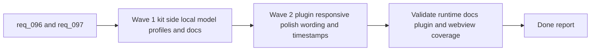

## task_101_orchestration_delivery_for_req_096_and_req_097_plugin_polish_and_hybrid_local_model_profile_flexibility - Orchestration delivery for req_096 and req_097 plugin polish and hybrid local model profile flexibility
> From version: 1.12.1
> Schema version: 1.0
> Status: In progress
> Understanding: 98%
> Confidence: 96%
> Progress: 50%
> Complexity: High
> Theme: Coordinated plugin polish and kit-side model profile flexibility
> Reminder: Update status/understanding/confidence/progress and dependencies/references when you edit this doc.

# Context
Derived from:
- `logics/backlog/item_158_collapse_bottom_details_when_activity_opens_in_vertical_plugin_layout.md`
- `logics/backlog/item_159_replace_textual_activity_attention_and_view_mode_labels_with_accessible_toolbar_icons.md`
- `logics/backlog/item_160_make_recent_plugin_updated_timestamps_more_precise_under_twenty_four_hours.md`
- `logics/backlog/item_161_generalize_plugin_context_pack_wording_beyond_codex_while_preserving_codex_specific_actions.md`
- `logics/backlog/item_162_add_configurable_deepseek_and_qwen_local_model_profiles_to_the_hybrid_runtime.md`
- `logics/backlog/item_163_extend_ollama_specialist_docs_and_validation_surfaces_for_supported_deepseek_and_qwen_profiles.md`

This orchestration task coordinates two distinct but adjacent slices:
- `req_097` extends the kit-side hybrid runtime so local-model support is no longer effectively DeepSeek-only and becomes configurable across a bounded DeepSeek/Qwen profile set.
- `req_096` then applies plugin-side polish so the webview behaves better in vertical layout, uses icon-led controls, presents recent timestamps more clearly, and frames shared AI context more neutrally.

The split matters:
- kit/runtime model-profile support should land first so the underlying local-model story is explicit before related operator messaging continues to evolve;
- plugin polish should stay a thin presentation layer over the existing runtime and not absorb model-policy logic;
- the final validation wave should confirm that the new model-profile flexibility and the plugin wording/UX changes still compose cleanly across CLI, docs, and webview surfaces.

Constraints:
- keep kit-side model support bounded to curated supported profiles rather than an open-ended Ollama registry;
- keep plugin changes presentation-focused and avoid moving shared runtime logic into TypeScript;
- prefer coherent wave checkpoints so kit/runtime changes and plugin UX changes can be reviewed independently.

# Plan
- [x] 1. Confirm the scope split between plugin-only work in `req_096` and kit/runtime work in `req_097`, plus AC traceability across items `158` through `163`.
- [x] 2. Wave 1: deliver hybrid runtime model-profile flexibility and aligned Ollama specialist guidance through items `162` and `163`.
- [ ] 3. Wave 2: deliver plugin responsive behavior, iconography, timestamp precision, and context-pack wording polish through items `158`, `159`, `160`, and `161`.
- [ ] 4. Validate the combined result across kit runtime surfaces, Ollama guidance, plugin webview behavior, and updated terminology.
- [ ] CHECKPOINT: leave each completed wave in a coherent, commit-ready state and update the linked Logics docs before continuing.
- [ ] FINAL: Update related Logics docs

# Delivery checkpoints
- Keep Wave 1 reviewable as a kit/runtime checkpoint before any plugin changes are layered on top.
- Keep Wave 2 reviewable as a pure plugin/UI checkpoint after the model-profile work is already grounded.
- Update linked request/backlog/task docs in the wave that materially changes the underlying behavior.

# AC Traceability
- req096-AC1 -> Wave 2. Proof: item `158` handles the vertical-layout `Activity` and details-panel interaction.
- req096-AC2 -> Wave 2. Proof: item `159` handles icon-led toolbar controls and their accessibility contract.
- req096-AC3 -> Wave 2. Proof: item `160` handles recent `Updated` precision.
- req096-AC4 -> Wave 2. Proof: item `161` handles agent-neutral context-pack wording while preserving Codex-specific labels where they still belong.
- req096-AC5/AC6 -> Wave 2 and validation. Proof: items `158` through `161` remain plugin-scoped and require regression coverage.
- req097-AC1/AC2/AC3 -> Wave 1. Proof: item `162` handles bounded DeepSeek/Qwen profile support, config-driven selection, and aligned runtime status behavior.
- req097-AC4/AC5/AC6 -> Wave 1 and validation. Proof: item `163` aligns operator guidance and validation surfaces while keeping support curated and kit-owned.

# Decision framing
- Product framing: Consider
- Product signals: usability, clarity, operator trust
- Product follow-up: Review whether a small product brief is needed if the shared AI handoff surface and plugin wording become more central than the current Codex-first framing.
- Architecture framing: Consider
- Architecture signals: runtime config policy and plugin/runtime boundaries
- Architecture follow-up: Consider an architecture follow-up if local-model family support expands again beyond the bounded DeepSeek/Qwen profile set.

# Links
- Product brief(s): (none yet)
- Architecture decision(s):
  - `adr_005_define_responsive_layout_scroll_and_sizing_rules_for_plugin_views`
  - `adr_011_keep_hybrid_assist_runtime_contracts_shared_backend_agnostic_and_safely_bounded`
  - `adr_012_keep_the_vs_code_plugin_as_a_thin_client_over_shared_hybrid_runtime_commands`
- Backlog item(s):
  - `item_158_collapse_bottom_details_when_activity_opens_in_vertical_plugin_layout`
  - `item_159_replace_textual_activity_attention_and_view_mode_labels_with_accessible_toolbar_icons`
  - `item_160_make_recent_plugin_updated_timestamps_more_precise_under_twenty_four_hours`
  - `item_161_generalize_plugin_context_pack_wording_beyond_codex_while_preserving_codex_specific_actions`
  - `item_162_add_configurable_deepseek_and_qwen_local_model_profiles_to_the_hybrid_runtime`
  - `item_163_extend_ollama_specialist_docs_and_validation_surfaces_for_supported_deepseek_and_qwen_profiles`
- Request(s):
  - `req_096_refine_plugin_responsive_activity_toolbar_iconography_timestamp_precision_and_agent_neutral_context_pack_wording`
  - `req_097_expand_hybrid_local_model_support_beyond_deepseek_with_configurable_qwen_and_deepseek_profiles`

# AI Context
- Summary: Coordinate the delivery of plugin polish in req_096 and bounded DeepSeek/Qwen local-model profile support in req_097 through separate kit and plugin waves.
- Keywords: task, plugin, qwen, deepseek, hybrid runtime, activity, icons, timestamps, context pack
- Use when: Use when executing or auditing the combined req_096 and req_097 delivery set.
- Skip when: Skip when the work belongs to only one isolated backlog item outside this combined scope.

# References
- `logics/request/req_096_refine_plugin_responsive_activity_toolbar_iconography_timestamp_precision_and_agent_neutral_context_pack_wording.md`
- `logics/request/req_097_expand_hybrid_local_model_support_beyond_deepseek_with_configurable_qwen_and_deepseek_profiles.md`
- `src/logicsWebviewHtml.ts`
- `src/logicsViewProvider.ts`
- `media/main.js`
- `media/mainInteractions.js`
- `media/renderDetails.js`
- `logics/skills/logics-flow-manager/scripts/logics_flow_hybrid.py`
- `logics/skills/logics-flow-manager/scripts/logics_flow_config.py`
- `logics/skills/logics-ollama-specialist/SKILL.md`
- `README.md`

# Validation
- `python3 logics/skills/logics-flow-manager/scripts/logics_flow.py sync refresh-mermaid-signatures --format json`
- `python3 logics/skills/logics-doc-linter/scripts/logics_lint.py --require-status`
- `python3 logics/skills/logics-flow-manager/scripts/workflow_audit.py --group-by-doc`
- `python3 -m unittest discover -s logics/skills/tests -p "test_*.py" -v`
- `npm test`
- `npm run lint:ts`
- Manual: verify vertical-layout `Activity` opens with the intended details collapse behavior and remains reversible.
- Manual: verify icon-led controls preserve selected-state clarity and accessible labels.
- Manual: verify the hybrid runtime reports the configured local-model profile coherently when using the curated DeepSeek and Qwen support set.

# Definition of Done (DoD)
- [ ] Scope implemented and acceptance criteria covered.
- [ ] Validation commands executed and results captured.
- [ ] Linked request/backlog/task docs updated during completed waves and at closure.
- [ ] Each completed wave leaves a commit-ready checkpoint or an explicit exception is documented.
- [ ] Status is `Done` and progress is `100%`.
