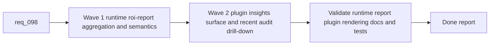

## task_102_orchestration_delivery_for_req_098_hybrid_assist_roi_dispatch_reporting_and_plugin_insights - Orchestration delivery for req_098 hybrid assist ROI dispatch reporting and plugin insights
> From version: 1.13.0
> Schema version: 1.0
> Status: Ready
> Understanding: 97%
> Confidence: 95%
> Progress: 0%
> Complexity: High
> Theme: Coordinated kit and plugin delivery for hybrid assist ROI observability
> Reminder: Update status/understanding/confidence/progress and dependencies/references when you edit this doc.

# Context
Derived from:
- `logics/backlog/item_164_add_a_canonical_hybrid_assist_roi_report_runtime_surface_over_existing_measurement_and_audit_logs.md`
- `logics/backlog/item_165_define_explicit_measured_derived_and_estimated_roi_semantics_for_hybrid_assist_reports.md`
- `logics/backlog/item_166_add_a_plugin_hybrid_assist_roi_dispatch_insights_surface_with_recent_audit_drill_down.md`

This orchestration task coordinates the delivery of `req_098` in a strict kit-then-plugin sequence:
- the kit must first expose a stable `roi-report` runtime surface over the existing hybrid measurement and audit logs;
- the report semantics must then make measured facts, derived summaries, and estimated ROI proxies explicit and documented;
- only after that foundation exists should the plugin render an insights surface and recent audit drill-down over the shared runtime output.

The split matters because:
- the plugin must not invent its own aggregation or ROI semantics;
- estimated token or local-offload benefit needs careful labeling before it is displayed in UI;
- the final validation wave must confirm that CLI, docs, and plugin all tell the same story about what is measured and what is estimated.

Constraints:
- keep one telemetry path built on the existing hybrid assist JSONL logs rather than introducing a second reporting store;
- keep the plugin a thin client over shared runtime report data and audit snippets;
- prefer conservative estimate language and drill-down visibility over glossy but opaque dashboards.

# Plan
- [ ] 1. Confirm the kit-first versus plugin-second split across items `164` through `166` and keep AC traceability aligned.
- [ ] 2. Wave 1: deliver the canonical runtime `roi-report` surface plus explicit measured, derived, and estimated semantics through items `164` and `165`.
- [ ] 3. Wave 2: deliver the plugin insights screen and recent audit drill-down through item `166`.
- [ ] 4. Validate the combined result across runtime outputs, plugin rendering, documentation, and test coverage.
- [ ] CHECKPOINT: leave each wave in a coherent, commit-ready state and update linked Logics docs before moving on.
- [ ] FINAL: Update related Logics docs

# Delivery checkpoints
- Keep Wave 1 reviewable as a pure kit/runtime checkpoint before any plugin insights UI is introduced.
- Keep Wave 2 reviewable as a plugin-only checkpoint over already-stable report data.
- Update `req_098`, linked backlog items, and this task as each wave lands so the report semantics and UI scope stay synchronized.

# AC Traceability
- req098-AC1/AC2 -> Wave 1. Proof: items `164` and `165` introduce the runtime report command, core metrics, and trustworthy field semantics.
- req098-AC3 -> Wave 1. Proof: item `165` makes measured-versus-estimated distinctions explicit and documented before UI rendering starts.
- req098-AC4/AC5 -> Wave 2. Proof: item `166` adds the plugin insights surface and recent audit drill-down over the shared runtime report.
- req098-AC6/AC7 -> Wave 1 and Wave 2. Proof: item `164` keeps aggregation in the runtime over existing logs, while item `166` keeps the plugin a pure renderer.
- req098-AC8 -> Validation and doc updates. Proof: the final wave requires test and documentation coverage for runtime output and plugin interpretation.

# Decision framing
- Product framing: Yes
- Product signals: trust, visibility, workflow adoption
- Product follow-up: Review whether the ROI dispatch report should surface a compact summary card elsewhere in the plugin once the dedicated insights screen proves useful.
- Architecture framing: Consider
- Architecture signals: report contract stability and thin-client enforcement
- Architecture follow-up: Consider an ADR follow-up only if the report schema becomes a long-lived external contract across multiple non-plugin consumers.

# Links
- Product brief(s):
  - `prod_001_hybrid_assist_operator_experience_for_repetitive_logics_delivery_flows`
  - `prod_002_plugin_hybrid_assist_runtime_visibility_and_action_ux`
- Architecture decision(s):
  - `adr_011_keep_hybrid_assist_runtime_contracts_shared_backend_agnostic_and_safely_bounded`
  - `adr_012_keep_the_vs_code_plugin_as_a_thin_client_over_shared_hybrid_runtime_commands`
- Backlog item(s):
  - `item_164_add_a_canonical_hybrid_assist_roi_report_runtime_surface_over_existing_measurement_and_audit_logs`
  - `item_165_define_explicit_measured_derived_and_estimated_roi_semantics_for_hybrid_assist_reports`
  - `item_166_add_a_plugin_hybrid_assist_roi_dispatch_insights_surface_with_recent_audit_drill_down`
- Request(s):
  - `req_098_add_a_hybrid_assist_roi_dispatch_report_with_runtime_aggregation_and_plugin_insights`

# AI Context
- Summary: Coordinate a kit-first then plugin-second delivery of a hybrid assist ROI dispatch report, with explicit measured-versus-estimated semantics and a plugin insights surface.
- Keywords: task, roi report, dispatch, hybrid assist, plugin insights, audit, measurements, fallback
- Use when: Use when executing or auditing the delivery of req_098 across runtime aggregation and plugin observability.
- Skip when: Skip when the work belongs to one isolated backlog item outside the req_098 scope.

# References
- `logics/request/req_098_add_a_hybrid_assist_roi_dispatch_report_with_runtime_aggregation_and_plugin_insights.md`
- `logics/skills/README.md`
- `logics/skills/logics-flow-manager/SKILL.md`
- `logics/skills/logics-flow-manager/scripts/logics_flow.py`
- `logics/skills/logics-flow-manager/scripts/logics_flow_hybrid.py`
- `src/logicsEnvironment.ts`
- `src/logicsViewProvider.ts`
- `src/logicsWebviewHtml.ts`
- `README.md`

# Validation
- `python3 logics/skills/logics-flow-manager/scripts/logics_flow.py sync refresh-mermaid-signatures --format json`
- `python3 logics/skills/logics-doc-linter/scripts/logics_lint.py --require-status`
- `python3 logics/skills/logics-flow-manager/scripts/workflow_audit.py --group-by-doc`
- `python3 -m unittest discover -s logics/skills/tests -p "test_*.py" -v`
- `npm test`
- `npm run lint:ts`
- Manual: verify the runtime report clearly separates measured values from estimated ROI proxies.
- Manual: verify the plugin insights screen exposes fallback and degraded reasons without forcing raw log inspection.

# Definition of Done (DoD)
- [ ] Scope implemented and acceptance criteria covered.
- [ ] Validation commands executed and results captured.
- [ ] Linked request/backlog/task docs updated during completed waves and at closure.
- [ ] Each completed wave leaves a commit-ready checkpoint or an explicit exception is documented.
- [ ] Status is `Done` and progress is `100%`.
