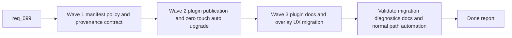

## task_103_orchestration_delivery_for_req_099_global_logics_kit_publication_and_overlay_migration - Orchestration delivery for req_099 global Logics kit publication and overlay migration
> From version: 1.14.0
> Schema version: 1.0
> Status: Done
> Understanding: 100%
> Confidence: 97%
> Progress: 100%
> Complexity: High
> Theme: Coordinated migration from overlay-backed Codex runtime to a globally published Logics kit
> Reminder: Update status/understanding/confidence/progress and dependencies/references when you edit this doc.

# Context
Derived from:
- `logics/backlog/item_167_define_a_global_logics_kit_publication_manifest_and_version_resolution_policy.md`
- `logics/backlog/item_168_publish_and_auto_upgrade_the_global_codex_logics_kit_from_canonical_repo_sources_in_the_plugin.md`
- `logics/backlog/item_169_migrate_plugin_docs_and_existing_overlay_ux_to_the_global_published_kit_model.md`

This orchestration task coordinates the delivery of `req_099` as a deliberate architecture migration:
- first define the global publication contract and winner-selection policy so the runtime is deterministic and supportable;
- then implement plugin-owned publication and zero-touch auto-upgrade behavior from canonical repo-local kit sources;
- then migrate plugin UX, diagnostics, and documentation away from overlay-centric wording and actions so the normal operator path becomes singular.

The sequence matters because:
- the plugin cannot safely auto-upgrade a global runtime before the manifest, provenance, and resolution policy are explicit;
- the migration must be no-user-action in the normal path, so publication automation and degraded-state handling need to exist before overlay wording is retired;
- the final validation wave must confirm that existing repositories can act as publication sources without manual migration chores and that stale overlay concepts no longer dominate the runtime story.

Constraints:
- keep `logics/skills` in each repository as the canonical source of truth for kit content;
- do not globalize repo-owned workflow docs such as `logics/request`, `logics/backlog`, `logics/tasks`, product briefs, or ADRs;
- treat overlay retirement as a migration concern, not as a parallel runtime that remains first-class indefinitely;
- reserve manual prompts for exceptional failures or permission issues, not for the normal migration path.

# Plan
- [x] 1. Confirm the architecture shift from overlays to a globally published kit and keep AC traceability aligned across items `167` through `169`.
- [x] 2. Wave 1: define and implement the global publication manifest, provenance model, and version-resolution policy through item `167`.
- [x] 3. Wave 2: deliver plugin-side detection, publication, repair, and zero-touch auto-upgrade behavior through item `168`.
- [x] 4. Wave 3: migrate plugin diagnostics, tools, and README/operator guidance away from overlay-specific runtime wording through item `169`.
- [x] 5. Validate the combined result across existing-repo migration, degraded-state behavior, plugin visibility, and documentation coherence.
- [x] CHECKPOINT: leave each completed wave in a coherent, commit-ready state and update linked Logics docs before continuing.
- [x] FINAL: Update related Logics docs

# Delivery checkpoints
- Keep Wave 1 reviewable as a pure contract and runtime-state checkpoint before plugin automation mutates the global Codex home.
- Keep Wave 2 reviewable as the zero-touch migration checkpoint where opening a compatible repository is enough to converge the machine in the normal path.
- Keep Wave 3 reviewable as a user-facing migration checkpoint that removes stale overlay mental models once the new runtime path is already working.
- Update the linked request, backlog items, and this task in the wave that materially changes the behavior so migration expectations stay synchronized with implementation.

# AC Traceability
- req099-AC1/AC2/AC3 -> Wave 1. Proof: item `167` defines the global runtime contract, canonical source relationship, and publication manifest fields.
- req099-AC4/AC4b/AC5 -> Wave 2. Proof: item `168` implements plugin-side detection, auto-publication, zero-touch migration, and the winning-version behavior over canonical repo sources.
- req099-AC6/AC6b/AC9 -> Wave 3. Proof: item `169` retires overlay-centric UX, updates docs, and keeps migration automatic in user-facing flows.
- req099-AC7 -> Wave 1 and Wave 2. Proof: the manifest and publication flow keep repo-owned workflow documents out of the global runtime surface.
- req099-AC8 -> Wave 2 and validation. Proof: publication failure, partial-install, and repair states must be represented and surfaced clearly before migration is considered complete.
- req099-AC10 -> Validation and doc updates. Proof: the final wave must leave a coherent implementation path that does not reopen the architecture decision.

# Decision framing
- Product framing: Yes
- Product signals: simplicity, habit change, reduced operator friction
- Product follow-up: Consider a lightweight product brief if the global-kit runtime becomes a broader cross-repository onboarding or trust story beyond this migration wave.
- Architecture framing: Yes
- Architecture signals: runtime source of truth, global mutable state, overlay replacement
- Architecture follow-up: Prepare an ADR that revises or supersedes `adr_008` once the global publication model and migration policy are implemented and validated.

# Links
- Product brief(s): `prod_002_plugin_hybrid_assist_runtime_visibility_and_action_ux`
- Architecture decision(s):
  - `adr_008_keep_codex_workspace_overlays_repo_local_isolated_and_composable`
  - `adr_012_keep_the_vs_code_plugin_as_a_thin_client_over_shared_hybrid_runtime_commands`
- Backlog item(s):
  - `item_167_define_a_global_logics_kit_publication_manifest_and_version_resolution_policy`
  - `item_168_publish_and_auto_upgrade_the_global_codex_logics_kit_from_canonical_repo_sources_in_the_plugin`
  - `item_169_migrate_plugin_docs_and_existing_overlay_ux_to_the_global_published_kit_model`
- Request(s):
  - `req_099_replace_repo_local_codex_overlays_with_a_global_published_logics_kit_and_managed_migration`

# AI Context
- Summary: Coordinate the migration from overlay-backed Codex runtime usage to a globally published Logics kit with explicit manifest policy, zero-touch plugin upgrades, and overlay-UX retirement.
- Keywords: task, global kit, codex, publication, zero touch migration, overlay deprecation, manifest, plugin
- Use when: Use when executing or auditing the end-to-end delivery of req_099 across manifest policy, plugin automation, and migration UX.
- Skip when: Skip when the work belongs to one isolated backlog item outside the req_099 migration set.

# References
- `logics/request/req_099_replace_repo_local_codex_overlays_with_a_global_published_logics_kit_and_managed_migration.md`
- `logics/backlog/item_167_define_a_global_logics_kit_publication_manifest_and_version_resolution_policy.md`
- `logics/backlog/item_168_publish_and_auto_upgrade_the_global_codex_logics_kit_from_canonical_repo_sources_in_the_plugin.md`
- `logics/backlog/item_169_migrate_plugin_docs_and_existing_overlay_ux_to_the_global_published_kit_model.md`
- `logics/architecture/adr_008_keep_codex_workspace_overlays_repo_local_isolated_and_composable.md`
- `logics/skills/README.md`
- `logics/skills/logics-flow-manager/SKILL.md`
- `logics/skills/logics-flow-manager/scripts/logics_flow.py`
- `logics/skills/logics-flow-manager/scripts/logics_codex_workspace.py`
- `src/logicsCodexWorkspace.ts`
- `src/logicsEnvironment.ts`
- `src/logicsViewProvider.ts`
- `src/logicsViewDocumentController.ts`
- `README.md`

# Validation
- `python3 logics/skills/logics-flow-manager/scripts/logics_flow.py sync refresh-mermaid-signatures --format json`
- `python3 logics/skills/logics-doc-linter/scripts/logics_lint.py --require-status`
- `python3 logics/skills/logics-flow-manager/scripts/workflow_audit.py --group-by-doc`
- `python3 -m unittest discover -s logics/skills/tests -p "test_*.py" -v`
- `npm test`
- `npm run lint:ts`
- Manual: verify that opening a compatible repository is sufficient to converge the global published kit in the normal path without a user migration action.
- Manual: verify that `Check Environment` and related plugin surfaces describe the active global kit version, source, and health without relying on overlay-specific mental models.
- Manual: verify that older repositories with the canonical submodule still behave as valid publication sources during migration.

# Definition of Done (DoD)
- [x] Scope implemented and acceptance criteria covered.
- [x] Validation commands executed and results captured.
- [x] Linked request/backlog/task docs updated during completed waves and at closure.
- [x] Each completed wave left a commit-ready checkpoint or an explicit exception is documented.
- [x] Status is `Done` and progress is `100%`.

# Report
- Delivered the global kit manifest and provenance policy in `src/logicsCodexWorkspace.ts`, including publish/repair state inspection, source revision tracking, and idempotent publication into `~/.codex`.
- Delivered zero-touch plugin publication and upgrade behavior in `src/logicsViewProvider.ts`, plus migration of launch, diagnostics, and handoff flows in `src/logicsViewDocumentController.ts`, `src/logicsWebviewHtml.ts`, and `media/hostApi.js`.
- Updated README and Logics architecture/docs to make the global published kit the primary runtime model and explicitly downscope legacy overlay tooling to compatibility use only.
- Validation completed with `npm test -- tests/logicsCodexWorkspace.test.ts tests/logicsViewProvider.test.ts tests/webview.harness-details-and-filters.test.ts`, `npm run lint:ts`, `npm test`, `npm run lint:logics`, and `python3 logics/skills/logics-flow-manager/scripts/workflow_audit.py --group-by-doc`.
