## task_104_orchestration_delivery_for_req_100_and_req_101_plugin_feedback_and_bootstrap_global_kit_convergence - Orchestration delivery for req_100, req_101, and req_102 across plugin feedback, bootstrap global kit convergence, and hybrid runtime contract hardening
> From version: 1.14.0
> Schema version: 1.0
> Status: Ready
> Understanding: 98%
> Confidence: 96%
> Progress: 0%
> Complexity: High
> Theme: Coordinated hybrid runtime trust, plugin feedback UX, and bootstrap global kit readiness
> Reminder: Update status/understanding/confidence/progress and dependencies/references when you edit this doc.

# Context
Derived from:
- `logics/backlog/item_170_add_plugin_in_progress_feedback_for_ollama_backed_hybrid_assist_actions.md`
- `logics/backlog/item_171_add_backend_aware_success_and_failure_notifications_for_plugin_hybrid_assist_runs.md`
- `logics/backlog/item_172_add_regression_coverage_for_plugin_hybrid_assist_execution_feedback.md`
- `logics/backlog/item_173_attempt_global_kit_publication_automatically_when_bootstrap_finishes_with_a_healthy_repo_local_source.md`
- `logics/backlog/item_174_tighten_bootstrap_completion_and_partial_failure_messaging_around_global_kit_readiness.md`
- `logics/backlog/item_175_add_regression_coverage_for_bootstrap_global_publication_outcomes.md`
- `logics/backlog/item_176_harden_ollama_hybrid_prompt_messages_for_supported_local_flows.md`
- `logics/backlog/item_177_preserve_invalid_local_payload_diagnostics_when_hybrid_validation_fails.md`
- `logics/backlog/item_178_add_semantic_ollama_hybrid_runtime_tests_for_valid_and_invalid_payloads.md`

This orchestration task coordinates three adjacent delivery tracks that share runtime trust surfaces and validation seams:
- `req_101` must first tighten bootstrap semantics so the normal path converges to a usable global kit instead of stopping at repo-local setup with ambiguous completion messaging;
- `req_102` then hardens the shared local hybrid runtime so healthy Ollama-backed flows stop echoing the contract and preserve useful diagnostics when validation still fails;
- `req_100` then improves operator feedback during hybrid assist runs so plugin-triggered Ollama-backed actions no longer look stalled or opaque once runtime provenance is trustworthy again;
- the final wave must cover bootstrap/global-publication outcomes, local-runtime contract behavior, and plugin execution-feedback outcomes together, because these changes land in overlapping runtime and extension surfaces.

The sequence matters because:
- bootstrap completion messaging should reflect the real global runtime state before we build more operator trust on top of plugin notifications;
- plugin execution feedback must report actual backend outcomes from the shared runtime, not invent local-only assumptions that conflict with fallback or degraded states;
- the local Ollama path must stop echoing the contract and retain meaningful degraded diagnostics before plugin toasts can safely claim backend-specific outcomes;
- the final validation wave must confirm that bootstrap, global publication, hybrid assist actions, local-runtime semantics, and plugin messaging all remain coherent together.

Constraints:
- keep global publication on the existing manifest and inspection path in `src/logicsCodexWorkspace.ts`;
- keep the plugin a thin client over shared `logics.py flow assist ...` behavior and backend selection semantics;
- keep hybrid-assist prompt shaping and validation detail inside the shared runtime rather than duplicating semantics in the plugin;
- avoid claiming `Ollama` too early when an `auto` run may later fall back to Codex;
- prefer one clear user-facing signal per run or per bootstrap outcome over stacked or redundant toasts.

```mermaid
%% logics-kind: task
%% logics-signature: task|orchestration-delivery-for-req-100-req-1|item-170-add-plugin-in-progress-feedback|1-confirm-the-shared-plugin-surfaces|python3-logics-skills-logics-flow-manage
flowchart LR
    Start[req_100 req_101 req_102] --> Wave1[Wave 1 bootstrap global convergence and completion semantics]
    Wave1 --> Wave2[Wave 2 local hybrid prompt hardening and failure diagnostics]
    Wave2 --> Wave3[Wave 3 hybrid assist progress and result notifications]
    Wave3 --> Wave4[Wave 4 regression coverage across runtime bootstrap and plugin UX]
    Wave4 --> Validate[Validate docs and targeted tests]
    Validate --> Report[Done report]
```

# Plan
- [ ] 1. Confirm the shared plugin surfaces, runtime dependencies, and AC traceability across items `170` through `178`.
- [ ] 2. Wave 1: deliver bootstrap-triggered global publication convergence and tighten completion or repair messaging through items `173` and `174`.
- [ ] 3. Wave 2: harden Ollama prompt messages and preserve invalid local payload diagnostics through items `176` and `177`.
- [ ] 4. Wave 3: deliver in-progress feedback plus backend-aware success and failure notifications for hybrid assist actions through items `170` and `171`.
- [ ] 5. Wave 4: add regression coverage for plugin execution-feedback behavior, bootstrap global-publication outcomes, and local hybrid runtime semantics through items `172`, `175`, and `178`.
- [ ] 6. Validate the combined result across bootstrap, global kit health, local hybrid runtime behavior, plugin messaging, and targeted tests.
- [ ] CHECKPOINT: leave the current wave commit-ready and update the linked Logics docs before continuing.
- [ ] FINAL: Update related Logics docs

# Delivery checkpoints
- Keep Wave 1 reviewable as a bootstrap and global-kit readiness checkpoint before hybrid assist execution messaging changes.
- Keep Wave 2 reviewable as a shared-runtime correctness checkpoint before plugin UX starts claiming backend-specific outcomes.
- Keep Wave 3 reviewable as a plugin UX checkpoint over already-correct bootstrap, local-runtime, and global publication semantics.
- Keep Wave 4 reviewable as a test-and-hardening checkpoint that proves all three tracks remain coherent together.
- Update the linked request, backlog items, and this task during the wave that materially changes the behavior, not only at final closure.

# AC Traceability
- req100-AC1/AC2 -> Wave 3. Proof: item `170` adds bounded in-progress execution feedback for plugin-launched hybrid assist actions.
- req100-AC3/AC4 -> Wave 3. Proof: item `171` adds backend-aware completion and failure notifications that reflect actual runtime outcomes.
- req100-AC5 -> Wave 3. Proof: items `170` and `171` keep the plugin as a wrapper around shared runtime invocation rather than a second backend owner.
- req100-AC6 -> Wave 4. Proof: item `172` adds targeted regression coverage for successful and failing execution-feedback paths.
- req101-AC1/AC2 -> Wave 1. Proof: item `173` makes bootstrap attempt global publication in the normal path, while item `174` ties completion semantics to actual global readiness.
- req101-AC3/AC4 -> Wave 1. Proof: item `174` makes partial or repair-required outcomes explicit when the repo cannot publish globally or publication remains unhealthy.
- req101-AC5 -> Wave 1. Proof: item `173` reuses the existing global publication contract and manifest inspection path rather than inventing a bootstrap-only runtime path.
- req101-AC6 -> Wave 4. Proof: item `175` adds regression coverage for ready and partial bootstrap outcomes.
- req102-AC1/AC2 -> Wave 2. Proof: item `176` hardens supported Ollama prompt messages so local runs return contract-valid payload instances instead of schema echoes.
- req102-AC3/AC4 -> Wave 2. Proof: item `177` preserves invalid local payload diagnostics while keeping `auto -> codex` fallback safe and inspectable.
- req102-AC5/AC6 -> Wave 4. Proof: item `178` adds runtime tests that distinguish true local successes, semantic validation failures, and transport failures so ROI telemetry remains interpretable.

# Decision framing
- Product framing: No
- Product signals: operator trust is already covered by the existing runtime and plugin UX work; this task stays implementation-oriented
- Product follow-up: No separate product brief is required unless notification behavior expands into broader plugin workflow policy.
- Architecture framing: Yes
- Architecture signals: bootstrap-global-runtime convergence, thin-client notification boundaries, backend provenance reporting, local hybrid contract correctness and observability
- Architecture follow-up: Reuse and preserve `adr_011`, `adr_012`, and `adr_013`; only open a new ADR if bootstrap gains a second publication path, the plugin starts owning runtime semantics, or prompt handling branches materially by model family.

# Links
- Product brief(s): (none yet)
- Architecture decision(s):
  - `adr_011_keep_hybrid_assist_runtime_contracts_shared_backend_agnostic_and_safely_bounded`
  - `adr_012_keep_the_vs_code_plugin_as_a_thin_client_over_shared_hybrid_runtime_commands`
  - `adr_013_replace_repo_local_codex_workspace_overlays_with_a_global_published_logics_kit`
- Backlog item(s):
  - `item_170_add_plugin_in_progress_feedback_for_ollama_backed_hybrid_assist_actions`
  - `item_171_add_backend_aware_success_and_failure_notifications_for_plugin_hybrid_assist_runs`
  - `item_172_add_regression_coverage_for_plugin_hybrid_assist_execution_feedback`
  - `item_173_attempt_global_kit_publication_automatically_when_bootstrap_finishes_with_a_healthy_repo_local_source`
  - `item_174_tighten_bootstrap_completion_and_partial_failure_messaging_around_global_kit_readiness`
  - `item_175_add_regression_coverage_for_bootstrap_global_publication_outcomes`
  - `item_176_harden_ollama_hybrid_prompt_messages_for_supported_local_flows`
  - `item_177_preserve_invalid_local_payload_diagnostics_when_hybrid_validation_fails`
  - `item_178_add_semantic_ollama_hybrid_runtime_tests_for_valid_and_invalid_payloads`
- Request(s):
  - `req_100_add_user_feedback_and_vs_code_notifications_for_ollama_backend_calls`
  - `req_101_make_logics_bootstrap_converge_to_a_ready_global_kit_before_reporting_completion`
  - `req_102_harden_ollama_hybrid_assist_prompts_and_response_validation_so_local_runs_stop_echoing_the_contract`

# AI Context
- Summary: Coordinate bootstrap global-kit convergence, local hybrid contract hardening, plugin hybrid-assist feedback, and the related regression coverage across req_100, req_101, and req_102.
- Keywords: task, bootstrap, global kit, plugin, notification, ollama, hybrid assist, fallback, regression, prompt contract, diagnostics
- Use when: Use when executing or auditing the combined delivery of req_100, req_101, and req_102 across bootstrap readiness, shared runtime correctness, and plugin execution feedback.
- Skip when: Skip when the work belongs to one isolated backlog item without cross-cutting coordination between bootstrap, runtime, and plugin assist behavior.

# References
- `logics/request/req_100_add_user_feedback_and_vs_code_notifications_for_ollama_backend_calls.md`
- `logics/request/req_101_make_logics_bootstrap_converge_to_a_ready_global_kit_before_reporting_completion.md`
- `logics/request/req_102_harden_ollama_hybrid_assist_prompts_and_response_validation_so_local_runs_stop_echoing_the_contract.md`
- `logics/backlog/item_170_add_plugin_in_progress_feedback_for_ollama_backed_hybrid_assist_actions.md`
- `logics/backlog/item_171_add_backend_aware_success_and_failure_notifications_for_plugin_hybrid_assist_runs.md`
- `logics/backlog/item_172_add_regression_coverage_for_plugin_hybrid_assist_execution_feedback.md`
- `logics/backlog/item_173_attempt_global_kit_publication_automatically_when_bootstrap_finishes_with_a_healthy_repo_local_source.md`
- `logics/backlog/item_174_tighten_bootstrap_completion_and_partial_failure_messaging_around_global_kit_readiness.md`
- `logics/backlog/item_175_add_regression_coverage_for_bootstrap_global_publication_outcomes.md`
- `logics/backlog/item_176_harden_ollama_hybrid_prompt_messages_for_supported_local_flows.md`
- `logics/backlog/item_177_preserve_invalid_local_payload_diagnostics_when_hybrid_validation_fails.md`
- `logics/backlog/item_178_add_semantic_ollama_hybrid_runtime_tests_for_valid_and_invalid_payloads.md`
- `logics/skills/logics-flow-manager/scripts/logics_flow.py`
- `logics/skills/logics-flow-manager/scripts/logics_flow_hybrid.py`
- `src/logicsViewProvider.ts`
- `src/logicsCodexWorkspace.ts`
- `src/logicsEnvironment.ts`
- `logics/skills/tests/test_logics_flow.py`
- `tests/logicsViewProvider.test.ts`
- `tests/logicsCodexWorkspace.test.ts`
- `tests/webview.harness-details-and-filters.test.ts`

# Validation
- `python3 logics/skills/logics-flow-manager/scripts/logics_flow.py sync refresh-mermaid-signatures --format json`
- `python3 logics/skills/logics-doc-linter/scripts/logics_lint.py --require-status`
- `python3 logics/skills/logics-flow-manager/scripts/workflow_audit.py --group-by-doc`
- `python3 -m pytest logics/skills/tests/test_logics_flow.py`
- `npx vitest run tests/logicsViewProvider.test.ts tests/logicsCodexWorkspace.test.ts tests/webview.harness-details-and-filters.test.ts`
- `npm run lint:ts`
- Manual: verify bootstrap completion messaging only reports full readiness when the global kit is actually healthy or warning-healthy.
- Manual: verify supported local hybrid flows stop echoing the contract and that invalid local payloads remain inspectable in degraded telemetry.
- Manual: verify plugin hybrid assist actions show in-progress feedback, then accurate backend-aware success or failure messaging without duplicate toasts.

# Definition of Done (DoD)
- [ ] Scope implemented and acceptance criteria covered.
- [ ] Validation commands executed and results captured.
- [ ] Linked request/backlog/task docs updated during completed waves and at closure.
- [ ] Each completed wave left a commit-ready checkpoint or an explicit exception is documented.
- [ ] Status is `Done` and progress is `100%`.

# Report
