## task_105_orchestration_delivery_for_req_103_hybrid_runtime_status_semantics_dispatch_expansion_and_windows_global_kit_validation - Orchestration delivery for req_103 across hybrid runtime status semantics, dispatch expansion, and Windows global-kit validation
> From version: 1.15.0 (refreshed)
> Schema version: 1.0
> Status: Done
> Understanding: 100% (refreshed)
> Confidence: 99%
> Progress: 100%
> Complexity: High
> Theme: Hybrid runtime health semantics, adapter contract alignment, broader Ollama-first delegation, and Windows-safe validation after global kit migration
> Reminder: Update status/understanding/confidence/progress and dependencies/references when you edit this doc.

# Context
Derived from:
- `logics/backlog/item_179_reclassify_optional_claude_bridge_availability_as_non_degraded_hybrid_runtime_metadata.md`
- `logics/backlog/item_180_unify_claude_bridge_detection_contracts_across_runtime_and_extension_status_surfaces.md`
- `logics/backlog/item_181_define_per_flow_ollama_first_dispatch_policy_for_supported_hybrid_assist_flows.md`
- `logics/backlog/item_182_expose_additional_high_value_hybrid_assist_flows_through_plugin_and_shared_operator_surfaces.md`
- `logics/backlog/item_183_add_regression_and_windows_post_global_kit_validation_for_hybrid_runtime_status_and_dispatch_expansion.md`

This orchestration task coordinates five adjacent changes that all affect how operators interpret and use the hybrid runtime:
- `item_179` must first correct the runtime-health semantics so optional Claude adapter absence no longer looks like an execution fault;
- `item_180` must then align the runtime and extension on one Claude bridge detection contract so status output stops disagreeing across layers;
- `item_181` must define the per-flow Ollama-first dispatch policy before broader delegation is exposed, otherwise `auto` remains too implicit to govern safely;
- `item_182` can then expose more bounded high-value flows through plugin or shared operator surfaces on top of a clarified runtime policy and trustworthy status semantics;
- `item_183` must finally prove the whole rollout is safe, including Windows behavior after the move to globally published Codex kit skills.

The sequence matters because:
- operator trust in expanded delegation depends on runtime status being semantically correct first;
- bridge detection must be unified before the plugin and runtime can report the same adapter availability story;
- broader Ollama-first exposure should follow an explicit policy rather than broadening `auto` by accident;
- Windows validation needs the final integrated behavior, especially after the migration away from repo-local overlays to globally deployed skills.

Constraints:
- keep degraded runtime state tied to actual backend or execution readiness, not optional adapter presence;
- keep backend selection policy in the shared runtime rather than duplicating it in the plugin;
- keep the plugin as a thin client over `logics.py flow assist ...` for newly exposed bounded flows;
- preserve truthful backend provenance, fallback reasons, and degraded reasons in audit and measurement outputs;
- validate the Windows path against the post-global-kit architecture introduced by `req_099`, not against the deprecated overlay model.

```mermaid
%% logics-kind: task
%% logics-signature: task|orchestration-delivery-for-req-103-acros|item-179-reclassify-optional-claude-brid|1-confirm-req-103-traceability-current-r|python3-logics-skills-logics-py-flow-syn
flowchart LR
    Backlog[item_179_reclassify_optional_claude_bridge] --> Step1[1. Confirm req_103 traceability current ru]
    Step1 --> Step2[2. Wave 1: deliver hybrid runtime]
    Step2 --> Step3[3. Wave 2: define and implement]
    Step3 --> Validation[python3 logics skills logics.py flow sync]
    Validation --> Report[Done report]
```

# Plan
- [x] 1. Confirm req_103 traceability, current runtime-status semantics, existing bridge detection paths, and the currently exposed hybrid assist operator flows.
- [x] 2. Wave 1: deliver hybrid runtime health semantic correction and unified Claude bridge detection through items `179` and `180`.
- [x] 3. Wave 2: define and implement the explicit per-flow Ollama-first dispatch policy through item `181`.
- [x] 4. Wave 3: expose additional bounded high-value hybrid assist flows through plugin or shared operator surfaces via item `182`.
- [x] 5. Wave 4: add regression coverage and perform the Windows post-global-kit validation pass through item `183`.
- [x] 6. Validate the combined result across runtime status, adapter availability, dispatch policy, operator surfaces, observability, and Windows-safe post-global-kit assumptions.
- [x] CHECKPOINT: leave the current wave commit-ready and update the linked Logics docs before continuing.
- [x] FINAL: Update related Logics docs

# Delivery checkpoints
- Keep Wave 1 reviewable as a semantic-correction checkpoint before any broader Ollama delegation is exposed.
- Keep Wave 2 reviewable as a runtime-policy checkpoint before the plugin or operator surfaces grow.
- Keep Wave 3 reviewable as an operator-surface checkpoint over already-correct status semantics and dispatch policy.
- Keep Wave 4 reviewable as a safety checkpoint with regression evidence and explicit Windows post-global-kit validation notes.
- Update the linked request, backlog items, and this task during the wave that materially changes behavior, not only at final closure.

# AC Traceability
- req103-AC1/AC2 -> Wave 1. Proof: items `179` and `180` separate optional Claude availability from runtime degradation and align status semantics across layers.
- req103-AC3 -> Wave 1. Proof: item `180` unifies the Claude bridge detection contract between Python runtime and extension inspection.
- req103-AC4 -> Wave 2. Proof: item `181` codifies an explicit per-flow Ollama-first dispatch policy rather than relying only on generic backend health.
- req103-AC5 -> Wave 3. Proof: item `182` exposes additional bounded high-value hybrid flows through plugin or shared operator surfaces.
- req103-AC6 -> Waves 2 and 3. Proof: items `181` and `182` preserve shared-runtime provenance and degraded semantics while delegation expands.
- req103-AC7/AC8 -> Wave 4. Proof: item `183` adds regression coverage and Windows post-global-kit validation evidence for the integrated rollout.

# Decision framing
- Product framing: No
- Product signals: existing product framing already covers operator visibility and repetitive delivery value; this task stays execution-oriented
- Product follow-up: Reuse `prod_001` and `prod_002`; add no new product brief unless expanded flows materially alter plugin information architecture.
- Architecture framing: Yes
- Architecture signals: runtime health semantics, adapter contract alignment, backend policy ownership, thin-client operator exposure, Windows-safe global-kit runtime behavior
- Architecture follow-up: Reuse `adr_011`, `adr_012`, and `adr_013`; only add a new ADR if per-flow policy introduces a new enduring governance model or compatibility branch.

# Links
- Product brief(s):
  - `prod_001_hybrid_assist_operator_experience_for_repetitive_logics_delivery_flows`
  - `prod_002_plugin_hybrid_assist_runtime_visibility_and_action_ux`
- Architecture decision(s):
  - `adr_011_keep_hybrid_assist_runtime_contracts_shared_backend_agnostic_and_safely_bounded`
  - `adr_012_keep_the_vs_code_plugin_as_a_thin_client_over_shared_hybrid_runtime_commands`
  - `adr_013_replace_repo_local_codex_workspace_overlays_with_a_global_published_logics_kit`
- Backlog item(s):
  - `item_179_reclassify_optional_claude_bridge_availability_as_non_degraded_hybrid_runtime_metadata`
  - `item_180_unify_claude_bridge_detection_contracts_across_runtime_and_extension_status_surfaces`
  - `item_181_define_per_flow_ollama_first_dispatch_policy_for_supported_hybrid_assist_flows`
  - `item_182_expose_additional_high_value_hybrid_assist_flows_through_plugin_and_shared_operator_surfaces`
  - `item_183_add_regression_and_windows_post_global_kit_validation_for_hybrid_runtime_status_and_dispatch_expansion`
- Request(s):
  - `req_103_separate_optional_claude_bridge_status_from_hybrid_runtime_degradation_and_expand_ollama_first_dispatch_across_supported_flows`

# AI Context
- Summary: Coordinate req_103 delivery across runtime-status semantic fixes, Claude bridge contract alignment, explicit Ollama-first dispatch policy, broader operator flow exposure, and Windows-safe post-global-kit validation.
- Keywords: task, hybrid assist, ollama, claude bridge, runtime status, dispatch policy, plugin, windows, global kit, validation
- Use when: Use when executing or auditing the combined delivery of req_103 across runtime semantics, delegation policy, operator surfaces, and Windows-safe validation.
- Skip when: Skip when the work belongs to one isolated backlog item without cross-cutting coordination between runtime status, dispatch policy, and validation evidence.

# References
- `logics/request/req_103_separate_optional_claude_bridge_status_from_hybrid_runtime_degradation_and_expand_ollama_first_dispatch_across_supported_flows.md`
- `logics/backlog/item_179_reclassify_optional_claude_bridge_availability_as_non_degraded_hybrid_runtime_metadata.md`
- `logics/backlog/item_180_unify_claude_bridge_detection_contracts_across_runtime_and_extension_status_surfaces.md`
- `logics/backlog/item_181_define_per_flow_ollama_first_dispatch_policy_for_supported_hybrid_assist_flows.md`
- `logics/backlog/item_182_expose_additional_high_value_hybrid_assist_flows_through_plugin_and_shared_operator_surfaces.md`
- `logics/backlog/item_183_add_regression_and_windows_post_global_kit_validation_for_hybrid_runtime_status_and_dispatch_expansion.md`
- `logics/request/req_099_replace_repo_local_codex_overlays_with_a_global_published_logics_kit_and_managed_migration.md`
- `logics/skills/logics-flow-manager/scripts/logics_flow.py`
- `logics/skills/logics-flow-manager/scripts/logics_flow_hybrid.py`
- `src/logicsEnvironment.ts`
- `src/logicsViewProvider.ts`
- `logics/skills/tests/test_logics_flow.py`
- `tests/logicsEnvironment.test.ts`
- `tests/logicsViewProvider.test.ts`
- `README.md`

# Validation
- `python3 logics/skills/logics.py flow sync refresh-mermaid-signatures --format json`
- `python3 logics/skills/logics.py audit --refs req_103 --refs item_179 --refs item_180 --refs item_181 --refs item_182 --refs item_183 --refs task_105`
- `python3 logics/skills/logics-doc-linter/scripts/logics_lint.py --require-status`
- `python3 logics/skills/logics-flow-manager/scripts/workflow_audit.py --group-by-doc`
- `python3 -m unittest logics/skills/tests/test_bootstrapper.py -v`
- `python3 -m unittest logics.skills.tests.test_logics_flow -v`
- `npx vitest run tests/logicsEnvironment.test.ts tests/logicsViewProvider.test.ts`
- Manual: verify a healthy runtime without Claude bridge reports `ready` and still shows bridge availability as informational metadata.
- Manual: verify at least one newly expanded hybrid flow remains thin-client routed through the shared runtime and reports actual backend outcomes.
- Manual: verify Windows post-global-kit assumptions around entrypoints, runtime-status, and dispatcher behavior remain explicit and supported.

# Definition of Done (DoD)
- [x] Scope implemented and acceptance criteria covered.
- [x] Validation commands executed and results captured.
- [x] Linked request/backlog/task docs updated during completed waves and at closure.
- [x] Each completed wave leaves a commit-ready checkpoint or an explicit exception is documented.
- [x] Status is `Done` and progress is `100%`.

# Report
- Wave 1 shipped the semantic correction and shared Claude-bridge detection contract:
  - missing Claude bridge files no longer degrade `runtime-status` on their own;
  - runtime and extension now agree on the supported bridge variants and preferred reporting order.
- Wave 2 encoded explicit backend policy in the shared runtime:
  - per-flow policy metadata now distinguishes `ollama-first` flows from `codex-only` flows under `auto`;
  - `next-step` now stays policy-routed to Codex under `auto`, while bounded proposal flows such as `diff-risk` remain eligible for local-first execution.
- Wave 3 expanded thin-client operator surfaces in the plugin:
  - the tools menu and command palette now expose `Triage Item`, `Assess Diff Risk`, `Validation Checklist`, and `Doc Consistency`;
  - those actions still route through `python logics/skills/logics.py flow assist ...` and reuse shared runtime notifications.
- Wave 4 closed regression and Windows/post-global-kit evidence:
  - Python and Vitest coverage now proves the healthy-without-Claude status path, unified bridge detection, explicit policy metadata, one new Ollama-eligible path, and one codex-only `auto` path;
  - `README.md` now documents the Windows VM checklist around the post-global-kit shared runtime entrypoint and explicitly calls out the supported `python logics/skills/logics.py flow assist ...` path instead of any repo-local overlay shortcut.

# Notes
