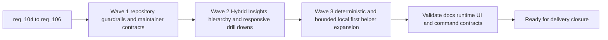

## task_106_orchestration_delivery_for_req_104_to_req_106_repository_guardrails_hybrid_insights_refinement_and_local_first_assist_expansion - Orchestration delivery for req_104 to req_106 across repository guardrails, Hybrid Insights refinement, and local-first assist expansion
> From version: 1.16.0
> Schema version: 1.0
> Status: Ready
> Understanding: 98%
> Confidence: 95%
> Progress: 0%
> Complexity: High
> Theme: Repository governance hardening, Hybrid Insights UX refinement, and deterministic plus Ollama-first delivery expansion
> Reminder: Update status/understanding/confidence/progress and dependencies/references when you edit this doc.

# Context
Derived from:
- `logics/backlog/item_184_harden_workflow_doc_proof_and_placeholder_enforcement.md`
- `logics/backlog/item_185_enforce_internal_asset_exclusion_and_package_validation_coverage.md`
- `logics/backlog/item_186_align_watch_and_release_helper_contracts_with_actual_runtime_behavior.md`
- `logics/backlog/item_187_clarify_or_expand_plugin_refresh_coverage_for_non_logics_runtime_inputs.md`
- `logics/backlog/item_188_reframe_hybrid_insights_overview_and_tool_native_visual_language.md`
- `logics/backlog/item_189_prioritize_operational_signals_and_compact_hybrid_insights_flow_diagnostics.md`
- `logics/backlog/item_190_improve_hybrid_insights_recent_run_drill_down_and_narrow_width_usability.md`
- `logics/backlog/item_191_add_deterministic_delivery_helpers_for_structured_repo_and_workflow_operations.md`
- `logics/backlog/item_192_add_bounded_ollama_first_suggestion_flows_for_high_frequency_delivery_tasks.md`
- `logics/backlog/item_193_expose_and_validate_the_expanded_local_first_delivery_portfolio_across_runtime_plugin_and_insights.md`

This orchestration task coordinates three adjacent streams that should land coherently:
- `req_104` hardens repository-maintenance guardrails so workflow governance, package hygiene, command truthfulness, and runtime-status freshness become more trustworthy;
- `req_105` refines the Hybrid Insights surface so operators see a clearer, more grounded diagnostic screen with better hierarchy, drill-down usability, and narrow-width behavior;
- `req_106` expands deterministic and bounded Ollama-first delivery helpers so repetitive operator work consumes less Codex without weakening safety, discoverability, or observability.

The sequence matters because:
- repository governance and command truthfulness from `req_104` improve the quality bar around the same runtime, packaging, and documentation surfaces that `req_105` and `req_106` depend on;
- Hybrid Insights refinement in `req_105` should reflect trustworthy runtime and observability semantics before the local-first helper portfolio grows further;
- portfolio expansion in `req_106` should land with explicit discoverability and reporting, which the refined Hybrid Insights surface can then present more cleanly.

Constraints:
- keep workflow-doc strictness scoped carefully so draft documents are not blocked by rules intended for ready or done states;
- keep the plugin a thin client over shared runtime contracts, including for Hybrid Insights and newly exposed local-first helper surfaces;
- keep deterministic helpers and model-backed flows visibly distinct in commands and observability output;
- keep recent-run and responsive UX refinement grounded in real operator tasks rather than decorative redesign;
- keep Windows-safe command assumptions explicit anywhere the new local-first portfolio touches release, validation, or packaging workflows.

# Plan
- [ ] 1. Confirm traceability, current repository guardrail behavior, current Hybrid Insights structure, and the existing deterministic plus hybrid local-first portfolio baseline.
- [ ] 2. Wave 1: deliver repository guardrail hardening through items `184`, `185`, `186`, and `187`.
- [ ] 3. Wave 2: refine Hybrid Insights overview, signal hierarchy, recent-run drill-down, and narrow-width behavior through items `188`, `189`, and `190`.
- [ ] 4. Wave 3: expand deterministic helpers, bounded Ollama-first suggestion flows, and operator-visible local-first surfaces through items `191`, `192`, and `193`.
- [ ] 5. Validate the integrated result across workflow governance, packaging, command truthfulness, runtime-status freshness, Hybrid Insights UX, runtime observability, and Windows-safe operator paths.
- [ ] CHECKPOINT: leave each completed wave in a commit-ready state and update the linked Logics docs before moving on.
- [ ] FINAL: Update related Logics docs

# Delivery checkpoints
- Keep Wave 1 reviewable as a governance and maintainer-contract checkpoint before UI or portfolio expansion starts relying on those contracts.
- Keep Wave 2 reviewable as a Hybrid Insights refinement checkpoint over stable runtime and observability semantics.
- Keep Wave 3 reviewable as a local-first portfolio checkpoint with explicit command surfaces and reporting semantics.
- Update the linked requests, backlog items, and this task during the wave that materially changes the behavior, not only at final closure.

# AC Traceability
- req104-AC1/AC2 -> Wave 1 via item `184`. Proof: ready or done workflow docs gain stricter proof and placeholder enforcement with blocking regression coverage.
- req104-AC3 -> Wave 1 via item `185`. Proof: internal-only assets gain an explicit VSIX exclusion policy with package validation coverage.
- req104-AC4/AC6 -> Wave 1 via item `186`. Proof: watch and release-helper contracts become truthful in scripts and docs.
- req104-AC5 -> Wave 1 via item `187`. Proof: non-`logics/` runtime inputs are watched or explicitly documented as manual refresh.
- req104-AC7 -> Wave 1 across items `184` to `187`. Proof: regression coverage is added for the hardened repository contracts.
- req105-AC1/AC2 -> Wave 2 via item `188`. Proof: the Hybrid Insights first viewport and visual language become more tool-native and operator-centered.
- req105-AC3/AC4/AC5/AC7 -> Wave 2 via item `189`. Proof: the screen hierarchy becomes clearer, risk signals gain stronger salience, flow diagnostics become more compact, and estimates stay secondary.
- req105-AC6/AC8/AC9 -> Wave 2 via item `190`. Proof: recent-run drill-down and narrow-width behavior are redesigned and covered by UI-oriented verification.
- req106-AC1/AC2 -> Wave 3 via item `191`. Proof: deterministic no-LLM helpers expand the local-first portfolio for structured repo and workflow tasks.
- req106-AC3/AC4/AC5 -> Wave 3 via item `192`. Proof: bounded Ollama-first suggestion flows land with strict contracts, fallback validation, and retained safety exclusions.
- req106-AC6/AC7/AC8 -> Wave 3 via item `193`. Proof: the expanded portfolio becomes discoverable through runtime and plugin surfaces with trustworthy observability and validation.

# Decision framing
- Product framing: Yes
- Product signals: operator trust, screen usability, discoverability of local-first helpers, reduced token spend on repetitive delivery work
- Product follow-up: Reuse `prod_001` and `prod_002`; add no new product brief unless the plugin navigation model or helper-discoverability model changes materially.
- Architecture framing: Yes
- Architecture signals: workflow governance boundaries, plugin thin-client ownership, deterministic versus model-backed taxonomy, runtime observability semantics
- Architecture follow-up: Reuse `adr_011` and `adr_012`; add no new ADR unless the reporting taxonomy or helper-boundary model becomes a lasting governance change.

# Links
- Product brief(s):
  - `prod_001_hybrid_assist_operator_experience_for_repetitive_logics_delivery_flows`
  - `prod_002_plugin_hybrid_assist_runtime_visibility_and_action_ux`
- Architecture decision(s):
  - `adr_011_keep_hybrid_assist_runtime_contracts_shared_backend_agnostic_and_safely_bounded`
  - `adr_012_keep_the_vs_code_plugin_as_a_thin_client_over_shared_hybrid_runtime_commands`
- Backlog item(s):
  - `item_184_harden_workflow_doc_proof_and_placeholder_enforcement`
  - `item_185_enforce_internal_asset_exclusion_and_package_validation_coverage`
  - `item_186_align_watch_and_release_helper_contracts_with_actual_runtime_behavior`
  - `item_187_clarify_or_expand_plugin_refresh_coverage_for_non_logics_runtime_inputs`
  - `item_188_reframe_hybrid_insights_overview_and_tool_native_visual_language`
  - `item_189_prioritize_operational_signals_and_compact_hybrid_insights_flow_diagnostics`
  - `item_190_improve_hybrid_insights_recent_run_drill_down_and_narrow_width_usability`
  - `item_191_add_deterministic_delivery_helpers_for_structured_repo_and_workflow_operations`
  - `item_192_add_bounded_ollama_first_suggestion_flows_for_high_frequency_delivery_tasks`
  - `item_193_expose_and_validate_the_expanded_local_first_delivery_portfolio_across_runtime_plugin_and_insights`
- Request(s):
  - `req_104_harden_repository_maintenance_guardrails_revealed_by_project_audit`
  - `req_105_refine_hybrid_insights_ux_ui_information_hierarchy`
  - `req_106_expand_deterministic_and_ollama_first_delivery_assist_to_reduce_codex_usage`

# AI Context
- Summary: Coordinate req_104 to req_106 so repository guardrails, Hybrid Insights UX, and the deterministic plus bounded local-first helper portfolio evolve coherently with truthful contracts and trustworthy observability.
- Keywords: orchestration, repository guardrails, hybrid insights, deterministic helpers, ollama, plugin, observability, validation
- Use when: Use when executing or auditing the combined delivery of repository hardening, Hybrid Insights refinement, and local-first helper expansion.
- Skip when: Skip when the work belongs to only one isolated backlog item without cross-cutting coordination between guardrails, UI, and runtime portfolio changes.

# References
- `logics/request/req_104_harden_repository_maintenance_guardrails_revealed_by_project_audit.md`
- `logics/request/req_105_refine_hybrid_insights_ux_ui_information_hierarchy.md`
- `logics/request/req_106_expand_deterministic_and_ollama_first_delivery_assist_to_reduce_codex_usage.md`
- `logics/backlog/item_184_harden_workflow_doc_proof_and_placeholder_enforcement.md`
- `logics/backlog/item_185_enforce_internal_asset_exclusion_and_package_validation_coverage.md`
- `logics/backlog/item_186_align_watch_and_release_helper_contracts_with_actual_runtime_behavior.md`
- `logics/backlog/item_187_clarify_or_expand_plugin_refresh_coverage_for_non_logics_runtime_inputs.md`
- `logics/backlog/item_188_reframe_hybrid_insights_overview_and_tool_native_visual_language.md`
- `logics/backlog/item_189_prioritize_operational_signals_and_compact_hybrid_insights_flow_diagnostics.md`
- `logics/backlog/item_190_improve_hybrid_insights_recent_run_drill_down_and_narrow_width_usability.md`
- `logics/backlog/item_191_add_deterministic_delivery_helpers_for_structured_repo_and_workflow_operations.md`
- `logics/backlog/item_192_add_bounded_ollama_first_suggestion_flows_for_high_frequency_delivery_tasks.md`
- `logics/backlog/item_193_expose_and_validate_the_expanded_local_first_delivery_portfolio_across_runtime_plugin_and_insights.md`
- `src/logicsHybridInsightsHtml.ts`
- `src/logicsViewProvider.ts`
- `logics/skills/logics-flow-manager/scripts/logics_flow.py`
- `logics/skills/logics-flow-manager/scripts/logics_flow_hybrid.py`
- `README.md`

# Validation
- `python3 logics/skills/logics.py flow sync refresh-mermaid-signatures --format json`
- `python3 logics/skills/logics.py audit --refs req_104 --refs req_105 --refs req_106 --refs item_184 --refs item_185 --refs item_186 --refs item_187 --refs item_188 --refs item_189 --refs item_190 --refs item_191 --refs item_192 --refs item_193 --refs task_106`
- `npm run lint:logics`
- Manual: verify repository guardrail failures are explicit for placeholder-proof and packaging-contract drift scenarios.
- Manual: verify Hybrid Insights remains readable on desktop and narrow-width layouts and keeps recent-run detail secondary by default.
- Manual: verify deterministic, Ollama-backed, and fallback execution remain distinguishable in runtime or insights surfaces for the expanded helper portfolio.

# Definition of Done (DoD)
- [ ] Scope implemented and acceptance criteria covered.
- [ ] Validation commands executed and results captured.
- [ ] Linked request/backlog/task docs updated during completed waves and at closure.
- [ ] Each completed wave leaves a commit-ready checkpoint or an explicit exception is documented.
- [ ] Status is `Done` and progress is `100%`.
