## task_107_orchestration_delivery_for_req_107_to_req_117_across_maintenance_hardening_ui_refinement_and_modularization - Orchestration delivery for req_107 to req_117 across maintenance hardening, UI refinement, and modularization
> From version: 1.16.0
> Schema version: 1.0
> Status: Done
> Understanding: 92%
> Confidence: 90%
> Progress: 100%
> Complexity: High
> Theme: Orchestration
> Reminder: Update status/understanding/confidence/progress and dependencies/references when you edit this doc.

# Context
Derived from:
- `logics/backlog/item_194_harden_agent_registry_yaml_parsing_against_malicious_skill_manifests.md`
- `logics/backlog/item_195_align_the_local_ci_check_with_the_full_repository_ci_contract.md`
- `logics/backlog/item_196_replace_coarse_bootstrap_detection_with_canonical_kit_inspection.md`
- `logics/backlog/item_197_make_the_security_audit_workflow_block_on_actionable_vulnerabilities.md`
- `logics/backlog/item_198_normalize_workflow_progress_indicators_and_close_placeholder_debt_in_completed_docs.md`
- `logics/backlog/item_199_restructure_the_tools_menu_information_architecture_without_moving_actions_out_of_the_menu.md`
- `logics/backlog/item_200_show_updated_timestamps_in_activity_cells.md`
- `logics/backlog/item_201_fix_false_positive_mermaid_signature_warnings_after_signature_refresh.md`
- `logics/backlog/item_202_sanitize_webview_error_rendering_instead_of_injecting_raw_error_html.md`
- `logics/backlog/item_203_address_the_remaining_esbuild_and_vite_audit_advisory_in_the_toolchain.md`
- `logics/backlog/item_204_resume_modularization_of_oversized_core_extension_and_workflow_modules.md`

This orchestration task coordinates the full follow-up portfolio opened after the large repository audit and subsequent UI review. The lot spans three families that should not be executed as an unstructured stream of mixed commits:
- maintenance and governance hardening around docs, CI truthfulness, audit enforcement, bootstrap detection, and webview safety;
- UI refinement around the tools menu information architecture and the activity panel metadata surface;
- structural and toolchain work around the remaining Vite and esbuild advisory plus the next modularization pass.

The core delivery rule for this task is strict:
- one subject at a time;
- one commit-ready checkpoint per subject;
- one documented wave boundary after each coherent cluster of subjects;
- no mixed "catch-all" commits that bundle unrelated governance, UI, and modularization changes together.

The intended sequence is:
- Wave 1: repository trust and governance contracts first, because they affect how the rest of the work is validated and reviewed;
- Wave 2: plugin UI refinements, once the repository guardrails and runtime messaging are trustworthy enough to support UI changes cleanly;
- Wave 3: toolchain and structural follow-ups, once the smaller behavior-facing slices are landed and the remaining heavier work can be reviewed with less noise.

Constraints:
- keep request and backlog docs updated during the wave that changes the behavior, not at the end of the whole program;
- do not mix multiple backlog subjects in the same implementation commit;
- if a wave contains several subjects, each subject still needs its own commit-ready state before moving to the next subject;
- leave an explicit validation checkpoint at the end of each wave;
- treat `item_203` and `item_204` as heavier-risk subjects that may require dedicated validation and potentially more than one implementation step, but still keep the final commits scoped to a single subject.

```mermaid
%% logics-kind: task
%% logics-signature: task|orchestration-delivery-for-req-107-to-re|item-019-render-mermaid-diagrams-in-read|1-confirm-all-item-links-wave|python3-logics-skills-logics-py-audit-re
flowchart LR
    Start[item 194 to item 204] --> Wave1[Wave 1 governance and safety subjects]
    Wave1 --> Wave2[Wave 2 menu and activity UI subjects]
    Wave2 --> Wave3[Wave 3 toolchain and modularization subjects]
    Wave3 --> Validate[Validate docs tests packaging and audit state]
    Validate --> Report[Commit-ready orchestration report]
```

# Plan
- [x] 1. Confirm all item links, wave boundaries, and subject-level commit rules before implementation starts.
- [x] 2. Wave 1: deliver governance and safety subjects `194`, `195`, `196`, `197`, `198`, `201`, and `202`, keeping one commit per subject.
- [x] 3. Wave 2: deliver UI subjects `199` and `200`, again keeping one commit per subject and updating the linked docs within the same subject wave.
- [x] 4. Wave 3: deliver toolchain and structural subjects `203` and `204`, with dedicated validation and one commit-ready checkpoint per subject.
- [x] 5. Validate the integrated result across docs, audit behavior, tests, packaging, and extension runtime expectations.
- [x] CHECKPOINT: after each subject, leave the repo commit-ready and update the linked request, backlog, and task docs before touching the next subject.
- [x] FINAL: Update related Logics docs

# Delivery checkpoints
- Never batch unrelated subjects into one implementation commit.
- End every subject with:
  - code and docs aligned;
  - relevant validation run for that subject;
  - a commit-ready diff scoped to that subject only.
- End every wave with:
  - the subject commits already prepared or landed one by one;
  - a short wave checkpoint in this task report;
  - linked requests and backlog items updated before starting the next wave.
- Preferred subject grouping:
  - Wave 1 governance and safety: `194`, `195`, `196`, `197`, `198`, `201`, `202`
  - Wave 2 UI refinement: `199`, `200`
  - Wave 3 toolchain and structure: `203`, `204`
- If a subject needs to be split internally, do it as sub-steps inside the wave, but still collapse the final reviewable commit to one subject.

# AC Traceability
- req107-AC1/AC2/AC3/AC4/AC5 -> Wave 1 via item `194`. Proof: parser hardening, mitigation path, registry behavior, and validation alignment stay grouped as one security subject.
- req108-AC1/AC2/AC3/AC4/AC5 -> Wave 1 via item `195`. Proof: local CI contract alignment remains one maintainer-workflow subject.
- req109-AC1/AC2/AC3/AC4/AC5 -> Wave 1 via item `196`. Proof: bootstrap gating and canonical inspection remain one repository-state subject.
- req110-AC1/AC2/AC3/AC4/AC5 -> Wave 1 via item `197`. Proof: audit-policy enforcement remains one security-governance subject.
- req111-AC1/AC2/AC3/AC4/AC5 -> Wave 1 via item `198`. Proof: progress normalization and placeholder cleanup remain one workflow-governance subject.
- req114-AC1/AC2/AC3/AC4/AC5 -> Wave 1 via item `201`. Proof: Mermaid signature false-positive repair remains one governance-tooling subject.
- req115-AC1/AC2/AC3/AC4/AC5 -> Wave 1 via item `202`. Proof: webview error rendering hardening remains one safety subject.
- req112-AC1/AC2/AC3/AC4/AC5/AC6/AC7/AC8 -> Wave 2 via item `199`. Proof: tools-menu IA refinement lands as one UI subject.
- req113-AC1/AC2/AC3/AC4/AC5 -> Wave 2 via item `200`. Proof: activity-cell `Updated` visibility lands as one UI subject.
- req116-AC1/AC2/AC3/AC4/AC5 -> Wave 3 via item `203`. Proof: the remaining Vite and esbuild advisory handling stays one toolchain subject.
- req117-AC1/AC2/AC3/AC4/AC5 -> Wave 3 via item `204`. Proof: modularization planning and bounded extraction remain one architecture subject.

# Decision framing
- Product framing: Yes
- Product signals: operator trust, discoverability, menu usability, activity-panel clarity
- Product follow-up: Linked `prod_003_plugin_tools_menu_and_activity_scanability` to capture the menu and activity-panel scanability direction used by `item_199` and `item_200`.
- Architecture framing: Yes
- Architecture signals: repository governance contracts, security rendering boundaries, toolchain upgrade risk, modularization seams, commit discipline across subjects
- Architecture follow-up: Linked `adr_014_keep_plugin_safety_and_repository_governance_explicit_bounded_and_modular` for the governance and safety rules across this wave, and reused `adr_002_keep_the_plugin_webview_as_a_modular_vanilla_frontend` for the webview modularization seam.

# Links
- Product brief(s): `prod_003_plugin_tools_menu_and_activity_scanability`
- Architecture decision(s): `adr_002_keep_the_plugin_webview_as_a_modular_vanilla_frontend`, `adr_014_keep_plugin_safety_and_repository_governance_explicit_bounded_and_modular`
- Backlog item(s):
  - `item_194_harden_agent_registry_yaml_parsing_against_malicious_skill_manifests`
  - `item_195_align_the_local_ci_check_with_the_full_repository_ci_contract`
  - `item_196_replace_coarse_bootstrap_detection_with_canonical_kit_inspection`
  - `item_197_make_the_security_audit_workflow_block_on_actionable_vulnerabilities`
  - `item_198_normalize_workflow_progress_indicators_and_close_placeholder_debt_in_completed_docs`
  - `item_199_restructure_the_tools_menu_information_architecture_without_moving_actions_out_of_the_menu`
  - `item_200_show_updated_timestamps_in_activity_cells`
  - `item_201_fix_false_positive_mermaid_signature_warnings_after_signature_refresh`
  - `item_202_sanitize_webview_error_rendering_instead_of_injecting_raw_error_html`
  - `item_203_address_the_remaining_esbuild_and_vite_audit_advisory_in_the_toolchain`
  - `item_204_resume_modularization_of_oversized_core_extension_and_workflow_modules`
- Request(s):
  - `req_107_harden_agent_registry_yaml_parsing_against_malicious_skill_manifests`
  - `req_108_align_the_local_ci_check_with_the_full_repository_ci_contract`
  - `req_109_replace_coarse_bootstrap_detection_with_canonical_kit_inspection`
  - `req_110_make_the_security_audit_workflow_block_on_actionable_vulnerabilities`
  - `req_111_normalize_workflow_progress_indicators_and_close_placeholder_debt_in_completed_docs`
  - `req_112_restructure_the_tools_menu_information_architecture_without_moving_actions_out_of_the_menu`
  - `req_113_show_updated_timestamps_in_activity_cells`
  - `req_114_fix_false_positive_mermaid_signature_warnings_after_signature_refresh`
  - `req_115_sanitize_webview_error_rendering_instead_of_injecting_raw_error_html`
  - `req_116_address_the_remaining_esbuild_and_vite_audit_advisory_in_the_toolchain`
  - `req_117_resume_modularization_of_oversized_core_extension_and_workflow_modules`

# AI Context
- Summary: Coordinate the req_107 to req_117 delivery portfolio across governance hardening, UI refinement, toolchain remediation, and modularization with one commit per subject and explicit wave checkpoints.
- Keywords: orchestration, waves, one commit per subject, governance, ui, toolchain, modularization, checkpoint
- Use when: Use when executing or reviewing the multi-subject delivery plan for the backlog set created from req_107 to req_117.
- Skip when: Skip when the work belongs to a single isolated backlog item with no orchestration dependency.

# References
- `logics/backlog/item_194_harden_agent_registry_yaml_parsing_against_malicious_skill_manifests.md`
- `logics/backlog/item_195_align_the_local_ci_check_with_the_full_repository_ci_contract.md`
- `logics/backlog/item_196_replace_coarse_bootstrap_detection_with_canonical_kit_inspection.md`
- `logics/backlog/item_197_make_the_security_audit_workflow_block_on_actionable_vulnerabilities.md`
- `logics/backlog/item_198_normalize_workflow_progress_indicators_and_close_placeholder_debt_in_completed_docs.md`
- `logics/backlog/item_199_restructure_the_tools_menu_information_architecture_without_moving_actions_out_of_the_menu.md`
- `logics/backlog/item_200_show_updated_timestamps_in_activity_cells.md`
- `logics/backlog/item_201_fix_false_positive_mermaid_signature_warnings_after_signature_refresh.md`
- `logics/backlog/item_202_sanitize_webview_error_rendering_instead_of_injecting_raw_error_html.md`
- `logics/backlog/item_203_address_the_remaining_esbuild_and_vite_audit_advisory_in_the_toolchain.md`
- `logics/backlog/item_204_resume_modularization_of_oversized_core_extension_and_workflow_modules.md`
- `logics/skills/logics-ui-steering/SKILL.md`

# Validation
- `python3 logics/skills/logics.py audit --refs req_107 --refs req_108 --refs req_109 --refs req_110 --refs req_111 --refs req_112 --refs req_113 --refs req_114 --refs req_115 --refs req_116 --refs req_117 --refs item_194 --refs item_195 --refs item_196 --refs item_197 --refs item_198 --refs item_199 --refs item_200 --refs item_201 --refs item_202 --refs item_203 --refs item_204 --refs task_107`
- `python3 logics/skills/logics-doc-linter/scripts/logics_lint.py --require-status`
- `python3 -m unittest discover -s logics/skills/tests -p 'test_*.py' -v`
- `npm run lint`
- `npm run test`
- `npm run test:smoke`
- `npm run package:ci`
- `npm audit --audit-level=moderate`
- Manual: confirm each subject ends in a commit-ready diff scoped to one backlog item only.
- Manual: confirm each wave closes with updated request, backlog, and task docs before the next wave starts.

# Definition of Done (DoD)
- [x] Scope implemented and acceptance criteria covered.
- [x] Validation commands executed and results captured.
- [x] Linked request/backlog/task docs updated during completed waves and at closure.
- [x] Each completed wave left a commit-ready checkpoint or an explicit exception is documented.
- [x] Status is `Done` and progress is `100%`.

# Report
- Wave 1:
  - Hardened repo-local agent manifest parsing in [src/agentRegistry.ts](/Users/alexandreagostini/Documents/cdx-logics-vscode/src/agentRegistry.ts) with deterministic size and nesting guards before YAML parsing, plus regression coverage in [tests/agentRegistry.test.ts](/Users/alexandreagostini/Documents/cdx-logics-vscode/tests/agentRegistry.test.ts).
  - Replaced coarse bootstrap gating with canonical bootstrap inspection in [src/logicsProviderUtils.ts](/Users/alexandreagostini/Documents/cdx-logics-vscode/src/logicsProviderUtils.ts) and [src/logicsViewProvider.ts](/Users/alexandreagostini/Documents/cdx-logics-vscode/src/logicsViewProvider.ts), including non-canonical repair messaging and bootstrap-title propagation into the webview.
  - Removed raw HTML injection from the error path in [media/main.js](/Users/alexandreagostini/Documents/cdx-logics-vscode/media/main.js) and added harness coverage in [tests/webview.harness-core.test.ts](/Users/alexandreagostini/Documents/cdx-logics-vscode/tests/webview.harness-core.test.ts).
  - Introduced a real local CI contract in [scripts/ci-check.mjs](/Users/alexandreagostini/Documents/cdx-logics-vscode/scripts/ci-check.mjs), wired `npm run ci:check`, and documented the distinction between `ci:fast`, `ci:check`, and `audit:ci` in [README.md](/Users/alexandreagostini/Documents/cdx-logics-vscode/README.md).
  - Replaced the report-only security workflow with the explicit audit-policy gate in [scripts/check-npm-audit.mjs](/Users/alexandreagostini/Documents/cdx-logics-vscode/scripts/check-npm-audit.mjs) and [.github/workflows/audit.yml](/Users/alexandreagostini/Documents/cdx-logics-vscode/.github/workflows/audit.yml). The remaining Vitest/Vite chain is now a documented temporary exception tracked by item `203`.
  - Normalized the targeted progress/placeholder debt called out by the audit in [item_019_render_mermaid_diagrams_in_read_markdown_view.md](/Users/alexandreagostini/Documents/cdx-logics-vscode/logics/backlog/item_019_render_mermaid_diagrams_in_read_markdown_view.md), [item_028_replace_hide_used_requests_with_hide_processed_requests_semantics.md](/Users/alexandreagostini/Documents/cdx-logics-vscode/logics/backlog/item_028_replace_hide_used_requests_with_hide_processed_requests_semantics.md), [item_029_refine_plugin_detail_panel_identity_and_action_hierarchy.md](/Users/alexandreagostini/Documents/cdx-logics-vscode/logics/backlog/item_029_refine_plugin_detail_panel_identity_and_action_hierarchy.md), and [task_003_build_flow_board_ui_and_details_panel.md](/Users/alexandreagostini/Documents/cdx-logics-vscode/logics/tasks/task_003_build_flow_board_ui_and_details_panel.md), and aligned the global reviewer progress bucketing in [logics_global_review.py](/Users/alexandreagostini/Documents/cdx-logics-vscode/logics/skills/logics-global-reviewer/scripts/logics_global_review.py).
  - Added refresh-vs-lint Mermaid consistency coverage in [test_logics_lint.py](/Users/alexandreagostini/Documents/cdx-logics-vscode/logics/skills/tests/test_logics_lint.py).
- Wave 2:
  - Rebuilt the tools menu information architecture in [src/logicsWebviewHtml.ts](/Users/alexandreagostini/Documents/cdx-logics-vscode/src/logicsWebviewHtml.ts), [media/css/toolbar.css](/Users/alexandreagostini/Documents/cdx-logics-vscode/media/css/toolbar.css), and [media/webviewChrome.js](/Users/alexandreagostini/Documents/cdx-logics-vscode/media/webviewChrome.js) with grouped sections, a state-aware `Recommended` block, shorter labels, and better disabled-state messaging.
  - Added `Updated` metadata to activity entries in [media/webviewChrome.js](/Users/alexandreagostini/Documents/cdx-logics-vscode/media/webviewChrome.js) and [media/webviewSelectors.js](/Users/alexandreagostini/Documents/cdx-logics-vscode/media/webviewSelectors.js), with graceful fallback for invalid timestamps and regression coverage in [tests/webview.harness-core.test.ts](/Users/alexandreagostini/Documents/cdx-logics-vscode/tests/webview.harness-core.test.ts).
  - Added the product framing companion [prod_003_plugin_tools_menu_and_activity_scanability.md](/Users/alexandreagostini/Documents/cdx-logics-vscode/logics/product/prod_003_plugin_tools_menu_and_activity_scanability.md) and linked it to `item_199` and `item_200`, then aligned the webview harness accessibility contract in [tests/webviewHarnessTestUtils.ts](/Users/alexandreagostini/Documents/cdx-logics-vscode/tests/webviewHarnessTestUtils.ts) and [tests/webview.harness-details-and-filters.test.ts](/Users/alexandreagostini/Documents/cdx-logics-vscode/tests/webview.harness-details-and-filters.test.ts) with the new menu priority order.
- Wave 3:
  - Upgraded the direct `yaml` dependency in [package.json](/Users/alexandreagostini/Documents/cdx-logics-vscode/package.json) and [package-lock.json](/Users/alexandreagostini/Documents/cdx-logics-vscode/package-lock.json) so the direct YAML advisory is removed from `npm audit`.
  - Chose and documented the temporary exception path for the remaining Vitest/Vite dev-server advisory chain through `npm run audit:ci`, which now blocks new actionable issues while keeping the tracked item `203` explicit.
  - Resumed bounded modularization by extracting the tools-menu layout seam from [media/webviewChrome.js](/Users/alexandreagostini/Documents/cdx-logics-vscode/media/webviewChrome.js) into [media/toolsPanelLayout.js](/Users/alexandreagostini/Documents/cdx-logics-vscode/media/toolsPanelLayout.js), and wiring the new module through [src/logicsWebviewHtml.ts](/Users/alexandreagostini/Documents/cdx-logics-vscode/src/logicsWebviewHtml.ts) plus the harness loader in [tests/webviewHarnessTestUtils.ts](/Users/alexandreagostini/Documents/cdx-logics-vscode/tests/webviewHarnessTestUtils.ts).
  - Added the architecture companion [adr_014_keep_plugin_safety_and_repository_governance_explicit_bounded_and_modular.md](/Users/alexandreagostini/Documents/cdx-logics-vscode/logics/architecture/adr_014_keep_plugin_safety_and_repository_governance_explicit_bounded_and_modular.md), linked it across the governance and tooling backlog items, and cleaned the last legacy lint warning by restoring a valid overview block in [task_003_build_flow_board_ui_and_details_panel.md](/Users/alexandreagostini/Documents/cdx-logics-vscode/logics/tasks/task_003_build_flow_board_ui_and_details_panel.md).
- Validation:
  - `python3 logics/skills/logics.py audit --refs req_107 --refs req_108 --refs req_109 --refs req_110 --refs req_111 --refs req_112 --refs req_113 --refs req_114 --refs req_115 --refs req_116 --refs req_117 --refs item_194 --refs item_195 --refs item_196 --refs item_197 --refs item_198 --refs item_199 --refs item_200 --refs item_201 --refs item_202 --refs item_203 --refs item_204 --refs task_107 --refs adr_014 --refs prod_003`
  - `python3 logics/skills/logics-doc-linter/scripts/logics_lint.py --require-status`
  - `npm run lint`
  - `npm run test -- tests/agentRegistry.test.ts tests/logicsViewProvider.test.ts tests/webview.harness-core.test.ts`
  - `npm run test -- tests/webview.harness-core.test.ts tests/webview.layout-collapse.test.ts`
  - `npm run test -- tests/webview.harness-details-and-filters.test.ts tests/webview.harness-core.test.ts`
  - `python3 -m unittest logics.skills.tests.test_logics_lint logics.skills.tests.test_global_reviewer -v`
  - `npm run audit:ci`
  - `npm run ci:check`
