## task_108_orchestration_delivery_for_req_118_branch_aware_bootstrap_recovery_and_setup_repair - Orchestration delivery for req_118 branch-aware bootstrap recovery and setup repair
> From version: 1.17.0
> Schema version: 1.0
> Status: Ready
> Understanding: 92%
> Confidence: 90%
> Progress: 0%
> Complexity: High
> Theme: Branch-aware bootstrap recovery
> Reminder: Update status/understanding/confidence/progress and dependencies/references when you edit this doc.

# Context
- Derived from:
  - `logics/backlog/item_205_detect_and_refresh_logics_bootstrap_state_after_git_branch_switches.md`
  - `logics/backlog/item_206_make_branch_local_bootstrap_recovery_and_setup_repair_explicit_in_the_plugin_ux.md`
  - `logics/backlog/item_207_add_regression_coverage_for_branch_switch_bootstrap_degradation_and_repair.md`

This orchestration task coordinates one coherent delivery track across detection, UX, and regression coverage for the branch-switch bootstrap problem:
- Wave 1 must make the extension re-evaluate bootstrap state when git branch content changes so stale `ready` assumptions do not persist.
- Wave 2 must then make degraded states readable and actionable from the operator point of view, including explicit bootstrap or repair flows for the active branch when supported.
- Wave 3 must lock the new behavior down with targeted regression coverage so prompt suppression, degraded-state routing, and branch-local repair affordances do not regress.

The sequence matters because:
- UX changes on top of stale branch state will still feel broken even if the copy is improved;
- regression coverage should assert the intended branch-aware behavior after the detection and remediation semantics are explicit;
- the setup repair path must remain clearly separated from malformed or non-canonical kit states throughout the rollout.

Constraints:
- keep the existing repository-state model in `src/logicsEnvironment.ts` as the source of truth rather than creating a second branch-only state model;
- keep repair and bootstrap flows operator-confirmed, not silently auto-writing on branch changes;
- preserve the canonical-kit inspection path and do not broaden automatic repair to unsupported `logics/skills` layouts;
- prefer reviewable delivery waves that leave the provider, environment model, and tests in a coherent state after each checkpoint.

```mermaid
%% logics-kind: task
%% logics-signature: task|orchestration-delivery-for-req-118-branc|item-205-detect-and-refresh-logics-boots|1-confirm-scope-dependencies-and-linked|python3-logics-skills-logics-py-flow-syn
flowchart LR
    Backlog[item_205 item_206 item_207] --> Step1[1. Confirm scope dependencies and linked]
    Step1 --> Wave1[2. Wave 1 branch-aware refresh and state invalidation]
    Wave1 --> Wave2[3. Wave 2 degraded-state UX and current-branch repair]
    Wave2 --> Wave3[4. Wave 3 targeted regression coverage and doc sync]
    Wave3 --> Validation[python3 logics skills logics flow manage]
    Validation --> Report[Done report]
```

# Plan
- [ ] 1. Confirm scope, dependencies, and linked acceptance criteria across items `205`, `206`, and `207`.
- [ ] 2. Wave 1: implement branch-aware refresh or equivalent git-state invalidation so repository bootstrap state is recomputed after checkout-like changes.
- [ ] 3. Wave 2: implement degraded-state UX and supported current-branch bootstrap or repair guidance for `missing-logics`, `missing-kit`, and `partial-bootstrap`.
- [ ] 4. Wave 3: add targeted regression coverage for state transitions, prompt reset semantics, and supported remediation routing.
- [ ] CHECKPOINT: leave the current wave commit-ready and update the linked Logics docs before continuing.
- [ ] FINAL: Update related Logics docs

# Delivery checkpoints
- Keep Wave 1 reviewable as a repository-state and invalidation checkpoint before changing operator-facing recovery copy.
- Keep Wave 2 reviewable as a plugin UX and setup-repair checkpoint over already-correct branch-state detection.
- Keep Wave 3 reviewable as a regression and documentation checkpoint that proves the combined behavior.
- Update the linked request, backlog items, and this task during the wave that materially changes the behavior, not only at final closure.

# AC Traceability
- req118-AC1 -> Wave 1. Proof: item `205` adds branch-aware refresh or equivalent git-state-triggered state recomputation.
- req118-AC2/AC3 -> Wave 2. Proof: item `206` adds explicit degraded-state guidance and supported current-branch repair or bootstrap actions.
- req118-AC4 -> Wave 1 and Wave 2. Proof: items `205` and `206` together ensure prompt suppression and remediation remain branch-aware instead of root-sticky.
- req118-AC5/AC6 -> Wave 2. Proof: item `206` keeps malformed or non-canonical setup distinct from supported current-branch repair.
- req118-AC7 -> Wave 3. Proof: item `207` adds focused regression coverage for branch-switch degradation and repair flows.

# Decision framing
- Product framing: Not needed
- Product signals: (none detected)
- Product follow-up: No product brief follow-up is expected based on current signals.
- Architecture framing: Not needed
- Architecture signals: the existing repository-state model and canonical bootstrap path should be reused rather than expanded into a parallel state system
- Architecture follow-up: No separate ADR is required unless implementation reveals the need for a new git-state watcher contract or a broader bootstrap-state model rewrite.

# Links
- Product brief(s): (none yet)
- Architecture decision(s): (none yet)
- Backlog item(s):
  - `item_205_detect_and_refresh_logics_bootstrap_state_after_git_branch_switches`
  - `item_206_make_branch_local_bootstrap_recovery_and_setup_repair_explicit_in_the_plugin_ux`
  - `item_207_add_regression_coverage_for_branch_switch_bootstrap_degradation_and_repair`
- Request(s): `req_118_handle_branch_switches_to_branches_without_logics_bootstrap_and_offer_setup_repair`

# AI Context
- Summary: Coordinate branch-aware bootstrap-state refresh, current-branch recovery UX, and regression coverage for req_118 without widening the bootstrap model beyond the existing supported contract.
- Keywords: branch switch, bootstrap, repair, provider refresh, git state, degraded UX, prompt reset, regression coverage
- Use when: Use when executing the combined delivery of req_118 across provider invalidation, current-branch repair guidance, and targeted tests.
- Skip when: Skip when the work belongs to an unrelated bootstrap feature or a standalone item with no cross-cutting coordination.

# Validation
- `python3 logics/skills/logics.py flow sync refresh-mermaid-signatures --format json`
- `python3 logics/skills/logics-doc-linter/scripts/logics_lint.py --require-status`
- `python3 logics/skills/logics-flow-manager/scripts/workflow_audit.py --group-by-doc`
- `npx vitest run tests/logicsViewProvider.test.ts tests/logicsEnvironment.test.ts tests/logicsViewDocumentController.test.ts`
- `npm run lint:ts`
- Manual: switch from a branch with `logics/` present to a branch without `logics/` and confirm the plugin refreshes into a branch-local bootstrap or repair state instead of leaving stale ready UI.
- Manual: switch from a healthy branch to a branch with partial bootstrap and confirm the plugin offers repair-oriented guidance rather than malformed-setup messaging.

# Definition of Done (DoD)
- [ ] Scope implemented and acceptance criteria covered.
- [ ] Validation commands executed and results captured.
- [ ] Linked request/backlog/task docs updated during completed waves and at closure.
- [ ] Each completed wave left a commit-ready checkpoint or an explicit exception is documented.
- [ ] Status is `Done` and progress is `100%`.

# Report
