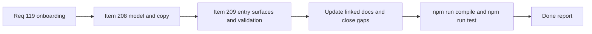

## task_109_orchestration_delivery_for_req_119_three_step_onboarding - Orchestration delivery for req 119 three step onboarding
> From version: 1.18.1
> Schema version: 1.0
> Status: Done
> Understanding: 99%
> Confidence: 99%
> Progress: 100%
> Complexity: Medium
> Theme: Workflow
> Reminder: Update status/understanding/confidence/progress and dependencies/references when you edit this doc.

# Context
This is an orchestration task, not a single-slice implementation task.
Its role is to deliver request `req_119_three_step_onboarding_for_need_framing_and_execution` coherently across the two split backlog items:
- `item_208_define_the_three_step_onboarding_model_and_operator_copy`
- `item_209_add_the_three_step_onboarding_model_to_guided_request_entry_surfaces_and_validate_workflow_alignment`

The task must stay aligned with:
- product direction in `prod_004_logics_auto_orchestration_vision`
- the canonical Logics flow and repo conventions in `logics/instructions.md`

Constraints:
- keep the visible model simple: Need, Framing, Execution
- ship it as a one-shot onboarding webview, not as a permanent operational board surface
- do not expand the slice into full auto orchestration
- do not break the canonical internal request, backlog, task structure while simplifying the onboarding abstraction

# Plan
- [x] 1. Lock the split execution order and confirm the boundaries between `item_208` and `item_209`.
- [x] 2. Deliver `item_208` first so the visible Need, Framing, and Execution model, onboarding narrative, and highlighted actions are settled before UI integration.
- [x] 3. Deliver `item_209` on top of that model as a one-shot onboarding webview with first-run or post-update visibility, manual reopen affordance, and workflow-alignment validation.
- [x] CHECKPOINT: leave the current wave commit-ready and update the linked Logics docs before continuing.
- [x] FINAL: Update related Logics docs

# Delivery checkpoints
- Each completed wave should leave the repository in a coherent, commit-ready state.
- Update the linked Logics docs during the wave that changes the behavior, not only at final closure.
- Prefer a reviewed commit checkpoint at the end of each meaningful wave instead of accumulating several undocumented partial states.

# AC Traceability
- AC1 -> Step 2 and Step 3. Proof: the visible Need, Framing, and Execution model is defined in `item_208` and rendered in the onboarding webview through `item_209`.
- AC2 -> Step 2 and Step 3. Proof: operator-facing copy is defined first, then shown in-context without protocol-heavy wording.
- AC3 -> Step 2 and Step 3. Proof: the main actions are defined in `item_208` and surfaced in the onboarding webview through `item_209`.
- AC4 -> Step 2 and Step 3. Proof: the model-to-workflow mapping is defined in `item_208` and preserved during onboarding-webview integration in `item_209`.
- AC5 -> Step 3. Proof: the onboarding webview appears through a bounded first-run or post-update lifecycle rather than as a permanent everyday surface.
- AC6 -> Step 1 through Step 3. Proof: the orchestration explicitly keeps the slice bounded to onboarding and workflow comprehension.

# Decision framing
- Product framing: Required
- Product signals: conversion journey
- Product follow-up: linked product brief already exists and should stay aligned during delivery.
- Architecture framing: Not needed
- Architecture signals: (none detected)
- Architecture follow-up: No architecture decision follow-up is expected based on current signals.

# Links
- Product brief(s): `prod_004_logics_auto_orchestration_vision`
- Architecture decision(s): (none yet)
- Backlog items: `item_208_define_the_three_step_onboarding_model_and_operator_copy`, `item_209_add_the_three_step_onboarding_model_to_guided_request_entry_surfaces_and_validate_workflow_alignment`
- Request(s): `req_119_three_step_onboarding_for_need_framing_and_execution`

# AI Context
- Summary: Orchestrate req 119 across the split onboarding backlog items so the onboarding narrative and actions land first, then the dedicated webview and its lifecycle follow coherently.
- Keywords: onboarding, orchestration, workflow, need, framing, execution, webview, first run, update trigger
- Use when: Use when delivering req 119 across `item_208` and `item_209` in a controlled order.
- Skip when: Skip when the work is unrelated to the three-step onboarding slice or expands into auto orchestration.

# Validation
- `npm run compile`
- `npm run test`
- `python3 logics/skills/logics-doc-linter/scripts/logics_lint.py --require-status`
- `python3 logics/skills/logics.py audit --refs req_119_three_step_onboarding_for_need_framing_and_execution`
- Finish workflow executed on 2026-04-04.
- Linked backlog/request close verification passed.

# Definition of Done (DoD)
- [x] Scope implemented and acceptance criteria covered.
- [x] Validation commands executed and results captured.
- [x] Linked request/backlog/task docs updated during completed waves and at closure.
- [x] Each completed wave left a commit-ready checkpoint or an explicit exception is documented.
- [x] Status is `Done` and progress is `100%`.

# Report

Wave 1 (item_208 — model and copy): Created `src/logicsOnboardingModel.ts` with `ONBOARDING_STAGES` constant defining Need, Framing, and Execution stage labels, taglines, descriptions, workflow mappings, and highlighted actions. Committed at `a73f67e`.

Wave 2 (item_209 — onboarding webview and lifecycle): Created `src/logicsOnboardingHtml.ts` with `buildOnboardingHtml()`. Updated `src/logicsViewProvider.ts` to add `maybeShowOnboarding()` (first-run/post-update lifecycle via `globalState` version comparison), `openOnboardingPanel()`, `openOnboardingFromCommand()`, and handling for `open-onboarding` and `tool-action` messages. Updated `src/logicsViewMessages.ts` to add `open-onboarding` and `tool-action` message types. Updated `src/logicsWebviewHtml.ts` to add the Getting Started button. Updated `media/toolsPanelLayout.js` to include `open-onboarding` in the workflow section. Registered `logics.openOnboarding` command in `src/extension.ts`. All 182 tests passing. Committed at `ee3e70c`.

Wave 3 (CHECKPOINT): Linked Logics docs (task_109, item_208, item_209, req_119) updated to Done/100%.
- Finished on 2026-04-04.
- Linked backlog item(s): `item_208_define_the_three_step_onboarding_model_and_operator_copy`, `item_209_add_the_three_step_onboarding_model_to_guided_request_entry_surfaces_and_validate_workflow_alignment`
- Related request(s): `req_119_three_step_onboarding_for_need_framing_and_execution`
