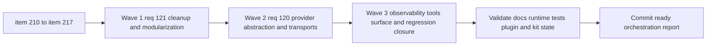

## task_110_orchestration_delivery_for_req_120_and_req_121_multi_provider_hybrid_dispatch_and_audit_cleanup - Orchestration delivery for req_120 and req_121 across audit cleanup and multi-provider hybrid dispatch
> From version: 1.18.1
> Schema version: 1.0
> Status: Done
> Understanding: 100%
> Confidence: 99%
> Progress: 100%
> Complexity: High
> Theme: Orchestration
> Reminder: Update status/understanding/confidence/progress and dependencies/references when you edit this doc.

# Context
Derived from:
- `logics/backlog/item_210_quick_wins_remove_dead_code_stale_artifacts_and_update_doc_references.md`
- `logics/backlog/item_211_kit_harmonization_launcher_convention_wildcard_import_and_runtime_directory_relocation.md`
- `logics/backlog/item_212_plugin_and_kit_structural_refactors_extract_duplications_add_type_safety_decompose_modules_and_add_html_test_coverage.md`
- `logics/backlog/item_213_refactor_hybrid_backend_selection_around_a_provider_abstraction.md`
- `logics/backlog/item_214_add_openai_and_gemini_provider_transports_with_config_and_credential_handling.md`
- `logics/backlog/item_215_add_provider_readiness_gating_and_skip_semantics_for_unconfigured_or_unhealthy_backends.md`
- `logics/backlog/item_216_update_observability_hybrid_insights_and_plugin_tools_surface_for_multi_provider_dispatch.md`
- `logics/backlog/item_217_add_regression_coverage_for_multi_provider_hybrid_dispatch_and_bounded_fallback.md`

This orchestration task coordinates two tightly related programs:
- `req_121`, which cleans up structural debt in the plugin and Logics kit, including the `logics_flow_hybrid.py` split that should land before provider expansion begins;
- `req_120`, which adds multi-provider hybrid dispatch (`OpenAI`, `Gemini`, `Ollama`, `Codex`, `deterministic`) with readiness gating, provider-aware observability, and compact plugin runtime surfaces.

The delivery rule for this task is strict:
- one backlog item at a time;
- one commit-ready checkpoint per item;
- update linked request, backlog, and task docs during the wave that changes the behavior, not at the end;
- leave an explicit wave checkpoint after each coherent cluster;
- when an item touches the Logics kit submodule, keep the subject coherent:
  - one scoped submodule commit if needed;
  - one parent pointer update commit if needed;
  - still treat the whole sequence as one item-level delivery subject.

The intended sequence is:
- Wave 1: `req_121` foundations first, because `item_212` and especially AC13 (hybrid module split) reduce the risk of the provider work that follows.
- Wave 2: `req_120` runtime and transport expansion, once the hybrid module seams and kit conventions are stable enough.
- Wave 3: observability, `Tools` surface integration, and regression closure, once the provider dispatch core is already working.
- Immediate follow-up after this task closes: resume `task_109_orchestration_delivery_for_req_119_three_step_onboarding` directly, rather than leaving onboarding work drifting behind the runtime and cleanup waves.

Constraints:
- do not mix `req_121` cleanup and `req_120` provider expansion in the same implementation commit;
- do not start `item_213` before the `item_212` modularization checkpoint is landed and documented;
- any provider work must preserve the current bounded contract model, doc updates, and rollback clarity;
- do not rely on the evolving hybrid runtime itself for critical delivery meta-actions during this task:
  - commit messages, commit plans, handoff summaries, and similar delivery-control outputs should be written or reviewed explicitly by the operator or main coding agent while the hybrid stack is under active modification;
  - avoid letting the in-flight hybrid provider changes “take the wheel” for commit wording or orchestration summaries until the dedicated regression item closes;
- when `task_110` reaches closure, hand off immediately into `task_109` with updated docs and a clean commit boundary so the onboarding slice can start from the stabilized runtime and tools-menu baseline;
- every wave must end with docs updated and a clear validation checkpoint.

# Plan
- [x] 1. Confirm item ordering, cross-request dependencies, and the rule that `item_212` lands before `item_213`.
- [x] 2. Wave 1: deliver `item_210`, `item_211`, and `item_212`, ending with the hybrid-module split and related cleanup documented and commit-ready.
- [x] 3. Wave 2: deliver `item_213`, `item_214`, and `item_215`, keeping provider abstraction, provider transports, and readiness gating as separate reviewable subjects.
- [x] 4. Wave 3: deliver `item_216` and `item_217`, covering provider-aware observability, `Hybrid Insights`, compact `Tools` integration, and regression closure.
- [x] 5. Validate the integrated result across docs, plugin runtime behavior, hybrid provider routing, readiness gating, observability, and test surfaces.
- [x] 6. Prepare the direct post-task handoff into `task_109`, including updated references, current runtime constraints, and the expectation that onboarding work starts immediately after `task_110`.
- [x] 7. At the very end, rerun the full relevant validation suite, update and synchronize the linked Logics docs, update `README.md`, and only then create the final closing commit for this task.
- [x] CHECKPOINT: after each item, update linked docs and leave the repo in a commit-ready state scoped to that item only.
- [x] FINAL: Update related Logics docs

# Delivery checkpoints
- Never batch two backlog items into one implementation commit.
- End every item with:
  - code and docs aligned;
  - relevant validation executed for that item;
  - a commit-ready diff scoped only to that item.
- End every wave with:
  - request, backlog, and task docs updated in the same wave;
  - a short wave checkpoint added to this task;
  - no partially hidden “I will document later” state.
- End the whole task with:
  - `task_109` explicitly called out as the next delivery target;
  - any runtime or tools-menu constraints relevant to onboarding copied into the docs or report so the next task starts with current context rather than rediscovering it;
  - a final validation rerun after the last implementation changes;
  - request, backlog, and task docs synchronized with the actual landed state;
  - `README.md` updated if commands, provider behavior, runtime setup, or operator-facing workflow changed;
  - one final closing commit only after tests and documentation are current.
- Preferred wave grouping:
  - Wave 1 cleanup and prerequisites: `210`, `211`, `212`
  - Wave 2 provider runtime expansion: `213`, `214`, `215`
  - Wave 3 observability and regression closure: `216`, `217`
- If an item spans parent repo plus Logics kit submodule:
  - keep the submodule work and the pointer update tightly scoped to that item;
  - do not smuggle unrelated parent-repo cleanup into the pointer-update commit.
- Every item or wave should leave at least one intentional commit checkpoint.
- Commit discipline is mandatory:
  - one item = one review subject;
  - one wave = several item-level commits, not one umbrella commit;
  - if a wave needs an explicit checkpoint commit, it must still stay within the currently active item subject.
- Hybrid-runtime guardrail:
  - while `item_213` to `item_217` are in progress, treat hybrid-generated commit messages, commit-all suggestions, and orchestration summaries as non-authoritative;
  - prefer manual commit messages and explicit human-reviewed delivery summaries until the multi-provider runtime and its regression coverage are stable again.

# AC Traceability
- req121-AC3/AC7/AC9/AC10/AC11/AC14/AC15 -> Wave 1 via `item_210`. Proof: quick wins, stale artifacts, entrypoint references, and visible doc cleanup remain one low-risk cleanup subject.
- req121-AC8/AC12/AC16 -> Wave 1 via `item_211`. Proof: launcher harmonization, wildcard-import cleanup, and runtime-directory relocation stay grouped as one kit-focused harmonization subject.
- req121-AC1/AC2/AC4/AC5/AC6/AC13/AC17 -> Wave 1 via `item_212`. Proof: plugin and kit structural refactors, HTML tests, and the hybrid split remain one higher-risk prerequisite subject.
- req120-AC2/AC3/AC6 -> Wave 2 via `item_213`. Proof: provider abstraction and explicit backend-policy routing remain one runtime-core subject.
- req120-AC1/AC4/AC4a/AC5 -> Wave 2 via `item_214`. Proof: OpenAI and Gemini transports, env or `.env` secret loading, and non-secret provider config handling remain one transport-and-config subject.
- req120-AC4b -> Wave 2 via `item_215`. Proof: readiness gating and skip semantics remain one runtime-health and operator-latency subject.
- req120-AC7/AC7b/AC7c -> Wave 3 via `item_216`. Proof: observability, `Hybrid Insights`, runtime status, and compact `Tools` provider management remain one reporting and UX subject.
- req120-AC8 -> Wave 3 via `item_217`. Proof: regression coverage for provider dispatch, readiness gating, invalid payload fallback, and legacy-path compatibility remains one dedicated validation subject.

# Decision framing
- Product framing: Consider
- Product signals: operator trust, provider visibility, compact tools-menu integration, observability clarity
- Product follow-up: Reuse existing product framing where possible; add a small companion product note only if the `AI Runtime` or `AI Providers` surface diverges materially from the current tools-menu direction.
- Architecture framing: Yes
- Architecture signals: provider abstraction, runtime-module decomposition, secret/config separation, observability contracts, submodule sequencing
- Architecture follow-up: Reuse `adr_011_keep_hybrid_assist_runtime_contracts_shared_backend_agnostic_and_safely_bounded`; add or update an ADR only if the provider abstraction or readiness-cache design changes the runtime contract materially.

# Links
- Product brief(s): `prod_001_hybrid_assist_operator_experience_for_repetitive_logics_delivery_flows`
- Architecture decision(s): `adr_011_keep_hybrid_assist_runtime_contracts_shared_backend_agnostic_and_safely_bounded`
- Backlog item(s):
  - `item_210_quick_wins_remove_dead_code_stale_artifacts_and_update_doc_references`
  - `item_211_kit_harmonization_launcher_convention_wildcard_import_and_runtime_directory_relocation`
  - `item_212_plugin_and_kit_structural_refactors_extract_duplications_add_type_safety_decompose_modules_and_add_html_test_coverage`
  - `item_213_refactor_hybrid_backend_selection_around_a_provider_abstraction`
  - `item_214_add_openai_and_gemini_provider_transports_with_config_and_credential_handling`
  - `item_215_add_provider_readiness_gating_and_skip_semantics_for_unconfigured_or_unhealthy_backends`
  - `item_216_update_observability_hybrid_insights_and_plugin_tools_surface_for_multi_provider_dispatch`
  - `item_217_add_regression_coverage_for_multi_provider_hybrid_dispatch_and_bounded_fallback`
- Request(s):
  - `req_120_add_openai_and_gemini_provider_dispatch_to_the_hybrid_assist_runtime`
  - `req_121_audit_cleanup_fix_code_quality_issues_across_plugin_and_logics_kit`
- Follow-up task(s):
  - `task_109_orchestration_delivery_for_req_119_three_step_onboarding`

# References
- `logics/request/req_120_add_openai_and_gemini_provider_dispatch_to_the_hybrid_assist_runtime.md`
- `logics/request/req_121_audit_cleanup_fix_code_quality_issues_across_plugin_and_logics_kit.md`
- `logics/backlog/item_210_quick_wins_remove_dead_code_stale_artifacts_and_update_doc_references.md`
- `logics/backlog/item_211_kit_harmonization_launcher_convention_wildcard_import_and_runtime_directory_relocation.md`
- `logics/backlog/item_212_plugin_and_kit_structural_refactors_extract_duplications_add_type_safety_decompose_modules_and_add_html_test_coverage.md`
- `logics/backlog/item_213_refactor_hybrid_backend_selection_around_a_provider_abstraction.md`
- `logics/backlog/item_214_add_openai_and_gemini_provider_transports_with_config_and_credential_handling.md`
- `logics/backlog/item_215_add_provider_readiness_gating_and_skip_semantics_for_unconfigured_or_unhealthy_backends.md`
- `logics/backlog/item_216_update_observability_hybrid_insights_and_plugin_tools_surface_for_multi_provider_dispatch.md`
- `logics/backlog/item_217_add_regression_coverage_for_multi_provider_hybrid_dispatch_and_bounded_fallback.md`

# Validation
- `python3 logics/skills/logics.py audit --refs req_120 --refs req_121 --refs item_210 --refs item_211 --refs item_212 --refs item_213 --refs item_214 --refs item_215 --refs item_216 --refs item_217 --refs task_110`
- `python3 logics/skills/logics-doc-linter/scripts/logics_lint.py --require-status`
- `python3 -m unittest discover -s logics/skills/tests -p 'test_*.py' -v`
- `npm run lint`
- `npm run test`
- `npm run test:smoke`
- `npm run package:ci`
- Manual: confirm each completed item ends with updated request, backlog, and task docs before the next item starts.
- Manual: confirm each wave leaves one or more intentional commit checkpoints and no mixed-item commit scope.
- Manual: confirm provider setup states behave correctly when optional providers are absent, unhealthy, or healthy.
- Manual: confirm commit messages and orchestration summaries used during the task were not blindly delegated to the in-flight hybrid runtime while its own behavior was under modification.
- Manual: confirm the close-out report leaves `task_109` as the explicit next action with enough current-context notes to start immediately after this task.
- Manual: confirm the final close-out reran the relevant tests, synchronized the Logics docs, updated `README.md` where needed, and ended with one explicit final commit.

# Definition of Done (DoD)
- [x] Scope implemented and acceptance criteria covered.
- [x] Validation commands executed and results captured.
- [x] Linked request, backlog, and task docs updated during completed waves and at closure.
- [x] Each completed item left a commit-ready checkpoint or an explicit documented exception.
- [x] Each wave ended with docs updated and commit discipline preserved.
- [x] The close-out explicitly hands off to `task_109` as the next task with current runtime and UI context captured.
- [x] The final close-out reran validation, synchronized docs, updated `README.md` where needed, and ended with a final closing commit.
- [x] Status is `Done` and progress is `100%`.

# Report
- 2026-04-04: `item_210` completed as the first wave-1 checkpoint. Removed the dead `runPython()` export, deleted stale root `.vsix` artifacts, switched the documented and Claude bridge entrypoints to `python logics/skills/logics.py ...`, added `logics/specs/README.md`, and seeded `logics.yaml`.
- Validation checkpoint for `item_210`: verified `.gitignore` still contains `*.vsix`, confirmed no `logics_flow.py` references remain in `logics/instructions.md`, the three targeted `SKILL.md` files, or `.claude/`, and confirmed the new specs/config files exist with the expected contents.
- 2026-04-04: `item_211` completed as the second wave-1 checkpoint inside the `logics/skills` submodule. Replaced the remaining 34 hardcoded `python3` launcher examples in `SKILL.md` files, converted `logics_flow.py` to an explicit `logics_flow_support` import list, updated bootstrap assets, and relocated hybrid audit/measurement runtime paths to `logics/.cache/`.
- Validation checkpoint for `item_211`: confirmed zero `python3 ` launcher matches remain in `SKILL.md`, removed the wildcard support import, verified local runtime state now lives under `logics/.cache/`, and ran `python3 -m unittest logics.skills.tests.test_bootstrapper logics.skills.tests.test_logics_flow -v` successfully.
- 2026-04-04: `item_212` completed as the third wave-1 checkpoint. Extracted shared overlay handoff support and focused plugin controllers, added hybrid payload parsing and exhaustive webview message typing, removed the dynamic Git config require, added HTML snapshot coverage, and split `logics_flow_hybrid.py` into dedicated core, transport, and observability modules while keeping the public facade stable.
- Validation checkpoint for `item_212`: ran `npm run lint`, `npm run test`, and `python3 -m unittest tests.test_bootstrapper tests.test_logics_flow -v` successfully after the TypeScript and submodule refactors.
- Wave 1 is now complete: `req_121` is closed and the prerequisite hybrid-runtime seams for `req_120` provider abstraction are in place. Next active delivery subject is `item_213`.
- 2026-04-04: `item_213` completed as the first wave-2 checkpoint inside the `logics/skills` submodule. Introduced shared provider registry, selection, and execution helpers; moved `_run_hybrid_assist(...)` onto those abstractions; and extended backend-policy metadata to expose ordered provider routing without changing the current `ollama-first`, `codex-only`, or `deterministic` behavior.
- Validation checkpoint for `item_213`: ran `python3 -m unittest tests.test_bootstrapper tests.test_logics_flow -v` successfully after adding direct policy-regression coverage for provider order and policy-violation handling.
- Wave 2 is now in progress. Next active delivery subject is `item_214`.
- 2026-04-04: `item_214` completed as the second wave-2 checkpoint inside the `logics/skills` submodule and root repo. Added direct OpenAI and Gemini transports, `.env` credential loading, non-secret provider configuration in `logics.yaml`, expanded backend choices across the assist CLI, and exposed provider availability through `runtime-status`.
- Validation checkpoint for `item_214`: ran `python3 -m unittest logics.skills.tests.test_bootstrapper logics.skills.tests.test_logics_flow -v` successfully after adding remote-provider execution coverage, runtime-status provider checks, and missing-credential failure tests.
- Wave 2 remains in progress. Next active delivery subject is `item_215`.
- 2026-04-04: `item_215` completed as the third wave-2 checkpoint. Added persisted provider-health cooldown state in `logics/.cache/provider_health.json`, skipped known-unhealthy remote providers during the cooldown window, and kept disabled or missing-credential providers off the live-probe path.
- Validation checkpoint for `item_215`: ran `python3 -m unittest logics.skills.tests.test_bootstrapper logics.skills.tests.test_logics_flow -v` successfully after adding cooldown regression coverage that proves a second CLI invocation skips the failed provider without re-probing it.
- Wave 2 is now complete. Next active delivery subject is `item_216`.
- 2026-04-04: `item_216` completed as the first wave-3 checkpoint across the submodule and extension UI. Added provider-aware execution-path observability, richer `runtime-status` provider diagnostics, updated `Hybrid Insights` to show provider mix and execution paths, and kept the plugin tools surface compact under `AI Runtime`.
- Validation checkpoint for `item_216`: ran `npm run test` and `python3 -m unittest logics.skills.tests.test_bootstrapper logics.skills.tests.test_logics_flow -v` successfully after updating the view-provider assertions, webview harness fixtures, and HTML snapshots for the provider-aware runtime surfaces.
- 2026-04-04: `item_217` completed as the second wave-3 checkpoint inside the `logics/skills` submodule. Added explicit regression coverage for ordered remote-provider fallback and bounded fallback after invalid remote payloads, while keeping the existing `ollama`, `deterministic`, `codex-only`, missing-credential, and cooldown cases green.
- Validation checkpoint for `item_217`: ran `python3 -m unittest logics.skills.tests.test_bootstrapper logics.skills.tests.test_logics_flow -v` successfully after extending the shared runtime regression matrix.
- Wave 3 is now complete. Final close-out synchronized the README with the shipped `AI Runtime` / `AI Provider Insights` labels and reran the relevant TypeScript, Logics-doc, and shared-runtime validation suite.
- Direct handoff: start `task_109_orchestration_delivery_for_req_119_three_step_onboarding` next. Reuse the stabilized `AI Runtime` tools baseline as-is, avoid reopening provider/runtime refactors during onboarding work, and treat the current multi-provider runtime contract as the platform underneath that onboarding slice.
