## task_111_orchestration_delivery_for_req_122_and_req_123_across_release_guardrails_assistant_wording_and_environment_diagnostics_clarity - Orchestration delivery for req_122 and req_123 across release guardrails assistant wording and environment diagnostics clarity
> From version: 1.21.0 (refreshed)
> Schema version: 1.0
> Status: Done
> Understanding: 100% (refreshed)
> Confidence: 100%
> Progress: 100%
> Complexity: High
> Theme: Orchestration
> Reminder: Update status/understanding/confidence/progress and dependencies/references when you edit this doc.

# Context
Derived from:
- `logics/backlog/item_218_harden_release_publish_guards_and_generalize_codex_specific_plugin_surfaces_for_claude_parity.md`
- `logics/backlog/item_219_make_check_environment_explainable_action_first_and_state_promoted_in_tools.md`

This orchestration task coordinates one plugin-focused delivery program across two tightly related backlog items:
- `item_218` hardens the product contract around GitHub release publication, repository-local consent for future `release`-branch maintenance, and assistant-neutral wording on shared plugin surfaces;
- `item_219` reshapes `Check Environment` into a clearer, action-first diagnostics surface and tightens when the Tools menu should recommend it.

The items are related but should still land as separate review subjects:
- Wave 1 should deliver `item_218` first, because release gating and shared-surface wording affect the same plugin action vocabulary used elsewhere in the Tools surface.
- Wave 2 should deliver `item_219`, once the shared action wording and release-state semantics are stable enough to feed into diagnostics and recommendation behavior.
- Wave 3 should close any cross-item regression, docs, and integration adjustments without reopening the earlier scopes.

Constraints:
- do not batch `item_218` and `item_219` into one implementation commit;
- update linked request, backlog, and task docs during the wave that changes the behavior, not only at close-out;
- keep the plugin a thin consumer of shared runtime and repository state rather than inventing parallel plugin-only health or release models;
- preserve backward compatibility for current runtime contracts while tightening plugin gating, wording, and recommendation logic;
- end every item with a commit-ready checkpoint and explicit validation evidence.

```mermaid
%% logics-kind: task
%% logics-signature: task|orchestration-delivery-for-req-122-and-r|item-218-harden-release-publish-guards-a|1-confirm-cross-item-ordering-request-co|python3-logics-skills-logics-py-audit-re
flowchart LR
    Backlog[item_218_harden_release_publish_guards_and] --> Step1[1. Confirm cross-item ordering request cov]
    Step1 --> Step2[2. Wave 1: deliver item_218 covering]
    Step2 --> Step3[3. Wave 2: deliver item_219 covering]
    Step3 --> Validation[python3 logics skills logics.py audit --re]
    Validation --> Report[Done report]
```

# Plan
- [x] 1. Confirm cross-item ordering, request coverage, and the rule that `item_218` lands before `item_219`.
- [x] 2. Wave 1: deliver `item_218`, covering GitHub publish gating, release-branch consent modeling, and assistant-neutral shared-surface wording.
- [x] 3. Wave 2: deliver `item_219`, covering `Check Environment` hierarchy, severity treatment, recommendation behavior, and detail affordances.
- [x] 4. Wave 3: close any integration-level docs, UI naming, and regression follow-through needed after both backlog items are in place.
- [x] 5. Rerun the relevant validation suite, update linked requests, backlog items, and this task, and leave the repo in a final commit-ready state.
- [x] CHECKPOINT: leave the current wave commit-ready and update the linked Logics docs before continuing.
- [x] GATE: do not close a wave or step until the relevant automated tests and quality checks have been run successfully.
- [x] FINAL: Update related Logics docs

# Delivery checkpoints
- Each completed wave should leave the repository in a coherent, commit-ready state.
- Update the linked Logics docs during the wave that changes the behavior, not only at final closure.
- Prefer a reviewed commit checkpoint at the end of each meaningful wave instead of accumulating several undocumented partial states.
- Keep one backlog item per review subject:
  - Wave 1 = `item_218`
  - Wave 2 = `item_219`
  - Wave 3 = integration closure only, not a hidden third implementation subject
- Do not mark a wave or step complete until the relevant automated tests and quality checks have been run successfully.
- Keep labels, wording, and recommendation semantics synchronized across Tools, diagnostics, and assist surfaces as soon as each wave changes them.
- If a wave touches both plugin TypeScript and shipped HTML or JS assets, validation must cover both logic and rendered-surface regressions.

# AC Traceability
- req122-AC1/AC2/AC3/AC4/AC5/AC6/AC7/AC8/AC9/AC10/AC11/AC12/AC13/AC14 -> Wave 1 via `item_218`. Proof: GitHub publish gating, repository-local consent semantics, shared-surface wording neutrality, and Claude parity coverage land together as one coherent plugin contract change.
- req123-AC1/AC2/AC3/AC4/AC5/AC6/AC7/AC8/AC9/AC10/AC11/AC12/AC13/AC14/AC15/AC16 -> Wave 2 via `item_219`. Proof: `Check Environment` hierarchy, severity model, recommendation policy, secondary detail affordance, and regression coverage land together as one coherent diagnostics UX change.
- Cross-item integration -> Wave 3. Proof: final docs, snapshots, and menu or diagnostics labels remain aligned after both delivery subjects land.

# Decision framing
- Product framing: Not needed
- Product signals: covered by linked backlog items and existing product briefs
- Product follow-up: No new product brief is needed for the orchestration task itself.
- Architecture framing: Not needed
- Architecture signals: covered by linked backlog items and existing ADR
- Architecture follow-up: No new architecture decision is needed for the orchestration task itself.

# Links
- Product brief(s): `prod_002_plugin_hybrid_assist_runtime_visibility_and_action_ux`, `prod_003_plugin_tools_menu_and_activity_scanability`
- Architecture decision(s): `adr_012_keep_the_vs_code_plugin_as_a_thin_client_over_shared_hybrid_runtime_commands`
- Backlog items:
  - `item_218_harden_release_publish_guards_and_generalize_codex_specific_plugin_surfaces_for_claude_parity`
  - `item_219_make_check_environment_explainable_action_first_and_state_promoted_in_tools`
- Request(s):
  - `req_122_harden_release_publish_guards_and_generalize_codex_specific_plugin_surfaces_for_claude_parity`
  - `req_123_make_check_environment_explainable_action_first_and_state_promoted_in_tools`

# AI Context
- Summary: Deliver `item_218` and `item_219` in sequence, keeping release guardrails and shared assistant wording aligned first, then reshaping `Check Environment` and its `Recommended` promotion behavior second, with explicit commit-ready checkpoints between the two items.
- Keywords: orchestration, release guards, publish release, assistant wording, claude parity, check environment, recommended, diagnostics clarity
- Use when: Use when executing the delivery waves for `item_218` and `item_219` or when deciding validation and doc-update order between them.
- Skip when: Skip when the work belongs to another backlog item or an unrelated plugin or runtime delivery slice.

# Validation
- `python3 logics/skills/logics.py audit --refs req_122 --refs req_123 --refs item_218 --refs item_219 --refs task_111`
- `npm run lint:ts`
- `npm run test`
- `npm run test:smoke`
- Manual: verify `Publish Release` is either executable on a GitHub-compatible repo or visible-disabled with an explicit reason elsewhere.
- Manual: verify shared plugin copy uses assistant-neutral wording where intended, while Codex-only and Claude-only surfaces remain explicitly labeled.
- Manual: verify `Check Environment` shows summary, action-first ordering, and restrained `Recommended` promotion on degraded or blocked states without becoming permanently top-priority on healthy repos.
- Manual: confirm each wave leaves a commit-ready checkpoint scoped to one backlog item only.

# Definition of Done (DoD)
- [x] Scope implemented and acceptance criteria covered.
- [x] Validation commands executed and results captured.
- [x] No wave or step was closed before the relevant automated tests and quality checks passed.
- [x] Linked request/backlog/task docs updated during completed waves and at closure.
- [x] Each completed wave left a commit-ready checkpoint or an explicit exception is documented.
- [x] Status is `Done` and progress is `100%`.

# Report
- 2026-04-04: `item_218` completed as the first delivery wave. Added explicit GitHub publish gating, made `Publish Release` visible-disabled with a concrete reason on non-GitHub repos, introduced repo-local consent for non-destructive local `release` fast-forward automation in `logics.yaml`, and neutralized shared plugin wording so assistant-agnostic surfaces no longer sound Codex-only.
- Validation checkpoint for `item_218`: added targeted tests for GitHub release capability inspection, repo-local release consent persistence, guarded release-branch fast-forward before publish, and assistant-neutral wording updates across the plugin and webview surfaces.
- 2026-04-04: `item_219` completed as the second delivery wave. Reworked `Check Environment` into a structured QuickPick with `Summary`, `Recommended actions`, `Current status`, and `Technical details`, added `Open detailed diagnostic report`, exposed release-consent state, and promoted `Check Environment` into `Recommended` only when state actually warrants it.
- Validation checkpoint for `item_219`: expanded `LogicsViewProvider`, webview harness, and HTML snapshot coverage for action-first diagnostics ordering, disabled publish-release behavior, and `Recommended` promotion rules.
- 2026-04-04: Wave 3 integration closure finished the remaining cross-surface follow-through. Added a dedicated `Logics Environment` output channel, kept the Tools surface and diagnostics labels aligned, and tightened `.vscodeignore` so smoke packaging no longer leaks `.env*` files into the VSIX.
- Final validation rerun completed successfully with `npm run lint:ts`, `npm test`, and `npm run test:smoke`. The repository is in a commit-ready state with linked request, backlog, and task docs synchronized to the delivered behavior.

# Notes
