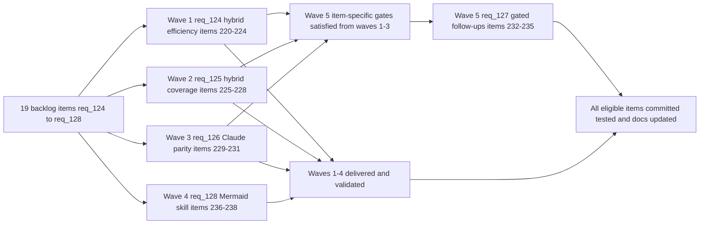

## task_112_orchestration_delivery_for_req_124_to_req_128_across_hybrid_efficiency_claude_parity_and_mermaid_skill - Orchestration delivery for req_124 to req_128 across hybrid efficiency Claude parity and Mermaid skill
> From version: 1.21.1+item231
> Schema version: 1.0
> Status: In Progress
> Understanding: 99%
> Confidence: 97%
> Progress: 67%
> Complexity: High
> Theme: Orchestration
> Reminder: Update status/understanding/confidence/progress and dependencies/references when you edit this doc.

# Context
Derived from:
- `logics/backlog/item_220_diff_preprocessor_and_git_snapshot_reuse_in_hybrid_runtime.md`
- `logics/backlog/item_221_short_lived_result_cache_for_hybrid_assist_flows.md`
- `logics/backlog/item_222_profile_downgrade_and_deterministic_pre_classification_for_bounded_flows.md`
- `logics/backlog/item_223_tier_based_selective_skill_overlay_publishing_for_global_kit.md`
- `logics/backlog/item_224_actionable_efficiency_recommendations_in_hybrid_insights.md`
- `logics/backlog/item_225_enable_next_step_dispatch_to_openai_and_gemini_via_explicit_backend_flag.md`
- `logics/backlog/item_226_add_request_draft_and_spec_first_pass_bounded_authoring_hybrid_flows.md`
- `logics/backlog/item_227_add_backlog_groom_bounded_authoring_hybrid_flow.md`
- `logics/backlog/item_228_extend_claude_bridge_for_new_authoring_flows_and_add_operator_guidance.md`
- `logics/backlog/item_229_publish_global_claude_kit_to_claude_agents_and_commands_directories.md`
- `logics/backlog/item_230_claude_global_kit_health_status_model_and_aligned_launcher_readiness_check.md`
- `logics/backlog/item_231_symmetric_plugin_ui_for_claude_and_codex_launchers_and_health_reporting.md`
- `logics/backlog/item_232_per_runtime_skill_tier_fields_codex_tier_and_claude_tier_if_usage_demands_it.md`
- `logics/backlog/item_233_execute_mode_for_hybrid_authoring_flows_request_draft_spec_first_pass_backlog_groom.md`
- `logics/backlog/item_234_next_step_auto_backend_opt_in_via_logics_yaml_next_step_auto_backend_key.md`
- `logics/backlog/item_235_shared_publication_lifecycle_abstraction_for_codex_and_claude_global_kit.md`
- `logics/backlog/item_236_logics_mermaid_generator_skill_package_with_deterministic_fallback.md`
- `logics/backlog/item_237_hybrid_ai_generation_mode_and_mermaid_safety_validation_in_mermaid_generator_skill.md`
- `logics/backlog/item_238_wire_logics_mermaid_generator_into_flow_manager_at_all_mermaid_call_sites.md`

This orchestration task coordinates the full delivery program for req_124–req_128, covering 19 backlog items across five requests. The delivery is organized into five waves. Each wave maps to one request and its items, in an order that respects inter-item dependencies:

- **Wave 1 (req_124)** — Hybrid runtime efficiency: reduces token cost at the execution layer for all providers. Items 220–224 are independently shippable and can be delivered one item per commit. No upstream dependency.
- **Wave 2 (req_125)** — Hybrid coverage expansion: routes more Claude/Codex interactive tasks through the cheaper hybrid pipeline. Items 225–228 depend on the shared hybrid contract being stable (req_093, req_120) but are otherwise independent of Wave 1 and can run in parallel. Item 228 (Claude bridge extension) must land after 226–227 since it wires those flows.
- **Wave 3 (req_126)** — Claude runtime parity: establishes the global Claude kit (`~/.claude`) and symmetric plugin health reporting. This wave is independent of Waves 1–2 at the code level, but items 229–231 must be delivered in sequence (229 → 230 → 231) since health status and launcher depend on publication being present first.
- **Wave 4 (req_128)** — Mermaid generator skill: self-contained and parallelisable with Waves 1–3. Items 236 → 237 → 238 must be delivered in that sequence.
- **Wave 5 (req_127)** — Post-rollout consolidation: all four items are explicitly gated on upstream production validation from Waves 1–3. Do not start Wave 5 items until their item-specific gate conditions are met. Item 232 is additionally conditional on production evidence. Wave 4 is not a prerequisite for Wave 5.

**One commit per item.** Each backlog item must ship as an isolated, reviewable commit (or a small coherent series if the item spans multiple files). Do not batch multiple items into one commit. Commit message must reference the item number and its AC coverage.

**Wave 5 items are gated.** Item 232 is conditional (only if real usage demands it). Items 233, 234, and 235 are gated on specific upstream items being live and validated in production. Do not implement speculatively.

# Plan

## Wave 1 — req_124: Hybrid runtime efficiency (items 220–224)

- [x] **1.1 — item_220**: Add diff preprocessor to `build_hybrid_messages_impl` in `logics_flow_hybrid_transport.py` and make `collect_git_snapshot` reuse its result within a single CLI invocation in `logics_flow.py`.
  - Unit test: assert lock file diff lines are stripped before prompt build.
  - Integration test: assert `collect_git_snapshot` subprocess called once per invocation on chained flows.
  - Commit: `feat(hybrid): add diff preprocessor and git snapshot reuse (item_220)`.

- [x] **1.2 — item_221**: Add short-lived result cache in `logics/.cache/flow_results_cache.json` keyed on `sha256(flow_name + diff_fingerprint)` with configurable TTL; log `cache-hit` in measurement log.
  - Integration test: retry same flow twice within TTL, assert second call produces no AI subprocess and measurement log shows `cache-hit`.
  - Commit: `feat(hybrid): add short-lived result cache for hybrid flows (item_221)`.

- [x] **1.3 — item_222**: Cap `handoff-packet` profile at `normal` on paid remote or Codex providers with `--profile deep` override; add deterministic pre-classifier for `diff-risk` and `windows-compat-risk`.
  - Unit tests: lock-file-only diff → `low` without AI; migration diff → `high` without AI; downgrade logged in audit.
  - Commit: `feat(hybrid): add profile downgrade and deterministic pre-classifier (item_222)`.

- [x] **1.4 — item_223**: Add `tier: core | optional` field to each skill's `agents/openai.yaml`; filter global kit publication to `core`-only by default; add `--include-optional` flag.
  - Test: publication script outputs only `core`-tier skills by default; `--include-optional` restores full list.
  - Commit: `feat(kit): add tier-based selective skill overlay publishing (item_223)`.

- [x] **1.5 — item_224**: Add efficiency recommendation sections to the Hybrid Insights panel: cache effectiveness and repeat-call opportunities, pre-classification savings, and profile downgrade events.
  - Test: Hybrid Insights HTML renders three new recommendation sections from measurement and audit log data.
  - Commit: `feat(insights): add actionable efficiency recommendations (item_224)`.

- [x] **GATE Wave 1**: run `python3 logics/skills/logics.py lint --require-status`, `python3 logics/skills/logics.py audit --group-by-doc`, `npm run lint:ts`, `npm run test`, `npm run test:smoke` before closing.

---

## Wave 2 — req_125: Hybrid coverage expansion (items 225–228)

- [x] **2.1 — item_225**: Allow `--backend openai` and `--backend gemini` for `next-step` with the same contract validation as other hybrid flows; keep `auto` policy as `codex-first`.
  - Test: `next-step --backend openai` dispatches to OpenAI and returns a validated proposal; invalid provider output triggers bounded Codex fallback.
  - Commit: `feat(hybrid): enable next-step explicit dispatch to OpenAI and Gemini (item_225)`.

- [x] **2.2 — item_226**: Add `request-draft` and `spec-first-pass` as `proposal-only` bounded hybrid flows conforming to the shared contract; no file writing.
  - Test: each flow returns validated JSON; no file written to disk; measurement log contains the run.
  - Commit: `feat(hybrid): add request-draft and spec-first-pass authoring flows (item_226)`.

- [x] **2.3 — item_227**: Add `backlog-groom` as a `proposal-only` bounded hybrid flow returning `title`, `complexity`, and `acceptance_criteria` candidates; no file writing.
  - Test: flow returns validated JSON; no file written; measurement log contains the run.
  - Commit: `feat(hybrid): add backlog-groom authoring flow (item_227)`.

- [x] **2.4 — item_228**: Extend `CLAUDE_BRIDGE_VARIANTS` in `src/claudeBridgeSupport.ts` for `request-draft`, `spec-first-pass`, and `backlog-groom`; add reviewer nudge to each bridge entry; add hybrid-vs-interactive decision rule in `logics.yaml` or `logics/instructions.md`.
  - Test: after `repairClaudeBridgeFiles`, `.claude/commands/` contains entries for all three new flows with reviewer nudges.
  - Commit: `feat(claude): extend bridge for authoring flows and add operator guidance (item_228)`.

- [x] **GATE Wave 2**: run `python3 logics/skills/logics.py lint --require-status`, `python3 logics/skills/logics.py audit --group-by-doc`, `npm run lint:ts`, `npm run test`, `npm run test:smoke` before closing.

---

## Wave 3 — req_126: Claude runtime parity (items 229–231)

- [x] **3.1 — item_229**: Implement global Claude kit publication to `~/.claude/agents/` and `~/.claude/commands/` using the existing bridge file format; write `~/.claude/logics-global-kit-claude.json` manifest; require explicit operator opt-in before first publication.
  - Test: after opt-in and publication, `~/.claude/agents/` and manifest exist with correct fields; second publication without changes is idempotent.
  - Commit: `feat(claude): publish global Claude kit to ~/.claude (item_229)`.

- [x] **3.2 — item_230**: Add `ClaudeKitSnapshot` type with `healthy`, `stale`, `missing-overlay`, `missing-manager`, `unavailable` states; implement `inspectClaudeGlobalKit()`; update Claude launcher in `src/runtimeLaunchers.ts` to require global kit healthy.
  - Test: stale manifest → `stale`; missing manifest → `missing-overlay`; launcher disabled when not healthy.
  - Commit: `feat(claude): add global kit health status model and align launcher (item_230)`.

- [x] **3.3 — item_231**: Update tools panel, environment check, and launcher buttons so Claude and Codex show identical readiness conditions, repair actions, and assistant-agnostic labels where behavior is identical.
  - Test: visual review and HTML snapshot confirm symmetric UI; no Codex-only wording on shared surfaces.
  - Commit: `feat(plugin): make Claude and Codex plugin UI symmetric (item_231)`.

- [ ] **GATE Wave 3**: run `python3 logics/skills/logics.py lint --require-status`, `python3 logics/skills/logics.py audit --group-by-doc`, `npm run lint:ts`, `npm run test`, `npm run test:smoke` before closing.

---

## Wave 4 — req_128: Mermaid generator skill (items 236–238)

- [ ] **4.1 — item_236**: Create `logics/skills/logics-mermaid-generator/` with `SKILL.md`, `agents/openai.yaml` (`tier: core`, `default_prompt`), and `scripts/generate_mermaid.py`; extract `_render_request_mermaid`, `_render_backlog_mermaid`, `_render_task_mermaid`, `_render_workflow_mermaid` from `logics_flow_support.py` as backward-compatible fallback.
  - Test: standalone script invocation returns a valid Mermaid block; existing flow manager tests for Mermaid generation still pass without modification.
  - Commit: `feat(skill): create logics-mermaid-generator skill package with deterministic fallback (item_236)`.

- [ ] **4.2 — item_237**: Add hybrid AI generation mode to the skill: `ollama-first` dispatch, compact prompt from doc kind/title/key sections, `proposal-only` output, 8-second bounded timeout, full Mermaid safety rule validation, silent fallback to deterministic on failure.
  - Test: with Ollama healthy, skill dispatches and returns a validated Mermaid block; AI output with Unicode label is rejected silently and deterministic block returned; measurement log captures both paths.
  - Commit: `feat(skill): add hybrid AI generation and Mermaid safety validation (item_237)`.

- [ ] **4.3 — item_238**: Update all Mermaid generation call sites in `logics_flow.py` and `logics_flow_support.py` (`new request`, `new backlog`, `new task`, `sync refresh-mermaid-signatures`) to route through the skill entry point.
  - Test: `new request` with healthy Ollama routes through skill; with no provider, deterministic fallback is used transparently; no operator-visible error in either case.
  - Commit: `feat(flow): wire logics-mermaid-generator into all flow manager Mermaid call sites (item_238)`.

- [ ] **GATE Wave 4**: run `python3 logics/skills/logics.py lint --require-status`, `python3 logics/skills/logics.py audit --group-by-doc`, `npm run lint:ts`, `npm run test`, `npm run test:smoke` before closing.

---

## Wave 5 — req_127: Post-rollout consolidation (items 232–235) — GATED

**Do not start any Wave 5 item until its gate condition is explicitly met.**

- [ ] **5.1 — item_235** *(gate: items 229–231 live and stable in production)*: Refactor Codex and Claude kit publication into a shared `inspect → publish → manifest → report` abstraction with runtime-specific adapters; regression test coverage for both paths before shipping.
  - Gate check: both `~/.codex` and `~/.claude` publication are live and no active regressions in production.
  - Test: regression suite for both publication paths passes after refactor; no behavioural change for either runtime.
  - Commit: `refactor(kit): shared publication lifecycle abstraction for Codex and Claude (item_235)`.

- [ ] **5.2 — item_234** *(gate: item_225 live and validated in production)*: Add `next_step_auto_backend` key to `logics.yaml`; read in provider dispatch; fall back to Codex with a logged warning if specified provider is unavailable.
  - Gate check: item_225 has shipped and operators have validated explicit `--backend` dispatch.
  - Test: `next_step_auto_backend: openai` in `logics.yaml` → auto dispatch to OpenAI; unhealthy provider → Codex fallback + warning logged.
  - Commit: `feat(config): add next_step_auto_backend opt-in to logics.yaml (item_234)`.

- [ ] **5.3 — item_233** *(gate: items 226–227 live and contracts validated in production)*: Add `--execution-mode execute` to `request-draft`, `spec-first-pass`, and `backlog-groom`; explicit operator confirmation before file write; proposal-only remains default.
  - Gate check: items 226–227 have shipped and at least one production use of each flow has been validated.
  - Test: execute mode prompts for confirmation and writes the doc; proposal-only default returns JSON without writing.
  - Commit: `feat(hybrid): add --execution-mode execute for authoring flows (item_233)`.

- [ ] **5.4 — item_232** *(conditional: only if production usage of item_223 demands per-runtime tier differentiation)*: Add `codex_tier` and `claude_tier` optional fields to `agents/openai.yaml` overriding shared `tier` per runtime. **Skip entirely if no real usage demand has materialised.**
  - Gate check: operators have explicitly reported the need after item_223 is live.
  - Test: skill with `codex_tier: core` and `claude_tier: optional` is included in Codex kit and excluded from Claude kit by default.
  - Commit: `feat(kit): add per-runtime tier fields codex_tier and claude_tier (item_232)`.

- [ ] **GATE Wave 5**: run `python3 logics/skills/logics.py lint --require-status`, `python3 logics/skills/logics.py audit --group-by-doc`, `npm run lint:ts`, `npm run test` before closing.

---

## Cross-wave rules

- [ ] **CHECKPOINT after every item**: commit before moving to the next item. Do not accumulate partial states across item boundaries.
- [ ] **Use `commit-all` assist**: if the hybrid runtime is active and healthy, use `python3 logics/skills/logics.py flow assist commit-all` to prepare each item commit checkpoint.
- [ ] **GATE before closing any wave**: `npm run lint:ts`, `npm run test`, `npm run test:smoke`, `python3 logics/skills/logics.py lint --require-status`.
- [ ] **Update linked Logics docs** during the wave that delivers the behaviour — do not defer doc updates to final closure.
- [ ] **FINAL**: Run full audit, update all linked backlog items and request `# Backlog` sections to `Done`, and verify the repository is in a clean commit-ready state.

# Delivery checkpoints

- One commit per backlog item. Commit message format: `feat|refactor|fix(scope): <description> (item_XXX)`.
- Waves 1, 2, 3, and 4 can be delivered in parallel or in any order between themselves — they have no cross-wave dependency at the code level.
- Wave 5 items are strictly sequential with their upstream gate conditions and must never be started speculatively.
- Each wave ends with a full test run before moving on. A failing test blocks the wave from being marked complete.
- If an item within a wave turns out to be larger than expected, split into sub-commits scoped to the item — do not re-merge with another item's scope.
- Do not mark a wave complete if any linked test is skipped or failing.

# AC Traceability

- Proof: Each mapped backlog item in this orchestration must ship with its own acceptance proof, and wave gates re-run the linked validation commands before the wave can close.

- req_124-AC1/AC2 → Wave 1, item_220 (diff preprocessor and snapshot reuse).
- req_124-AC3 → Wave 1, item_221 (result cache).
- req_124-AC4/AC5 → Wave 1, item_222 (profile downgrade and pre-classifier).
- req_124-AC6 → Wave 1, item_223 (tier-based overlay publishing).
- req_124-AC7 → Wave 1, item_224 (Hybrid Insights efficiency recommendations).
- req_125-AC1 → Wave 2, item_225 (next-step explicit backend).
- req_125-AC2 (request-draft/spec-first-pass) → Wave 2, item_226.
- req_125-AC2 (backlog-groom) → Wave 2, item_227.
- req_125-AC3/AC4 → Wave 2, item_228 (Claude bridge extension and guidance).
- req_126-AC1 → Wave 3, item_229 (global Claude kit publication).
- req_126-AC2/AC3 → Wave 3, item_230 (health status model and launcher).
- req_126-AC5 → Wave 3, item_231 (symmetric plugin UI).
- req_127-AC4 → Wave 5, item_235 (shared publication abstraction).
- req_127-AC3 → Wave 5, item_234 (next-step auto backend opt-in).
- req_127-AC2 → Wave 5, item_233 (execute mode for authoring flows).
- req_127-AC1 → Wave 5, item_232 (conditional per-runtime tiers).
- req_128-AC1/AC3/AC6 → Wave 4, item_236 (skill package and fallback).
- req_128-AC2/AC5 → Wave 4, item_237 (hybrid AI and safety validation).
- req_128-AC4 → Wave 4, item_238 (flow manager wiring).

# Decision framing
- Product framing: Not needed
- Architecture framing: Not needed

# Links
- Product brief(s): (none yet)
- Architecture decision(s): (none yet)
- Backlog items:
  - `logics/backlog/item_220_diff_preprocessor_and_git_snapshot_reuse_in_hybrid_runtime.md`
  - `logics/backlog/item_221_short_lived_result_cache_for_hybrid_assist_flows.md`
  - `logics/backlog/item_222_profile_downgrade_and_deterministic_pre_classification_for_bounded_flows.md`
  - `logics/backlog/item_223_tier_based_selective_skill_overlay_publishing_for_global_kit.md`
  - `logics/backlog/item_224_actionable_efficiency_recommendations_in_hybrid_insights.md`
  - `logics/backlog/item_225_enable_next_step_dispatch_to_openai_and_gemini_via_explicit_backend_flag.md`
  - `logics/backlog/item_226_add_request_draft_and_spec_first_pass_bounded_authoring_hybrid_flows.md`
  - `logics/backlog/item_227_add_backlog_groom_bounded_authoring_hybrid_flow.md`
  - `logics/backlog/item_228_extend_claude_bridge_for_new_authoring_flows_and_add_operator_guidance.md`
  - `logics/backlog/item_229_publish_global_claude_kit_to_claude_agents_and_commands_directories.md`
  - `logics/backlog/item_230_claude_global_kit_health_status_model_and_aligned_launcher_readiness_check.md`
  - `logics/backlog/item_231_symmetric_plugin_ui_for_claude_and_codex_launchers_and_health_reporting.md`
  - `logics/backlog/item_232_per_runtime_skill_tier_fields_codex_tier_and_claude_tier_if_usage_demands_it.md`
  - `logics/backlog/item_233_execute_mode_for_hybrid_authoring_flows_request_draft_spec_first_pass_backlog_groom.md`
  - `logics/backlog/item_234_next_step_auto_backend_opt_in_via_logics_yaml_next_step_auto_backend_key.md`
  - `logics/backlog/item_235_shared_publication_lifecycle_abstraction_for_codex_and_claude_global_kit.md`
  - `logics/backlog/item_236_logics_mermaid_generator_skill_package_with_deterministic_fallback.md`
  - `logics/backlog/item_237_hybrid_ai_generation_mode_and_mermaid_safety_validation_in_mermaid_generator_skill.md`
  - `logics/backlog/item_238_wire_logics_mermaid_generator_into_flow_manager_at_all_mermaid_call_sites.md`
- Request(s):
  - `logics/request/req_124_harden_hybrid_assist_runtime_efficiency_with_diff_preprocessing_result_caching_and_profile_aware_fallback.md`
  - `logics/request/req_125_expand_hybrid_provider_coverage_to_replace_more_claude_and_codex_interactive_flows.md`
  - `logics/request/req_126_achieve_claude_runtime_parity_with_the_codex_overlay_and_launcher_model.md`
  - `logics/request/req_127_consolidate_deferred_hybrid_and_kit_publication_improvements_after_initial_rollout.md`
  - `logics/request/req_128_add_a_logics_mermaid_generator_skill_with_hybrid_ai_and_deterministic_fallback.md`

# AI Context
- Summary: Orchestrate the full delivery of req_124–req_128 across 19 backlog items in five waves: Wave 1 hybrid runtime efficiency, Wave 2 hybrid coverage expansion, Wave 3 Claude runtime parity, Wave 4 Mermaid generator skill, Wave 5 post-rollout consolidation (gated). One commit per item, full test run before closing each wave, Wave 5 items strictly gated on upstream production stability.
- Keywords: orchestration, req_124, req_125, req_126, req_127, req_128, waves, hybrid efficiency, Claude parity, Mermaid skill, one commit per item, gated, consolidation
- Use when: Executing the delivery of any of the 19 backlog items in req_124–req_128, deciding item ordering within or across waves, or confirming gate conditions for Wave 5 items.
- Skip when: Work belongs to a different request family or is a standalone hotfix unrelated to this program.

# Validation

Per wave and per item, before marking complete:
- `python3 logics/skills/logics.py lint --require-status`
- `python3 logics/skills/logics.py audit --group-by-doc`
- `npm run lint:ts`
- `npm run test`
- `npm run test:smoke` (before wave close)

Wave-specific manual validations:
- **Wave 1**: verify lock file lines are absent from hybrid prompt output; verify measurement log shows `cache-hit` and `deterministic-preclassified` entries; verify Hybrid Insights panel renders the three new recommendation sections.
- **Wave 2**: verify `next-step --backend openai` dispatches and falls back correctly; verify each authoring flow returns JSON without writing files; verify `.claude/commands/` contains entries for all three new flows after bridge repair.
- **Wave 3**: verify `~/.claude/agents/` and manifest are written on first publication; verify Claude launcher is disabled when kit is stale; verify both launchers show identical repair options in the tools panel.
- **Wave 4**: verify standalone skill invocation returns a valid Mermaid block; verify Ollama-generated Mermaid with a Unicode label is rejected silently; verify `new request` routes through the skill.
- **Wave 5**: regression test both `~/.codex` and `~/.claude` publication after shared abstraction refactor; verify `next_step_auto_backend: openai` changes dispatch and logs warning on unhealthy provider.

# Definition of Done (DoD)
- [ ] All 19 items implemented across Waves 1–4 (and Wave 5 items where gate conditions are met).
- [ ] One commit per item — no item is batched with another item's scope.
- [ ] Each wave closed only after `npm run test` and `python3 logics/skills/logics.py lint --require-status` passed.
- [ ] Wave 5 items only started after their explicit gate conditions are confirmed.
- [ ] Linked request `# Backlog` sections and backlog item statuses updated during the wave that delivers the behaviour.
- [ ] Repository is in a clean commit-ready state at final closure.
- [ ] Status is `Done` and progress is `100%`.

# Report
