## task_113_orchestration_delivery_for_req_129_plugin_and_kit_coverage_portfolio - Orchestration delivery for req_129 plugin and kit coverage portfolio
> From version: 1.22.0
> Schema version: 1.0
> Status: In Progress
> Understanding: 98%
> Confidence: 94%
> Progress: 75%
> Complexity: High
> Theme: Cross-item delivery orchestration
> Reminder: Update status/understanding/confidence/progress and dependencies/references when you edit this doc.

# Context
Derived from:
- `logics/backlog/item_239_increase_plugin_webview_behavior_coverage_for_media_runtime_surfaces.md`
- `logics/backlog/item_240_add_sandbox_install_and_update_lifecycle_coverage_for_the_packaged_plugin.md`
- `logics/backlog/item_241_increase_logics_kit_workflow_and_flow_manager_behavior_coverage.md`
- `logics/backlog/item_242_add_sandbox_install_repair_migrate_and_update_lifecycle_coverage_for_the_logics_kit.md`
- `logics/backlog/item_243_add_opt_in_live_provider_integration_coverage_for_configured_healthy_backends.md`

This orchestration task coordinates the full delivery program for `req_129`, covering five backlog items across plugin coverage, plugin lifecycle integration, kit workflow coverage, kit lifecycle integration, and opt-in live provider integration.

The delivery order follows the clarified default from the request:
- **Wave 1 — item_239**: plugin webview behavior coverage for `media/*.js` runtime surfaces.
- **Wave 2 — item_241**: Logics kit workflow and flow-manager behavior coverage.
- **Wave 3 — item_240**: packaged plugin install and update lifecycle coverage in sandbox workspaces.
- **Wave 4 — item_242**: Logics kit install, repair, migrate, and update lifecycle coverage in sandbox repositories.
- **Wave 5 — item_243**: opt-in live provider integration coverage for configured healthy backends.

Execution intent:
- deliver the highest-risk deterministic coverage first;
- keep plugin and kit validation readable by surface;
- avoid introducing brittle gates before the deterministic coverage baseline is strong;
- treat Wave 5 as explicitly gated on local configuration, healthy providers, and stable lower-level contract tests from Waves 1–4.

Constraints:
- keep each backlog item bounded to one coherent delivery slice;
- prefer one reviewable commit checkpoint per backlog item;
- do not start Wave 5 speculatively if local provider configuration or runtime health is not ready;
- do not let sandbox install or update tests become the primary gate before they are proven stable in disposable environments.

```mermaid
%% logics-kind: task
%% logics-signature: task|orchestration-delivery-for-req-129-plugi|item-239-increase-plugin-webview-behavio|wave-1-item-239-plugin-webview-behavior|npm-run-compile
flowchart LR
    Req[Req 129 coverage portfolio] --> W1[Wave 1 item 239 plugin webview behavior]
    W1 --> W2[Wave 2 item 241 kit workflow behavior]
    W2 --> W3[Wave 3 item 240 plugin sandbox lifecycle]
    W3 --> W4[Wave 4 item 242 kit sandbox lifecycle]
    W4 --> Gate[Gate local providers configured and healthy]
    Gate --> W5[Wave 5 item 243 live provider integration]
    W5 --> Final[Update docs and close report]
```

# Plan

## Wave 1 — item_239: plugin webview behavior coverage

- [x] **1.1 — lock runtime targets**: confirmed first-pass browser runtime targets across all 14 `media/*.js` files. Existing harness already loaded them; refactored loading to use a shared `loadMediaScript` helper with `//# sourceURL` annotations.
- [x] **1.2 — expand behavior suites**: added 72 behavior-focused tests across 5 new test files: `webview.persistence.test.ts` (8 tests), `webview.selectors.test.ts` (14 tests), `webview.chrome.test.ts` (18 tests), `webview.board-renderer.test.ts` (16 tests), `webview.hydration.test.ts` (16 tests). Covers hydration, board and detail rendering, filters and selection behavior, layout state, persistence and restore, keyboard navigation, card previews, toolbar controls, empty states, and data message handling.
- [x] **1.3 — protect reporting intent**: tests validate user-visible behavior and regression resistance (AC6). Known gap: V8 coverage provider cannot instrument eval'd JSDOM code, so the media coverage metric stays at 0% despite behavioral coverage. Fixing this requires a vitest coverage plugin or switching media files to an importable module format — tracked as a separate infrastructure concern.
- [x] **1.4 — checkpoint**: committed as `b7e45a1` with all linked Logics docs updated.

## Wave 2 — item_241: kit workflow and flow-manager behavior coverage

- [x] **2.1 — lock highest-risk kit paths**: confirmed scenario matrix across 6 modules: dispatcher validation (461 lines), config parsing (233 lines), mutations (48 lines), transactions (119 lines), models (261 lines), decision support (222 lines). Identified 112 unit-testable scenarios covering pure-logic functions not reached by existing CLI integration tests.
- [x] **2.2 — add deterministic scenario coverage**: added 112 unit tests in `test_kit_unit.py` across 18 test classes. Covers: extract_json_object (6 tests), normalize_confidence (8), normalize_target_ref (6), normalize_titles (7), validate_action_args (12), validate_dispatcher_decision (11), map_decision_to_command (4), coerce_scalar (7), parse_simple_yaml (7), deep_merge (4), load_repo_config (2), get_config_value (2), build_planned_mutation (3), apply_mutation (2), apply_transaction (6), extract_refs (3), parse_frontmatter (5), detect_workflow_kind (4), extract_indicators (2), extract_title (2), decision_support (10).
- [x] **2.3 — unlock testability where needed**: no refactoring needed — existing module structure already exposes pure-logic functions suitable for direct import and unit testing via `importlib`.
- [ ] **2.4 — checkpoint**: leave `item_241` in a commit-ready state with linked Logics docs updated.

## Wave 3 — item_240: packaged plugin sandbox install and update lifecycle

- [x] **3.1 — define disposable sandbox harness**: `tests/run_plugin_lifecycle_checks.mjs` uses `--extensions-dir` and `--user-data-dir` pointed at `fs.mkdtempSync` directories for full isolation. Cleanup on completion or failure.
- [x] **3.2 — validate fresh install path**: test verifies extension not present before install, then present after `--install-extension` in sandbox.
- [x] **3.3 — validate update path**: test installs VSIX, reinstalls same VSIX (simulates update), verifies extension still listed. Also includes uninstall path test.
- [x] **3.4 — gate execution mode**: double-gated — requires `PLUGIN_LIFECYCLE_TESTS=1` env var AND `code` CLI on PATH. Skips with exit 0 and message when either gate is not met.
- [ ] **3.5 — checkpoint**: leave `item_240` in a commit-ready state with linked Logics docs updated.

## Wave 4 — item_242: kit sandbox install, repair, migrate, and update lifecycle

- [x] **4.1 — define deterministic repo fixtures**: tests use `tempfile.TemporaryDirectory` with CLI subprocess invocation — same pattern as existing `test_logics_flow.py`. No network or remote dependencies.
- [x] **4.2 — validate install and re-run**: fresh bootstrap test verifies structure, config, and env files. Idempotent re-run test verifies second bootstrap succeeds without duplicating logics.yaml content.
- [x] **4.3 — validate convergence paths**: doctor issue detection on incomplete repo, doctor convergence after creating missing directory, schema migration with version injection, idempotent schema migration, schema status counts, config defaults after bootstrap, new doc creation after bootstrap.
- [x] **4.4 — keep remote assumptions out**: all 9 tests are fully local — tempdir-based repos with subprocess CLI invocation. No network calls.
- [ ] **4.5 — checkpoint**: leave `item_242` in a commit-ready state with linked Logics docs updated.

## Wave 5 — item_243: opt-in live provider integration coverage — GATED

- [ ] **5.1 — gate readiness**: start only when lower-level deterministic coverage is in place and at least one provider is configured locally, non-empty, and healthy.
- [ ] **5.2 — add local opt-in integration tests**: add provider integration tests behind an explicit environment gate such as `LIVE_PROVIDER_TESTS=1`.
- [ ] **5.3 — validate contract, not wording**: assert reachability, auth, model availability, structured output shape, and degraded fallback behavior rather than exact model text.
- [ ] **5.4 — keep CI default clean**: do not move these tests into the default CI path until cost and flakiness are understood.
- [ ] **5.5 — checkpoint**: leave `item_243` in a commit-ready state with linked Logics docs updated.

## Cross-wave rules

- [ ] **CHECKPOINT after every item**: one backlog item per commit-ready checkpoint; do not batch multiple item scopes into one undocumented state.
- [ ] **Update Logics docs during the wave**: update the linked request, backlog item, and this task during the wave that changes behavior, not only at final closure.
- [ ] **Use commit-all when healthy**: if the shared runtime is healthy, run `python3 logics/skills/logics.py flow assist commit-all` for the commit checkpoint of each finished wave.
- [ ] **Do not close gated work speculatively**: Wave 5 stays blocked unless local provider readiness is explicit and the opt-in contract is honored.
- [ ] **FINAL**: capture validation evidence, update linked docs, and close the chain only after all intended backlog slices are complete or explicitly deferred with rationale.

# Delivery checkpoints

- Each wave must end in a coherent, reviewable, commit-ready state.
- Prefer the default execution order from the request unless a concrete dependency analysis justifies reordering.
- Waves 1 and 2 establish the deterministic baseline and should land before the lifecycle-heavy sandbox waves.
- Waves 3 and 4 should use isolated disposable environments and must not rely on mutable global editor or git state.
- Wave 5 is gated on local configuration and should remain optional in default automation until stable.
- Do not mark a wave complete if its linked validation is skipped or knowingly flaky without an explicit note in this task.

# AC Traceability

- AC1 -> Waves 1 through 5. Proof: the orchestration explicitly keeps plugin and kit work separated into bounded backlog slices.
- AC2 -> Wave 1 / item_239. Proof: webview runtime behavior coverage is delivered before broader plugin lifecycle coverage.
- AC3 -> Waves 1 and 3. Proof: plugin coverage reporting and lifecycle checks stay visible as distinct surfaces.
- AC4 -> Wave 2 / item_241. Proof: highest-risk kit workflow paths are covered through scenario-driven tests before broader lifecycle expansion.
- AC5 -> Wave 2 / item_241. Proof: narrow testability extractions are allowed only when they unlock durable coverage in oversized modules.
- AC6 -> Waves 1 through 5. Proof: every wave requires regression-sensitive tests that would fail on realistic behavior drift, not only metric movement.
- AC7 -> Waves 1 through 4. Proof: the orchestration keeps Node and Python validation aligned with the repository's existing quality gates.
- AC8 -> Wave 5 / item_243. Proof: live provider integration stays opt-in, local-first, and contract-focused.
- AC9 -> Wave 3 / item_240. Proof: packaged plugin install and update behavior is validated in sandbox environments.
- AC10 -> Wave 4 / item_242. Proof: kit install, repair, migrate, and update lifecycle is validated in deterministic sandbox repositories.

# Decision framing
- Product framing: Not needed
- Architecture framing: Not needed

# Links
- Product brief(s): (none yet)
- Architecture decision(s): (none yet)
- Backlog items:
  - `logics/backlog/item_239_increase_plugin_webview_behavior_coverage_for_media_runtime_surfaces.md`
  - `logics/backlog/item_240_add_sandbox_install_and_update_lifecycle_coverage_for_the_packaged_plugin.md`
  - `logics/backlog/item_241_increase_logics_kit_workflow_and_flow_manager_behavior_coverage.md`
  - `logics/backlog/item_242_add_sandbox_install_repair_migrate_and_update_lifecycle_coverage_for_the_logics_kit.md`
  - `logics/backlog/item_243_add_opt_in_live_provider_integration_coverage_for_configured_healthy_backends.md`
- Request(s): `req_129_greatly_improve_plugin_and_kit_coverage_with_behavior_focused_tests`

# AI Context
- Summary: Orchestrate req_129 across five bounded backlog items covering plugin webview behavior coverage, plugin sandbox install and update coverage, kit workflow coverage, kit sandbox lifecycle coverage, and gated live provider integration coverage.
- Keywords: orchestration, req_129, coverage portfolio, plugin webview, plugin sandbox lifecycle, kit workflow, kit sandbox lifecycle, live provider integration, waves, gated execution
- Use when: Use when executing or sequencing the `req_129` backlog portfolio and deciding what validation or gating is required before closing each wave.
- Skip when: Skip when the work is a standalone fix unrelated to the `req_129` coverage portfolio or belongs to only one backlog item without orchestration needs.

# Validation
- `npm run compile`
- `npm run test:coverage`
- `npm run test:smoke`
- `npm run coverage:kit`
- `npm run lint:logics`
- `python3 logics/skills/logics.py audit --refs req_129_greatly_improve_plugin_and_kit_coverage_with_behavior_focused_tests`

# Definition of Done (DoD)
- [ ] Scope implemented and acceptance criteria covered.
- [ ] Validation commands executed and results captured.
- [ ] Linked request, backlog, and task docs updated during completed waves and at closure.
- [ ] Each completed wave left a commit-ready checkpoint or an explicit exception is documented.
- [ ] Status is `Done` and progress is `100%`.

# Report

## Wave 4 — item_242 (in progress)

- **Tests added**: 9 new lifecycle tests in `test_kit_lifecycle.py`.
- **Scenarios covered**: fresh bootstrap (structure, config, env files), idempotent re-run, doctor issue detection on incomplete repos, doctor convergence after fix, schema migration with version injection, idempotent schema migration, schema status reporting, config defaults after bootstrap, new doc creation after bootstrap.
- **Approach**: tempdir-based sandbox repos with subprocess CLI invocation — fully local, no network, same pattern as existing tests.
- **Validation**: `python3 -m unittest discover` 284/284 passed (was 275), `npm run compile` OK, `npm run test:coverage` 307/307 passed.

## Wave 3 — item_240 (complete)

- **Test script**: `tests/run_plugin_lifecycle_checks.mjs`, run via `npm run test:lifecycle`.
- **Tests**: 3 sandbox lifecycle tests — fresh install (2 assertions), update/reinstall (2 assertions), uninstall (1 assertion).
- **Sandbox approach**: disposable `--extensions-dir` and `--user-data-dir` under `os.tmpdir()`, cleaned up after each test.
- **Gating**: double-gated by `PLUGIN_LIFECYCLE_TESTS=1` env var and `code` CLI availability. Skips cleanly with exit 0.
- **Validation**: `npm run test:lifecycle` exits 0 with skip message (no `code` CLI on current machine). `npm run compile` OK, `npm run test:coverage` 307/307 passed, `npm run test:smoke` OK.

## Wave 2 — item_241 (complete)

- **Tests added**: 112 new unit tests in `test_kit_unit.py` across 18 test classes.
- **Modules covered**: `logics_flow_dispatcher.py` (dispatcher validation, JSON extraction, confidence normalization, target ref validation, title dedup, action arg constraints, decision-to-command mapping), `logics_flow_config.py` (scalar coercion, YAML parsing, deep merge, repo config loading), `logics_flow_mutations.py` (planned mutation building, dry-run and write behavior), `logics_flow_transactions.py` (dry-run preview, successful write, transactional rollback, direct mode no-rollback, unknown mode rejection), `logics_flow_models.py` (ref extraction with mermaid exclusion, frontmatter parsing with block scalars, workflow kind detection, indicator extraction, title extraction), `logics_flow_decision_support.py` (signal detection, decision levels, follow-up rendering).
- **Validation**: `python3 -m unittest discover` 275/275 passed (was 163), `npm run compile` OK, `npm run test:coverage` 307/307 passed.
- **Approach**: direct `importlib` import of module functions (same pattern as existing `test_logics_flow.py`). No production code refactoring needed.

## Wave 1 — item_239 (complete)

- **Tests added**: 72 new behavior-focused tests across 5 files.
- **Test files**: `webview.persistence.test.ts`, `webview.selectors.test.ts`, `webview.chrome.test.ts`, `webview.board-renderer.test.ts`, `webview.hydration.test.ts`.
- **Surfaces covered**: persistence (hydration, scroll capture, reset, legacy field migration), selectors (progress states, filtering, sorting, search, visibility, empty states), chrome (toolbar, filter indicators, tools panel, help banner, activity panel, view mode toggle), board renderer (columns, cards, keyboard nav, previews, list view, add menu), hydration (data messages, layout mode, details panel, payload fields).
- **Harness improvement**: refactored `webviewHarnessTestUtils.ts` and `webview.layout-collapse.test.ts` to use shared `loadMediaScript` helper with `//# sourceURL` annotations.
- **Validation**: `npm run compile` OK, `npm run test:coverage` 307/307 passed, `npm run test:smoke` OK.
- **Known gap**: V8 coverage provider reports 0% for `media/*.js` because eval'd JSDOM code is not instrumented by V8. The behavioral tests catch regressions regardless. Addressing the metric requires infrastructure work (vitest plugin or module format migration).
