## task_113_orchestration_delivery_for_req_129_plugin_and_kit_coverage_portfolio - Orchestration delivery for req_129 plugin and kit coverage portfolio
> From version: 1.22.0
> Schema version: 1.0
> Status: Ready
> Understanding: 98%
> Confidence: 94%
> Progress: 0%
> Complexity: High
> Theme: Cross-item delivery orchestration
> Reminder: Update status/understanding/confidence/progress and dependencies/references when you edit this doc.

# Context
Derived from:
- `logics/backlog/item_239_increase_plugin_webview_behavior_coverage_for_media_runtime_surfaces.md`
- `logics/backlog/item_240_add_sandbox_install_and_update_lifecycle_coverage_for_the_packaged_plugin.md`
- `logics/backlog/item_241_increase_logics_kit_workflow_and_flow_manager_behavior_coverage.md`
- `logics/backlog/item_242_add_sandbox_install_repair_migrate_and_update_lifecycle_coverage_for_the_logics_kit.md`
- `logics/backlog/item_243_add_opt_in_live_provider_integration_coverage_for_configured_healthy_backends.md`

This orchestration task coordinates the full delivery program for `req_129`, covering five backlog items across plugin coverage, plugin lifecycle integration, kit workflow coverage, kit lifecycle integration, and opt-in live provider integration.

The delivery order follows the clarified default from the request:
- **Wave 1 — item_239**: plugin webview behavior coverage for `media/*.js` runtime surfaces.
- **Wave 2 — item_241**: Logics kit workflow and flow-manager behavior coverage.
- **Wave 3 — item_240**: packaged plugin install and update lifecycle coverage in sandbox workspaces.
- **Wave 4 — item_242**: Logics kit install, repair, migrate, and update lifecycle coverage in sandbox repositories.
- **Wave 5 — item_243**: opt-in live provider integration coverage for configured healthy backends.

Execution intent:
- deliver the highest-risk deterministic coverage first;
- keep plugin and kit validation readable by surface;
- avoid introducing brittle gates before the deterministic coverage baseline is strong;
- treat Wave 5 as explicitly gated on local configuration, healthy providers, and stable lower-level contract tests from Waves 1–4.

Constraints:
- keep each backlog item bounded to one coherent delivery slice;
- prefer one reviewable commit checkpoint per backlog item;
- do not start Wave 5 speculatively if local provider configuration or runtime health is not ready;
- do not let sandbox install or update tests become the primary gate before they are proven stable in disposable environments.

```mermaid
%% logics-kind: task
%% logics-signature: task|orchestration-delivery-for-req-129-plugi|item-239-increase-plugin-webview-behavio|wave-1-item-239-plugin-webview-behavior|npm-run-compile
flowchart LR
    Req[Req 129 coverage portfolio] --> W1[Wave 1 item 239 plugin webview behavior]
    W1 --> W2[Wave 2 item 241 kit workflow behavior]
    W2 --> W3[Wave 3 item 240 plugin sandbox lifecycle]
    W3 --> W4[Wave 4 item 242 kit sandbox lifecycle]
    W4 --> Gate[Gate local providers configured and healthy]
    Gate --> W5[Wave 5 item 243 live provider integration]
    W5 --> Final[Update docs and close report]
```

# Plan

## Wave 1 — item_239: plugin webview behavior coverage

- [ ] **1.1 — lock runtime targets**: confirm the first-pass browser runtime targets and expected user-visible flows for `media/main.js`, `media/renderBoard.js`, `media/renderDetails.js`, `media/webviewChrome.js`, `media/webviewPersistence.js`, `media/webviewSelectors.js`, and `media/layoutController.js`.
- [ ] **1.2 — expand behavior suites**: add or extend behavior-focused tests for hydration, board and detail rendering, filters and selection behavior, layout state, and persistence or restore behavior.
- [ ] **1.3 — protect reporting intent**: keep plugin coverage readable by surface so the new webview tests improve signal, not just the top-line percentage.
- [ ] **1.4 — checkpoint**: leave `item_239` in a commit-ready state with linked Logics docs updated.

## Wave 2 — item_241: kit workflow and flow-manager behavior coverage

- [ ] **2.1 — lock highest-risk kit paths**: confirm the first-pass scenario matrix around `logics_flow.py`, dispatcher validation, hybrid transport, and guarded release-oriented behavior.
- [ ] **2.2 — add deterministic scenario coverage**: extend kit tests for the highest-risk workflow paths before touching sandbox lifecycle coverage.
- [ ] **2.3 — unlock testability where needed**: extract or isolate narrowly scoped pure logic only where the current command structure blocks durable tests.
- [ ] **2.4 — checkpoint**: leave `item_241` in a commit-ready state with linked Logics docs updated.

## Wave 3 — item_240: packaged plugin sandbox install and update lifecycle

- [ ] **3.1 — define disposable sandbox harness**: use packaged VSIX installation in an isolated sandbox workspace with disposable user-data and extension directories.
- [ ] **3.2 — validate fresh install path**: verify successful install, activation, and basic command or webview availability for the packaged plugin.
- [ ] **3.3 — validate update path**: verify upgrade from an older packaged build to a newer one and confirm stable post-update behavior.
- [ ] **3.4 — gate execution mode**: keep these tests opt-in or separately gated until their stability is proven.
- [ ] **3.5 — checkpoint**: leave `item_240` in a commit-ready state with linked Logics docs updated.

## Wave 4 — item_242: kit sandbox install, repair, migrate, and update lifecycle

- [ ] **4.1 — define deterministic repo fixtures**: create or refine sandbox repository fixtures for fresh bootstrap, idempotent re-run, repair or doctor convergence, migration, and canonical update-path validation.
- [ ] **4.2 — validate install and re-run**: cover fresh bootstrap and idempotent repeat execution.
- [ ] **4.3 — validate convergence paths**: cover repair, doctor, migrate-schema, and post-update convergence behavior in bounded fixtures.
- [ ] **4.4 — keep remote assumptions out**: prefer deterministic local fixtures over remote-network update paths when the same convergence contract can be validated locally.
- [ ] **4.5 — checkpoint**: leave `item_242` in a commit-ready state with linked Logics docs updated.

## Wave 5 — item_243: opt-in live provider integration coverage — GATED

- [ ] **5.1 — gate readiness**: start only when lower-level deterministic coverage is in place and at least one provider is configured locally, non-empty, and healthy.
- [ ] **5.2 — add local opt-in integration tests**: add provider integration tests behind an explicit environment gate such as `LIVE_PROVIDER_TESTS=1`.
- [ ] **5.3 — validate contract, not wording**: assert reachability, auth, model availability, structured output shape, and degraded fallback behavior rather than exact model text.
- [ ] **5.4 — keep CI default clean**: do not move these tests into the default CI path until cost and flakiness are understood.
- [ ] **5.5 — checkpoint**: leave `item_243` in a commit-ready state with linked Logics docs updated.

## Cross-wave rules

- [ ] **CHECKPOINT after every item**: one backlog item per commit-ready checkpoint; do not batch multiple item scopes into one undocumented state.
- [ ] **Update Logics docs during the wave**: update the linked request, backlog item, and this task during the wave that changes behavior, not only at final closure.
- [ ] **Use commit-all when healthy**: if the shared runtime is healthy, run `python3 logics/skills/logics.py flow assist commit-all` for the commit checkpoint of each finished wave.
- [ ] **Do not close gated work speculatively**: Wave 5 stays blocked unless local provider readiness is explicit and the opt-in contract is honored.
- [ ] **FINAL**: capture validation evidence, update linked docs, and close the chain only after all intended backlog slices are complete or explicitly deferred with rationale.

# Delivery checkpoints

- Each wave must end in a coherent, reviewable, commit-ready state.
- Prefer the default execution order from the request unless a concrete dependency analysis justifies reordering.
- Waves 1 and 2 establish the deterministic baseline and should land before the lifecycle-heavy sandbox waves.
- Waves 3 and 4 should use isolated disposable environments and must not rely on mutable global editor or git state.
- Wave 5 is gated on local configuration and should remain optional in default automation until stable.
- Do not mark a wave complete if its linked validation is skipped or knowingly flaky without an explicit note in this task.

# AC Traceability

- AC1 -> Waves 1 through 5. Proof: the orchestration explicitly keeps plugin and kit work separated into bounded backlog slices.
- AC2 -> Wave 1 / item_239. Proof: webview runtime behavior coverage is delivered before broader plugin lifecycle coverage.
- AC3 -> Waves 1 and 3. Proof: plugin coverage reporting and lifecycle checks stay visible as distinct surfaces.
- AC4 -> Wave 2 / item_241. Proof: highest-risk kit workflow paths are covered through scenario-driven tests before broader lifecycle expansion.
- AC5 -> Wave 2 / item_241. Proof: narrow testability extractions are allowed only when they unlock durable coverage in oversized modules.
- AC6 -> Waves 1 through 5. Proof: every wave requires regression-sensitive tests that would fail on realistic behavior drift, not only metric movement.
- AC7 -> Waves 1 through 4. Proof: the orchestration keeps Node and Python validation aligned with the repository's existing quality gates.
- AC8 -> Wave 5 / item_243. Proof: live provider integration stays opt-in, local-first, and contract-focused.
- AC9 -> Wave 3 / item_240. Proof: packaged plugin install and update behavior is validated in sandbox environments.
- AC10 -> Wave 4 / item_242. Proof: kit install, repair, migrate, and update lifecycle is validated in deterministic sandbox repositories.

# Decision framing
- Product framing: Not needed
- Architecture framing: Not needed

# Links
- Product brief(s): (none yet)
- Architecture decision(s): (none yet)
- Backlog items:
  - `logics/backlog/item_239_increase_plugin_webview_behavior_coverage_for_media_runtime_surfaces.md`
  - `logics/backlog/item_240_add_sandbox_install_and_update_lifecycle_coverage_for_the_packaged_plugin.md`
  - `logics/backlog/item_241_increase_logics_kit_workflow_and_flow_manager_behavior_coverage.md`
  - `logics/backlog/item_242_add_sandbox_install_repair_migrate_and_update_lifecycle_coverage_for_the_logics_kit.md`
  - `logics/backlog/item_243_add_opt_in_live_provider_integration_coverage_for_configured_healthy_backends.md`
- Request(s): `req_129_greatly_improve_plugin_and_kit_coverage_with_behavior_focused_tests`

# AI Context
- Summary: Orchestrate req_129 across five bounded backlog items covering plugin webview behavior coverage, plugin sandbox install and update coverage, kit workflow coverage, kit sandbox lifecycle coverage, and gated live provider integration coverage.
- Keywords: orchestration, req_129, coverage portfolio, plugin webview, plugin sandbox lifecycle, kit workflow, kit sandbox lifecycle, live provider integration, waves, gated execution
- Use when: Use when executing or sequencing the `req_129` backlog portfolio and deciding what validation or gating is required before closing each wave.
- Skip when: Skip when the work is a standalone fix unrelated to the `req_129` coverage portfolio or belongs to only one backlog item without orchestration needs.

# Validation
- `npm run compile`
- `npm run test:coverage`
- `npm run test:smoke`
- `npm run coverage:kit`
- `npm run lint:logics`
- `python3 logics/skills/logics.py audit --refs req_129_greatly_improve_plugin_and_kit_coverage_with_behavior_focused_tests`

# Definition of Done (DoD)
- [ ] Scope implemented and acceptance criteria covered.
- [ ] Validation commands executed and results captured.
- [ ] Linked request, backlog, and task docs updated during completed waves and at closure.
- [ ] Each completed wave left a commit-ready checkpoint or an explicit exception is documented.
- [ ] Status is `Done` and progress is `100%`.

# Report

- Pending. Fill per wave with commit checkpoints, validation evidence, and any explicit gating decisions or deferrals.
