## task_114_orchestration_delivery_for_req_130_and_req_131_plugin_coverage_governance_and_under_1000_line_modularization - Orchestration delivery for req_130 and req_131 across plugin coverage governance and under-1000-line modularization
> From version: 1.22.0
> Schema version: 1.0
> Status: Ready
> Understanding: 97%
> Confidence: 93%
> Progress: 0%
> Complexity: High
> Theme: Cross-item delivery orchestration
> Reminder: Update status/understanding/confidence/progress and dependencies/references when you edit this doc.

# Context
Derived from:
- `logics/backlog/item_244_raise_plugin_src_coverage_on_high_return_entry_and_utility_modules.md`
- `logics/backlog/item_245_add_scenario_driven_coverage_for_plugin_workflow_and_utility_decision_paths.md`
- `logics/backlog/item_246_separate_src_and_media_plugin_coverage_reporting_thresholds_and_webview_measurement.md`
- `logics/backlog/item_247_split_oversized_plugin_source_entry_and_orchestration_surfaces_below_1000_lines.md`
- `logics/backlog/item_248_split_oversized_plugin_test_suites_by_behavior_domain_below_1000_lines.md`
- `logics/backlog/item_249_split_oversized_flow_manager_cli_and_support_scripts_below_1000_lines.md`
- `logics/backlog/item_250_split_oversized_flow_manager_hybrid_audit_and_test_surfaces_below_1000_lines.md`

This orchestration task coordinates two tightly related delivery programs:
- `req_130`, which makes plugin coverage actionable by raising `src` coverage first, then extending scenario coverage, then making `src` and `media` coverage governance honest and explicit;
- `req_131`, which reduces the remaining oversized maintained source and test files below `1000` lines through seam-driven refactors across plugin and Logics flow-manager surfaces.

These requests should not be delivered as isolated streams.
They reinforce each other when sequenced deliberately:
- early coverage work creates a safer baseline before the largest plugin refactors;
- plugin source modularization should land before the deeper scenario-driven tests on the largest plugin modules, so those tests target the more stable seams rather than the old monolith shape;
- coverage governance should land after meaningful `src` gains are real, so the thresholds describe a stronger baseline instead of a hypothetical target;
- oversized plugin test-suite splits should follow the stabilized source and behavior seams rather than get chunked prematurely;
- the Python workflow-manager modularization should stay as a later program so the plugin coverage and plugin modularization work can finish with clear attribution first.

The intended execution order is:
- Wave 1: `item_244` first, to secure quick-win `src` coverage on the smallest high-return modules.
- Wave 2: `item_247`, to reduce the largest plugin source entry and orchestration surfaces below `1000` lines.
- Wave 3: `item_245` and `item_246`, once the plugin-source seams are clearer and `src` coverage already has a stronger baseline.
- Wave 4: `item_248`, after the plugin behavior seams are stable enough to justify clean test-suite decomposition.
- Wave 5: `item_249` and `item_250`, covering the Python workflow-manager structural refactor program in bounded stages.

Constraints:
- keep each backlog item as one coherent review subject;
- do not combine coverage quick wins, structural refactors, and governance changes in one implementation commit;
- do not start `item_245` before `item_247` is sufficiently landed, otherwise the scenario tests risk being written against seams that will immediately move;
- do not start `item_248` before the plugin source and behavior seams are stable enough to justify the test-suite grouping;
- treat `item_246` as governance follow-through, not as a substitute for real coverage gains;
- when a Python refactor item is active, keep validation scoped and explicit so failures are attributable to the current wave;
- update linked request, backlog, and task docs during the wave that changes the behavior, not later.

```mermaid
%% logics-kind: task
%% logics-signature: task|orchestration-delivery-for-req-130-and-r|item-244-raise-plugin-src-coverage-on-hi|wave-1-item-244-quick-win-src-cover|npm-run-lint
flowchart LR
    Start[req 130 and req 131] --> W1[Wave 1 item 244 src quick wins]
    W1 --> W2[Wave 2 item 247 plugin source modularization]
    W2 --> W3[Wave 3 item 245 scenario coverage and item 246 governance]
    W3 --> W4[Wave 4 item 248 plugin test suite decomposition]
    W4 --> W5[Wave 5 item 249 and item 250 python modularization]
    W5 --> Final[Docs validation and close report]
```

# Plan

## Wave 1 - item_244: quick-win plugin src coverage

- [ ] 1.1 Lock the current `src` baseline and confirm the quick-win targets: `src/extension.ts`, `src/logicsViewMessages.ts`, `src/pythonRuntime.ts`, and `src/logicsOverlaySupport.ts`.
- [ ] 1.2 Add or expand behavior-focused tests for those modules with emphasis on activation, parsing, fallback behavior, and overlay handoff guard paths.
- [ ] 1.3 Capture the post-wave `src` coverage delta and confirm that the quick-win wave improved the actionable baseline without relying on `media` governance changes.
- [ ] 1.4 Leave one commit-ready checkpoint scoped only to `item_244`.

## Wave 2 - item_247: oversized plugin source modularization

- [ ] 2.1 Split `src/logicsViewProvider.ts` below `1000` lines by stable seams while keeping it as the readable provider entry surface.
- [ ] 2.2 Split `media/main.js` below `1000` lines by bootstrap, action wiring, state synchronization, and render-coordination seams while keeping it as the readable webview entry surface.
- [ ] 2.3 Reduce `src/logicsCodexWorkflowController.ts` below `1000` lines through seam-driven extraction.
- [ ] 2.4 Reduce `src/logicsHybridInsightsHtml.ts` below `1000` lines or document a justified exception if one remains necessary.
- [ ] 2.5 Leave one or more commit-ready checkpoints scoped only to `item_247`.

## Wave 3 - item_245 and item_246: deeper plugin coverage and governance

- [ ] 3.1 Add scenario-driven coverage for `src/logicsProviderUtils.ts` and `src/logicsCodexWorkflowController.ts`, aligned with the seams produced by Wave 2.
- [ ] 3.2 Introduce honest plugin coverage reporting that makes `src` and `media` visible separately enough for engineering decisions.
- [ ] 3.3 Gate `src` first with progressive thresholds, keeping `media` visible without turning misleading measurement into a brittle primary gate.
- [ ] 3.4 Leave item-scoped commit-ready checkpoints for `item_245` and `item_246`.

## Wave 4 - item_248: oversized plugin test-suite decomposition

- [ ] 4.1 Split `tests/logicsViewProvider.test.ts` into behavior-domain suites aligned with the current provider seams.
- [ ] 4.2 Split `tests/webview.harness-core.test.ts` and `tests/webview.harness-details-and-filters.test.ts` into behavior-domain suites aligned with the current harness and webview interaction seams.
- [ ] 4.3 Extract shared helpers only where they reduce duplication and keep test intent obvious.
- [ ] 4.4 Leave one commit-ready checkpoint scoped only to `item_248`.

## Wave 5 - item_249 and item_250: Python workflow-manager modularization

- [ ] 5.1 Split `logics_flow.py` and `logics_flow_support.py` below `1000` lines while preserving discoverable CLI ownership.
- [ ] 5.2 Split `logics_flow_hybrid.py`, `logics_flow_hybrid_transport.py`, and `workflow_audit.py` below `1000` lines or document justified exceptions.
- [ ] 5.3 Split `test_logics_flow.py` into command-family or runtime-family suites below `1000` lines while preserving behavioral confidence.
- [ ] 5.4 Leave item-scoped commit-ready checkpoints for `item_249` and `item_250`.

## Cross-wave rules

- [ ] CHECKPOINT: after each backlog item, update the linked request, backlog item, and this task before moving to the next item.
- [ ] CHECKPOINT: keep every item as one review subject even if it spans several commits.
- [ ] CHECKPOINT: when a wave changes validation strategy or thresholds, capture the rationale in the docs during the same wave.
- [ ] FINAL: rerun the relevant validation suite for both plugin and Python surfaces, synchronize the linked Logics docs, and only then close the task.

# Delivery checkpoints

- Never batch two backlog items into one implementation commit.
- End every item with:
  - code and docs aligned;
  - relevant validation executed for that item;
  - a commit-ready diff scoped only to that item.
- End every wave with:
  - request, backlog, and task docs updated in the same wave;
  - a short wave checkpoint added to this task;
  - no hidden follow-up work needed just to explain the landed state.
- Prefer this wave order unless a concrete dependency discovered during implementation justifies a documented reorder:
  - Wave 1: `244`
  - Wave 2: `247`
  - Wave 3: `245`, `246`
  - Wave 4: `248`
  - Wave 5: `249`, `250`
- Do not treat `item_246` as permission to weaken `media` visibility. Separate governance is acceptable; disappearance from reporting is not.
- Do not split oversized test files mechanically just to satisfy the threshold. The split must reflect stable behavior domains.
- For the Python waves, keep validation scoped enough that failures remain attributable to the current refactor surface.

# AC Traceability

- req130-AC1 -> Wave 3 via `item_246`. Proof: plugin coverage reporting separates `src` and `media` concerns visibly.
- req130-AC2 -> Wave 1 via `item_244`. Proof: quick-win tests land for the small high-return `src` modules.
- req130-AC3 -> Wave 3 via `item_245`. Proof: scenario-driven tests raise branch confidence on the larger plugin decision modules.
- req130-AC4 -> Wave 3 via `item_246`. Proof: `media` measurement becomes trustworthy enough to guide reporting or is governed separately without hiding it.
- req130-AC5 -> Wave 3 via `item_246`. Proof: thresholds are progressive and aligned with the stronger post-wave baseline.
- req130-AC6 -> Waves 1 and 3 via `item_244` and `item_245`. Proof: tests assert runtime behavior, fallback logic, and user-observable outcomes rather than only static structure.
- req131-AC1/AC2/AC6/AC7/AC9 -> Waves 2 through 5 via `item_247`, `item_248`, `item_249`, and `item_250`. Proof: the below-1000 target is applied through bounded seam-driven slices with validation preserved.
- req131-AC3 -> Wave 2 via `item_247`. Proof: oversized plugin source files are reduced below the target or receive documented justified exceptions.
- req131-AC4 -> Wave 4 via `item_248`. Proof: oversized plugin test suites are reorganized into behavior-domain suites below the target.
- req131-AC5 -> Wave 5 via `item_249` and `item_250`. Proof: oversized workflow-manager, hybrid, audit, and Python test surfaces are decomposed while preserving CLI and runtime behavior.
- req131-AC8 -> Waves 2 and 5 via `item_247` and `item_249`. Proof: provider, webview, and CLI entry surfaces remain discoverable after extraction.

# Decision framing
- Product framing: Not required
- Product signals: none
- Product follow-up: none
- Architecture framing: Yes
- Architecture signals: runtime and boundaries, contracts and integration, testability, module ownership
- Architecture follow-up: reuse existing architectural direction where possible; add or update an ADR only if the plugin or Python entrypoint ownership changes materially.

# Links
- Product brief(s): (none yet)
- Architecture decision(s): `adr_002_keep_the_plugin_webview_as_a_modular_vanilla_frontend`, `adr_014_keep_plugin_safety_and_repository_governance_explicit_bounded_and_modular`
- Backlog item(s):
  - `item_244_raise_plugin_src_coverage_on_high_return_entry_and_utility_modules`
  - `item_245_add_scenario_driven_coverage_for_plugin_workflow_and_utility_decision_paths`
  - `item_246_separate_src_and_media_plugin_coverage_reporting_thresholds_and_webview_measurement`
  - `item_247_split_oversized_plugin_source_entry_and_orchestration_surfaces_below_1000_lines`
  - `item_248_split_oversized_plugin_test_suites_by_behavior_domain_below_1000_lines`
  - `item_249_split_oversized_flow_manager_cli_and_support_scripts_below_1000_lines`
  - `item_250_split_oversized_flow_manager_hybrid_audit_and_test_surfaces_below_1000_lines`
- Request(s):
  - `req_130_make_plugin_coverage_actionable_with_targeted_src_gains_and_honest_webview_measurement`
  - `req_131_reduce_all_remaining_active_source_and_test_files_below_1000_lines_with_seam_driven_refactors`

# References
- `logics/request/req_130_make_plugin_coverage_actionable_with_targeted_src_gains_and_honest_webview_measurement.md`
- `logics/request/req_131_reduce_all_remaining_active_source_and_test_files_below_1000_lines_with_seam_driven_refactors.md`
- `logics/backlog/item_244_raise_plugin_src_coverage_on_high_return_entry_and_utility_modules.md`
- `logics/backlog/item_245_add_scenario_driven_coverage_for_plugin_workflow_and_utility_decision_paths.md`
- `logics/backlog/item_246_separate_src_and_media_plugin_coverage_reporting_thresholds_and_webview_measurement.md`
- `logics/backlog/item_247_split_oversized_plugin_source_entry_and_orchestration_surfaces_below_1000_lines.md`
- `logics/backlog/item_248_split_oversized_plugin_test_suites_by_behavior_domain_below_1000_lines.md`
- `logics/backlog/item_249_split_oversized_flow_manager_cli_and_support_scripts_below_1000_lines.md`
- `logics/backlog/item_250_split_oversized_flow_manager_hybrid_audit_and_test_surfaces_below_1000_lines.md`
- `src/logicsViewProvider.ts`
- `media/main.js`
- `src/logicsCodexWorkflowController.ts`
- `src/logicsProviderUtils.ts`
- `vitest.config.mts`
- `logics/skills/logics-flow-manager/scripts/logics_flow.py`
- `logics/skills/tests/test_logics_flow.py`

# Validation
- `python3 logics/skills/logics.py audit --refs req_130 --refs req_131 --refs item_244 --refs item_245 --refs item_246 --refs item_247 --refs item_248 --refs item_249 --refs item_250 --refs task_114`
- `python3 logics/skills/logics-doc-linter/scripts/logics_lint.py --require-status`
- `npm run lint`
- `npm run test`
- `npm run test:coverage`
- `npm run test:smoke`
- `npm run coverage:kit`
- Manual: confirm each completed item ends with docs updated and a commit-ready checkpoint before the next item starts.
- Manual: confirm `media` remains visible in reporting even if it is not part of the first enforced gate.
- Manual: confirm each oversized source or test file in scope is below `1000` lines at close-out or has an explicit documented exception.

# Definition of Done (DoD)
- [ ] Scope implemented and acceptance criteria covered.
- [ ] Validation commands executed and results captured.
- [ ] Linked request, backlog, and task docs updated during completed waves and at closure.
- [ ] Each completed item left a commit-ready checkpoint or an explicit documented exception.
- [ ] Each oversized file in scope is below `1000` lines at close-out or has a justified documented exception.
- [ ] Coverage governance is explicit enough that `src` and `media` no longer collapse into one misleading primary signal.
- [ ] Status is `Done` and progress is `100%`.

# Report
- Pending. Use this section to record one checkpoint per completed item or wave, including validation evidence and any justified exceptions to the below-1000 target.
