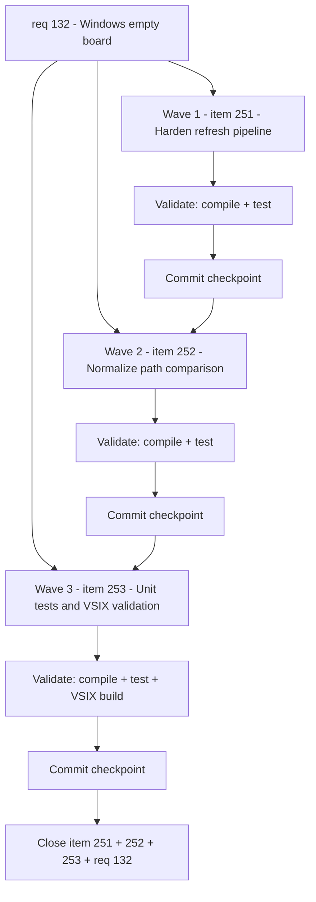

## task_115_fix_windows_empty_board_orchestration - Fix Windows empty board - orchestration
> From version: 1.22.0
> Schema version: 1.0
> Status: Ready
> Understanding: 95%
> Confidence: 80%
> Progress: 0%
> Complexity: High
> Theme: Runtime
> Reminder: Update status/understanding/confidence/progress and dependencies/references when you edit this doc.

# Context
- Orchestration task covering the three backlog items spawned from `req_132`: harden the async refresh pipeline (item_251), normalize Windows path comparisons (item_252), and add Windows-specific unit tests with pre-release validation (item_253).
- The root issue is GitHub issue #1: on Windows the board stays completely empty because docs never reach the webview.
- Delivery is sequenced in three waves matching the priority order of the backlog items.

# Plan

## Wave 1 - Harden async refresh pipeline (item_251)
> Covers: item_251 AC1, AC2, AC3

- [ ] 1.1. In `src/logicsViewProvider.ts`, replace the `Promise.all` at line 303 with `Promise.allSettled` (or wrap with try/catch). Extract fulfilled values and fall back to safe defaults for rejected results.
- [ ] 1.2. Wrap `indexLogics(root)` at line 301 in a try/catch so that if it throws, `postData` is called with an error message instead of the board staying silently empty.
- [ ] 1.3. Wrap `this.refreshAgents("silent", root)` at line 302 in a try/catch so agent refresh failures do not block `postData`.
- [ ] 1.4. Define safe defaults for each diagnostic result:
  - `changedPaths`: `[]`
  - `launchers`: `{ codex: { available: false, title: "Unavailable" }, claude: { available: false, title: "Unavailable" } }`
  - `environmentSnapshot`: `null`
  - `publishReleaseCapability`: `{ available: false, title: "Unavailable" }`
- [ ] 1.5. Ensure `shouldRecommendCheckEnvironment` also handles a null `environmentSnapshot` gracefully.
- [ ] GATE: `npm run compile` passes.
- [ ] GATE: `npm run test` passes.
- [ ] CHECKPOINT: commit wave 1.

## Wave 2 - Normalize workspace root comparison (item_252)
> Covers: item_252 AC1, AC2, AC3

- [ ] 2.1. In `media/main.js` around line 878, replace `persistedWorkspaceRoot !== payload.root` with an inline Windows-aware comparison function (case-insensitive, slash-normalized). The webview is sandboxed so it cannot import `areSamePath` directly; implement a lightweight inline equivalent.
- [ ] 2.2. Audit `media/main.js` for any other raw string comparisons on paths (`activeWorkspaceRoot`, `payload.root`, etc.) and normalize them with the same helper.
- [ ] 2.3. In `src/extension.ts`, review `createFileSystemWatcher(new RelativePattern(root, ...))` patterns. Document whether VS Code's `RelativePattern` normalizes paths on Windows or whether explicit normalization is needed. If needed, normalize the root before passing to `RelativePattern`.
- [ ] 2.4. Verify that `areSamePath` in `src/logicsProviderUtils.ts` handles edge cases: trailing slashes, mixed slashes, UNC paths.
- [ ] GATE: `npm run compile` passes.
- [ ] GATE: `npm run test` passes.
- [ ] CHECKPOINT: commit wave 2.

## Wave 3 - Unit tests and pre-release validation (item_253)
> Covers: item_253 AC1, AC2, AC3, AC4

- [ ] 3.1. Add unit tests for `areSamePath` in a new or existing test file covering:
  - `C:\Users\project` vs `c:\users\project` (case)
  - `C:/Users/project` vs `C:\Users\project` (slash direction)
  - `C:\Users\project\` vs `C:\Users\project` (trailing slash)
  - `\\server\share\repo` vs `\\SERVER\share\repo` (UNC paths)
  - Identical POSIX paths (no false positives on non-Windows)
- [ ] 3.2. Add unit tests for the `refresh()` resilience from wave 1: mock one or more diagnostics rejecting and verify `postData` is still called with items.
- [ ] 3.3. Add unit tests for the webview root comparison logic from wave 2: verify no spurious `resetPersistedUiState` with Windows path variants.
- [ ] 3.4. Write a validation checklist for the issue reporter in the Report section:
  - Install the pre-release VSIX
  - Open a repo that contains a `logics/` folder
  - Verify the board displays items
  - Toggle filters on/off, verify items appear/disappear
  - Modify a logics doc, verify the board refreshes
- [ ] 3.5. Build a pre-release VSIX: `npx vsce package --pre-release`
- [ ] GATE: `npm run compile` passes.
- [ ] GATE: `npm run test` passes (including new tests).
- [ ] CHECKPOINT: commit wave 3.

## Closure
- [ ] FINAL: update item_251, item_252, item_253 progress to 100% and status to Done.
- [ ] FINAL: update req_132 status to Done if all backlog items are Done.
- [ ] FINAL: share pre-release VSIX with the reporter on GitHub issue #1 for Windows validation.

# AC Traceability
- AC1 -> req_132 AC1: `indexLogics(root)` returns items on Windows. Proof: wave 1 step 1.2 try/catch + unit test in wave 3 step 3.2.
- AC2 -> req_132 AC2: `postData` called even when diagnostics fail. Proof: wave 1 steps 1.1-1.5 Promise.allSettled + unit test in wave 3 step 3.2.
- AC3 -> req_132 AC3: FileSystemWatcher patterns work on Windows. Proof: wave 2 step 2.3 documented verification.
- AC4 -> req_132 AC4: Windows-aware path comparison in webview. Proof: wave 2 steps 2.1-2.2 + unit test in wave 3 step 3.3.
- AC5 -> req_132 AC5: board displays docs on Windows. Proof: wave 3 step 3.4 reporter validates pre-release VSIX.
- AC6 -> req_132 AC6: unit tests with Windows paths. Proof: wave 3 steps 3.1-3.3 test suite passes.

# Dependencies
- Wave 2 depends on wave 1 (pipeline must be resilient before path normalization matters).
- Wave 3 depends on waves 1 and 2 (tests validate the actual fixes).

# Decision framing
- Product framing: Not needed (bug fix, no UI contract change)
- Architecture framing: Not needed (local error handling + path normalization, no structural change)

# Links
- Product brief(s): (none yet)
- Architecture decision(s): (none yet)
- Backlog items: `item_251_harden_async_refresh_pipeline_against_partial_promise_rejection`, `item_252_normalize_workspace_root_comparison_with_windows_aware_path_logic`, `item_253_add_windows_path_normalization_unit_tests_and_pre_release_validation`
- Request: `req_132_fix_empty_board_on_windows_due_to_indexing_and_path_issues`

# AI Context
- Summary: Orchestration task for fixing the empty board on Windows across three delivery waves
- Keywords: orchestration, Windows, empty board, Promise.allSettled, areSamePath, path normalization, unit tests, VSIX, pre-release
- Use when: Executing the Windows empty board fix across all three backlog items
- Skip when: Working on an unrelated feature or a single backlog item in isolation

# References
- `src/logicsViewProvider.ts`
- `src/extension.ts`
- `media/main.js`
- `src/logicsProviderUtils.ts`
- `tests/logicsViewProvider.test.ts`

# Validation
- `npm run compile`
- `npm run test`
- `npx vsce package --pre-release`

# Definition of Done (DoD)
- [ ] All three waves implemented and committed.
- [ ] All wave gates passed (compile + test).
- [ ] No wave or step closed before automated tests passed.
- [ ] item_251, item_252, item_253 updated to Done.
- [ ] req_132 updated to Done.
- [ ] Pre-release VSIX shared with reporter for Windows validation.
- [ ] Status is `Done` and progress is `100%`.

# Report
