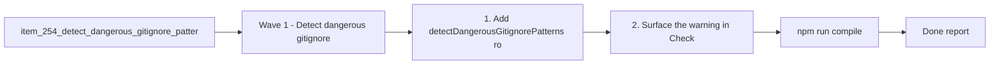

## task_116_orchestrate_kit_update_fallback_for_gitignored_logics - Orchestrate kit update fallback for gitignored logics
> From version: 1.22.1 (doc sync) (refreshed)
> Schema version: 1.0
> Status: Done
> Understanding: 97%
> Confidence: 94%
> Progress: 100%
> Complexity: Medium
> Theme: General
> Reminder: Update status/understanding/confidence/progress and dependencies/references when you edit this doc.

# Context
- This task orchestrates the three backlog items derived from request req_133: detect dangerous gitignore patterns (item_254), implement fallback kit install (item_255), and add adaptive update strategy (item_256).
- The delivery order is sequential: detection first, then fallback install, then adaptive updates. Each wave should leave the repo commit-ready.
- The current kit update in `src/logicsCodexWorkflowController.ts` only supports `git submodule update`. This task adds two parallel code paths (direct clone and global kit copy) and a routing layer to choose the right strategy.

# Plan

## Wave 1 - Detect dangerous gitignore patterns (item_254)
- [x] 1. Add `detectDangerousGitignorePatterns(root)` in `src/logicsProviderUtils.ts` that scans `.gitignore` for broad patterns (`logics/`, `logics/*`, `logics/**`) covering `logics/skills`.
- [x] 2. Surface the warning in Check Environment (`src/logicsViewProvider.ts`) as a non-blocking informational item explaining the trade-off and that a fallback exists.
- [x] 3. Add unit tests for pattern detection (positive and negative cases).
- [x] 4. CHECKPOINT: compile, lint, test. Commit wave 1.

## Wave 2 - Fallback kit install cascade (item_255)
- [x] 5. Add a `fallbackInstallKit(root)` method in `src/logicsCodexWorkflowController.ts` that tries: (a) copy from global kit (`~/.codex/skills/` or `~/.claude/`, using existing inspection), then (b) `git clone` from the canonical URL into `logics/skills/`.
- [x] 6. Wire the fallback into `updateLogicsKit`: when submodule update fails or is not functional and a dangerous gitignore pattern is detected, prompt user for confirmation and run the fallback.
- [x] 7. Call `reconcileRepoBootstrapAfterKitUpdate` after successful fallback install.
- [x] 8. Add tests: fallback with global kit present, fallback with clone, existing submodule path unchanged.
- [x] 9. CHECKPOINT: compile, lint, test. Commit wave 2.

## Wave 3 - Adaptive update strategy (item_256)
- [x] 10. Add `detectKitInstallType(root)` in `src/logicsProviderUtils.ts` returning `"submodule" | "standalone-clone" | "plain-copy"` based on the state of `logics/skills`.
- [x] 11. Update `updateLogicsKit` to route: submodule -> `git submodule update`, standalone-clone -> `git -C logics/skills pull`, plain-copy -> re-copy from global kit or fresh clone.
- [x] 12. Guard against submodule operations on a standalone clone if the user later un-ignores `logics/`.
- [x] 13. Add tests for each routing path and the un-ignore guard.
- [x] 14. CHECKPOINT: compile, lint, test. Commit wave 3.

## Final
- [x] 15. Update item_254, item_255, item_256 progress and status.
- [x] 16. Run full validation: `npm run compile && npm run test && python3 logics/skills/logics.py lint --require-status && python3 logics/skills/logics.py audit --legacy-cutoff-version 1.1.0 --group-by-doc`.

# Delivery checkpoints
- Each completed wave should leave the repository in a coherent, commit-ready state.
- Update the linked Logics docs during the wave that changes the behavior, not only at final closure.
- Prefer a reviewed commit checkpoint at the end of each meaningful wave instead of accumulating several undocumented partial states.
- If the shared AI runtime is active and healthy, use `python logics/skills/logics.py flow assist commit-all` to prepare the commit checkpoint for each meaningful step, item, or wave.
- Do not mark a wave or step complete until the relevant automated tests and quality checks have been run successfully.

# AC Traceability
- AC1 -> Wave 2 steps 5-7 and final validation. Proof: fallback handling must replace the dead-end submodule-only path when `logics/skills` is missing because `logics/` is gitignored.
- AC2 -> Wave 2 steps 5-6 and validation step 16. Proof: the delivery requires copy-from-global-kit before direct clone, with validation covering both branches of the cascade.
- AC3 -> Wave 2 step 7 and validation step 16. Proof: bootstrap convergence is part of the fallback wave and must be exercised after a successful install path.
- AC4 -> Waves 1-3 and validation step 16. Proof: the existing canonical submodule path remains in scope as a non-regression check throughout the orchestration task.
- AC5 -> Wave 1 steps 1-3 and validation step 16. Proof: proactive `.gitignore` detection and the non-blocking warning are delivered before the fallback path and verified during environment diagnostics.
- AC6 -> Wave 3 steps 10-13 and validation step 16. Proof: adaptive routing across submodule, standalone clone, and plain copy remains a dedicated validation target for the final wave.
- Wave 1 -> item_254 AC1-AC3. Proof: this wave owns detection of broad `.gitignore` patterns, the Check Environment warning surface, and the non-blocking behavior contract.
- Wave 2 -> item_255 AC1-AC5. Proof: this wave owns the fallback offer, copy-first then clone cascade, bootstrap convergence, and submodule-path non-regression checks.
- Wave 3 -> item_256 AC1-AC5. Proof: this wave owns install-type detection, standalone-clone pull behavior, plain-copy refresh behavior, and the guard against unsafe submodule operations.

# Decision framing
- Product framing: Not needed
- Architecture framing: Required (new install/update code paths in the workflow controller)
- Architecture signals: state and sync, install-type detection, fallback cascade
- Architecture follow-up: Keep fallback path cleanly separated from submodule path to avoid coupling. Detection function should be reusable.

# Links
- Product brief(s): (none yet)
- Architecture decision(s): (none yet)
- Backlog item: `item_254_detect_dangerous_gitignore_patterns_covering_logics_skills_and_warn_the_user`
- Backlog item: `item_255_fallback_kit_install_via_global_kit_copy_or_direct_clone_when_submodule_is_unavailable`
- Backlog item: `item_256_adaptive_kit_update_strategy_for_standalone_clone_vs_submodule_installs`
- Request(s): `req_133_add_kit_update_fallback_when_logics_is_gitignored`

# References
- `src/logicsCodexWorkflowController.ts` (updateLogicsKit, reconcileRepoBootstrapAfterKitUpdate)
- `src/logicsProviderUtils.ts` (inspectLogicsKitSubmodule, getMissingBootstrapGitignoreEntries)
- `src/logicsViewProvider.ts` (checkEnvironment flow)
- `src/logicsClaudeGlobalKit.ts` (inspectClaudeGlobalKit)
- `src/logicsCodexWorkspace.ts` (inspectCodexWorkspaceOverlay)
- `src/logicsEnvironment.ts` (inspectLogicsEnvironment)

# AI Context
- Summary: Orchestration task for 3-wave delivery of kit update fallback when logics/ is gitignored: detection, fallback install, adaptive updates
- Keywords: orchestration, kit, update, fallback, gitignore, submodule, detection, clone, global-kit, adaptive, waves
- Use when: Use when executing the implementation of the kit update fallback feature across item_254, item_255, item_256.
- Skip when: Skip when the work belongs to another feature or request.

# Validation
- `npm run compile`
- `npm run test`
- `python3 logics/skills/logics.py lint --require-status`
- `python3 logics/skills/logics.py audit --legacy-cutoff-version 1.1.0 --group-by-doc`

# Definition of Done (DoD)
- [x] Scope implemented and acceptance criteria covered for all 3 backlog items.
- [x] Validation commands executed and results captured for each wave.
- [x] No wave or step was closed before the relevant automated tests and quality checks passed.
- [x] Linked request/backlog/task docs updated during completed waves and at closure.
- [x] Each completed wave left a commit-ready checkpoint or an explicit exception is documented.
- [x] Status is `Done` and progress is `100%`.

# Report
- Implemented the three-wave kit fallback flow for gitignored `logics/`: proactive `.gitignore` warnings, copy-first fallback installation, direct clone fallback, and adaptive routing for standalone clones.
- Validation passed: `npm run compile`, `npm test`, and targeted Vitest coverage for `logicsProviderUtils.test.ts` and `logicsViewProvider.test.ts`.

# Notes
